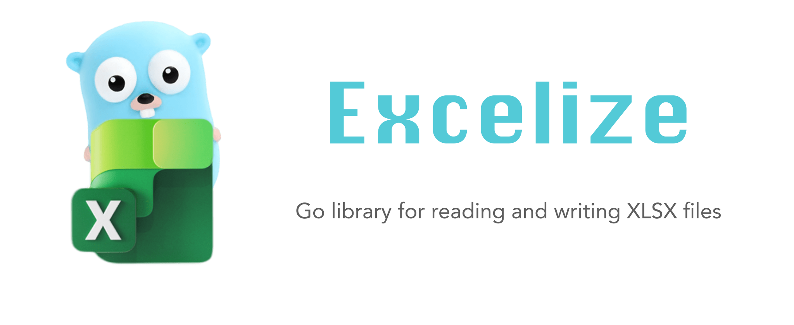

# المقدمة

Excelize هي مكتبة مكتوبة في الذهاب نقية توفير مجموعة من الوظائف التي تسمح لك الكتابة إلى وقراءة من XLSX / XLSM / XLTM الملفات. يدعم قراءة وكتابة مستندات جداول البيانات التي تم إنشاؤها بواسطة Microsoft Excel&trade; 2007 والإصدارات الأحدث. يدعم المكونات المعقدة من خلال التوافق العالي ، ويوفر واجهة برمجة التطبيقات المتدفقة لتوليد أو قراءة البيانات من ورقة عمل تحتوي على كميات هائلة من البيانات. تحتاج هذه المكتبة إلى Go الإصدار 1.10 أو الإصدار الأحدث.

- شفرة المصدر: [github.com/360EntSecGroup-Skylar/excelize](https://github.com/360EntSecGroup-Skylar/excelize)
- المساله: [github.com/360EntSecGroup-Skylar/excelize/issues](https://github.com/360EntSecGroup-Skylar/excelize/issues)
- go.dev: [pkg.go.dev/github.com/360EntSecGroup-Skylar/excelize/v2?tab=doc](https://pkg.go.dev/github.com/360EntSecGroup-Skylar/excelize/v2?tab=doc)
- التراخيص: [BSD 3-Clause](https://opensource.org/licenses/BSD-3-Clause)
- الإصدار الأخير: [v2.3.2](https://github.com/360EntSecGroup-Skylar/excelize/releases/latest)
- وقت تحديث المستند: مارس 26, 2021

## بعثة المشروع

الهدف من Excelize هو إنشاء وصيانة إصدار لغة الانتقال من API المستند Excel لمعالجة ملفات xlsx التي تتوافق مع Office فتح XML (OOXML) القياسية. مع Excelize يمكنك استخدام الذهاب لقراءة وكتابة ملفات MS Excel.

## لماذا استخدام Excelize

في بعض الحالات، نحن بحاجة إلى التعامل مع مستندات Excel من خلال برامج، مثل: فتح لقراءة محتوى مستند Excel الحالي، إنشاء مستندات Excel جديدة، إنشاء مستندات Excel جديدة استناداً إلى المستندات الموجودة (القوالب)، إدراج الصور في مستندات Excel، مخططات عناصر مثل الجداول، وأحيانا تحتاج إلى تنفيذ هذه العمليات عبر الأنظمة الأساسية. يمكن أن تلبي Excelize بسهولة هذه الاحتياجات.

## العملاء المعروفين

                   

إذا كانت شركتك أو منتجك يستخدم أيضا Excelize، نرحب <a href="mailto: xuri.me@gmail.com?Subject=Please add our company in Excelize Introduction page&amp;Body=Hello%2C%20this%20is%20%3Cyour%20name%3E%20from%20%3Cyour%20company%20name%3E.%0AWe%20are%20using%20Excelize%20and%20will%20be%20proud%20to%20add%20our%20company%20name%20to%20Excelize%20Introduction%20page.%0APlease%20see%20attachment%20for%20our%20logo.%20%3CBe%20sure%20to%20include%20logo%20in%20attachment%3E%0A" title="send Logo via E-mail">إرسال الشعار</a> لنا

   

## الراعي إكسلسيز التنمية

إذا كنت مستخدم فرديا وتتمتع إنتاجية استخدام Excelize، والنظر في التبرع كعلامة على التقدير - مثل شراء لي القهوة مرة واحدة في كل حين. ادعم هذا المشروع من خلال أن تصبح راعيًا.

  
