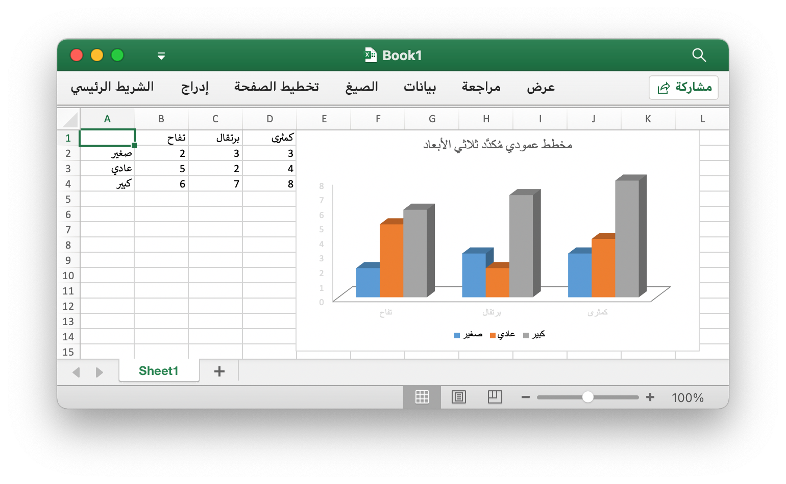

# الاستخدام الأساسي

## التركيب {#install}

يوضح الجدول التالي الحد الأدنى من متطلبات لغة Go مع كل إصدار تم إصداره من Excelize:

الإصدار Excelize | الحد الأدنى من متطلبات إصدار لغة Go
---|---
v2.10.0 ~ master | 1.24.0
v2.9.1 | 1.23.0
v2.8.1 ~ v2.9.0 | 1.18
v2.7.0 ~ v2.8.0 | 1.16
v2.4.0 ~ v2.6.1 | 1.15
v2.0.2 ~ v2.3.2 | 1.10
v1.0.0 ~ v2.0.1 | 1.6

استخدام أحدث إصدار Excelize مكتبة تتطلب الانتقال الإصدار 1.23.0 أو أحدث. لاحظ أن هناك بعض [التغييرات غير المتوافقة](https://github.com/golang/go/issues/61881) في Go 1.21.0، ولا يمكن لهذه المكتبة العمل مع هذا الإصدار، إذا كنت تستخدم Go 1.21.x، فيرجى الترقية إلى Go 1.21.1 والإصدار الأحدث.

- التركيب

```bash
go get github.com/xuri/excelize
```

- إذا كانت إدارة الحزمة مع [Go Modules](https://go.dev/blog/using-go-modules)، يرجى تثبيت مع الأمر التالي.

```bash
go get github.com/xuri/excelize/v2
```

## ترقيه {#update}

- الترقية إلى أحدث إصدار مستقر

```bash
go get -u github.com/xuri/excelize/v2
```

- الترقية إلى أحدث كود فرع التطوير

```bash
go get -u github.com/xuri/excelize/v2@master
```

## قم بإنشاء مستند جدول بيانات {#NewFile}

هنا هو الحد الأدنى من الاستخدام الأمثلة التي من شأنها أن تخلق ملف جدول البيانات:

```go
package main

import (
    "fmt"

    "github.com/xuri/excelize/v2"
)

func main() {
    f := excelize.NewFile()
    defer func() {
        if err := f.Close(); err != nil {
            fmt.Println(err)
        }
    }()
    enable := true
    if err := f.SetSheetView("Sheet1", -1, &excelize.ViewOptions{
        RightToLeft: &enable,
    }); err != nil {
        fmt.Println(err)
    }
    // إنشاء ورقة عمل جديدة.
    index, err := f.NewSheet("Sheet2")
    if err != nil {
        fmt.Println(err)
        return
    }
    // تعيين قيمة خلية.
    f.SetCellValue("Sheet2", "A2", "Hello world.")
    f.SetCellValue("Sheet1", "B2", 100)
    // تعيين ورقة نشطة للمصنف.
    f.SetActiveSheet(index)
    // احفظ جدول البيانات بالمسار المحدد.
    if err := f.SaveAs("المصنف1.xlsx"); err != nil {
        fmt.Println(err)
    }
}
```

## قراءة وثيقة إكسل {#read}

وفيما يلي يشكل عارية لقراءة وثيقة جدول:

```go
package main

import (
    "fmt"

    "github.com/xuri/excelize/v2"
)

func main() {
    f, err := excelize.OpenFile("المصنف1.xlsx")
    if err != nil {
        fmt.Println(err)
        return
    }
    defer func() {
        if err := f.Close(); err != nil {
            fmt.Println(err)
        }
    }()
    // الحصول على قيمة من الخلية حسب اسم ورقة العمل والمحور.
    cell, err := f.GetCellValue("Sheet1", "B2")
    if err != nil {
        fmt.Println(err)
        return
    }
    fmt.Println(cell)
    // الحصول على جميع الصفوف في Sheet1.
    rows, err := f.GetRows("Sheet1")
    if err != nil {
        fmt.Println(err)
        return
    }
    for _, row := range rows {
        for _, colCell := range row {
            fmt.Print(colCell, "\t")
        }
        fmt.Println()
    }
}
```

## أضف مخططًا إلى جدول بيانات {#chart}

مع Excelize إنشاء المخطط والإدارة سهلاً مثل بضعة أسطر من التعليمات البرمجية. يمكنك إنشاء مخططات استناداً إلى بيانات في ورقة العمل أو إنشاء مخططات بدون أية بيانات في ورقة العمل على الإطلاق.

<p align="center"></p>

```go
package main

import (
    "fmt"

    "github.com/xuri/excelize/v2"
)

func main() {
    f := excelize.NewFile()
    defer func() {
        if err := f.Close(); err != nil {
            fmt.Println(err)
        }
    }()
    enable := true
    if err := f.SetSheetView("Sheet1", -1, &excelize.ViewOptions{
        RightToLeft: &enable,
    }); err != nil {
        fmt.Println(err)
    }
    for idx, row := range [][]interface{}{
        {nil, "تفاح", "برتقال", "كمثرى"}, {"صغير", 2, 3, 3},
        {"عادي", 5, 2, 4}, {"كبير", 6, 7, 8},
    } {
        cell, err := excelize.CoordinatesToCellName(1, idx+1)
        if err != nil {
            fmt.Println(err)
            return
        }
        f.SetSheetRow("Sheet1", cell, &row)
    }
    if err := f.AddChart("Sheet1", "E1", &excelize.Chart{
        Type: excelize.Col3DClustered,
        Series: []excelize.ChartSeries{
            {
                Name:       "Sheet1!$A$2",
                Categories: "Sheet1!$B$1:$D$1",
                Values:     "Sheet1!$B$2:$D$2",
            },
            {
                Name:       "Sheet1!$A$3",
                Categories: "Sheet1!$B$1:$D$1",
                Values:     "Sheet1!$B$3:$D$3",
            },
            {
                Name:       "Sheet1!$A$4",
                Categories: "Sheet1!$B$1:$D$1",
                Values:     "Sheet1!$B$4:$D$4",
            }},
        Title: []excelize.RichTextRun{
            {
                Text: "مخطط عمودي مُكدَّد ثلاثي الأبعاد",
            },
        },
    }); err != nil {
        fmt.Println(err)
        return
    }
    // احفظ جدول البيانات بالمسار المحدد.
    if err := f.SaveAs("المصنف1.xlsx"); err != nil {
        fmt.Println(err)
    }
}
```

## أضف صورة إلى جدول البيانات {#image}

```go
package main

import (
    "fmt"
    _ "image/gif"
    _ "image/jpeg"
    _ "image/png"

    "github.com/xuri/excelize/v2"
)

func main() {
    f, err := excelize.OpenFile("المصنف1.xlsx")
    if err != nil {
        fmt.Println(err)
        return
    }
    defer func() {
        if err := f.Close(); err != nil {
            fmt.Println(err)
        }
    }()
    // إدراج صورة.
    if err := f.AddPicture("Sheet1", "A2", "image.png", nil); err != nil {
        fmt.Println(err)
        return
    }
    // إدراج صورة في ورقة عمل مع التحجيم.
    if err := f.AddPicture("Sheet1", "D2", "image.jpg",
        &excelize.GraphicOptions{ScaleX: 0.5, ScaleY: 0.5}); err != nil {
        fmt.Println(err)
        return
    }
    // إدراج إزاحة صورة في الخلية مع دعم الطباعة.
    enable, disable := true, false
    if err := f.AddPicture("Sheet1", "H2", "image.gif",
        &excelize.GraphicOptions{
            PrintObject:     &enable,
            LockAspectRatio: false,
            OffsetX:         15,
            OffsetY:         10,
            Locked:          &disable,
        }); err != nil {
        fmt.Println(err)
        return
    }
    // احفظ جدول البيانات بالمسار المحدد.
    if err = f.Save(); err != nil {
        fmt.Println(err)
    }
}
```
