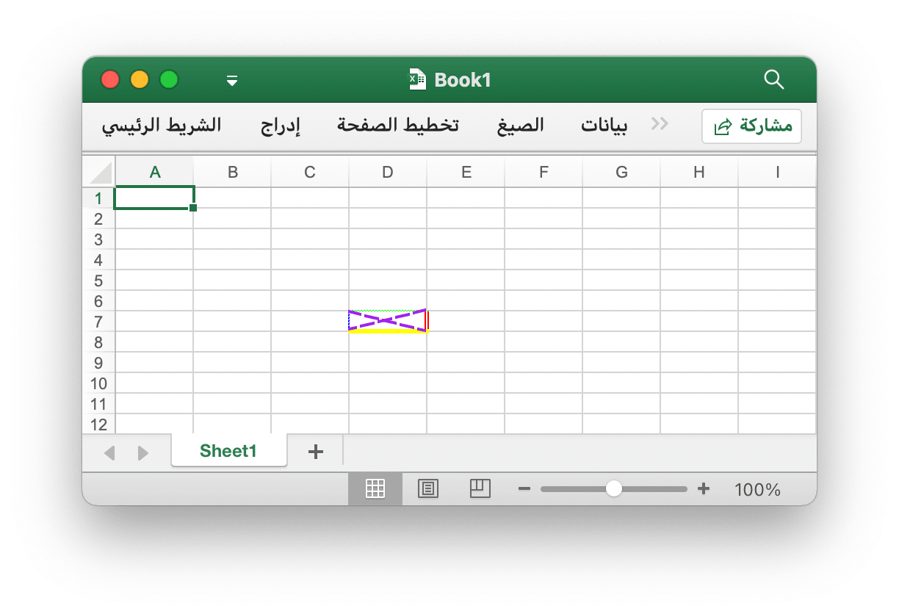
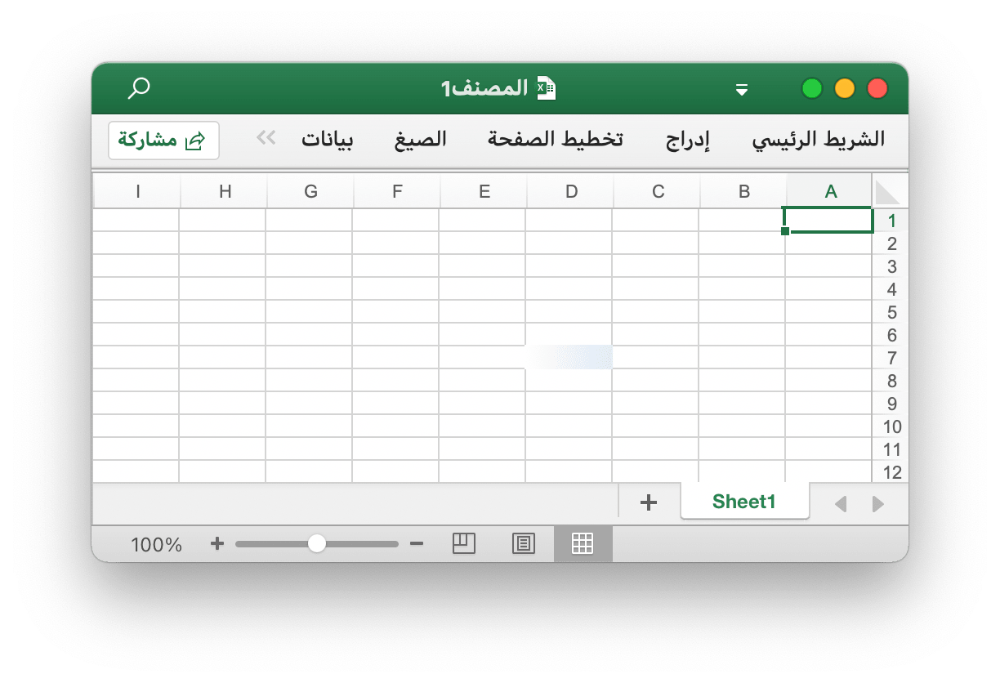
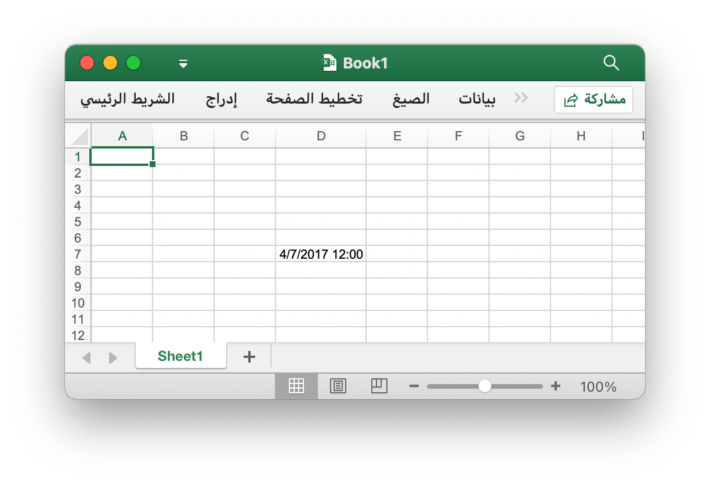
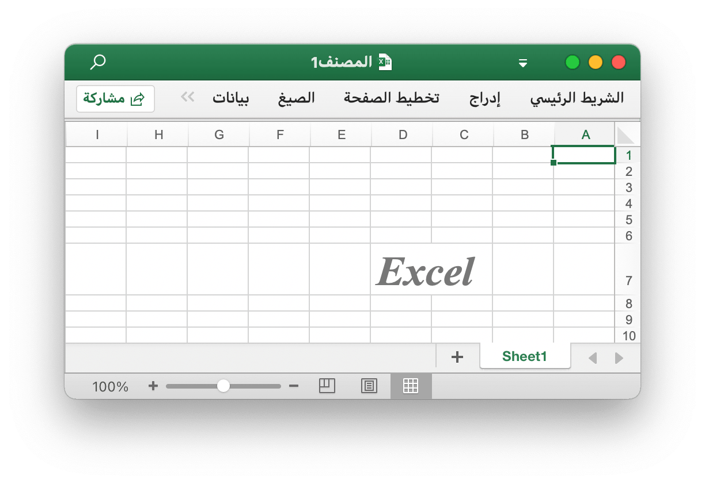
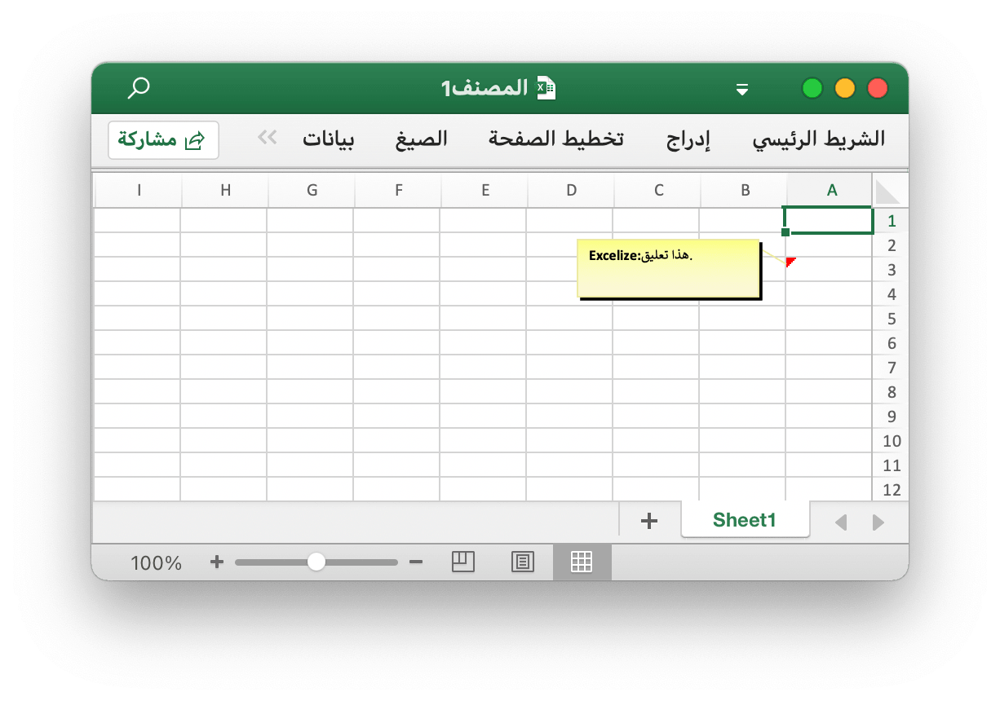

# الخليه

يقوم `RichTextRun` بتعيين إعدادات تشغيل النص المنسق مباشرةً.

```go
type RichTextRun struct {
    Font *Font
    Text string
}
```

يمكن تمرير `HyperlinkOpts` إلى [`SetCellHyperlink`](cell.md#SetCellHyperlink) لتعيين سمات الارتباط التشعبي الاختيارية (مثل النص المراد عرضه ونص تلميح الشاشة).

```go
type HyperlinkOpts struct {
    Display *string
    Tooltip *string
}
```

يمكن تمرير `FormulaOpts` إلى [`SetCellFormula`](cell.md#SetCellFormula) لاستخدام أنواع الصيغ الأخرى.

```go
type FormulaOpts struct {
    Type *string // نوع الصيغة
    Ref  *string // مرجع صيغة مشتركة
}
```

## تعيين قيمة الخلية {#SetCellValue}

```go
func (f *File) SetCellValue(sheet, cell string, value interface{}) error
```

يوفر SetCellValue دالة لتعيين قيمة خلية. هذه الوظيفة آمنة للتزامن. يجب ألا تكون الإحداثيات المحددة في الصف الأول من الجدول. التي تدعم أنواع البيانات التالية:

|أنواع البيانات المدعومة|
|---|
|int|
|int8|
|int16|
|int32|
|int64|
|uint|
|uint8|
|uint16|
|uint32|
|uint64|
|float32|
|float64|
|string|
|[]byte|
|time.Duration|
|time.Time|
|bool|
|nil|

لاحظ أن تنسيق التاريخ الافتراضي هو `m/d/yy h:mm` لقيمة نوع الوقت. يمكنك ضبط تنسيق الأرقام بطريقة [`SetCellStyle`](cell.md#SetCellStyle). إذا كنت بحاجة إلى تعيين التاريخ المتخصص في Excel مثل 0 يناير 1900 أو 29 فبراير 1900 ، فلا يمكن تمثيل هذه الأوقات في نوع بيانات Go بلغة البرمجة `time.Time`. يرجى تعيين قيمة الخلية كرقم 0 أو 60 ، ثم إنشاء وربط نمط تنسيق رقم التاريخ والوقت للخلية.

## تعيين قيمة منطقية {#SetCellBool}

```go
func (f *File) SetCellBool(sheet, cell string, value bool) error
```

يوفر SetCellBool وظيفة لتعيين قيمة نوع منطقي لخلية من خلال اسم ورقة العمل المحدد وإحداثيات الخلية وقيمة الخلية.

## تعيين قيمة RAW {#SetCellDefault}

```go
func (f *File) SetCellDefault(sheet, cell, value string) error
```

يوفر SetCellDefault وظيفة لتعيين قيمة نوع السلسلة لخلية كتنسيق افتراضي دون هروب الخلية.

## تعيين قيمة عدد صحيح {#SetCellInt}

```go
func (f *File) SetCellInt(sheet, cell string, value int) error
```

يوفر SetCellInt دالة لتعيين قيمة نوع int لخلية من خلال اسم ورقة العمل المحدد وإحداثيات الخلية وقيمة الخلية.

## تعيين قيمة السلسلة {#SetCellStr}

```go
func (f *File) SetCellStr(sheet, cell, value string) error
```

يوفر SetCellStr وظيفة لتعيين قيمة نوع السلسلة للخلية. العدد الإجمالي للأحرف التي يمكن أن تحتويها الخلية على `32767` حرفًا.

## تعيين نمط الخلية {#SetCellStyle}

```go
func (f *File) SetCellStyle(sheet, hCell, vCell string, styleID int) error
```

يوفر SetCellStyle وظيفة لإضافة سمة نمط للخلايا من خلال اسم ورقة العمل المعطى ومنطقة الإحداثيات ومعرف النمط. هذه الوظيفة آمنة للتزامن. يمكن الحصول على فهارس النمط من خلال وظيفة [`NewStyle`](style.md#NewStyle). لاحظ أن حد النوع `diagonalDown` و `diagonalUp` يجب أن يستخدموا نفس اللون في نفس منطقة الإحداثيات. سيقوم SetCellStyle بالكتابة فوق الأنماط الموجودة للخلية ، ولن يقوم بإلحاق أو دمج النمط مع الأنماط الموجودة.

- المثال 1 ، أنشئ حدودًا للخلية `D7` في `Sheet1`:

```go
style, err := f.NewStyle(&excelize.Style{
    Border: []excelize.Border{
        {Type: "left", Color: "0000FF", Style: 3},
        {Type: "top", Color: "00FF00", Style: 4},
        {Type: "bottom", Color: "FFFF00", Style: 5},
        {Type: "right", Color: "FF0000", Style: 6},
        {Type: "diagonalDown", Color: "A020F0", Style: 7},
        {Type: "diagonalUp", Color: "A020F0", Style: 8},
    },
})
if err != nil {
    fmt.Println(err)
}
err = f.SetCellStyle("Sheet1", "D7", "D7", style)
```

<p align="center"></p>

تم تعيين الحدود الأربعة للخلية `D7` بأنماط وألوان مختلفة. يرتبط هذا بالمعلمات عند استدعاء وظيفة [`NewStyle`](style.md#NewStyle). تحتاج إلى تعيين أنماط مختلفة للإشارة إلى الوثائق الخاصة بهذا الفصل.

- المثال 2 ، تعيين نمط التدرج لخلية ورقة العمل `D7` المسماة `Sheet1`:

```go
style, err := f.NewStyle(&excelize.Style{
    Fill: excelize.Fill{Type: "gradient", Color: []string{"#FFFFFF", "#E0EBF5"}, Shading: 1},
})
if err != nil {
    fmt.Println(err)
}
err = f.SetCellStyle("Sheet1", "D7", "D7", style)
```

<p align="center"></p>

تم تعيين الخلية `D7` بتعبئة اللون لتأثير التدرج. يرتبط تأثير التعبئة المتدرجة بالمعامل عند استدعاء الوظيفة [`NewStyle`](style.md#NewStyle). تحتاج إلى تعيين أنماط مختلفة للإشارة إلى وثائق هذا الفصل.

- مثال 3 ، عيّن تعبئة خالصة للخلية `D7` المسماة `Sheet1`:

```go
style, err := f.NewStyle(&excelize.Style{
    Fill: excelize.Fill{Type: "pattern", Color: []string{"#E0EBF5"}, Pattern: 1},
})
if err != nil {
    fmt.Println(err)
}
err = f.SetCellStyle("Sheet1", "D7", "D7", style)
```

<p align="center"></p>

تم تعيين الخلية `D7` بتعبئة ثابتة.

- مثال 4 ، عيّن تباعد الأحرف وزاوية الدوران للخلية `D7` المسماة `Sheet1`:

```go
f.SetCellValue("Sheet1", "D7", "أسلوب")
style, err := f.NewStyle(&excelize.Style{
    Alignment: &excelize.Alignment{
        Horizontal:      "center",
        Indent:          1,
        JustifyLastLine: true,
        ReadingOrder:    0,
        RelativeIndent:  1,
        ShrinkToFit:     true,
        TextRotation:    45,
        Vertical:        "",
        WrapText:        true,
    },
})
if err != nil {
    fmt.Println(err)
}
err = f.SetCellStyle("Sheet1", "D7", "D7", style)
```

<p align="center"></p>

- مثال 5 ، يتم تمثيل التاريخ والوقت في Excel بأرقام حقيقية ، على سبيل المثال ، `2017/7/4 12:00:00 PM` يمكن تمثيلها بالرقم `42920.5`. عيّن تنسيق الوقت لخلية ورقة العمل `D7` المسماة `Sheet1`:

```go
f.SetCellValue("Sheet1", "D7", 42920.5)
f.SetColWidth("Sheet1", "D", "D", 13)
style, err := f.NewStyle(&excelize.Style{NumFmt: 22})
if err != nil {
    fmt.Println(err)
}
err = f.SetCellStyle("Sheet1", "D7", "D7", style)
```

<p align="center"></p>

تم تعيين الخلية `D7` على تنسيق الوقت. لاحظ أنه عندما يكون عرض الخلية مع تنسيق الوقت المطبق ضيقًا جدًا بحيث لا يمكن عرضها بالكامل ، فسيتم عرضها كـ `####` ، يمكنك سحب عرض العمود وإفلاته أو تعيين العمود إلى الحجم المناسب عن طريق استدعاء وظيفة `SetColWidth` لجعلها عرضًا عاديًا.

- مثال 6 ، تعيين الخط وحجم الخط واللون ونمط الانحراف لخلية ورقة العمل `D7` المسماة `Sheet1`:

```go
f.SetCellValue("Sheet1", "D7", "Excel")
style, err := f.NewStyle(&excelize.Style{
    Font: &excelize.Font{
        Bold:   true,
        Italic: true,
        Family: "Times New Roman",
        Size:   36,
        Color:  "#777777",
    },
})
if err != nil {
    fmt.Println(err)
}
err = f.SetCellStyle("Sheet1", "D7", "D7", style)
```

<p align="center"></p>

- مثال 7 ، تأمين وإخفاء خلية ورقة العمل `D7` المسماة `Sheet1`:

```go
style, err := f.NewStyle(&excelize.Style{
    Protection: &excelize.Protection{
        Hidden: true,
        Locked: true,
    },
})
if err != nil {
    fmt.Println(err)
}
err = f.SetCellStyle("Sheet1", "D7", "D7", style)
```

لتأمين خلية أو إخفاء صيغة ، قم بحماية ورقة العمل. في علامة التبويب "مراجعة" ، انقر فوق "حماية ورقة العمل".

## تعيين ارتباط تشعبي {#SetCellHyperLink}

```go
func (f *File) SetCellHyperLink(sheet, cell, link, linkType string, opts ...HyperlinkOpts) error
```

يوفر SetCellHyperLink وظيفة لتعيين الارتباطات التشعبية للخلايا عن طريق اسم ورقة العمل وعنوان URL للرابط. يعرّف LinkType نوعين من الارتباطات التشعبية `External` لموقع الويب أو `Location` للانتقال إلى إحدى الخلايا في هذا المصنف. الحد الأقصى للارتباطات التشعبية في ورقة العمل هو `65530`. تُستخدم هذه الوظيفة فقط لتعيين الارتباط التشعبي للخلية ولا تؤثر على قيمة الخلية. إذا كنت بحاجة إلى تعيين قيمة الخلية ، فالرجاء استخدام الوظائف الأخرى مثل [`SetCellStyle`](cell.md#SetCellStyle) أو [`SetSheetRow`](sheet.md#SetSheetRow). أدناه مثال على ارتباط خارجي.

- مثال 1 ، إضافة ارتباط خارجي إلى الخلية `A3` من ورقة العمل المسماة `Sheet1`:

```go
display, tooltip := "https://github.com/xuri/excelize", "Excelize on GitHub"
if err := f.SetCellHyperLink("Sheet1", "A3",
    "https://github.com/xuri/excelize", "External", excelize.HyperlinkOpts{
        Display: &display,
        Tooltip: &tooltip,
    }); err != nil {
    fmt.Println(err)
}
// عيّن الخط ونمط التسطير للخلية
style, err := f.NewStyle(&excelize.Style{
    Font: &excelize.Font{Color: "#1265BE", Underline: "single"},
})
if err != nil {
    fmt.Println(err)
}
err = f.SetCellStyle("Sheet1", "A3", "A3", style)
```

- المثال 2 ، إضافة ارتباط موقع داخلي إلى الخلية `A3` المسماة `Sheet1`:

```go
err := f.SetCellHyperLink("Sheet1", "A3", "Sheet1!A40", "Location")
```

## تعيين نص منسق للخلية {#SetCellRichText}

```go
func (f *File) SetCellRichText(sheet, cell string, runs []RichTextRun) error
```

يوفر SetCellRichText وظيفة لتعيين خلية بنص منسق بواسطة ورقة عمل معينة.

على سبيل المثال ، قم بتعيين نص منسق في الخلية `A1` من ورقة العمل المسماة `Sheet1`:

<p align="center"></p>

```go
package main

import (
    "fmt"

    "github.com/xuri/excelize/v2"
)

func main() {
    f := excelize.NewFile()
    if err := f.SetRowHeight("Sheet1", 1, 35); err != nil {
        fmt.Println(err)
        return
    }
    if err := f.SetSheetViewOptions("Sheet1", -1,
        excelize.RightToLeft(true),
    ); err != nil {
        fmt.Println(err)
    }
    if err := f.SetColWidth("Sheet1", "A", "A", 44); err != nil {
        fmt.Println(err)
        return
    }
    if err := f.SetCellRichText("Sheet1", "A1", []excelize.RichTextRun{
        {
            Text: "bold",
            Font: &excelize.Font{
                Bold:   true,
                Color:  "2354e8",
                Family: "Times New Roman",
            },
        },
        {
            Text: " and ",
            Font: &excelize.Font{
                Family: "Times New Roman",
            },
        },
        {
            Text: "italic ",
            Font: &excelize.Font{
                Bold:   true,
                Color:  "e83723",
                Italic: true,
                Family: "Times New Roman",
            },
        },
        {
            Text: "text with color and font-family,",
            Font: &excelize.Font{
                Bold:   true,
                Color:  "2354e8",
                Family: "Times New Roman",
            },
        },
        {
            Text: "\r\nlarge text with ",
            Font: &excelize.Font{
                Size:  14,
                Color: "ad23e8",
            },
        },
        {
            Text: "strike",
            Font: &excelize.Font{
                Color:  "e89923",
                Strike: true,
            },
        },
        {
            Text: " superscript",
            Font: &excelize.Font{
                Color:     "dbc21f",
                VertAlign: "superscript",
            },
        },
        {
            Text: " and ",
            Font: &excelize.Font{
                Size:      14,
                Color:     "ad23e8",
                VertAlign: "baseline",
            },
        },
        {
            Text: "underline",
            Font: &excelize.Font{
                Color:     "23e833",
                Underline: "single",
            },
        },
        {
            Text: " subscript.",
            Font: &excelize.Font{
                Color:     "017505",
                VertAlign: "subscript",
            },
        },
    }); err != nil {
        fmt.Println(err)
        return
    }
    style, err := f.NewStyle(&excelize.Style{
        Alignment: &excelize.Alignment{
            WrapText: true,
        },
    })
    if err != nil {
        fmt.Println(err)
        return
    }
    if err := f.SetCellStyle("Sheet1", "A1", "A1", style); err != nil {
        fmt.Println(err)
        return
    }
    if err := f.SaveAs("المصنف1.xlsx"); err != nil {
        fmt.Println(err)
    }
}
```

## احصل على نص منسق للخلية {#GetCellRichText}

```go
func (f *File) GetCellRichText(sheet, cell string) ([]RichTextRun, error)
```

يوفر GetCellRichText وظيفة للحصول على نص منسق للخلايا بواسطة ورقة عمل معينة.

## الحصول على قيمة الخلية {#GetCellValue}

```go
func (f *File) GetCellValue(sheet, cell string, opts ...Options) (string, error)
```

يتم استرداد قيمة الخلية وفقًا لورقة العمل المحددة وإحداثيات الخلية ، ويتم تحويل قيمة الإرجاع إلى نوع `string`. هذه الوظيفة آمنة للتزامن. إذا كان من الممكن تطبيق تنسيق الخلية على قيمة خلية ، فسيتم إرجاع القيمة المطبقة ، وإلا سيتم إرجاع القيمة الأصلية. ستكون جميع قيم الخلايا هي نفسها في النطاق المدمج.

## احصل على نوع الخلية {#GetCellType}

```go
func (f *File) GetCellType(sheet, cell string) (CellType, error)
```

يوفر GetCellType وظيفة للحصول على نوع بيانات الخلية عن طريق اسم ورقة العمل المحددة والمحور في ملف جدول البيانات.

## الحصول على كل قيمة الخلية حسب الأعمدة {#GetCols}

```go
func (f *File) GetCols(sheet string, opts ...Options) ([][]string, error)
```

يحصل GetCols على قيمة جميع الخلايا حسب الأعمدة في ورقة العمل استنادًا إلى اسم ورقة العمل المحدد ، ويتم إرجاعه كمصفوفة ثنائية الأبعاد ، حيث يتم تحويل قيمة الخلية إلى نوع `string`. إذا كان من الممكن تطبيق تنسيق الخلية على قيمة الخلية ، فسيتم استخدام القيمة المطبقة ، وإلا سيتم استخدام القيمة الأصلية. فمثلا:

على سبيل المثال ، احصل على قيمة جميع الخلايا واجتيازها حسب الأعمدة في ورقة عمل تسمى `Sheet1`:

```go
cols, err := f.GetCols("Sheet1")
if err != nil {
    fmt.Println(err)
    return
}
for _, col := range cols {
    for _, rowCell := range col {
        fmt.Print(rowCell, "\t")
    }
    fmt.Println()
}
```

## الحصول على كل قيمة الخلية بالصفوف {#GetRows}

```go
func (f *File) GetRows(sheet string, opts ...Options) ([][]string, error)
```

يُرجع GetRows كافة الصفوف في الورقة بواسطة اسم ورقة العمل المحدد ، ويتم إرجاعه كمصفوفة ثنائية الأبعاد ، حيث يتم تحويل قيمة الخلية إلى نوع `string`. إذا كان من الممكن تطبيق تنسيق الخلية على قيمة الخلية ، فسيتم استخدام القيمة المطبقة ، وإلا سيتم استخدام القيمة الأصلية. جلب GetRows الصفوف ذات القيمة أو خلايا الصيغة ، وسيتم تخطي الخلايا الفارغة باستمرار في ذيل كل صف ، لذلك قد يكون طول كل صف غير متسق.

على سبيل المثال ، احصل على قيمة جميع الخلايا واجتيازها حسب الصفوف في ورقة عمل تسمى `Sheet1`:

```go
rows, err := f.GetRows("Sheet1")
if err != nil {
    fmt.Println(err)
    return
}
for _, row := range rows {
    for _, colCell := range row {
        fmt.Print(colCell, "\t")
    }
    fmt.Println()
}
```

## الحصول على ارتباط تشعبي {#GetCellHyperLink}

```go
func (f *File) GetCellHyperLink(sheet, cell string) (bool, string, error)
```

يحصل GetCellHyperLink على ارتباط تشعبي للخلية استنادًا إلى اسم ورقة العمل المحددة وإحداثيات الخلية. إذا كانت الخلية تحتوي على ارتباط تشعبي ، فستعرض `true` وعنوان الارتباط ، وإلا ستعرض `false` وعنوان ارتباط فارغًا.

على سبيل المثال ، احصل على ارتباط تشعبي لخلية `H6` في ورقة عمل باسم `Sheet1`:

```go
link, target, err := f.GetCellHyperLink("Sheet1", "H6")
```

## الحصول على فهرس النمط {#GetCellStyle}

```go
func (f *File) GetCellStyle(sheet, cell string) (int, error)
```

يتم الحصول على فهرس نمط الخلية من اسم ورقة العمل المحددة وإحداثيات الخلية ، ويمكن استخدام الفهرس الذي تم الحصول عليه كمعامل لاستدعاء وظيفة `SetCellValue` عند نسخ نمط الخلية.

## دمج الخلايا {#MergeCell}

```go
func (f *File) MergeCell(sheet, hCell, vCell string) error
```

دمج الخلايا بناءً على اسم ورقة العمل المحدد ومناطق إحداثيات الخلية. يؤدي دمج الخلايا إلى الاحتفاظ فقط بقيمة الخلية العلوية اليسرى ، ويتجاهل القيم الأخرى. على سبيل المثال ، ادمج الخلايا في منطقة `D3:E9` في ورقة عمل تسمى `Sheet1`:

```go
err := f.MergeCell("Sheet1", "D3", "E9")
```

إذا تداخلت منطقة إحداثيات الخلية المحددة مع الخلايا المدمجة الأخرى الموجودة ، فسيتم حذف الخلايا المدمجة الحالية.

## خلايا إلغاء الدمج {#UnmergeCell}

```go
func (f *File) UnmergeCell(sheet string, hCell, vCell string) error
```

يوفر UnmergeCell وظيفة لإلغاء دمج منطقة إحداثيات معينة. على سبيل المثال ، إلغاء دمج المنطقة `D3:E9` في `Sheet1`:

```go
err := f.UnmergeCell("Sheet1", "D3", "E9")
```

تنبيه: المناطق المتداخلة ستكون أيضًا غير مدمجة.

## الحصول على خلايا دمج {#GetMergeCells}

يوفر GetMergeCells وظيفة للحصول على جميع الخلايا المدمجة من ورقة العمل حاليًا.

```go
func (f *File) GetMergeCells(sheet string) ([]MergeCell, error)
```

### احصل على قيمة خلية مدمجة

```go
func (m *MergeCell) GetCellValue() string
```

إرجاع GetCellValue قيمة الخلية المدمجة.

### احصل على إحداثيات الخلية اليسرى العلوية للنطاق المدمج

```go
func (m *MergeCell) GetStartAxis() string
```

يُرجع GetStartAxis إحداثيات الخلية اليسرى العلوية للنطاق المدمج ، على سبيل المثال: `C2`.

### احصل على إحداثيات الخلية اليمنى السفلية للنطاق المدمج

```go
func (m *MergeCell) GetEndAxis() string
```

يُرجع GetEndAxis إحداثيات الخلية اليمنى السفلية للنطاق المدمج ، على سبيل المثال: `D4`.

## إضافة تعليق {#AddComment}

```go
func (f *File) AddComment(sheet, cell, opts string) error
```

يوفر AddComment طريقة لإضافة التعليقات في ورقة من خلال فهرس ورقة العمل والخلية ومجموعة التنسيق (مثل المؤلف والنص). لاحظ أن الحد الأقصى لطول المؤلف هو 255 والحد الأقصى لطول النص هو 32512. على سبيل المثال ، أضف تعليقًا في `Sheet1!$A$3`:

<p align="center"></p>

```go
err := f.AddComment("Sheet1", "A3", `{"author":"Excelize: ","text":"هذا تعليق."}`)
```

## الحصول على تعليق {#GetComments}

```go
func (f *File) GetComments() (comments map[string][]Comment)
```

يقوم GetComments باسترداد جميع التعليقات وإرجاع خريطة اسم ورقة العمل إلى تعليقات ورقة العمل.

## حذف تعليق {#DeleteComment}

```go
func (f *File) DeleteComment(sheet, cell string) (err error)
```

يوفر DeleteComment طريقة حذف تعليق في ورقة بواسطة ورقة عمل معينة. على سبيل المثال ، احذف التعليق في `Sheet1!$A$30`:

```go
err := f.DeleteComment("Sheet1", "A30")
```

## تعيين صيغة الخلية {#SetCellFormula}

```go
func (f *File) SetCellFormula(sheet, cell, formula string, opts ...FormulaOpts) error
```

يوفر SetCellFormula وظيفة لتعيين الصيغة على الخلية يتم أخذها وفقًا لاسم ورقة العمل المحدد وإعدادات صيغة الخلية. يمكن حساب نتيجة خلية الصيغة عند فتح ورقة العمل بواسطة تطبيق Office Excel أو يمكن أن تستخدم الدالة [CalcCellValue](cell.md#CalcCellValue) أيضاً الحصول على قيمة الخلية المحسوبة. إذا لم يقم تطبيق Excel بحساب الصيغة تلقائيًا عند فتح المصنف ، يرجى الاتصال بـ [UpdateLinkedValue](utils.md#UpdateLinkedValue) بعد تعيين وظائف صيغة الخلية.

- مثال 1 ،  تعيين الصيغة العادية `=SUM(A1,B1)` للخلية `A3` على `Sheet1`:

```go
err := f.SetCellFormula("Sheet1", "A3", "=SUM(A1,B1)")
```

- مثال 2 ،  تعيين صفيف ثابت عمودي أحادي الأبعاد (صف صف الصفيف) الصيغة `1,2,3` للخلية `A3` على `Sheet1`:

```go
err := f.SetCellFormula("Sheet1", "A3", "={1,2,3}")
```

- مثال 3 ،  تعيين صفيف ثابت أفقي أحادي الأبعاد (صفيف عمود) الصيغة `"a","b","c"` للخلية `A3` على `Sheet1`:

```go
err := f.SetCellFormula("Sheet1", "A3", "={\"a\",\"b\",\"c\"}")
```

- مثال 4 ،  تعيين صيغة صفيف ثابت ثنائي الأبعاد `{1,2,"a","b"}` للخلية `A3` على `Sheet1`:

```go
formulaType, ref := excelize.STCellFormulaTypeArray, "A3:A3"
err := f.SetCellFormula("Sheet1", "A3", "={1,2,\"a\",\"b\"}",
    excelize.FormulaOpts{Ref: &ref, Type: &formulaType})
```

- مثال 5 ،  تعيين صيغة صفيف النطاق `A1:A2` للخلية `A3` على `Sheet1`:

```go
formulaType, ref := excelize.STCellFormulaTypeArray, "A3:A3"
err := f.SetCellFormula("Sheet1", "A3", "=A1:A2",
    excelize.FormulaOpts{Ref: &ref, Type: &formulaType})
```

- مثال 6 ، قم بتعيين الصيغة المشتركة `=A1+B1` للخلايا `C1:C5` في `Sheet1` ، `C1` هي الخلية الرئيسية:

```go
formulaType, ref := excelize.STCellFormulaTypeShared, "C1:C5"
err := f.SetCellFormula("Sheet1", "C1", "=A1+B1",
    excelize.FormulaOpts{Ref: &ref, Type: &formulaType})
```

- مثال 7 ، تعيين صيغة الجدول `=SUM(Table1[[A]:[B]])` للخلية `C2` في `Sheet1`:

```go
package main

import (
    "fmt"

    "github.com/xuri/excelize/v2"
)

func main() {
    f := excelize.NewFile()
    for idx, row := range [][]interface{}{{"A", "B", "C"}, {1, 2}} {
        if err := f.SetSheetRow("Sheet1", fmt.Sprintf("A%d", idx+1), &row); err != nil {
            fmt.Println(err)
            return
        }
    }
    if err := f.AddTable("Sheet1", "A1", "C2",
        `{"table_name":"Table1","table_style":"TableStyleMedium2"}`); err != nil {
        fmt.Println(err)
        return
    }
    formulaType := excelize.STCellFormulaTypeDataTable
    if err := f.SetCellFormula("Sheet1", "C2", "=SUM(Table1[[A]:[B]])",
        excelize.FormulaOpts{Type: &formulaType}); err != nil {
        fmt.Println(err)
        return
    }
    if err := f.SaveAs("Book1.xlsx"); err != nil {
        fmt.Println(err)
    }
}
```

## الحصول على صيغة الخلية {#GetCellFormula}

```go
func (f *File) GetCellFormula(sheet, cell string) (string, error)
```

احصل على الصيغة في الخلية بناءً على اسم ورقة العمل المحددة وإحداثيات الخلية.

## حساب قيمة الخلية {#CalcCellValue}

```go
func (f *File) CalcCellValue(sheet, cell string) (string, error)
```

توفر CalcCellValue دالة للحصول على قيمة الخلية المحسوبة. هذه الميزة قيد المعالجة حاليًا. الحساب التكراري والتقاطع الضمني والتقاطع الصريح وصيغة الصفيف وصيغة الجدول وبعض الصيغ الأخرى غير مدعومة حاليًا.

الصيغ المدعومة:

```text
ABS
ACCRINT
ACCRINTM
ACOS
ACOSH
ACOT
ACOTH
ADDRESS
AMORDEGRC
AMORLINC
AND
ARABIC
ASIN
ASINH
ATAN
ATAN2
ATANH
AVEDEV
AVERAGE
AVERAGEA
AVERAGEIF
AVERAGEIFS
BASE
BESSELI
BESSELJ
BESSELK
BESSELY
BETADIST
BETA.DIST
BETAINV
BETA.INV
BIN2DEC
BIN2HEX
BIN2OCT
BINOMDIST
BINOM.DIST
BINOM.DIST.RANGE
BINOM.INV
BITAND
BITLSHIFT
BITOR
BITRSHIFT
BITXOR
CEILING
CEILING.MATH
CEILING.PRECISE
CHAR
CHIDIST
CHIINV
CHITEST
CHISQ.DIST
CHISQ.DIST.RT
CHISQ.INV
CHISQ.INV.RT
CHISQ.TEST
CHOOSE
CLEAN
CODE
COLUMN
COLUMNS
COMBIN
COMBINA
COMPLEX
CONCAT
CONCATENATE
CONFIDENCE
CONFIDENCE.NORM
CONFIDENCE.T
CONVERT
CORREL
COS
COSH
COT
COTH
COUNT
COUNTA
COUNTBLANK
COUNTIF
COUNTIFS
COUPDAYBS
COUPDAYS
COUPDAYSNC
COUPNCD
COUPNUM
COUPPCD
COVAR
COVARIANCE.P
COVARIANCE.S
CRITBINOM
CSC
CSCH
CUMIPMT
CUMPRINC
DATE
DATEDIF
DATEVALUE
DAVERAGE
DAY
DAYS
DAYS360
DB
DCOUNT
DCOUNTA
DDB
DEC2BIN
DEC2HEX
DEC2OCT
DECIMAL
DEGREES
DELTA
DEVSQ
DGET
DISC
DMAX
DMIN
DOLLARDE
DOLLARFR
DPRODUCT
DSTDEV
DSTDEVP
DSUM
DURATION
DVAR
DVARP
EFFECT
EDATE
ENCODEURL
EOMONTH
ERF
ERF.PRECISE
ERFC
ERFC.PRECISE
ERROR.TYPE
EUROCONVERT
EVEN
EXACT
EXP
EXPON.DIST
EXPONDIST
FACT
FACTDOUBLE
FALSE
F.DIST
F.DIST.RT
FDIST
FIND
FINDB
F.INV
F.INV.RT
FINV
FISHER
FISHERINV
FIXED
FLOOR
FLOOR.MATH
FLOOR.PRECISE
FORMULATEXT
F.TEST
FTEST
FV
FVSCHEDULE
GAMMA
GAMMA.DIST
GAMMADIST
GAMMA.INV
GAMMAINV
GAMMALN
GAMMALN.PRECISE
GAUSS
GCD
GEOMEAN
GESTEP
GROWTH
HARMEAN
HEX2BIN
HEX2DEC
HEX2OCT
HLOOKUP
HOUR
HYPERLINK
HYPGEOM.DIST
HYPGEOMDIST
IF
IFERROR
IFNA
IFS
IMABS
IMAGINARY
IMARGUMENT
IMCONJUGATE
IMCOS
IMCOSH
IMCOT
IMCSC
IMCSCH
IMDIV
IMEXP
IMLN
IMLOG10
IMLOG2
IMPOWER
IMPRODUCT
IMREAL
IMSEC
IMSECH
IMSIN
IMSINH
IMSQRT
IMSUB
IMSUM
IMTAN
INDEX
INDIRECT
INT
INTRATE
IPMT
IRR
ISBLANK
ISERR
ISERROR
ISEVEN
ISFORMULA
ISLOGICAL
ISNA
ISNONTEXT
ISNUMBER
ISODD
ISREF
ISTEXT
ISO.CEILING
ISOWEEKNUM
ISPMT
KURT
LARGE
LCM
LEFT
LEFTB
LEN
LENB
LN
LOG
LOG10
LOGINV
LOGNORM.DIST
LOGNORMDIST
LOGNORM.INV
LOOKUP
LOWER
MATCH
MAX
MAXA
MAXIFS
MDETERM
MDURATION
MEDIAN
MID
MIDB
MIN
MINA
MINIFS
MINUTE
MINVERSE
MIRR
MMULT
MOD
MODE
MODE.MULT
MODE.SNGL
MONTH
MROUND
MULTINOMIAL
MUNIT
N
NA
NEGBINOM.DIST
NEGBINOMDIST
NETWORKDAYS
NETWORKDAYS.INTL
NOMINAL
NORM.DIST
NORMDIST
NORM.INV
NORMINV
NORM.S.DIST
NORMSDIST
NORM.S.INV
NORMSINV
NOT
NOW
NPER
NPV
OCT2BIN
OCT2DEC
OCT2HEX
ODD
ODDFPRICE
OR
PDURATION
PEARSON
PERCENTILE.EXC
PERCENTILE.INC
PERCENTILE
PERCENTRANK.EXC
PERCENTRANK.INC
PERCENTRANK
PERMUT
PERMUTATIONA
PHI
PI
PMT
POISSON.DIST
POISSON
POWER
PPMT
PRICE
PRICEDISC
PRICEMAT
PRODUCT
PROPER
PV
QUARTILE
QUARTILE.EXC
QUARTILE.INC
QUOTIENT
RADIANS
RAND
RANDBETWEEN
RANK
RANK.EQ
RATE
RECEIVED
REPLACE
REPLACEB
REPT
RIGHT
RIGHTB
ROMAN
ROUND
ROUNDDOWN
ROUNDUP
ROW
ROWS
RRI
RSQ
SEC
SECH
SECOND
SERIESSUM
SHEET
SHEETS
SIGN
SIN
SINH
SKEW
SKEW.P
SLN
SLOPE
SMALL
SQRT
SQRTPI
STANDARDIZE
STDEV
STDEV.P
STDEV.S
STDEVA
STDEVP
STDEVPA
STEYX
SUBSTITUTE
SUM
SUMIF
SUMIFS
SUMPRODUCT
SUMSQ
SUMX2MY2
SUMX2PY2
SUMXMY2
SWITCH
SYD
T
TAN
TANH
TBILLEQ
TBILLPRICE
TBILLYIELD
T.DIST
T.DIST.2T
T.DIST.RT
TDIST
TEXTJOIN
TIME
TIMEVALUE
T.INV
T.INV.2T
TINV
TODAY
TRANSPOSE
TREND
TRIM
TRIMMEAN
TRUE
TRUNC
T.TEST
TTEST
TYPE
UNICHAR
UNICODE
UPPER
VALUE
VAR
VAR.P
VAR.S
VARA
VARP
VARPA
VDB
VLOOKUP
WEEKDAY
WEEKNUM
WEIBULL
WEIBULL.DIST
WORKDAY
WORKDAY.INTL
XIRR
XLOOKUP
XNPV
XOR
YEAR
YEARFRAC
YIELD
YIELDDISC
YIELDMAT
Z.TEST
ZTEST
```
