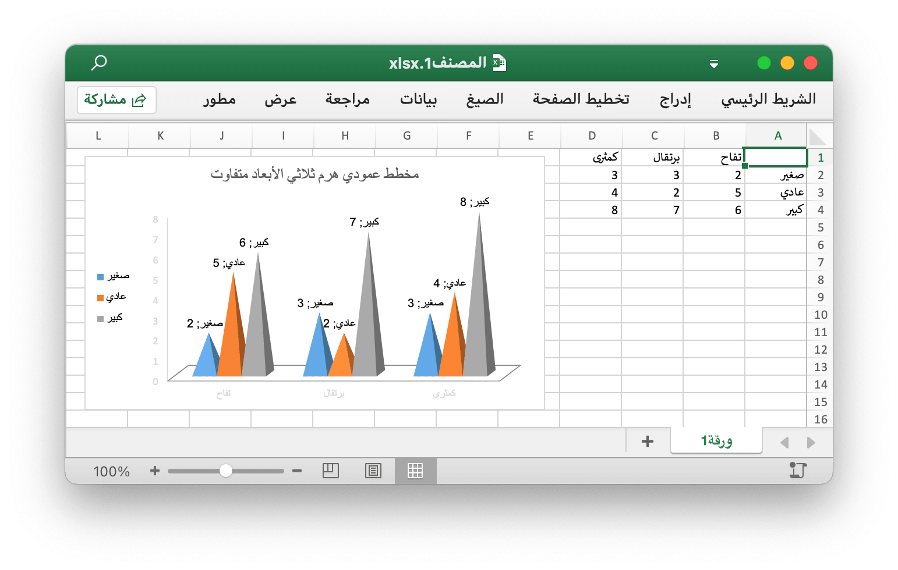

# مخطط عمودي هرم ثلاثي الأبعاد متفاوت {#col3DPyramidClustered}

على سبيل المثال ، أضف مخطط عمودي هرم ثلاثي الأبعاد متفاوت مثل هذا:

<p align="center"></p>

```go
package main

import (
    "fmt"

    "github.com/xuri/excelize/v2"
)

func main() {
    f := excelize.NewFile()
    defer func() {
        if err := f.Close(); err != nil {
            fmt.Println(err)
        }
    }()
    if err := f.SetSheetName("Sheet1", "ورقة1"); err != nil {
        fmt.Println(err)
        return
    }
    enable := true
    if err := f.SetSheetView("ورقة1", -1, &excelize.ViewOptions{
        RightToLeft: &enable,
    }); err != nil {
        fmt.Println(err)
    }
    for idx, row := range [][]interface{}{
        {nil, "تفاح", "برتقال", "كمثرى"},
        {"صغير", 2, 3, 3},
        {"عادي", 5, 2, 4},
        {"كبير", 6, 7, 8},
    } {
        cell, err := excelize.CoordinatesToCellName(1, idx+1)
        if err != nil {
            fmt.Println(err)
            return
        }
        f.SetSheetRow("ورقة1", cell, &row)
    }
    if err := f.AddChart("ورقة1", "E1", &excelize.Chart{
        Type: excelize.Col3DPyramidClustered,
        Series: []excelize.ChartSeries{
            {
                Name:       "ورقة1!$A$2",
                Categories: "ورقة1!$B$1:$D$1",
                Values:     "ورقة1!$B$2:$D$2",
            },
            {
                Name:       "ورقة1!$A$3",
                Categories: "ورقة1!$B$1:$D$1",
                Values:     "ورقة1!$B$3:$D$3",
            },
            {
                Name:       "ورقة1!$A$4",
                Categories: "ورقة1!$B$1:$D$1",
                Values:     "ورقة1!$B$4:$D$4",
            },
        },
        Format: excelize.GraphicOptions{
            OffsetX: 15,
            OffsetY: 10,
        },
        Legend: excelize.ChartLegend{
            Position: "left",
        },
        Title: excelize.ChartTitle{
            Name: "مخطط عمودي هرم ثلاثي الأبعاد متفاوت",
        },
        PlotArea: excelize.ChartPlotArea{
            ShowCatName:     false,
            ShowLeaderLines: false,
            ShowPercent:     true,
            ShowSerName:     true,
            ShowVal:         true,
        },
        ShowBlanksAs: "zero",
    }); err != nil {
        fmt.Println(err)
        return
    }
    // احفظ جدول البيانات بالمسار المحدد.
    if err := f.SaveAs("المصنف1.xlsx"); err != nil {
        fmt.Println(err)
    }
}
```
