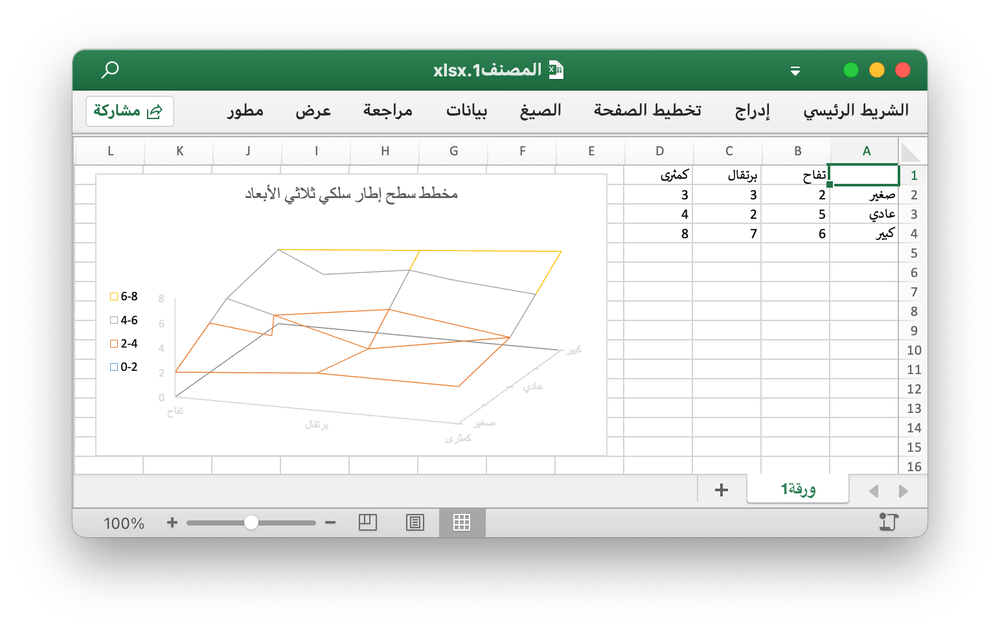

# مخطط سطح إطار سلكي ثلاثي الأبعاد {#wireframeSurface3D}

على سبيل المثال ، أضف مخطط سطح إطار سلكي ثلاثي الأبعاد مثل هذا:

<p align="center"></p>

```go
package main

import (
    "fmt"

    "github.com/360EntSecGroup-Skylar/excelize"
)

func main() {
    categories := map[string]string{
        "A2": "صغير", "A3": "عادي", "A4": "كبير", "B1": "تفاح", "C1": "برتقال", "D1": "كمثرى"}
    values := map[string]int{
        "B2": 2, "C2": 3, "D2": 3, "B3": 5, "C3": 2, "D3": 4, "B4": 6, "C4": 7, "D4": 8}
    f := excelize.NewFile()
    f.SetSheetName("Sheet1", "ورقة1")
    if err := f.SetSheetViewOptions("ورقة1", -1,
        excelize.RightToLeft(true),
    ); err != nil {
        fmt.Println(err)
    }
    for k, v := range categories {
        f.SetCellValue("ورقة1", k, v)
    }
    for k, v := range values {
        f.SetCellValue("ورقة1", k, v)
    }
    if err := f.AddChart("ورقة1", "E1", `{
        "type": "wireframeSurface3D",
        "series": [
        {
            "name": "ورقة1!$A$2",
            "categories": "ورقة1!$B$1:$D$1",
            "values": "ورقة1!$B$2:$D$2"
        },
        {
            "name": "ورقة1!$A$3",
            "categories": "ورقة1!$B$1:$D$1",
            "values": "ورقة1!$B$3:$D$3"
        },
        {
            "name": "ورقة1!$A$4",
            "categories": "ورقة1!$B$1:$D$1",
            "values": "ورقة1!$B$4:$D$4"
        }],
        "format":
        {
            "x_scale": 1.0,
            "y_scale": 1.0,
            "x_offset": 15,
            "y_offset": 10,
            "print_obj": true,
            "lock_aspect_ratio": false,
            "locked": false
        },
        "legend":
        {
            "position": "left",
            "show_legend_key": false
        },
        "title":
        {
            "name": "مخطط سطح إطار سلكي ثلاثي الأبعاد"
        }
    }`); err != nil {
        fmt.Println(err)
    }
    // احفظ جدول البيانات بالمسار المحدد.
    if err := f.SaveAs("المصنف1.xlsx"); err != nil {
        fmt.Println(err)
    }
}
```
