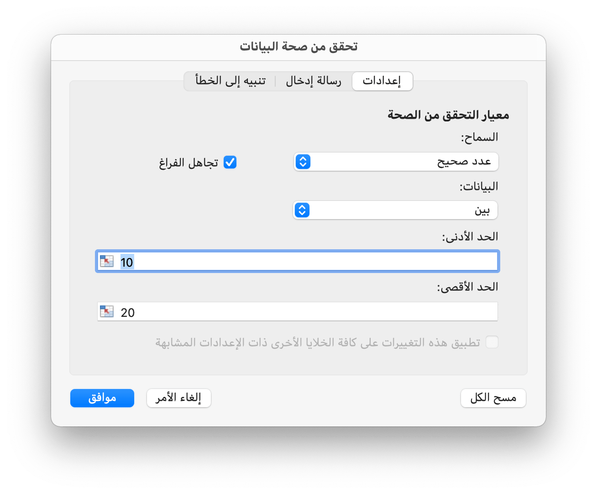
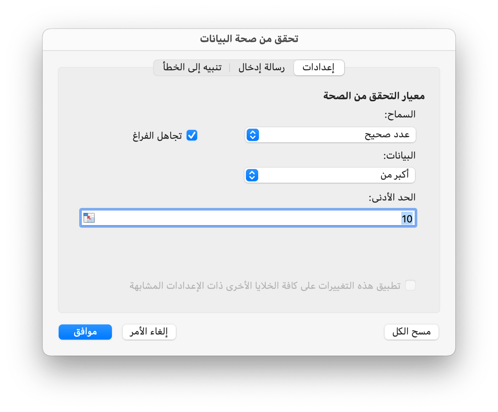
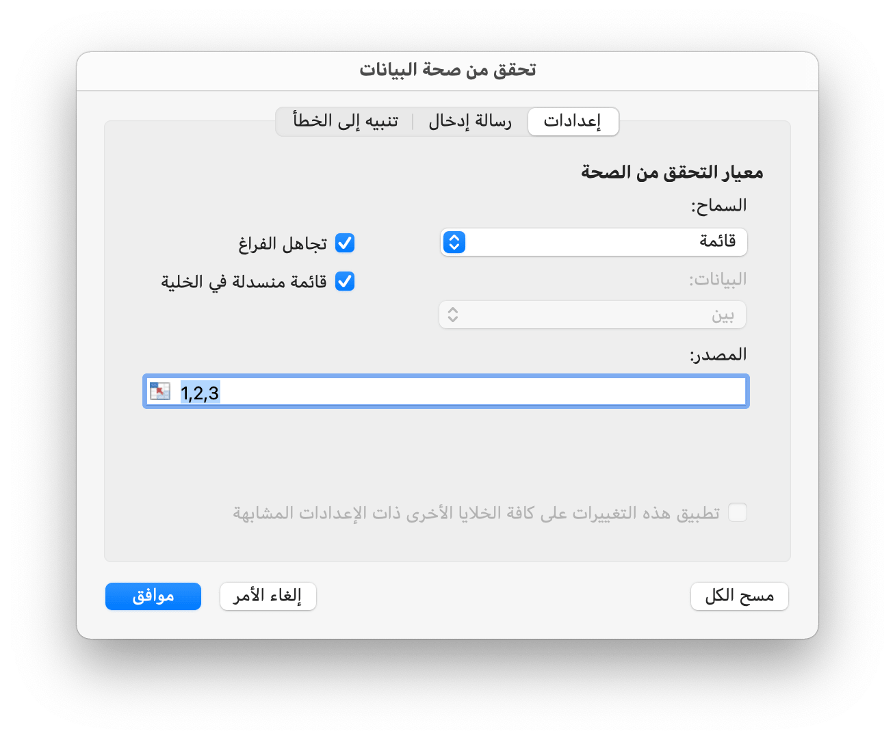
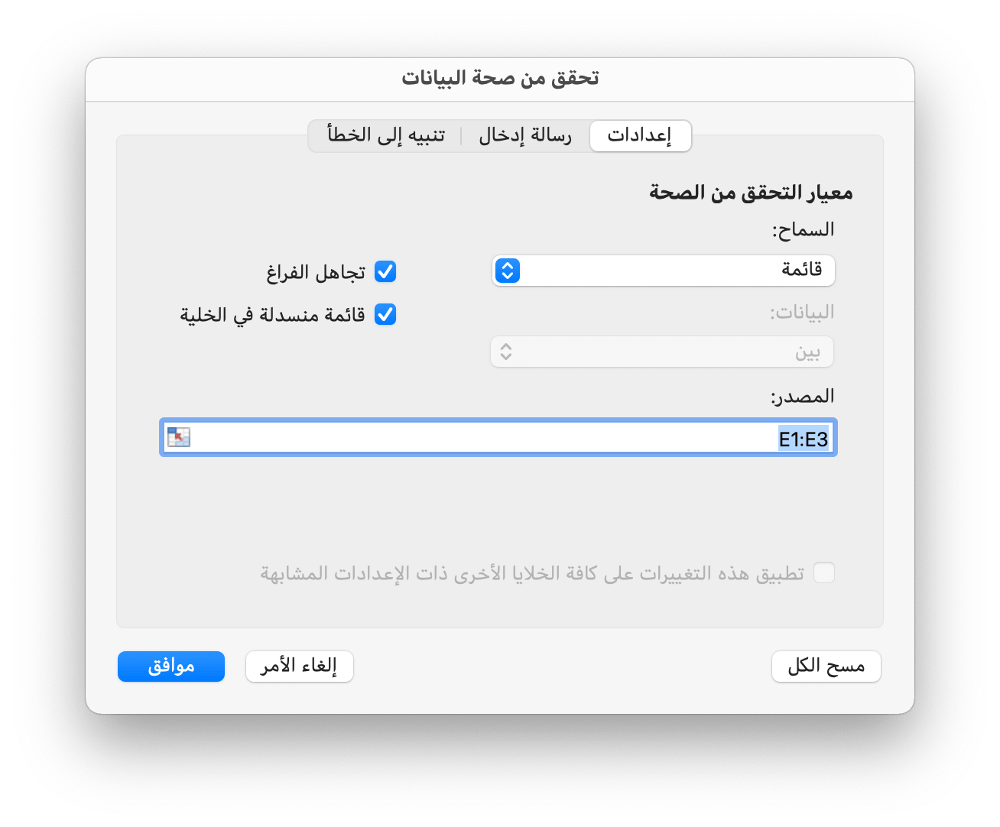

# البيانات

## إضافة التحقق من صحة البيانات {#AddDataValidation}

```go
func (f *File) AddDataValidation(sheet string, dv *DataValidation)
```

يوفر AddDataValidation التحقق من صحة البيانات المحددة في نطاق من ورقة العمل من خلال كائن التحقق من صحة البيانات واسم ورقة العمل المحدد. يمكن إنشاء كائن التحقق من صحة البيانات بواسطة الدالة `NewDataValidation`. يمكن العثور على نوع التحقق من صحة البيانات وعوامل التشغيل في قسم [الثوابت](constants.md).

مثال 1 ، قم بتعيين التحقق من صحة البيانات على `Sheet1!A1:B2` بإعدادات معايير التحقق ، إظهار تنبيه خطأ بعد إدخال بيانات غير صالحة بنمط "إيقاف" والعنوان المخصص "نص الخطأ":

<p align="center"></p>

```go
dv := excelize.NewDataValidation(true)
dv.SetSqref("A1:B2")
dv.SetRange(10, 20, excelize.DataValidationTypeWhole, excelize.DataValidationOperatorBetween)
dv.SetError(excelize.DataValidationErrorStyleStop, "error title", "نص الخطأ")
f.AddDataValidation("Sheet1", dv)
```

Example 2, set data validation on `Sheet1!A3:B4` with validation criteria settings, and show input message when cell is selected:

<p align="center"></p>

```go
dv = excelize.NewDataValidation(true)
dv.SetSqref("A3:B4")
dv.SetRange(10, 20, excelize.DataValidationTypeWhole, excelize.DataValidationOperatorGreaterThan)
dv.SetInput("input title", "input body")
f.AddDataValidation("Sheet1", dv)
```

مثال 3 ، قم بتعيين التحقق من صحة البيانات على `Sheet1!A5:B6` باستخدام إعدادات معايير التحقق ، قم بإنشاء قائمة منسدلة داخل الخلية عن طريق السماح بمصدر القائمة:

<p align="center"></p>

```go
dv = excelize.NewDataValidation(true)
dv.SetSqref("A5:B6")
dv.SetDropList([]string{"1", "2", "3"})
f.AddDataValidation("Sheet1", dv)
```

إذا قمت بكتابة العناصر في مربع حوار التحقق من صحة البيانات (قائمة محددة)، فإن الحد الأقصى هو 255 حرفًا، بما في ذلك الفواصل. إذا كانت صيغة مصدر قائمة التحقق من صحة البيانات الخاصة بك تتجاوز الحد الأقصى للطول، فيرجى تعيين القيم المسموح بها في خلايا ورقة العمل، واستخدام وظيفة `SetSqrefDropList` لتعيين المرجع للخلايا الخاصة بها.

المثال 4 ، قم بتعيين التحقق من صحة البيانات على `Sheet1!A7:B8` باستخدام إعدادات مصدر معايير التحقق `Sheet1!E1:E3` ، قم بإنشاء قائمة منسدلة داخل الخلية عن طريق السماح بمصدر القائمة:

<p align="center"></p>

```go
dv := excelize.NewDataValidation(true)
dv.SetSqref("A7:B8")
dv.SetSqrefDropList("$E$1:$E$3")
f.AddDataValidation("Sheet1", dv)
```

هناك حدود لعدد العناصر التي ستظهر في القائمة المنسدلة للتحقق من صحة البيانات: يمكن أن تظهر القائمة حتى تعرض 32768 عنصرًا من قائمة في ورقة العمل. إذا كنت بحاجة إلى المزيد من العناصر، فيمكنك إنشاء قائمة منسدلة تابعة، مقسمة حسب الفئة.

## الحصول على التحقق من صحة البيانات {#GetDataValidations}

```go
func (f *File) GetDataValidations(sheet string) ([]*DataValidation, error)
```

يقوم GetDataValidations بإرجاع قائمة التحقق من صحة البيانات بواسطة اسم ورقة العمل المحدد.

## حذف التحقق من صحة البيانات {#DeleteDataValidation}

```go
func (f *File) DeleteDataValidation(sheet string, sqref ...string) error
```

DeleteDataValidation يحذف التحقق من صحة البيانات من خلال اسم ورقة العمل المحددة والتسلسل المرجعي. سيتم حذف جميع عمليات التحقق من صحة البيانات في ورقة العمل إذا لم يتم تحديد معلمة تسلسل مرجعي.

## أضف القطاعة {#AddSlicer}

تمثل `SlicerOptions` إعدادات أداة التقطيع.

```go
type SlicerOptions struct {
    Name          string
    Table         string
    Cell          string
    Caption       string
    Macro         string
    Width         uint
    Height        uint
    DisplayHeader *bool
    ItemDesc      bool
    Format        GraphicOptions
}
```

يحدد `Name` اسم مقسم طريقة العرض، ويجب أن يكون اسم حقل موجودًا للجدول المحدد أو الجدول المحوري، وهذا الإعداد مطلوب.

يحدد `Table` اسم الجدول أو الجدول المحوري، وهذا الإعداد مطلوب.

تحدد `Cell` الخلية العلوية اليسرى التي تنسق موضع إدخال أداة التقطيع، وهذا الإعداد مطلوب.

يحدد `Caption` التسمية التوضيحية لقطاعة العرض، وهذا الإعداد اختياري.

يُستخدم `Macro` لتعيين الماكرو لمقسم طريقة العرض، ويجب أن يكون ملحق المصنف XLSM أو XLTM.

يحدد `Width` عرض أداة التقطيع، وهذا الإعداد اختياري.

يحدد `Height` ارتفاع أداة التقطيع، وهذا الإعداد اختياري.

يحدد `DisplayHeader` ما إذا كان سيتم عرض رأس مقسم طريقة العرض، فهذا الإعداد اختياري، والإعداد الافتراضي هو العرض.

يحدد `ItemDesc` ترتيب العناصر تنازليًا (Z-A)، وهذا الإعداد اختياري، والإعداد الافتراضي هو `false` (يمثل تصاعديًا).

يحدد `Format` تنسيق أداة التقطيع، وهذا الإعداد اختياري.

```go
func (f *File) AddSlicer(sheet string, opts *SlicerOptions) error
```

تقوم وظيفة AddSlicer بإدراج أداة تقطيع شرائح عن طريق إعطاء اسم ورقة العمل وإعدادات أداة تقطيع شرائح البيانات. أداة تقطيع الجدول المحوري غير مدعومة حاليًا. على سبيل المثال، قم بإدراج مقسم طريقة عرض في `ورقة1!E1` مع الحقل `Column1` للجدول المسمى `Table1`:

```go
err := f.AddSlicer("ورقة1", &excelize.SlicerOptions{
    Name:    "Column1",
    Table:   "Table1",
    Cell:    "E1",
    Caption: "Column1",
    Width:   200,
    Height:  200,
})
```
