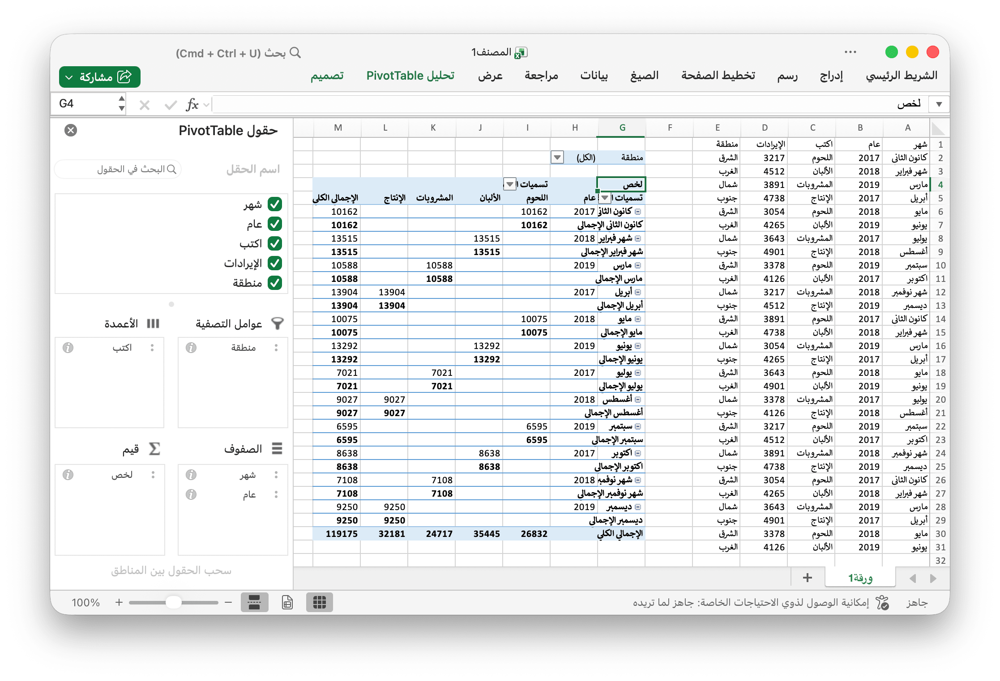

# الجدول المحوري {#PivotTable}

الجدول المحوري هو جدول إحصائيات يلخص بيانات جدول أكثر شمولاً (مثل من قاعدة بيانات أو جدول بيانات أو برنامج ذكاء الأعمال). قد يتضمن هذا الملخص مجاميع أو متوسطات أو إحصائيات أخرى ، والتي يقوم الجدول المحوري بتجميعها معًا بطريقة مفيدة.

يقوم PivotTableOption بتعيين إعدادات التنسيق للجدول المحوري مباشرةً.

```go
type PivotTableOption struct {
    DataRange           string
    PivotTableRange     string
    Rows                []PivotTableField
    Columns             []PivotTableField
    Data                []PivotTableField
    Filter              []PivotTableField
    RowGrandTotals      bool
    ColGrandTotals      bool
    ShowDrill           bool
    UseAutoFormatting   bool
    PageOverThenDown    bool
    MergeItem           bool
    CompactData         bool
    ShowRowHeaders      bool
    ShowColHeaders      bool
    ShowRowStripes      bool
    ShowColStripes      bool
    ShowLastColumn      bool
    PivotTableStyleName string
}
```

يقوم PivotTableField بتعيين الإعدادات الميدانية للجدول المحوري مباشرةً.

```go
type PivotTableField struct {
    Data            string
    Name            string
    Subtotal        string
    DefaultSubtotal bool
}
```

تحدد Subtotal وظيفة التجميع التي تنطبق على حقل البيانات هذا. القيمة الافتراضية هي `Sum`. القيم المحتملة لهذه السمة هي:

|قيمة اختيارية|
|---|
|Average|
|Count|
|CountNums|
|Max|
|Min|
|Product|
|StdDev|
|StdDevp|
|Sum|
|Var|
|Varp|

يحدد Name اسم حقل البيانات. الحد الأقصى المسموح به `255` حرفًا في اسم حقل البيانات ، وسيتم قطع الأحرف الزائدة.

## إنشاء جدول محوري {#AddPivotTable}

```go
func (f *File) AddPivotTable(opt *PivotTableOption) error
```

يوفر AddPivotTable طريقة لإضافة جدول محوري من خلال خيارات الجدول المحوري المحددة.

على سبيل المثال ، أنشئ جدولاً محوريًا في منطقة `Sheet1!$G$2:$M$34` مع المنطقة `Sheet1!$A$1:$E$31` كمصدر للبيانات ، ولخص بالمجموع للمبيعات:

<p align="center"></p>

```go
package main

import (
    "fmt"
    "math/rand"

    "github.com/360EntSecGroup-Skylar/excelize/v2"
)

func main() {
    f := excelize.NewFile()
    if err := f.SetSheetViewOptions("Sheet1", -1,
        excelize.RightToLeft(true),
    ); err != nil {
        fmt.Println(err)
    }
    // قم بإنشاء بعض البيانات في ورقة العمل
    month := []string{"كانون الثاني", "شهر فبراير", "مارس", "أبريل", "مايو",
        "يونيو", "يوليو", "أغسطس", "سبتمبر", "اكتوبر", "شهر نوفمبر", "ديسمبر"}
    year := []int{2017, 2018, 2019}
    types := []string{"اللحوم", "الألبان", "المشروبات", "الإنتاج"}
    region := []string{"الشرق", "الغرب", "شمال", "جنوب"}
    f.SetSheetRow("Sheet1", "A1", &[]string{"شهر", "عام", "اكتب", "مبيعات", "منطقة"})
    for i := 0; i < 30; i++ {
        f.SetCellValue("Sheet1", fmt.Sprintf("A%d", i+2), month[rand.Intn(12)])
        f.SetCellValue("Sheet1", fmt.Sprintf("B%d", i+2), year[rand.Intn(3)])
        f.SetCellValue("Sheet1", fmt.Sprintf("C%d", i+2), types[rand.Intn(4)])
        f.SetCellValue("Sheet1", fmt.Sprintf("D%d", i+2), rand.Intn(5000))
        f.SetCellValue("Sheet1", fmt.Sprintf("E%d", i+2), region[rand.Intn(4)])
    }
    if err := f.AddPivotTable(&excelize.PivotTableOption{
        DataRange:       "Sheet1!$A$1:$E$31",
        PivotTableRange: "Sheet1!$G$2:$M$34",
        Rows: []excelize.PivotTableField{
            {Data: "شهر", DefaultSubtotal: true}, {Data: "عام"}},
        Filter: []excelize.PivotTableField{
            {Data: "منطقة"}},
        Columns: []excelize.PivotTableField{
            {Data: "اكتب", DefaultSubtotal: true}},
        Data: []excelize.PivotTableField{
            {Data: "مبيعات", Name: "لخص", Subtotal: "Sum"}},
        RowGrandTotals: true,
        ColGrandTotals: true,
        ShowDrill:      true,
        ShowRowHeaders: true,
        ShowColHeaders: true,
        ShowLastColumn: true,
    }); err != nil {
        fmt.Println(err)
    }
    if err := f.SaveAs("المصنف1.xlsx"); err != nil {
        fmt.Println(err)
    }
}
```
