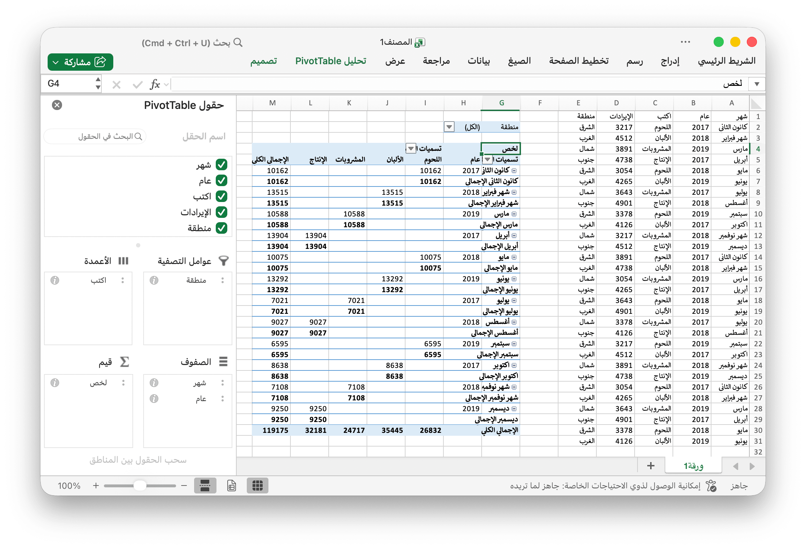

# الجدول المحوري {#PivotTable}

الجدول المحوري هو جدول إحصائيات يلخص بيانات جدول أكثر شمولاً (مثل من قاعدة بيانات أو جدول بيانات أو برنامج ذكاء الأعمال). قد يتضمن هذا الملخص مجاميع أو متوسطات أو إحصائيات أخرى ، والتي يقوم الجدول المحوري بتجميعها معًا بطريقة مفيدة.

يقوم `PivotTableOptions` بتعيين إعدادات التنسيق للجدول المحوري مباشرةً.

```go
type PivotTableOptions struct {
    DataRange           string
    PivotTableRange     string
    Name                string
    Rows                []PivotTableField
    Columns             []PivotTableField
    Data                []PivotTableField
    Filter              []PivotTableField
    RowGrandTotals      bool
    ColGrandTotals      bool
    ShowDrill           bool
    UseAutoFormatting   bool
    PageOverThenDown    bool
    MergeItem           bool
    ClassicLayout       bool
    CompactData         bool
    ShowError           bool
    ShowRowHeaders      bool
    ShowColHeaders      bool
    ShowRowStripes      bool
    ShowColStripes      bool
    ShowLastColumn      bool
    FieldPrintTitles    bool
    ItemPrintTitles     bool
    PivotTableStyleName string
    // يحتوي على حقول مصفاة أو غير مُصدرة
}
```

`PivotTableStyleName`: أسماء أنماط الجدول المحوري المضمنة:

```text
PivotStyleLight1 - PivotStyleLight28
PivotStyleMedium1 - PivotStyleMedium28
PivotStyleDark1 - PivotStyleDark28
```

يقوم `PivotTableField` بتعيين الإعدادات الميدانية للجدول المحوري مباشرةً.

```go
type PivotTableField struct {
    Compact         bool
    Data            string
    Name            string
    Outline         bool
    ShowAll         bool
    InsertBlankRow  bool
    Subtotal        string
    DefaultSubtotal bool
    NumFmt          int
    SelectedItems   []string
}
```

تحدد `Subtotal` وظيفة التجميع التي تنطبق على حقل البيانات هذا. القيمة الافتراضية هي `Sum`. القيم المحتملة لهذه السمة هي:

|قيمة اختيارية|
|---|
|Average|
|Count|
|CountNums|
|Max|
|Min|
|Product|
|StdDev|
|StdDevp|
|Sum|
|Var|
|Varp|

يحدد `Name` اسم حقل البيانات. الحد الأقصى المسموح به `255` حرفًا في اسم حقل البيانات ، وسيتم قطع الأحرف الزائدة.

يُحدد حقل `SelectedItems` العناصر المحددة افتراضيًا في حقل جدول محوري. يجب أن تكون العناصر المحددة قيمًا ضمن نطاق الخلايا المشار إليه بواسطة هذا الحقل.

## إنشاء جدول محوري {#AddPivotTable}

```go
func (f *File) AddPivotTable(opts *PivotTableOptions) error
```

يوفر AddPivotTable طريقة لإضافة جدول محوري من خلال خيارات الجدول المحوري المحددة.

على سبيل المثال ، أنشئ جدولاً محوريًا في منطقة `ورقة1!G4:M31` مع المنطقة `ورقة1!A1:E31` كمصدر للبيانات ، ولخص بالمجموع للمبيعات:

<p align="center"></p>

```go
package main

import (
    "fmt"

    "github.com/xuri/excelize/v2"
)

func main() {
    f := excelize.NewFile()
    defer func() {
        if err := f.Close(); err != nil {
            fmt.Println(err)
        }
    }()
    if err := f.SetSheetName("Sheet1", "ورقة1"); err != nil {
        fmt.Println(err)
        return
    }
    enable := true
    if err := f.SetSheetView("ورقة1", -1, &excelize.ViewOptions{
        RightToLeft: &enable,
    }); err != nil {
        fmt.Println(err)
        return
    }
    // قم بإنشاء بعض البيانات في ورقة العمل
    month := []string{"كانون الثاني", "شهر فبراير", "مارس", "أبريل", "مايو",
        "يونيو", "يوليو", "أغسطس", "سبتمبر", "اكتوبر", "شهر نوفمبر", "ديسمبر"}
    year := []int{2017, 2018, 2019}
    types := []string{"اللحوم", "الألبان", "المشروبات", "الإنتاج"}
    revenue := []int{3217, 4512, 3891, 4738, 3054, 4265, 3643, 4901, 3378, 4126}
    region := []string{"الشرق", "الغرب", "شمال", "جنوب"}
    if err := f.SetSheetRow(
        "ورقة1", "A1", &[]string{"شهر", "عام", "اكتب", "الإيرادات", "منطقة"},
    ); err != nil {
        fmt.Println(err)
        return
    }
    for row := 2; row < 32; row++ {
        f.SetCellValue("ورقة1", fmt.Sprintf("A%d", row), month[(row-2)%len(month)])
        f.SetCellValue("ورقة1", fmt.Sprintf("B%d", row), year[(row-2)%len(year)])
        f.SetCellValue("ورقة1", fmt.Sprintf("C%d", row), types[(row-2)%len(types)])
        f.SetCellValue("ورقة1", fmt.Sprintf("D%d", row), revenue[(row-2)%len(revenue)])
        f.SetCellValue("ورقة1", fmt.Sprintf("E%d", row), region[(row-2)%len(region)])
    }
    if err := f.AddPivotTable(&excelize.PivotTableOptions{
        DataRange:       "ورقة1!A1:E31",
        PivotTableRange: "ورقة1!G4:M31",
        Rows: []excelize.PivotTableField{
            {Data: "شهر", DefaultSubtotal: true}, {Data: "عام"},
        },
        Filter: []excelize.PivotTableField{
            {Data: "منطقة"}},
        Columns: []excelize.PivotTableField{
            {Data: "اكتب", DefaultSubtotal: true},
        },
        Data: []excelize.PivotTableField{
            {Data: "الإيرادات", Name: "لخص", Subtotal: "Sum"},
        },
        RowGrandTotals: true,
        ColGrandTotals: true,
        ShowDrill:      true,
        ShowRowHeaders: true,
        ShowColHeaders: true,
        ShowLastColumn: true,
    }); err != nil {
        fmt.Println(err)
        return
    }
    if err := f.SaveAs("المصنف1.xlsx"); err != nil {
        fmt.Println(err)
    }
}
```

## الحصول على الجداول المحورية {#GetPivotTables}

```go
func (f *File) GetPivotTables(sheet string) ([]PivotTableOptions, error)
```

تقوم GetPivotTables بإرجاع كافة تعريفات الجدول المحوري في ورقة العمل حسب اسم ورقة العمل المحدد.

## حذف الجدول المحوري {#DeletePivotTable}

```go
func (f *File) DeletePivotTable(sheet, name string) error
```

تقوم DeletePivotTable بحذف جدول محوري عن طريق إعطاء اسم ورقة العمل واسم الجدول المحوري. لاحظ أن هذه الوظيفة لا تقوم بتنظيف قيم الخلايا في نطاق الجدول المحوري.
