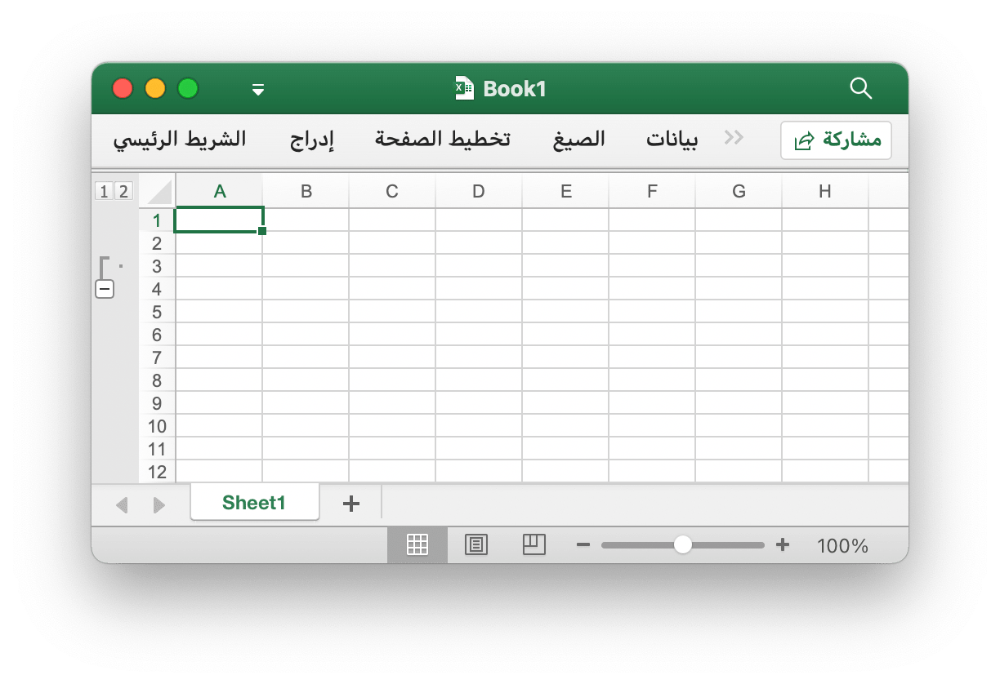
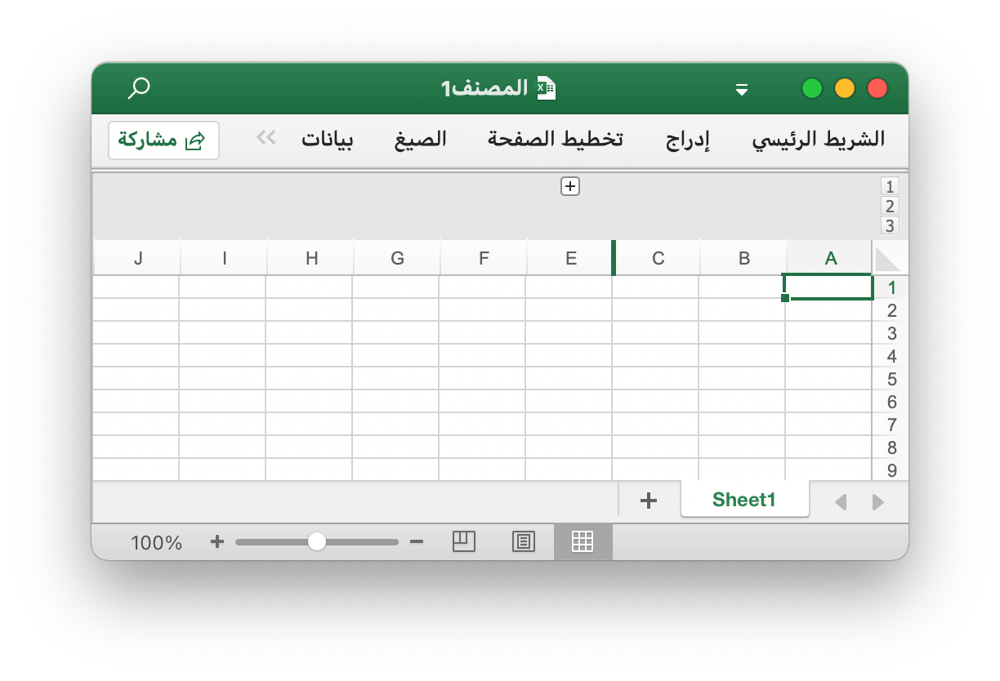

# ورقة عمل

## تعيين رؤية العمود {#SetColVisible}

```go
func (f *File) SetColVisible(sheet, col string, visible bool) error
```

يوفر SetColVisible وظيفة لتعيين مرئي لعمود واحد من خلال اسم ورقة العمل واسم العمود المحدد. على سبيل المثال ، إخفاء العمود `D` في `Sheet1`:

```go
err := f.SetColVisible("Sheet1", "D", false)
```

إخفاء الأعمدة من `D` إلى `F` (مضمنة):

```go
err := f.SetColVisible("Sheet1", "D:F", false)
```

## تعيين عرض العمود {#SetColWidth}

```go
func (f *File) SetColWidth(sheet, startCol, endCol string, width float64) error
```

يوفر SetColWidth وظيفة لتعيين عرض عمود واحد أو عدة أعمدة. فمثلا:

```go
f := excelize.NewFile()
err := f.SetColWidth("Sheet1", "A", "H", 20)
```

## تعيين ارتفاع الصف {#SetRowHeight}

```go
func (f *File) SetRowHeight(sheet string, row int, height float64) error
```

يوفر SetRowHeight وظيفة لتعيين ارتفاع صف واحد. على سبيل المثال ، عيِّن ارتفاع الصف الأول في `Sheet1`:

```go
err := f.SetRowHeight("Sheet1", 1, 50)
```

## تعيين رؤية الصف {#SetRowVisible}

```go
func (f *File) SetRowVisible(sheet string, row int, visible bool) error
```

يوفر SetRowVisible وظيفة لتعيين مرئي لصف واحد من خلال اسم ورقة العمل وفهرس الصف. على سبيل المثال ، إخفاء الصف `2` في `Sheet1`:

```go
err := f.SetRowVisible("Sheet1", 2, false)
```

## احصل على اسم الورقة {#GetSheetName}

```go
func (f *File) GetSheetName(index int) string
```

يوفر GetSheetName وظيفة للحصول على اسم ورقة المصنف من خلال فهرس الورقة المحدد. إذا كان فهرس الورقة المحدد غير صالح ، فسيتم إرجاع سلسلة فارغة.

## احصل على رؤية العمود {#GetColVisible}

```go
func (f *File) GetColVisible(sheet, column string) (bool, error)
```

يوفر GetColVisible وظيفة لإظهار عمود واحد من خلال اسم ورقة العمل واسم العمود المحدد. على سبيل المثال ، احصل على الحالة المرئية للعمود `D` في `Sheet1`:
```go
visible, err := f.GetColVisible("Sheet1", "D")
```

## احصل على عرض العمود {#GetColWidth}

```go
func (f *File) GetColWidth(sheet, col string) (float64, error)
```

يوفر GetColWidth وظيفة للحصول على عرض العمود من خلال إعطاء اسم ورقة العمل وفهرس العمود.

## احصل على ارتفاع الخط {#GetRowHeight}

```go
func (f *File) GetRowHeight(sheet string, row int) (float64, error)
```

يوفر GetRowHeight وظيفة للحصول على ارتفاع الصف من خلال اسم ورقة العمل وفهرس الصف. على سبيل المثال ، احصل على ارتفاع الصف الأول في `Sheet1`:

```go
height, err := f.GetRowHeight("Sheet1", 1)
```

## احصل على رؤية للخط {#GetRowVisible}

```go
func (f *File) GetRowVisible(sheet string, row int) (bool, error)
```

يوفر GetRowVisible وظيفة لإظهار صف واحد من خلال اسم ورقة العمل وفهرس الصف. على سبيل المثال ، احصل على الحالة المرئية للصف `2` في `Sheet1`:

```go
err := f.GetRowVisible("Sheet1", 2)
```

## احصل على فهرس ورقة العمل {#GetSheetIndex}

```go
func (f *File) GetSheetIndex(name string) int
```

يوفر GetSheetIndex وظيفة للحصول على فهرس ورقة المصنف حسب اسم الورقة المحدد. إذا كان اسم الورقة المحدد غير صالح أو كانت ورقة العمل غير موجودة ، فستُرجع قيمة نوع عدد صحيح `-1`.

يمكن استخدام الفهرس الذي تم الحصول عليه كمعامل لاستدعاء الوظيفة [`SetActiveSheet()`](workbook.md#SetActiveSheet) عند تعيين ورقة العمل الافتراضية للمصنف.

## الحصول على خريطة ورقة {#GetSheetMap}

```go
func (f *File) GetSheetMap() map[int]string
```

يوفر GetSheetMap وظيفة للحصول على أوراق العمل وأوراق المخططات ومعرف أوراق الحوار وخريطة اسم المصنف. فمثلا:

```go
f, err := excelize.OpenFile("المصنف1.xlsx")
if err != nil {
    return
}
for index, name := range f.GetSheetMap() {
    fmt.Println(index, name)
}
```

## الحصول على قائمة ورقة {#GetSheetList}

```go
func (f *File) GetSheetList() []string
```

يوفر GetSheetList وظيفة للحصول على أوراق العمل وأوراق المخططات وقائمة أسماء أوراق الحوار الخاصة بالمصنف.

## تعيين اسم الورقة {#SetSheetName}

```go
func (f *File) SetSheetName(oldName, newName string)
```

يوفر SetSheetName وظيفة لتعيين اسم ورقة العمل من خلال إعطاء أسماء أوراق العمل القديمة والجديدة. يُسمح بـ 31 حرفًا كحد أقصى في عنوان الورقة وهذه الوظيفة تغير فقط اسم الورقة ولن تقوم بتحديث اسم الورقة في الصيغة أو المرجع المرتبط بالخلية. لذلك قد يكون هناك خطأ في صيغة مشكلة أو إشارة مفقودة.

## تعيين خصائص الورقة {#SetSheetPrOptions}

```go
func (f *File) SetSheetPrOptions(name string, opts ...SheetPrOption) error
```

يوفر SetSheetPrOptions دالة لتعيين خصائص ورقة العمل.

الخيارات المتاحة:

|السمة الاختيارية|اكتب|
|---|---|
|CodeName|string|
|EnableFormatConditionsCalculation|bool|
|Published|bool|
|FitToPage|bool|
|TabColor|string|
|AutoPageBreaks|bool|
|OutlineSummaryBelow|bool|

فمثلا:

```go
f := excelize.NewFile()
const sheet = "Sheet1"

if err := f.SetSheetPrOptions(sheet,
    excelize.CodeName("code"),
    excelize.EnableFormatConditionsCalculation(false),
    excelize.Published(false),
    excelize.FitToPage(true),
    excelize.TabColor("#FFFF00"),
    excelize.AutoPageBreaks(true),
    excelize.OutlineSummaryBelow(false),
); err != nil {
    fmt.Println(err)
}
```

## الحصول على خصائص ورقة {#GetSheetPrOptions}

```go
func (f *File) GetSheetPrOptions(name string, opts ...SheetPrOptionPtr) error
```

يوفر GetSheetPrOptions دالة للحصول على خصائص ورقة العمل.

|السمة الاختيارية|اكتب|
|---|---|
|CodeName|string|
|EnableFormatConditionsCalculation|bool|
|Published|bool|
|FitToPage|bool|
|TabColor|string|
|AutoPageBreaks|bool|
|OutlineSummaryBelow|bool|

فمثلا:

```go
f := excelize.NewFile()
const sheet = "Sheet1"

var (
    codeName                          excelize.CodeName
    enableFormatConditionsCalculation excelize.EnableFormatConditionsCalculation
    published                         excelize.Published
    fitToPage                         excelize.FitToPage
    tabColor                          excelize.TabColor
    autoPageBreaks                    excelize.AutoPageBreaks
    outlineSummaryBelow               excelize.OutlineSummaryBelow
)

if err := f.GetSheetPrOptions(sheet,
    &codeName,
    &enableFormatConditionsCalculation,
    &published,
    &fitToPage,
    &tabColor,
    &autoPageBreaks,
    &outlineSummaryBelow,
); err != nil {
    fmt.Println(err)
}
fmt.Println("Defaults:")
fmt.Printf("- codeName: %q\n", codeName)
fmt.Println("- enableFormatConditionsCalculation:", enableFormatConditionsCalculation)
fmt.Println("- published:", published)
fmt.Println("- fitToPage:", fitToPage)
fmt.Printf("- tabColor: %q\n", tabColor)
fmt.Println("- autoPageBreaks:", autoPageBreaks)
fmt.Println("- outlineSummaryBelow:", outlineSummaryBelow)
```

الحصول على الإخراج:

```text
Defaults:
- codeName: ""
- enableFormatConditionsCalculation: true
- published: true
- fitToPage: false
- tabColor: ""
- autoPageBreaks: false
- outlineSummaryBelow: true
```

## إدراج عمود {#InsertCol}

```go
func (f *File) InsertCol(sheet, column string) error
```

يوفر InsertCol وظيفة لإدراج عمود جديد قبل فهرس العمود المحدد. على سبيل المثال ، أنشئ عمودًا جديدًا قبل العمود `C` في `Sheet1`:

```go
err := f.InsertCol("Sheet1", "C")
```

## إدراج صف {#InsertRow}

```go
func (f *File) InsertRow(sheet string, row int) error
```

يوفر InsertRow وظيفة لإدراج صف جديد بعد رقم صف Excel المحدد بدءًا من 1. على سبيل المثال ، قم بإنشاء صف جديد قبل الصف `3` في `Sheet1`:

```go
err := f.InsertRow("Sheet1", 3)
```

## إلحاق صف مكرر {#DuplicateRow}

```go
func (f *File) DuplicateRow(sheet string, row int) error
```

يُدرج DuplicateRow نسخة من صف معين أدناه المحدد ، على سبيل المثال:

```go
err := f.DuplicateRow("Sheet1", 2)
```

استخدم هذه الطريقة بحذر ، مما سيؤثر على التغييرات في المراجع مثل الصيغ والمخططات وما إلى ذلك. إذا كان هناك أي قيمة مرجعية لورقة العمل ، فسوف يتسبب ذلك في حدوث خطأ في الملف عند فتحه. برنامج excelize يقوم بتحديث هذه المراجع جزئيًا فقط حاليًا.

## صف مكرر {#DuplicateRowTo}

```go
func (f *File) DuplicateRowTo(sheet string, row, row2 int) error
```

يُدرج DuplicateRowTo نسخة من الصف المحدد بواسطته رقم Excel إلى موضع الصف المحدد ويتحرك إلى أسفل الصفوف الموجودة بعد الموضع الهدف ، على سبيل المثال:

```go
err := f.DuplicateRowTo("Sheet1", 2, 7)
```

استخدم هذه الطريقة بحذر ، مما سيؤثر على التغييرات في المراجع مثل الصيغ والمخططات وما إلى ذلك. إذا كان هناك أي قيمة مرجعية لورقة العمل ، فسوف يتسبب ذلك في حدوث خطأ في الملف عند فتحه. برنامج excelize يقوم بتحديث هذه المراجع جزئيًا فقط حاليًا.

## إنشاء مخطط تفصيلي للصف {#SetRowOutlineLevel}

```go
func (f *File) SetRowOutlineLevel(sheet string, row int, level uint8) error
```

يوفر SetRowOutlineLevel وظيفة لتعيين رقم مستوى المخطط التفصيلي لصف واحد من خلال اسم ورقة العمل المعطى ورقم صف Excel. على سبيل المثال ، مخطط الصف 2 في `Sheet1` إلى المستوى 1:

<p align="center"></p>

```go
err := f.SetRowOutlineLevel("Sheet1", 2, 1)
```

## إنشاء مخطط تفصيلي للعمود {#SetColOutlineLevel}

```go
func (f *File) SetColOutlineLevel(sheet, col string, level uint8) error
```

يوفر SetColOutlineLevel وظيفة لتعيين مستوى المخطط التفصيلي لعمود واحد من خلال اسم ورقة العمل واسم العمود. على سبيل المثال ، عيّن مستوى المخطط التفصيلي للعمود `D` في `Sheet1` على 2:

<p align="center"></p>

```go
err := f.SetColOutlineLevel("Sheet1", "D", 2)
```

## الحصول على مخطط تفصيلي للصف {#GetRowOutlineLevel}

```go
func (f *File) GetRowOutlineLevel(sheet string, row int) (uint8, error)
```

يوفر GetRowOutlineLevel وظيفة للحصول على رقم مستوى المخطط التفصيلي لصف واحد عن طريق اسم ورقة العمل المعطى ورقم صف Excel. على سبيل المثال ، احصل على رقم المخطط التفصيلي للصف 2 في `Sheet1`:

```go
err := f.GetRowOutlineLevel("Sheet1", 2)
```

## الحصول على مخطط تفصيلي للعمود {#GetColOutlineLevel}

```go
func (f *File) GetColOutlineLevel(sheet, col string) (uint8, error)
```

يوفر GetColOutlineLevel وظيفة للحصول على مستوى المخطط التفصيلي لعمود واحد عن طريق اسم ورقة العمل واسم العمود. على سبيل المثال ، احصل على مستوى المخطط التفصيلي للعمود `D` في `Sheet1`:

```go
level, err := f.GetColOutlineLevel("Sheet1", "D")
```

## مُكَرِّد عمود {#Cols}

```go
func (f *File) Cols(sheet string) (*Cols, error)
```

تقوم Cols بإرجاع مكرر العمود ، المستخدم لدفق بيانات القراءة لورقة عمل ذات بيانات كبيرة. فمثلا:

```go
cols, err := f.Cols("Sheet1")
if err != nil {
    fmt.Println(err)
    return
}
for cols.Next() {
    col, err := cols.Rows()
    if err != nil {
        fmt.Println(err)
    }
    for _, rowCell := range col {
        fmt.Print(rowCell, "\t")
    }
    fmt.Println()
}
```

### مُكَرِّد عمود - الأعمدة

```go
func (cols *Cols) Rows(opts ...Options) ([]string, error)
```

تُرجع الصفوف قيم صف الأعمدة الحالية.

### مُكَرِّد عمود - ترافيرس

```go
func (cols *Cols) Next() bool
```

سيعيد Next `true` إذا تم العثور على العمود التالي.

### مُكَرِّد عمود - معالجة الأخطاء

```go
func (cols *Cols) Error() error
```

سيعيد Error الحرف `error` عند حدوث الخطأ.

## مُكَرِّد الصفوف {#Rows}

```go
func (f *File) Rows(sheet string) (*Rows, error)
```

يقوم Rows بإرجاع مكرر الصفوف ، يُستخدم لدفق بيانات القراءة لورقة عمل تحتوي على بيانات كبيرة. فمثلا:

```go
rows, err := f.Rows("Sheet1")
if err != nil {
    fmt.Println(err)
    return
}
for rows.Next() {
    row, err := rows.Columns()
    if err != nil {
        fmt.Println(err)
    }
    for _, colCell := range row {
        fmt.Print(colCell, "\t")
    }
    fmt.Println()
}
if err = rows.Close(); err != nil {
    fmt.Println(err)
}
```

### مُكَرِّد الصفوف - الأعمدة

```go
func (rows *Rows) Columns(opts ...Options) ([]string, error)
```

تُرجع الدالة Columns قيم عمود الصف الحالي.

### مُكَرِّد الصفوف - ترافيرس

```go
func (rows *Rows) Next() bool
```

سيعيد Next `true` إذا تم العثور على عنصر الصف التالي.

### مُكَرِّد الصفوف - معالجة الأخطاء

```go
func (rows *Rows) Error() error
```

سيعيد Error الحرف `error` عند حدوث الخطأ.

### مكرر الصف - إغلاق

```go
func (rows *Rows) Close() error
```

يغلق Close ملف XML المفتوح لورقة العمل في الدليل المؤقت للنظام.

## ورقة البحث {#SearchSheet}

```go
func (f *File) SearchSheet(sheet, value string, reg ...bool) ([]string, error)
```

يوفر SearchSheet وظيفة للحصول على الإحداثيات من خلال اسم ورقة العمل المعطى وقيمة الخلية والتعبير العادي. لا تدعم الوظيفة البحث في النتيجة المحسوبة والأرقام المنسقة والبحث الشرطي حاليًا. إذا كانت خلية مدمجة ، فستقوم بإرجاع إحداثيات الزاوية اليسرى العليا للمنطقة المدمجة.

على سبيل المثال ، ابحث عن إحداثيات القيمة `100` في `Sheet1`:

```go
result, err := f.SearchSheet("Sheet1", "100")
```

على سبيل المثال ، ابحث في الإحداثيات حيث يتم وصف القيمة العددية في النطاق `0-9` من `Sheet1`:

```go
result, err := f.SearchSheet("Sheet1", "[0-9]", true)
```

## حماية الورقة {#ProtectSheet}

```go
func (f *File) ProtectSheet(sheet string, settings *FormatSheetProtection) error
```

توفر ProtectSheet وظيفة لمنع المستخدمين الآخرين من تغيير البيانات في ورقة العمل أو نقلها أو حذفها عن طريق الخطأ أو عن عمد. الحقل الاختياري `AlgorithmName` خوارزمية التجزئة المحددة ، ودعم XOR ، MD4 ، MD5 ، SHA-1 ، SHA-256 ، SHA-384 ، و SHA-512 حاليًا ، إذا لم يتم تحديد خوارزمية التجزئة ، فسيستخدم خوارزمية XOR كإعداد افتراضي. على سبيل المثال ، حماية `Sheet1` بإعدادات الحماية:

<p align="center"></p>

```go
err := f.ProtectSheet("Sheet1", &excelize.FormatSheetProtection{
    AlgorithmName: "SHA-512",
    Password:      "password",
    EditScenarios: false,
})
```

يقوم FormatSheetProtection بتعيين إعدادات حماية ورقة العمل مباشرةً.

```go
type FormatSheetProtection struct {
    AlgorithmName       string
    AutoFilter          bool
    DeleteColumns       bool
    DeleteRows          bool
    EditObjects         bool
    EditScenarios       bool
    FormatCells         bool
    FormatColumns       bool
    FormatRows          bool
    InsertColumns       bool
    InsertHyperlinks    bool
    InsertRows          bool
    Password            string
    PivotTables         bool
    SelectLockedCells   bool
    SelectUnlockedCells bool
    Sort                bool
}
```

## ورقة إلغاء الحماية {#UnprotectSheet}

```go
func (f *File) UnprotectSheet(sheet string, password ...string) error
```

يوفر UnprotectSheet وظيفة لإزالة الحماية للورقة ، وحدد معلمة كلمة المرور الاختيارية الثانية لإزالة حماية الورقة باستخدام التحقق من كلمة المرور.

## إزالة عمود {#RemoveCol}

```go
func (f *File) RemoveCol(sheet, col string) error
```

يوفر RemoveCol وظيفة لإزالة عمود واحد من خلال إعطاء اسم ورقة العمل وفهرس العمود. على سبيل المثال ، أزل العمود `C` في `Sheet1`:

```go
err := f.RemoveCol("Sheet1", "C")
```

استخدم هذه الطريقة بحذر ، مما سيؤثر على التغييرات في المراجع مثل الصيغ والمخططات وما إلى ذلك. إذا كان هناك أي قيمة مرجعية لورقة العمل ، فسوف يتسبب ذلك في حدوث خطأ في الملف عند فتحه. برنامج excelize يقوم بتحديث هذه المراجع جزئيًا فقط حاليًا.

## إزالة الصف {#RemoveRow}

```go
func (f *File) RemoveRow(sheet string, row int) error
```

يوفر RemoveRow وظيفة لإزالة صف واحد عن طريق اسم ورقة العمل المحددة ورقم صف Excel. على سبيل المثال ، أزل الصف `3` في `Sheet1`:

```go
err := f.RemoveRow("Sheet1", 3)
```

استخدم هذه الطريقة بحذر ، مما سيؤثر على التغييرات في المراجع مثل الصيغ والمخططات وما إلى ذلك. إذا كان هناك أي قيمة مرجعية لورقة العمل ، فسوف يتسبب ذلك في حدوث خطأ في الملف عند فتحه. برنامج excelize يقوم بتحديث هذه المراجع جزئيًا فقط حاليًا.

## تعيين قيم الصفوف {#SetSheetRow}

```go
func (f *File) SetSheetRow(sheet, axis string, slice interface{}) error
```

يكتب SetSheetRow مصفوفة إلى صف بواسطة اسم ورقة العمل المحدد ، وبدء التنسيق ومؤشر لنوع الصفيف `slice` على سبيل المثال ، يكتب مصفوفة في الصف `6` تبدأ بالخلية `B6` في `Sheet1`:

```go
err := f.SetSheetRow("Sheet1", "B6", &[]interface{}{"1", nil, 2})
```

## إدراج فاصل الصفحات {#InsertPageBreak}

```go
func (f *File) InsertPageBreak(sheet, cell string) error
```

يُنشئ InsertPageBreak فاصل صفحات لتحديد مكان انتهاء الصفحة المطبوعة وأين يبدأ الفصل التالي من خلال اسم ومحور ورقة العمل المعينين ، بحيث تتم طباعة المحتوى قبل فاصل الصفحة على صفحة واحدة وبعد فاصل الصفحة على أخرى.

## إزالة فاصل الصفحات {#RemovePageBreak}

```go
func (f *File) RemovePageBreak(sheet, cell string) error
```

يقوم RemovePageBreak بإزالة فاصل صفحة من خلال اسم ومحور ورقة العمل المحددين.
