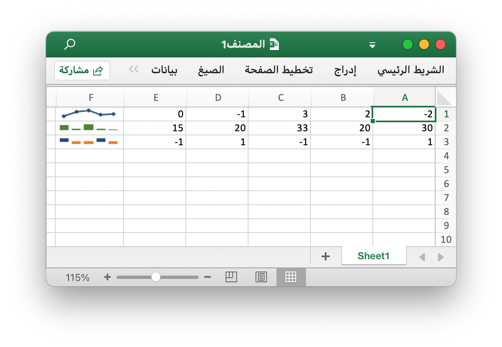
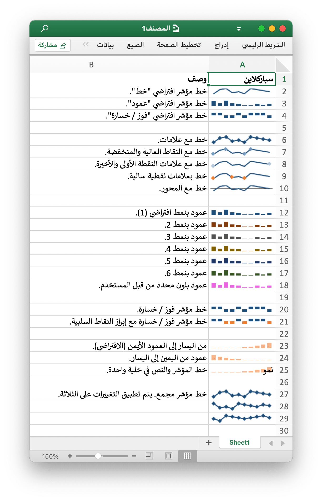

# سباركلاين

خطوط المؤشر هي إحدى ميزات Excel 2010+ والتي تتيح لك إضافة مخططات صغيرة إلى خلايا ورقة العمل. هذه مفيدة لعرض الاتجاهات المرئية في البيانات بتنسيق مضغوط.

<p align="center"></p>

اخترع [Edward Tufte](https://en.wikipedia.org/wiki/Edward_Tufte) [سباركلينج](https://en.wikipedia.org/wiki/Sparklines).

## أضف سباركلاين

```go
func (f *File) AddSparkline(sheet string, opts *SparklineOptions) error
```

يوفر AddSparkline وظيفة لإضافة خطوط مؤشرات إلى ورقة العمل من خلال خيارات التنسيق المحددة. خطوط المؤشر هي مخططات صغيرة تتلاءم مع خلية واحدة وتُستخدم لإظهار الاتجاهات في البيانات. الخطوط المضيئة هي إحدى ميزات Excel 2010 والإصدارات الأحدث فقط. يمكنك كتابتها في ملف جدول بيانات يمكن قراءته بواسطة Excel 2007 ولكن لن يتم عرضها. على سبيل المثال ، أضف خط مؤشر مجمع. يتم تطبيق التغييرات على الثلاثة:

```go
err := f.AddSparkline("Sheet1", &excelize.SparklineOptions{
    Location: []string{"A1", "A2", "A3"},
    Range:    []string{"Sheet2!A1:J1", "Sheet2!A2:J2", "Sheet2!A3:J3"},
    Markers:  true,
})
```

<p align="center"></p>

يظهر ما يلي خيارات التنسيق لخط مؤشر مدعوم بواسطة excelize:

معامل | وصف
---|---
Location    | مطلوب ، يجب أن يكون له نفس الرقم مع معلمة `Range`
Range       | مطلوب ، يجب أن يكون له نفس الرقم مع معلمة `Location`
Type        | قيمة التعداد: `line` ، `column` ، `win_loss`
Style       | مدى القيمة: 0 - 35
Hight       | تبديل النقاط العالية لخط التألق
Low         | تبديل نقاط خط المؤشر المنخفضة
First       | تبديل النقاط الأولى لخط المؤشر
Last        | تبديل النقاط الأخيرة لخط المؤشر
Negative    | تبديل النقاط السلبية لخط المؤشر
Markers     | تبديل علامات خط المؤشر
Axis        | يستخدم لتحديد ما إذا كان سيتم إظهار المحور الأفقي
Reverse     | يستخدم لتحديد ما إذا كان يتم تمكين بيانات الرسم من اليمين إلى اليسار
SeriesColor | تم تحديد لون RGB على أنه `RRGGBB`
