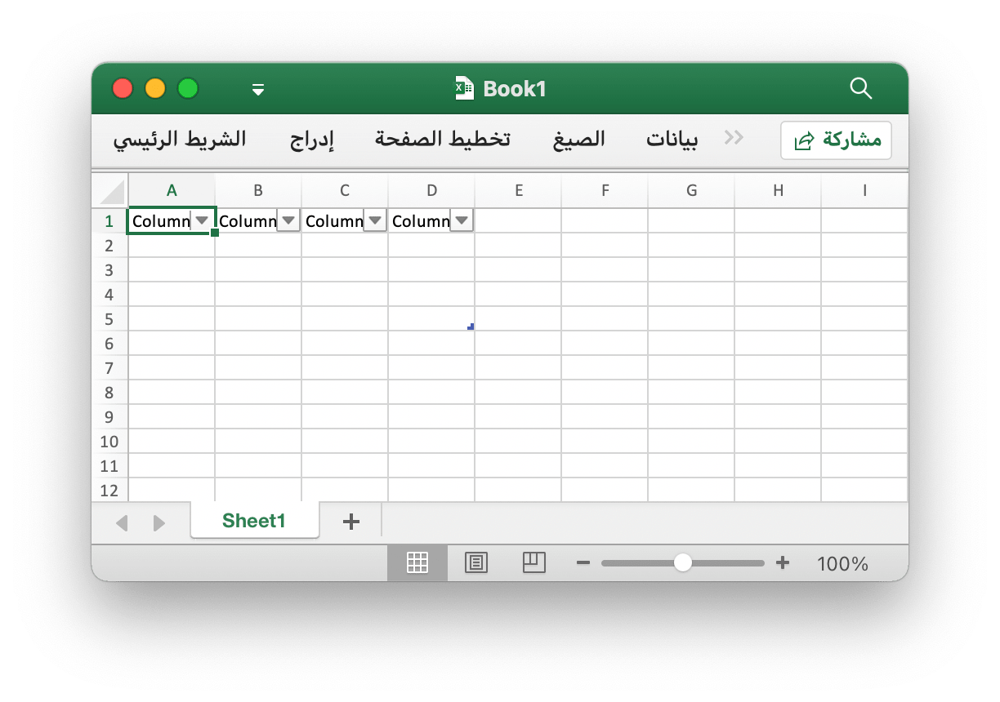
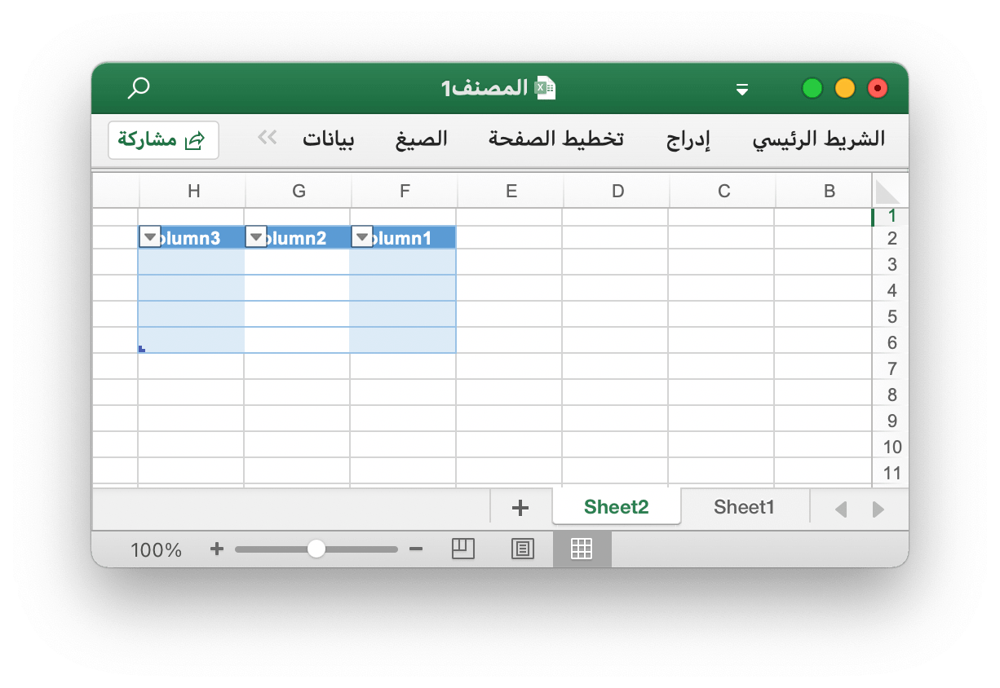
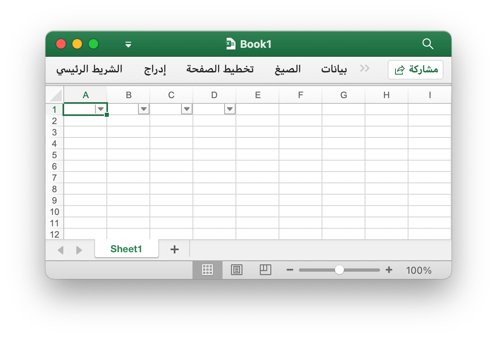
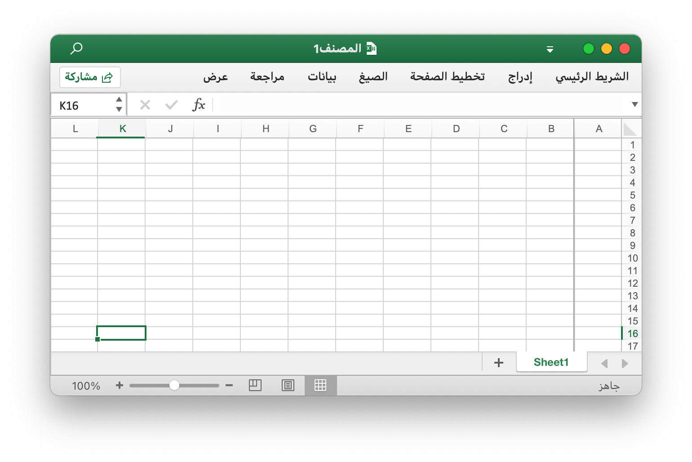
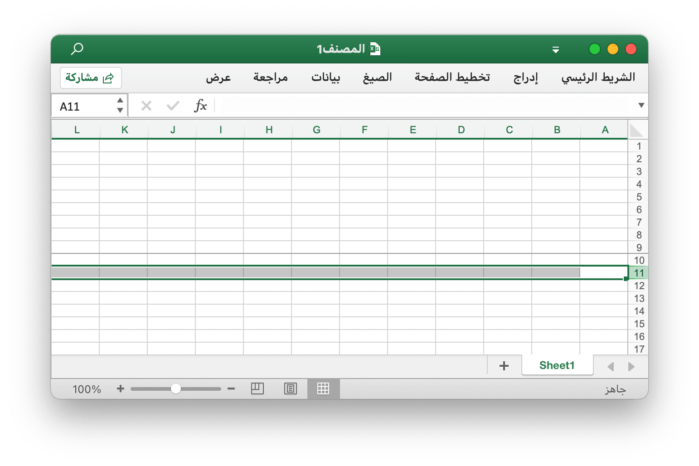
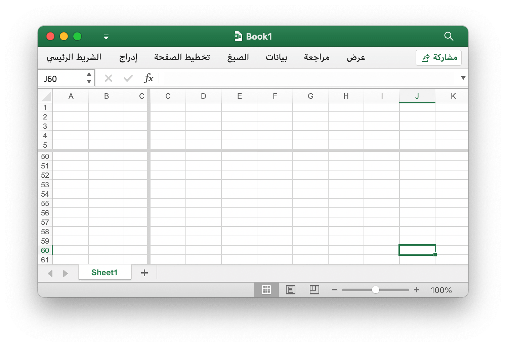

# أدوات

## الطاولة {#AddTable}

```go
func (f *File) AddTable(sheet, hCell, vCell, format string) error
```

يوفر AddTable طريقة لإضافة جدول في ورقة عمل حسب اسم ورقة العمل المحدد ومنطقة الإحداثيات ومجموعة التنسيق.

- مثال 1 ، أنشئ جدولاً من `A1:5` في `Sheet1`:

<p align="center"></p>

```go
err := f.AddTable("Sheet1", "A1", "D5", ``)
```

- مثال 2 ، أنشئ جدولاً من `F2:H6` في `Sheet2` مع مجموعة التنسيق:

<p align="center"></p>

```go
err := f.AddTable("Sheet2", "F2", "H6", `{
    "table_name": "table",
    "table_style": "TableStyleMedium2",
    "show_first_column": true,
    "show_last_column": true,
    "show_row_stripes": false,
    "show_column_stripes": true
}`)
```

لاحظ أن الجدول يجب أن يتكون من سطرين على الأقل بما في ذلك الرأس. يجب أن تحتوي خلايا الرأس على سلاسل ويجب أن تكون فريدة ، كما يجب تعيين بيانات صف الرأس في الجدول قبل استدعاء دالة AddTable. تنسق الجداول المتعددة المناطق التي لا يمكن أن تحتوي على تقاطع.

`table_name`: يجب أن يكون اسم الجدول ، في نفس اسم ورقة العمل للجدول ، فريدًا.

`table_style`: أسماء نمط الجدول المضمنة:

```text
TableStyleLight1 - TableStyleLight21
TableStyleMedium1 - TableStyleMedium28
TableStyleDark1 - TableStyleDark11
```

فهرس|أسلوب|فهرس|أسلوب|فهرس|أسلوب
---|---|---|---|---|---
||TableStyleLight1||TableStyleLight2|
TableStyleLight3||TableStyleLight4||TableStyleLight5|
TableStyleLight6||TableStyleLight7||TableStyleLight8|
TableStyleLight9||TableStyleLight10||TableStyleLight11|
TableStyleLight12||TableStyleLight13||TableStyleLight14|
TableStyleLight15||TableStyleLight16||TableStyleLight17|
TableStyleLight18||TableStyleLight19||TableStyleLight20|
TableStyleLight21||TableStyleMedium1||TableStyleMedium2|
TableStyleMedium3||TableStyleMedium4||TableStyleMedium5|
TableStyleMedium6||TableStyleMedium7||TableStyleMedium8|
TableStyleMedium9||TableStyleMedium10||TableStyleMedium11|
TableStyleMedium12||TableStyleMedium13||TableStyleMedium14|
TableStyleMedium15||TableStyleMedium16||TableStyleMedium17|
TableStyleMedium18||TableStyleMedium19||TableStyleMedium20|
TableStyleMedium21||TableStyleMedium22||TableStyleMedium23|
TableStyleMedium24||TableStyleMedium25||TableStyleMedium26|
TableStyleMedium27||TableStyleMedium28||TableStyleDark1|
TableStyleDark2||TableStyleDark3||TableStyleDark4|
TableStyleDark5||TableStyleDark6||TableStyleDark7|
TableStyleDark8||TableStyleDark9||TableStyleDark10|
TableStyleDark11|||||

## فلتر السيارات {#AutoFilter}

```go
func (f *File) AutoFilter(sheet, hCell, vCell, format string) error
```

يوفر AutoFilter طريقة لإضافة عامل تصفية تلقائي في ورقة عمل حسب اسم ورقة العمل المحدد ومنطقة الإحداثيات والإعدادات. يعد عامل التصفية التلقائي في Excel طريقة لتصفية نطاق ثنائي الأبعاد من البيانات بناءً على بعض المعايير البسيطة.

مثال 1 ، تطبيق عامل التصفية التلقائي على نطاق خلايا `A1:D4` في `Sheet1`:

<p align="center"></p>

```go
err := f.AutoFilter("Sheet1", "A1", "D4", "")
```

مثال 2 ، تصفية البيانات في مرشح تلقائي:

```go
err := f.AutoFilter("Sheet1", "A1", "D4", `{"column":"B","expression":"x != blanks"}`)
```

يحدد `column` أعمدة التصفية في نطاق التصفية التلقائي بناءً على معايير بسيطة.

لا يكفي مجرد تحديد شرط الفلتر. يجب عليك أيضًا إخفاء أي صفوف لا تتطابق مع شرط الفلتر. يتم إخفاء الصفوف باستخدام طريقة [`SetRowVisible()`](sheet.md#SetRowVisible). لا يمكن لـ Excelize تصفية الصفوف تلقائيًا لأن هذا ليس جزءًا من تنسيق الملف.

تعيين معايير التصفية للعمود:

يحدد `expression` الشروط ، تتوفر العوامل التالية لتعيين معايير التصفية:

```text
==
!=
>
<
>=
<=
and
or
```

يمكن أن يشتمل التعبير على عبارة واحدة أو عبارتين مفصولة بعوامل `and` و `or`. فمثلا:

```text
x <  2000
x >  2000
x == 2000
x >  2000 and x <  5000
x == 2000 or  x == 5000
```

يمكن تحقيق تصفية البيانات الفارغة أو غير الفارغة باستخدام قيمة الفراغات أو NonBlanks في التعبير:

```text
x == Blanks
x == NonBlanks
```

يسمح Office Excel أيضًا ببعض عمليات مطابقة السلاسل البسيطة:

```text
x == b*      // تبدأ b
x != b*      // لا تبدأ ب b
x == *b      // ينتهي مع b
x != *b      // لا تنتهي مع b
x == *b*     // يحتوي b
x != *b*     // لا يحتوي b
```

يمكنك أيضًا استخدام `*` لمطابقة أي حرف أو رقم و `?` لمطابقة أي حرف أو رقم واحد. لا تدعم مرشحات Excel أي محدد كمي للتعبير العادي. يمكن الهروب من أحرف التعبير العادي في Excel باستخدام `~`.

يمكن استبدال المتغير النائب `x` في الأمثلة أعلاه بأي سلسلة بسيطة. يتم تجاهل اسم العنصر النائب الفعلي داخليًا ، لذا فإن جميع العناصر التالية متساوية:

```text
x     < 2000
col   < 2000
Price < 2000
```

## تحديث قيمة مرتبطة {#UpdateLinkedValue}

```go
func (f *File) UpdateLinkedValue() error
```

إصلاح UpdateLinkedValue لا يتم تحديث القيم المرتبطة في جدول بيانات في Office Excel 2007 و 2010. ستزيل هذه الوظيفة علامة القيمة عند تلبية خلية لها قيمة مرتبطة. المرجع [https://social.technet.microsoft.com/Forums/office/en-US/e16bae1f-6a2c-4325-8013-e989a3479066/excel-2010-linked-cells-not-updating](https://social.technet.microsoft.com/Forums/office/en-US/e16bae1f-6a2c-4325-8013-e989a3479066/excel-2010-linked-cells-not-updating) ملاحظة: بعد فتح ملف جدول البيانات ، سيقوم Excel بتحديث القيمة المرتبطة وإنشاء قيمة جديدة وسيطلب حفظ الملف أم لا.

يظهر تأثير مسح ذاكرة التخزين المؤقت للخلية في المصنف كتعديل على العلامة `<v>` ، على سبيل المثال ، ذاكرة التخزين المؤقت للخلية قبل المسح:

```xml
<row r="19" spans="2:2">
    <c r="B19">
        <f>SUM(Sheet2!D2,Sheet2!D11)</f>
        <v>100</v>
     </c>
</row>
```

بعد مسح ذاكرة التخزين المؤقت للخلية:

```xml
<row r="19" spans="2:2">
    <c r="B19">
        <f>SUM(Sheet2!D2,Sheet2!D11)</f>
    </c>
</row>
```

## تقسيم اسم الخلية {#SplitCellName}

```go
func SplitCellName(cell string) (string, int, error)
```

يقسم SplitCellName اسم الخلية إلى اسم العمود ورقم الصف. فمثلا:

```go
excelize.SplitCellName("AK74") // إرجاع "AK", 74, nil
```

## انضم إلى اسم الخلية {#JoinCellName}

```go
func JoinCellName(col string, row int) (string, error)
```

JoinCellName ينضم إلى اسم الخلية من اسم العمود ورقم الصف.

## اسم العمود لرقم {#ColumnNameToNumber}

```go
func ColumnNameToNumber(name string) (int, error)
```

يوفر ColumnNameToNumber وظيفة لتحويل اسم عمود ورقة Excel إلى `int`. اسم العمود غير حساس لحالة الأحرف. تقوم الدالة بإرجاع خطأ إذا كان اسم العمود غير صحيح. فمثلا:

```go
excelize.ColumnNameToNumber("AK") // إرجاع 37, nil
```

## رقم العمود المراد تسميته {#ColumnNumberToName}

```go
func ColumnNumberToName(num int) (string, error)
```

يوفر ColumnNumberToName دالة لتحويل العدد الصحيح إلى عنوان عمود ورقة Excel. فمثلا:

```go
excelize.ColumnNumberToName(37) // إرجاع "AK", nil
```

## اسم الخلية للإحداثيات {#CellNameToCoordinates}

```go
func CellNameToCoordinates(cell string) (int, int, error)
```

تقوم CellNameToCoordinates بتحويل اسم الخلية الأبجدية الرقمية إلى إحداثيات `[X, Y]` أو إرجاع خطأ. فمثلا:

```go
excelize.CellNameToCoordinates("A1") // إرجاع 1, 1, nil
excelize.CellNameToCoordinates("Z3") // إرجاع 26, 3, nil
```

## إحداثيات لاسم خلية {#CoordinatesToCellName}

```go
func CoordinatesToCellName(col, row int, abs ...bool) (string, error)
```

يقوم CoordinatesToCellName بتحويل إحداثيات `[X, Y]` إلى اسم خلية أبجدي رقمي أو إرجاع خطأ. فمثلا:

```go
excelize.CoordinatesToCellName(1, 1) // إرجاع "A1", nil
excelize.CoordinatesToCellName(1, 1, true) // إرجاع "$A$1", nil
```

## النمط الشرطي {#NewConditionalStyle}

```go
func (f *File) NewConditionalStyle(style string) (int, error)
```

يوفر NewConditionalStyle وظيفة لإنشاء نمط للتنسيق الشرطي بتنسيق نمط معين. المعلمات هي نفس الوظيفة [`NewStyle`](style.md#NewStyle). لاحظ أن حقل اللون يستخدم رمز لون RGB ويدعم فقط تعيين الخط والتعبئة والمحاذاة والحدود حاليًا.

## تعيين تنسيق شرطي {#SetConditionalFormat}

```go
func (f *File) SetConditionalFormat(sheet, area, formatSet string) error
```

يوفر SetConditionalFormat وظيفة لإنشاء قاعدة تنسيق شرطي لقيمة الخلية. التنسيق الشرطي هو إحدى ميزات Office Excel التي تتيح لك تطبيق تنسيق على خلية أو نطاق من الخلايا بناءً على معايير معينة.

يعد خيار `type` معلمة مطلوبة وليس لها قيمة افتراضية. قيم الأنواع المسموح بها والمعلمات المرتبطة بها هي:

<table>
    <thead>
        <tr>
            <th>اكتب</th>
            <th>المعلمات</th>
        </tr>
    </thead>
    <tbody>
        <tr>
            <td rowspan=4>cell</td>
            <td>criteria</td>
        </tr>
        <tr>
            <td>value</td>
        </tr>
        <tr>
            <td>minimum</td>
        </tr>
        <tr>
            <td>maximum</td>
        </tr>
        <tr>
            <td rowspan=4>date</td>
            <td>criteria</td>
        </tr>
        <tr>
            <td>value</td>
        </tr>
        <tr>
            <td>minimum</td>
        </tr>
        <tr>
            <td>maximum</td>
        </tr>
        <tr>
            <td>time_period</td>
            <td>criteria</td>
        </tr>
        <tr>
            <td rowspan=2>text</td>
            <td>criteria</td>
        </tr>
        <tr>
            <td>value</td>
        </tr>
        <tr>
            <td>average</td>
            <td>criteria</td>
        </tr>
        <tr>
            <td>duplicate</td>
            <td>(none)</td>
        </tr>
        <tr>
            <td>unique</td>
            <td>(none)</td>
        </tr>
        <tr>
            <td rowspan=2>top</td>
            <td>criteria</td>
        </tr>
        <tr>
            <td>value</td>
        </tr>
        <tr>
            <td rowspan=2>bottom</td>
            <td>criteria</td>
        </tr>
        <tr>
            <td>value</td>
        </tr>
        <tr>
            <td>blanks</td>
            <td>(none)</td>
        </tr>
        <tr>
            <td>no_blanks</td>
            <td>(none)</td>
        </tr>
        <tr>
            <td>errors</td>
            <td>(none)</td>
        </tr>
        <tr>
            <td>no_errors</td>
            <td>(none)</td>
        </tr>
        <tr>
            <td rowspan=6>2_color_scale</td>
            <td>min_type</td>
        </tr>
        <tr>
            <td>max_type</td>
        </tr>
        <tr>
            <td>min_value</td>
        </tr>
        <tr>
            <td>max_value</td>
        </tr>
        <tr>
            <td>min_color</td>
        </tr>
        <tr>
            <td>max_color</td>
        </tr>
        <tr>
            <td rowspan=9>3_color_scale</td>
            <td>min_type</td>
        </tr>
        <tr>
            <td>mid_type</td>
        </tr>
        <tr>
            <td>max_type</td>
        </tr>
        <tr>
            <td>min_value</td>
        </tr>
        <tr>
            <td>mid_value</td>
        </tr>
        <tr>
            <td>max_value</td>
        </tr>
        <tr>
            <td>min_color</td>
        </tr>
        <tr>
            <td>mid_color</td>
        </tr>
        <tr>
            <td>max_color</td>
        </tr>
        <tr>
            <td rowspan=5>data_bar</td>
            <td>min_type</td>
        </tr>
        <tr>
            <td>max_type</td>
        </tr>
        <tr>
            <td>min_value</td>
        </tr>
        <tr>
            <td>max_value</td>
        </tr>
        <tr>
            <td>bar_color</td>
        </tr>
        <tr>
            <td>formula</td>
            <td>criteria</td>
        </tr>
    </tbody>
</table>

يتم استخدام معلمة `criteria` لتعيين المعايير التي سيتم من خلالها تقييم بيانات الخلية. ليس لها قيمة افتراضية. المعايير الأكثر شيوعًا كما هي مطبقة على `{"type"："cell"}` هي:

حرف وصف النص|التمثيل الرمزي
---|---
between|
not between|
equal to|==
not equal to|!=
greater than|>
less than|<
greater than or equal to|>=
less than or equal to|<=

يمكنك إما استخدام سلاسل الوصف النصي في Excel ، في العمود الأول أعلاه أو البدائل الرمزية الأكثر شيوعًا.

يتم عرض المعايير الإضافية الخاصة بأنواع التنسيق الشرطي الأخرى في الأقسام ذات الصلة أدناه.

`value`: تُستخدم القيمة عمومًا مع معلمة `criteria` لتعيين القاعدة التي سيتم من خلالها تقييم بيانات الخلية:

```go
f.SetConditionalFormat("Sheet1", "D1:D10", fmt.Sprintf(`[
{
    "type": "cell",
    "criteria": ">",
    "format": %d,
    "value": "6"
}]`, format))
```

يمكن أن تكون خاصية `value` أيضًا مرجع خلية:

```go
f.SetConditionalFormat("Sheet1", "D1:D10", fmt.Sprintf(`[
{
    "type": "cell",
    "criteria": ">",
    "format": %d,
    "value": "$C$1"
}]`, format))
```

type: `format` - تُستخدم معلمة `format` لتحديد التنسيق الذي سيتم تطبيقه على الخلية عند استيفاء معيار التنسيق الشرطي. يتم إنشاء التنسيق باستخدام طريقة [`NewConditionalStyle()`](utils.md#NewConditionalStyle) بنفس طريقة تنسيقات الخلايا:

```go
format, err = f.NewConditionalStyle(`{
    "font":
    {
        "color": "#9A0511"
    },
    "fill":
    {
        "type": "pattern",
        "color": ["#FEC7CE"],
        "pattern": 1
    }
}`)
if err != nil {
    fmt.Println(err)
}
f.SetConditionalFormat("Sheet1", "A1:A10", fmt.Sprintf(`[
{
    "type": "cell",
    "criteria": ">",
    "format": %d,
    "value": "6"
}]`, format))
```

ملاحظة: في Excel ، يتم فرض التنسيق الشرطي فوق تنسيق الخلية الموجود ، ولا يمكن تعديل جميع خصائص تنسيق الخلية. الخصائص التي لا يمكن تعديلها في تنسيق شرطي هي اسم الخط وحجم الخط والخط المرتفع والمنخفض والحدود القطرية وجميع خصائص المحاذاة وجميع خصائص الحماية.

يحدد Excel بعض التنسيقات الافتراضية لاستخدامها مع التنسيق الشرطي. يمكن تكرارها باستخدام تنسيقات excelize التالية:

```go
// تنسيق الوردة لشرطية سيئة.
format1, err = f.NewConditionalStyle(`{
    "font":
    {
        "color": "#9A0511"
    },
    "fill":
    {
        "type": "pattern",
        "color": ["#FEC7CE"],
        "pattern": 1
    }
}`)

// تنسيق أصفر فاتح للشروط المحايدة.
format2, err = f.NewConditionalStyle(`{
    "font":
    {
        "color": "#9B5713"
    },
    "fill":
    {
        "type": "pattern",
        "color": ["#FEEAA0"],
        "pattern": 1
    }
}`)

// تنسيق أخضر فاتح لشرطي جيد.
format3, err = f.NewConditionalStyle(`{
    "font":
    {
        "color": "#09600B"
    },
    "fill":
    {
        "type": "pattern",
        "color": ["#C7EECF"],
        "pattern": 1
    }
}`)
```

type: `minimum` - يتم استخدام معلمة `minimum` لتعيين قيمة الحد الأدنى عندما يكون `criteria` إما `between` أو `not between`.

```go
// قاعدة الخلايا المميزة: بين...
f.SetConditionalFormat("Sheet1", "A1:A10", fmt.Sprintf(`[
{
    "type": "cell",
    "criteria": "between",
    "format": %d,
    "minimum": "6",
    "maximum": "8"
}]`, format))
```

type: `maximum` - تُستخدم معلمة `maximum` لتعيين قيمة الحد الأعلى عندما تكون المعايير إما `between` أو `not between`. انظر المثال السابق.

type: `average` - يُستخدم النوع `average` لتحديد التنسيق الشرطي لنمط "المتوسط" في Office Excel:

```go
// القواعد العلوية/السفلية: فوق المتوسط...
f.SetConditionalFormat("Sheet1", "A1:A10", fmt.Sprintf(`[
{
    "type": "average",
    "criteria": "=",
    "format": %d,
    "above_average": true
}]`, format1))

// القواعد العلوية/السفلية: أقل من المتوسط...
f.SetConditionalFormat("Sheet1", "B1:B10", fmt.Sprintf(`[
{
    "type": "average",
    "criteria": "=",
    "format": %d,
    "above_average": false
}]`, format2))
```

type: `duplicate` - يستخدم النوع `duplicate` لتمييز الخلايا المكررة في نطاق:

```go
// قاعدة تمييز الخلايا: القيم المكررة...
f.SetConditionalFormat("Sheet1", "A1:A10", fmt.Sprintf(`[
{
    "type": "duplicate",
    "criteria": "=",
    "format": %d
}]`, format))
```

type: `unique` - يستخدم النوع `unique` لإبراز الخلايا الفريدة في نطاق:

```go
// قاعدة تمييز الخلايا: لا تساوي...
f.SetConditionalFormat("Sheet1", "A1:A10", fmt.Sprintf(`[
{
    "type": "unique",
    "criteria": "=",
    "format": %d
}]`, format))
```

type: `top` - يتم استخدام النوع `top` لتحديد أعلى قيم n من خلال الرقم أو النسبة المئوية في نطاق:

```go
// القواعد العلوية/السفلية: أعلى 10.
f.SetConditionalFormat("Sheet1", "H1:H10", fmt.Sprintf(`[
{
    "type": "top",
    "criteria": "=",
    "format": %d,
    "value": "6"
}]`, format))
```

يمكن استخدام المعايير للإشارة إلى أن شرط النسبة المئوية مطلوب:

```go
f.SetConditionalFormat("Sheet1", "A1:A10", fmt.Sprintf(`[
{
    "type": "top",
    "criteria": "=",
    "format": %d,
    "value": "6",
    "percent": true
}]`, format))
```

type: `2_color_scale` - يتم استخدام النوع `2_color_scale` لتحديد التنسيق الشرطي لنمط "2 Color Scale" في Excel:

```go
// مقاييس اللون: 2 لون.
f.SetConditionalFormat("Sheet1", "A1:A10", `[
{
    "type": "2_color_scale",
    "criteria": "=",
    "min_type": "min",
    "max_type": "max",
    "min_color": "#F8696B",
    "max_color": "#63BE7B"
}]`)
```

يمكن تعديل هذا النوع الشرطي باستخدام `min_type` و `max_type` و `min_value` و `max_value` و `min_color` و `max_color` ، انظر أدناه.

type: `3_color_scale` - يستخدم النوع `3_color_scale` لتحديد التنسيق الشرطي لنمط "3 Color Scale" في Excel:

```go
// المقاييس اللونية: 3 ألوان.
f.SetConditionalFormat("Sheet1", "A1:A10", `[
{
    "type": "3_color_scale",
    "criteria": "=",
    "min_type": "min",
    "mid_type": "percentile",
    "max_type": "max",
    "min_color": "#F8696B",
    "mid_color": "#FFEB84",
    "max_color": "#63BE7B"
}]`)
```

يمكن تعديل هذا النوع الشرطي باستخدام `min_type` و `mid_type` و `max_type` و `min_value` و `mid_value` و `max_value` و `min_color` و `mid_color` و `max_color` ، انظر أدناه.

type: `data_bar` - يتم استخدام النوع `data_bar` لتحديد التنسيق الشرطي لنمط "شريط البيانات" في Excel.

`min_type` - تكون خصائص `min_type` و `max_type` متاحة عندما يكون نوع التنسيق الشرطي `2_color_scale` أو `3_color_scale` أو `data_bar`. `mid_type` متاح لـ `3_color_scale`. يتم استخدام الخصائص على النحو التالي:

```go
// أشرطة البيانات: تعبئة متدرجة.
f.SetConditionalFormat("Sheet1", "K1:K10", `[
{
    "type": "data_bar",
    "criteria": "=",
    "min_type": "min",
    "max_type": "max",
    "bar_color": "#638EC6"
}]`)
```

أنواع `min/mid/max` المتاحة هي:

معامل|تفسير
---|---
min|الحد الأدنى للقيمة (لـ `min_type` فقط)
num|رقمي
percent|النسبة المئوية
percentile|النسبة المئوية
formula|معادلة
max|الحد الأقصى (لـ `max_type` فقط)

`mid_type` - يستخدم في `3_color_scale`. مثل `min_type` ، انظر أعلاه.

`max_type` - مثل `min_type` ، انظر أعلاه.

`min_value` - تكون خصائص `min_value` و `max_value` متاحة عندما يكون نوع التنسيق الشرطي `2_color_scale` أو `3_color_scale` أو `data_bar`. `mid_value` متاح لـ `3_color_scale`.

`mid_value` - يستخدم في `3_color_scale`. مثل `min_value` ، انظر أعلاه.

`max_value` - مثل `min_value` ، انظر أعلاه.

`min_color` - تكون خصائص `min_color` و `max_color` متاحة عندما يكون نوع التنسيق الشرطي `2_color_scale` أو `3_color_scale` أو `data_bar`. `mid_color` متاح لـ `3_color_scale`. يتم استخدام الخصائص على النحو التالي:

```go
// المقاييس اللونية: 3 ألوان.
f.SetConditionalFormat("Sheet1", "B1:B10", `[
{
    "type": "3_color_scale",
    "criteria": "=",
    "min_type": "min",
    "mid_type": "percentile",
    "max_type": "max",
    "min_color": "#F8696B",
    "mid_color": "#FFEB84",
    "max_color": "#63BE7B"
}]`)
```

`mid_color` - يستخدم في `3_color_scale`. مثل `min_color` ، انظر أعلاه.

`max_color` - مثل `min_color` ، انظر أعلاه.

`bar_color` - يستخدم لـ `data_bar`. مثل `min_color` ، انظر أعلاه.

على سبيل المثال ، قم بتمييز أعلى وأدنى القيم في نطاق من الخلايا `A1:D4` عن طريق تعيين التنسيق الشرطي على `الورقة 1`:

<p align="center"></p>

```go
package main

import (
    "fmt"
    "math/rand"

    "github.com/xuri/excelize"
)

func main() {
    f := excelize.NewFile()
    f.SetSheetName("Sheet1", "ورقة1")
    if err := f.SetSheetViewOptions("ورقة1", -1,
        excelize.RightToLeft(true),
    ); err != nil {
        fmt.Println(err)
    }
    for r := 1; r <= 4; r++ {
        row := []int{rand.Intn(100), rand.Intn(100), rand.Intn(100), rand.Intn(100)}
        if err := f.SetSheetRow("ورقة1", fmt.Sprintf("A%d", r), &row); err != nil {
            fmt.Println(err)
        }
    }
    red, err := f.NewConditionalStyle(`{
        "font":
        {
            "color": "#9A0511"
        },
        "fill":
        {
            "type": "pattern",
            "color": ["#FEC7CE"],
            "pattern": 1
        }
    }`)
    if err != nil {
        fmt.Println(err)
    }
    if err := f.SetConditionalFormat("ورقة1", "A1:D4", fmt.Sprintf(`[
        {
            "type": "bottom",
            "criteria": "=",
            "value": "1",
            "format": %d
        }]`, red)); err != nil {
        fmt.Println(err)
    }
    green, err := f.NewConditionalStyle(`{
        "font":
        {
            "color": "#09600B"
        },
        "fill":
        {
            "type": "pattern",
            "color": ["#C7EECF"],
            "pattern": 1
        }
    }`)
    if err != nil {
        fmt.Println(err)
    }
    if err := f.SetConditionalFormat("ورقة1", "A1:D4", fmt.Sprintf(`[
        {
            "type": "top",
            "criteria":"=",
            "value":"1",
            "format": %d
        }]`, green)); err != nil {
        fmt.Println(err)
    }
    if err := f.SaveAs("المصنف1.xlsx"); err != nil {
        fmt.Println(err)
    }
}
```

## احصل على تنسيق شرطي {#GetConditionalFormats}

```go
func (f *File) GetConditionalFormats(sheet string) (map[string]string, error)
```

يُرجع GetConditionalFormats إعدادات التنسيق الشرطي حسب اسم ورقة العمل المحدد.

## قم بإزالة التنسيق الشرطي {#UnsetConditionalFormat}

```go
func (f *File) UnsetConditionalFormat(sheet, reference string) error
```

يوفر UnsetConditionalFormat وظيفة لإلغاء تعيين التنسيق الشرطي عن طريق اسم ورقة العمل المحددة والنطاق.

## جزء من جانب شيء {#SetPanes}

```go
func (f *File) SetPanes(sheet, panes string)
```

يوفر SetPanes وظيفة لإنشاء وإزالة أجزاء التجميد وتقسيم الألواح عن طريق اسم ورقة العمل المحددة ومجموعة تنسيق الأجزاء.

يحدد "activePane" الجزء النشط. يتم تحديد القيم المحتملة لهذه السمة في الجدول التالي:

تعداد|وصف
---|---
bottomLeft (الجزء الأيسر السفلي) |الجزء السفلي الأيسر عند تطبيق الانقسامات الرأسية والأفقية.<br><br>تُستخدم هذه القيمة أيضًا عند تطبيق انقسام أفقي فقط ، حيث يتم تقسيم الجزء إلى مناطق علوية وسفلية. في هذه الحالة ، تحدد هذه القيمة الجزء السفلي.
bottomRight (الجزء السفلي الأيمن) | الجزء السفلي الأيمن ، عند تطبيق الانقسامات الرأسية والأفقية
topLeft (الجزء العلوي الأيسر)|الجزء العلوي الأيسر ، عند تطبيق الانقسامات الرأسية والأفقية.<br><br>تُستخدم هذه القيمة أيضًا عند تطبيق انقسام أفقي فقط ، حيث يتم تقسيم الجزء إلى مناطق علوية وسفلية. في هذه الحالة ، تحدد هذه القيمة الجزء العلوي.<br><br>تُستخدم هذه القيمة أيضًا عند تطبيق الانقسام الرأسي فقط ، وتقسيم اللوحة إلى مناطق يمنى ويسرى. في هذه الحالة ، تحدد هذه القيمة الجزء الأيمن.
topRight (الجزء العلوي الأيمن)|الجزء العلوي الأيمن ، عند تطبيق الانقسامات الرأسية والأفقية.<br><br> تُستخدم هذه القيمة أيضًا عند تطبيق الانقسام الرأسي فقط ، وتقسيم اللوحة إلى مناطق يمنى ويسرى. في هذه الحالة ، تحدد هذه القيمة الجزء الأيمن.

نوع حالة الجزء مقيد بالقيم المدعومة المدرجة حاليًا في الجدول التالي:

قيمة العد|وصف
---|---
frozen (مجمدة)|يتم تجميد الأجزاء ولكن لم يتم تقسيمها حتى يتم تجميدها. في هذه الحالة ، عندما يتم إلغاء تجميد الأجزاء مرة أخرى ، ينتج عن جزء واحد ، بدون انقسام.<br><br>في هذه الحالة ، تكون القضبان المنقسمة غير قابلة للتعديل.
split (انشق، مزق)|الأجزاء منقسمة ولكنها غير مجمدة. في هذه الحالة ، يمكن تعديل أشرطة الانقسام بواسطة المستخدم.

`x_split` - الموضع الأفقي للانقسام ، 1/20 من نقطة ؛ 0 (صفر) إذا لم يكن هناك شيء. إذا تم تجميد الجزء ، تشير هذه القيمة إلى عدد الأعمدة المرئية في الجزء العلوي.

`y_split` - الوضع الرأسي للانقسام ، في 1/20 من نقطة ؛ 0 (صفر) إذا لم يكن هناك شيء. إذا تم تجميد الجزء ، تشير هذه القيمة إلى عدد الصفوف المرئية في الجزء الأيمن. يتم تحديد القيم المحتملة لهذه السمة بواسطة نوع البيانات المزدوج لمخطط W3C XML.

`top_left_cell` - موقع الخلية المرئية العلوية اليسرى في الجزء السفلي الأيمن (عندما تكون في الوضع من اليسار إلى اليمين).

`sqref` - نطاق الاختيار. يمكن أن تكون مجموعة نطاقات غير متجاورة.

مثال 1: تجميد العمود `A` في `Sheet1` وتعيين الخلية النشطة على `Sheet1!K16`:

<p align="center"></p>

```go
f.SetPanes("Sheet1", `{
    "freeze": true,
    "split": false,
    "x_split": 1,
    "y_split": 0,
    "top_left_cell": "B1",
    "active_pane": "topRight",
    "panes": [
    {
        "sqref": "K16",
        "active_cell": "K16",
        "pane": "topRight"
    }]
}`)
```

مثال 2: قم بتجميد الصفوف من 1 إلى 9 في `Sheet1` وقم بتعيين نطاقات الخلايا النشطة على `Sheet1!A11:XFD11`:

<p align="center"></p>

```go
f.SetPanes("Sheet1", `{
    "freeze": true,
    "split": false,
    "x_split": 0,
    "y_split": 9,
    "top_left_cell": "A34",
    "active_pane": "bottomLeft",
    "panes": [
    {
        "sqref": "A11:XFD11",
        "active_cell": "A11",
        "pane": "bottomLeft"
    }]
}`)
```

مثال 3: قم بإنشاء ألواح مقسمة في `Sheet1` وتعيين الخلية النشطة على `Sheet1!J60`:

<p align="center"></p>

```go
f.SetPanes("Sheet1", `{
    "freeze": false,
    "split": true,
    "x_split": 3270,
    "y_split": 1800,
    "top_left_cell": "N57",
    "active_pane": "bottomLeft",
    "panes": [
    {
        "sqref": "I36",
        "active_cell": "I36"
    },
    {
        "sqref": "G33",
        "active_cell": "G33",
        "pane": "topRight"
    },
    {
        "sqref": "J60",
        "active_cell": "J60",
        "pane": "bottomLeft"
    },
    {
        "sqref": "O60",
        "active_cell": "O60",
        "pane": "bottomRight"
    }]
}`)
```

مثال 4 ، قم بإلغاء التجميد وإزالة كافة الأجزاء في `Sheet1`:

```go
f.SetPanes("Sheet1", `{"freeze":false,"split":false}`)
```

## اللون {#ThemeColor}

```go
func ThemeColor(baseColor string, tint float64) string
```

تم تطبيق ThemeColor على اللون بقيمة الصبغة:

```go
package main

import (
    "fmt"
    "strings"

    "github.com/xuri/excelize/v2"
)

func main() {
    f, err := excelize.OpenFile("المصنف1.xlsx")
    if err != nil {
        fmt.Println(err)
        return
    }
    fmt.Println(getCellBgColor(f, "Sheet1", "A1"))
    if err = f.Close(); err != nil {
        fmt.Println(err)
    }
}

func getCellBgColor(f *excelize.File, sheet, axix string) string {
    styleID, err := f.GetCellStyle(sheet, axix)
    if err != nil {
        return err.Error()
    }
    fillID := *f.Styles.CellXfs.Xf[styleID].FillID
    fgColor := f.Styles.Fills.Fill[fillID].PatternFill.FgColor
    if fgColor != nil {
        if fgColor.Theme != nil {
            children := f.Theme.ThemeElements.ClrScheme.Children
            if *fgColor.Theme < 4 {
                dklt := map[int]string{
                    0: children[1].SysClr.LastClr,
                    1: children[0].SysClr.LastClr,
                    2: *children[3].SrgbClr.Val,
                    3: *children[2].SrgbClr.Val,
                }
                return strings.TrimPrefix(
                    excelize.ThemeColor(dklt[*fgColor.Theme], fgColor.Tint), "FF")
            }
            srgbClr := *children[*fgColor.Theme].SrgbClr.Val
            return strings.TrimPrefix(excelize.ThemeColor(srgbClr, fgColor.Tint), "FF")
        }
        return strings.TrimPrefix(fgColor.RGB, "FF")
    }
    return "FFFFFF"
}
```

## تحويل RGB إلى HSL {#RGBToHSL}

```go
func RGBToHSL(r, g, b uint8) (h, s, l float64)
```

تقوم تقنية RGBToHSL بتحويل RGB الثلاثي إلى ثلاثي HSL.

## تحويل HSL إلى RGB {#HSLToRGB}

```go
func HSLToRGB(h, s, l float64) (r, g, b uint8)
```

يقوم HSLToRGB بتحويل HSL الثلاثي إلى ثلاثي RGB.

## كاتب الملف {#FileWriter}

### Write {#Write}

```go
func (f *File) Write(w io.Writer, opts ...Options) error
```

يوفر Write وظيفة للكتابة إلى `io.Writer`.

### WriteTo {#WriteTo}

```go
func (f *File) WriteTo(w io.Writer, opts ...Options) (int64, error)
```

يقوم WriteTo بتنفيذ `io.WriterTo` لكتابة الملف.

### WriteToBuffer {#WriteToBuffer}

```go
func (f *File) WriteToBuffer() (*bytes.Buffer, error)
```

يوفر WriteToBuffer وظيفة للحصول على `*bytes.Buffer` من الملف المحفوظ.

## أضف مشروع VBA {#AddVBAProject}

```go
func (f *File) AddVBAProject(bin string) error
```

يوفر AddVBAProject طريقة لإضافة ملف `vbaProject.bin` الذي يحتوي على وظائف و / أو وحدات ماكرو. يجب أن يكون امتداد الملف `.xlsm`. فمثلا:

```go
if err := f.SetSheetPrOptions("Sheet1", excelize.CodeName("Sheet1")); err != nil {
    fmt.Println(err)
}
if err := f.AddVBAProject("vbaProject.bin"); err != nil {
    fmt.Println(err)
}
if err := f.SaveAs("macros.xlsm"); err != nil {
    fmt.Println(err)
}
```

## تاريخ Excel إلى وقت {#ExcelDateToTime}

```go
func ExcelDateToTime(excelDate float64, use1904Format bool) (time.Time, error)
```

يقوم ExcelDateToTime بتحويل تمثيل تاريخ Excel على أساس عائم إلى `time.Time`.

## محول محارف {#CharsetTranscoder}

```go
func (f *File) CharsetTranscoder(fn charsetTranscoderFn) *File
```

CharsetTranscoder تعيين وظيفة محول الشفرة المعرفة من قبل المستخدم لجدول بيانات مفتوح من غير ترميز UTF-8.
