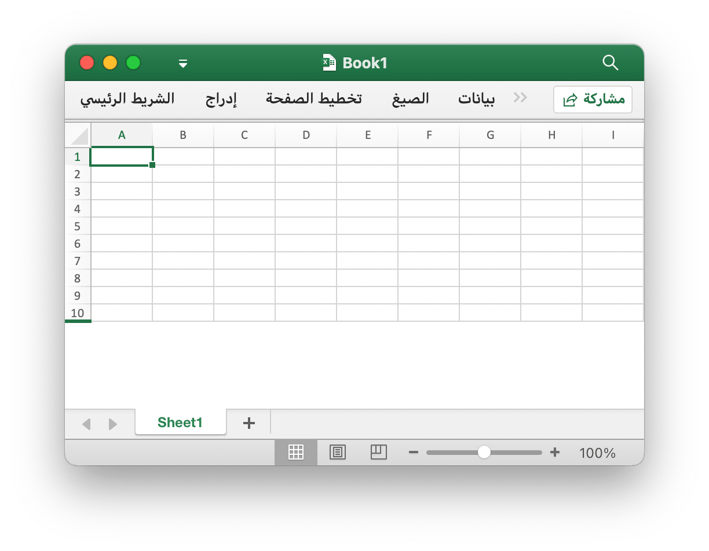
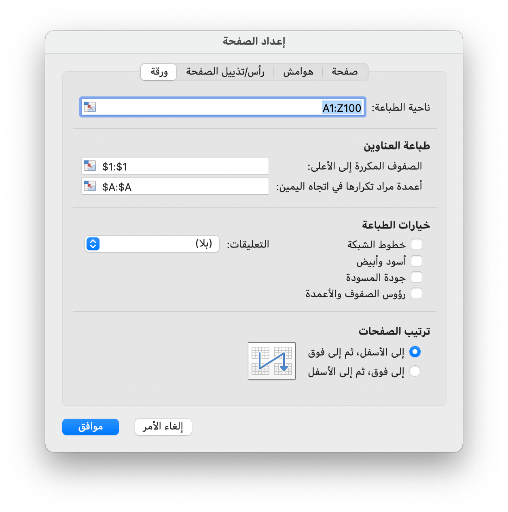

# دفتر العمل

تحدد `Options` خيارات قراءة وكتابة جداول البيانات.

```go
type Options struct {
    Password          string
    RawCellValue      bool
    UnzipSizeLimit    int64
    UnzipXMLSizeLimit int64
}
```

تحدد `Password` كلمة مرور جدول البيانات بنص عادي.

يحدد `RawCellValue` ما إذا كان يتم تطبيق تنسيق الأرقام لقيمة الخلية أو الحصول على القيمة الأولية.

يحدّد `UnzipSizeLimit` حد حجم فك الضغط بالبايت عند فتح جدول البيانات ، ويجب أن تكون هذه القيمة أكبر من أو تساوي `UnzipXMLSizeLimit` ، الحد الافتراضي للحجم هو 16 غيغابايت.

يحدد `UnzipXMLSizeLimit` حد الذاكرة لفك ضغط ورقة العمل بالبايت ، وسيتم استخراج XML لورقة العمل إلى دليل النظام المؤقت عندما يكون حجم الملف أكبر من هذه القيمة ، يجب أن تكون هذه القيمة أقل من أو تساوي `UnzipSizeLimit` ، القيمة الافتراضية هي 16 ميغا بايت.

## قم بإنشاء جدول بيانات {#NewFile}

```go
func NewFile() *File
```

يوفر `NewFile` وظيفة لإنشاء ملف جديد بواسطة القالب الافتراضي. سيحتوي المصنف الذي تم إنشاؤه حديثًا بشكل افتراضي على ورقة عمل باسم `Sheet1`. فمثلا:

## افتح {#OpenFile}

```go
func OpenFile(filename string, opts ...Options) (*File, error)
```

يأخذ OpenFile اسم ملف جدول البيانات ويعيد بنية ملف جدول بيانات معبأة له. على سبيل المثال ، افتح جدول بيانات محميًا بكلمة مرور:

```go
f, err := excelize.OpenFile("المصنف1.xlsx", excelize.Options{Password: "password"})
if err != nil {
    return
}
```

أغلق الملف عن طريق [`Close()`](workbook.md#Close) بعد فتح جدول البيانات.

## فتح دفق البيانات {#OpenReader}

```go
func OpenReader(r io.Reader, opts ...Options) (*File, error)
```

يقوم OpenReader بقراءة دفق البيانات من `io.Reader` وإرجاع ملف جدول بيانات ممتلئ.

على سبيل المثال ، أنشئ خادم HTTP للتعامل مع قالب التحميل ، ثم استجابة ملف التنزيل مع إضافة ورقة عمل جديدة:

```go
package main

import (
    "fmt"
    "net/http"

    "github.com/xuri/excelize/v2"
)

func process(w http.ResponseWriter, req *http.Request) {
    file, _, err := req.FormFile("file")
    if err != nil {
        fmt.Fprint(w, err.Error())
        return
    }
    defer file.Close()
    f, err := excelize.OpenReader(file)
    if err != nil {
        fmt.Fprint(w, err.Error())
        return
    }
    f.Path = "Book1.xlsx"
    f.NewSheet("NewSheet")
    w.Header().Set("Content-Disposition", fmt.Sprintf("attachment; filename=%s", f.Path))
    w.Header().Set("Content-Type", req.Header.Get("Content-Type"))
    if err := f.Write(w); err != nil {
        fmt.Fprint(w, err.Error())
    }
}

func main() {
    http.HandleFunc("/process", process)
    http.ListenAndServe(":8090", nil)
}
```

اختبار مع cURL:

```bash
curl --location --request GET 'http://127.0.0.1:8090/process' \
--form 'file=@/tmp/template.xltx' -O -J
```

## حفظ {#Save}

```go
func (f *File) Save(opts ...Options) error
```

يوفر Save وظيفة لتجاوز جدول البيانات بمسار الأصل.

## حفظ باسم {#SaveAs}

```go
func (f *File) SaveAs(name string, opts ...Options) error
```

يوفر SaveAs وظيفة لإنشاء أو تحديث جدول بيانات في المسار المتوفر.

## إغلاق المصنف {#Close}

```go
func (f *File) Close() error
```

يقوم Close بإغلاق وتنظيف الملف المؤقت المفتوح لجدول البيانات.

## قم بإنشاء ورقة عمل {#NewSheet}

```go
func (f *File) NewSheet(sheet string) int
```

يوفر NewSheet وظيفة لإنشاء ورقة جديدة من خلال إعطاء اسم ورقة العمل وإرجاع فهرس الأوراق في المصنف (جدول البيانات) بعد إلحاقه. لاحظ أنه عند إنشاء ملف جدول بيانات جديد ، سيتم إنشاء ورقة العمل الافتراضية المسماة `Sheet1`.

## احذف ورقة العمل {#DeleteSheet}

```go
func (f *File) DeleteSheet(sheet string)
```

يوفر DeleteSheet وظيفة لحذف ورقة العمل في مصنف حسب اسم ورقة العمل المحدد ، وأسماء الأوراق ليست حساسة لحالة الأحرف. استخدم هذه الطريقة بحذر ، مما سيؤثر على التغييرات في المراجع مثل الصيغ والمخططات وما إلى ذلك. إذا كان هناك أي قيمة مرجعية لورقة العمل المحذوفة ، فسوف يتسبب ذلك في حدوث خطأ في الملف عند فتحه. ستكون هذه الوظيفة غير صالحة عند ترك ورقة عمل واحدة فقط.

## نسخ ورقة العمل {#CopySheet}

```go
func (f *File) CopySheet(from, to int) error
```

يوفر CopySheet وظيفة لتكرار ورقة العمل من خلال إعطاء فهرس ورقة العمل المصدر والهدف. لاحظ أنه لا يدعم حاليًا المصنفات المكررة التي تحتوي على جداول أو مخططات أو صور. فمثلا:

```go
// Sheet1 موجود بالفعل...
index := f.NewSheet("Sheet2")
err := f.CopySheet(1, index)
return err
```

## أوراق عمل المجموعة {#GroupSheets}

```go
func (f *File) GroupSheets(sheets []string) error
```

توفر GroupSheets وظيفة لتجميع أوراق العمل حسب اسم أوراق العمل المحدد. يجب أن تحتوي أوراق العمل الجماعية على ورقة عمل نشطة.

## فك تجميع أوراق العمل {#UngroupSheets}

```go
func (f *File) UngroupSheets() error
```

توفر UngroupSheets وظيفة لفك تجميع أوراق العمل.

## تعيين خلفية ورقة العمل {#SetSheetBackground}

```go
func (f *File) SetSheetBackground(sheet, picture string) error
```

يوفر SetSheetBackground وظيفة لتعيين صورة الخلفية بواسطة اسم ورقة العمل المحدد.

## تعيين ورقة العمل الافتراضية {#SetActiveSheet}

```go
func (f *File) SetActiveSheet(index int)
```

يوفر SetActiveSheet وظيفة لتعيين الورقة النشطة الافتراضية للمصنف بواسطة فهرس معين. لاحظ أن الفهرس النشط يختلف عن المعرف الذي تم إرجاعه بواسطة الوظيفة `GetSheetMap`. يجب أن يكون أكبر أو يساوي 0 وأقل من إجمالي أرقام ورقة العمل.

## احصل على فهرس الورقة النشط {#GetActiveSheetIndex}

```go
func (f *File) GetActiveSheetIndex() int
```

يوفر GetActiveSheetIndex وظيفة للحصول على ورقة عمل نشطة من المصنف. إذا لم يتم العثور على الورقة النشطة ، فستعرض عددًا صحيحًا `0`.

## تعيين ورقة العمل مرئية {#SetSheetVisible}

```go
func (f *File) SetSheetVisible(sheet string, visible bool) error
```

يوفر SetSheetVisible وظيفة لتعيين ورقة العمل مرئية من خلال اسم ورقة العمل المحدد. يجب أن يحتوي المصنف على ورقة عمل مرئية واحدة على الأقل. إذا تم تنشيط ورقة العمل المحددة ، فسيتم إبطال هذا الإعداد. قيم حالة الورقة على النحو المحدد بواسطة [SheetStateValues Enum](https://learn.microsoft.com/ar-sa/dotnet/api/documentformat.openxml.spreadsheet.sheetstatevalues?view=openxml-2.8.1):

|قيم حالة ورقة العمل|
|---|
|visible|
|hidden|
|veryHidden|

على سبيل المثال ، إخفاء `Sheet1`:

```go
err := f.SetSheetVisible("Sheet1", false)
```

## احصل على ورقة العمل مرئية {#GetSheetVisible}

```go
func (f *File) GetSheetVisible(sheet string) bool
```

يوفر GetSheetVisible وظيفة لإظهار ورقة العمل من خلال اسم ورقة العمل المحدد. على سبيل المثال ، احصل على الحالة المرئية لـ `Sheet1`:

```go
f.GetSheetVisible("Sheet1")
```

## تعيين خصائص الورقة {#SetSheetProps}

```go
func (f *File) SetSheetProps(sheet string, opts *SheetPropsOptions) error
```

يوفر SetSheetProps وظيفة لتعيين خصائص ورقة العمل. الخصائص التي يمكن تعيينها هي:

خيارات|اكتب|وصف
---|---|---
CodeName                          | `*string`  | يحدد اسما ثابتا للورقة، والذي يجب ألا يتغير بمرور الوقت، ولا يتغير من إدخال المستخدم. يجب استخدام هذا الاسم بواسطة التعليمات البرمجية للإشارة إلى ورقة معينة
EnableFormatConditionsCalculation | `*bool`    | بيان ما إذا كان سيتم تقييم حسابات التنسيق الشرطي. إذا تم تعيينها إلى false، فلن يتم تحديث قيم الصغر/الحد الأقصى لمقاييس الألوان أو أشرطة البيانات أو قيم العتبة في قواعد Top N. أساسا التنسيق الشرطي "calc" هو قبالة
Published                         | `*bool`    | بالإشارة إلى ما إذا كان قد تم نشر ورقة العمل أم لا، تكون القيمة الافتراضية هي `true`
AutoPageBreaks                    | `*bool`    | بالإشارة إلى ما إذا كانت الورقة تعرض فواصل الصفحات التلقائية، تكون القيمة الافتراضية هي `true`
FitToPage                         | `*bool`    | بالإشارة إلى ما إذا كان خيار طباعة احتواء الصفحة ممكنا أم لا، تكون القيمة الافتراضية هي `false`
TabColorIndexed                   | `*int`     | يمثل قيمة اللون المفهرسة
TabColorRGB                       | `*string`  | يمثل قيمة اللون ARGB (ألفا أحمر أخضر أزرق) القياسية
TabColorTheme                     | `*int`     | يمثل الفهرس المستند إلى الصفر في المجموعة، مع الإشارة إلى قيمة معينة يتم التعبير عنها في جزء النسق
TabColorTint                      | `*float64` | يحدد قيمة الصبغة المطبقة على اللون، والقيمة الافتراضية هي `0.0`
OutlineSummaryBelow               | `*bool`    | للإشارة إلى ما إذا كانت صفوف الملخص تظهر أسفل التفاصيل في مخطط تفصيلي، عند تطبيق مخطط تفصيلي، تكون القيمة الافتراضية هي `true`
OutlineSummaryRight               | `*bool`    | للإشارة إلى ما إذا كانت أعمدة الملخص تظهر على يسار التفاصيل في مخطط تفصيلي، عند تطبيق مخطط تفصيلي، تكون القيمة الافتراضية هي `true`
BaseColWidth                      | `*uint8`   | يحدد عدد أحرف الحد الأقصى لعرض الأرقام لخط النمط العادي. لا تتضمن هذه القيمة حشو الهامش أو الحشو الإضافي لخطوط الشبكة. إنه فقط عدد الأحرف ، القيمة الافتراضية هي `8`
DefaultColWidth                   | `*float64` | يحدد عرض العمود الافتراضي الذي تم قياسه كعدد أحرف الحد الأقصى لعرض الأرقام لخط النمط العادي
DefaultRowHeight                  | `*float64` | يحدد ارتفاع الصف الافتراضي الذي تم قياسه بحجم النقطة. التحسين حتى لا نضطر إلى كتابة الارتفاع على جميع الصفوف. يمكن كتابة ذلك إذا كان لمعظم الصفوف ارتفاع مخصص ، لتحقيق التحسين
CustomHeight                      | `*bool`    | يحدد الارتفاع المخصص ، القيمة الافتراضية هي `false`
ZeroHeight                        | `*bool`    | يحدد ما إذا كانت الصفوف مخفية، تكون القيمة الافتراضية هي `false`
ThickTop                          | `*bool`    | يحدد ما إذا كانت الصفوف تحتوي على حد علوي سميك بشكل افتراضي، فإن القيمة الافتراضية هي `false`
ThickBottom                       | `*bool`    | يحدد ما إذا كانت الصفوف تحتوي على حد سفلي سميك بشكل افتراضي، فإن القيمة الافتراضية هي `false`

على سبيل المثال ، اجعل صفوف ورقة العمل الافتراضية مخفية:

<p align="center"></p>

```go
f, enable := excelize.NewFile(), true
if err := f.SetSheetView("Sheet1", -1, &excelize.ViewOptions{
    RightToLeft: &enable,
}); err != nil {
    fmt.Println(err)
}
if err := f.SetSheetProps("Sheet1", &excelize.SheetPropsOptions{
    ZeroHeight: &enable,
}); err != nil {
    fmt.Println(err)
}
if err := f.SetRowVisible("Sheet1", 10, true); err != nil {
    fmt.Println(err)
}
f.SaveAs("المصنف1.xlsx")
```

## الحصول على خصائص ورقة {#GetSheetProps}

```go
func (f *File) GetSheetProps(sheet string) (SheetPropsOptions, error)
```

يوفر GetSheetProps دالة للحصول على خصائص ورقة العمل. الخصائص التي يمكن تعيينها هي:

خيارات|اكتب|وصف
---|---|---
DefaultGridColor  | `*bool`    | الإشارة إلى أن التطبيق المستهلك يجب أن يستخدم لون خطوط الشبكة الافتراضي (يعتمد على النظام). يتجاوز أي لون محدد في colorId ، القيمة الافتراضية هي `true`
RightToLeft       | `*bool`    | الإشارة إلى ما إذا كانت الورقة في وضع العرض "من اليمين إلى اليسار". عندما يكون العمود A في هذا الوضع ، يكون في أقصى اليمين ، العمود B ؛ هو عمود واحد يسار العمود A، وهكذا. أيضا ، يتم عرض المعلومات في الخلايا بتنسيق من اليمين إلى اليسار ، والقيمة الافتراضية هي `false`
ShowFormulas      | `*bool`    | للإشارة إلى ما إذا كان يجب أن تعرض هذه الورقة صيغا ، فإن القيمة الافتراضية هي `false`
ShowGridLines     | `*bool`    | بالإشارة إلى ما إذا كان يجب أن تعرض هذه الورقة خطوط الشبكة ، فإن القيمة الافتراضية هي `true`
ShowRowColHeaders | `*bool`    | بالإشارة إلى ما إذا كان يجب أن تعرض الورقة عناوين الصفوف والأعمدة، تكون القيمة الافتراضية هي `true`
ShowRuler         | `*bool`    | بالإشارة إلى أن هذه الورقة يجب أن تعرض المسطرة ، فإن القيمة الافتراضية هي `true`
ShowZeros         | `*bool`    | الإشارة إلى ما إذا كان يجب "إظهار صفر في الخلايا التي لها قيمة صفرية". عند استخدام صيغة للإشارة إلى خلية أخرى فارغة، تصبح القيمة المشار إليها `0` عندما تكون العلامة `true`، وتكون القيمة الافتراضية هي `true`
TopLeftCell       | `*string`  | يحدد موقعا للخلية المرئية العلوية اليسرى موقع الخلية المرئية العلوية اليسرى في الجزء السفلي الأيسر (عندما تكون في الوضع من اليسار إلى اليمين)
View              | `*string`  | للإشارة إلى كيفية عرض الورقة ، فإنها تستخدم افتراضيا سلسلة فارغة وخيارات متاحة: `normal` و `pageBreakPreview` و `pageLayout`
ZoomScale         | `*float64` | يحدد تكبير تكبير النافذة للعرض الحالي الذي يمثل قيم النسبة المئوية. تقتصر هذه السمة على قيم تتراوح من `10` إلى `400`. مقياس أفقي ورأسي معا ، القيمة الافتراضية هي `100`

## تعيين خصائص عرض ورقة العمل {#SetSheetView}

```go
func (f *File) SetSheetView(sheet string, viewIndex int, opts *ViewOptions) error
```

تعيين SetSheetView خصائص عرض الورقة. قد يكون `viewIndex` سالبًا وإذا كان الأمر كذلك يتم حسابه تنازليًا (`-1` هو العرض الأخير).

## احصل على خصائص عرض ورقة العمل {#GetSheetView}

```go
func (f *File) GetSheetView(sheet string, viewIndex int) (ViewOptions, error)
```

يحصل GetSheetView على قيمة خصائص عرض الورقة. قد يكون `viewIndex` سالبًا وإذا كان الأمر كذلك يتم حسابه تنازليًا (`-1` هو العرض الأخير).

## تعيين تخطيط صفحة ورقة العمل {#SetPageLayout}

```go
func (f *File) SetPageLayout(sheet string, opts *PageLayoutOptions) error
```

يوفر SetPageLayout وظيفة لتعيين تخطيط صفحة ورقة العمل. الخيارات المتاحة:

حدد `Size` حجم ورق ورقة العمل ، وحجم الورق الافتراضي لورقة العمل هو "ورق إلكتروني (8.5 بوصة × 11 بوصة)". يوضح ما يلي حجم الورق مرتبة حسب رقم فهرس Excelize:

فهرس|حجم الورق
---|---
1   | Letter paper (8.5 in. × 11 in.)
2   | Letter small paper (8.5 in. × 11 in.)
3   | Tabloid paper (11 in. × 17 in.)
4   | Ledger paper (17 in. × 11 in.)
5   | Legal paper (8.5 in. × 14 in.)
6   | Statement paper (5.5 in. × 8.5 in.)
7   | Executive paper (7.25 in. × 10.5 in.)
8   | A3 paper (297 mm × 420 mm)
9   | A4 paper (210 mm × 297 mm)
10  | A4 small paper (210 mm × 297 mm)
11  | A5 paper (148 mm × 210 mm)
12  | B4 paper (250 mm × 353 mm)
13  | B5 paper (176 mm × 250 mm)
14  | Folio paper (8.5 in. × 13 in.)
15  | Quarto paper (215 mm × 275 mm)
16  | Standard paper (10 in. × 14 in.)
17  | Standard paper (11 in. × 17 in.)
18  | Note paper (8.5 in. × 11 in.)
19  | #9 envelope (3.875 in. × 8.875 in.)
20  | #10 envelope (4.125 in. × 9.5 in.)
21  | #11 envelope (4.5 in. × 10.375 in.)
22  | #12 envelope (4.75 in. × 11 in.)
23  | #14 envelope (5 in. × 11.5 in.)
24  | C paper (17 in. × 22 in.)
25  | D paper (22 in. × 34 in.)
26  | E paper (34 in. × 44 in.)
27  | DL envelope (110 mm × 220 mm)
28  | C5 envelope (162 mm × 229 mm)
29  | C3 envelope (324 mm × 458 mm)
30  | C4 envelope (229 mm × 324 mm)
31  | C6 envelope (114 mm × 162 mm)
32  | C65 envelope (114 mm × 229 mm)
33  | B4 envelope (250 mm × 353 mm)
34  | B5 envelope (176 mm × 250 mm)
35  | B6 envelope (176 mm × 125 mm)
36  | Italy envelope (110 mm × 230 mm)
37  | Monarch envelope (3.875 in. × 7.5 in.).
38  | 6¾ envelope (3.625 in. × 6.5 in.)
39  | US standard fanfold (14.875 in. × 11 in.)
40  | German standard fanfold (8.5 in. × 12 in.)
41  | German legal fanfold (8.5 in. × 13 in.)
42  | ISO B4 (250 mm × 353 mm)
43  | Japanese postcard (100 mm × 148 mm)
44  | Standard paper (9 in. × 11 in.)
45  | Standard paper (10 in. × 11 in.)
46  | Standard paper (15 in. × 11 in.)
47  | Invite envelope (220 mm × 220 mm)
50  | Letter extra paper (9.275 in. × 12 in.)
51  | Legal extra paper (9.275 in. × 15 in.)
52  | Tabloid extra paper (11.69 in. × 18 in.)
53  | A4 extra paper (236 mm × 322 mm)
54  | Letter transverse paper (8.275 in. × 11 in.)
55  | A4 transverse paper (210 mm × 297 mm)
56  | Letter extra transverse paper (9.275 in. × 12 in.)
57  | SuperA/SuperA/A4 paper (227 mm × 356 mm)
58  | SuperB/SuperB/A3 paper (305 mm × 487 mm)
59  | Letter plus paper (8.5 in. × 12.69 in.)
60  | A4 plus paper (210 mm × 330 mm)
61  | A5 transverse paper (148 mm × 210 mm)
62  | JIS B5 transverse paper (182 mm × 257 mm)
63  | A3 extra paper (322 mm × 445 mm)
64  | A5 extra paper (174 mm × 235 mm)
65  | ISO B5 extra paper (201 mm × 276 mm)
66  | A2 paper (420 mm × 594 mm)
67  | A3 transverse paper (297 mm × 420 mm)
68  | A3 extra transverse paper (322 mm × 445 mm)
69  | Japanese Double Postcard (200 mm × 148 mm)
70  | A6 (105 mm × 148 mm)
71  | Japanese Envelope Kaku #2
72  | Japanese Envelope Kaku #3
73  | Japanese Envelope Chou #3
74  | Japanese Envelope Chou #4
75  | Letter Rotated (11 × 8½ in.)
76  | A3 Rotated (420 mm × 297 mm)
77  | A4 Rotated (297 mm × 210 mm)
78  | A5 Rotated (210 mm × 148 mm)
79  | B4 (JIS) Rotated (364 mm × 257 mm)
80  | B5 (JIS) Rotated (257 mm × 182 mm)
81  | Japanese Postcard Rotated (148 mm × 100 mm)
82  | Double Japanese Postcard Rotated (148 mm × 200 mm)
83  | A6 Rotated (148 mm × 105 mm)
84  | Japanese Envelope Kaku #2 Rotated
85  | Japanese Envelope Kaku #3 Rotated
86  | Japanese Envelope Chou #3 Rotated
87  | Japanese Envelope Chou #4 Rotated
88  | B6 (JIS) (128 mm × 182 mm)
89  | B6 (JIS) Rotated (182 mm × 128 mm)
90  | (12 in × 11 in)
91  | Japanese Envelope You #4
92  | Japanese Envelope You #4 Rotated
93  | PRC 16K (146 mm × 215 mm)
94  | PRC 32K (97 mm × 151 mm)
95  | PRC 32K(Big) (97 mm × 151 mm)
96  | PRC Envelope #1 (102 mm × 165 mm)
97  | PRC Envelope #2 (102 mm × 176 mm)
98  | PRC Envelope #3 (125 mm × 176 mm)
99  | PRC Envelope #4 (110 mm × 208 mm)
100 | PRC Envelope #5 (110 mm × 220 mm)
101 | PRC Envelope #6 (120 mm × 230 mm)
102 | PRC Envelope #7 (160 mm × 230 mm)
103 | PRC Envelope #8 (120 mm × 309 mm)
104 | PRC Envelope #9 (229 mm × 324 mm)
105 | PRC Envelope #10 (324 mm × 458 mm)
106 | PRC 16K Rotated
107 | PRC 32K Rotated
108 | PRC 32K(Big) Rotated
109 | PRC Envelope #1 Rotated (165 mm × 102 mm)
110 | PRC Envelope #2 Rotated (176 mm × 102 mm)
111 | PRC Envelope #3 Rotated (176 mm × 125 mm)
112 | PRC Envelope #4 Rotated (208 mm × 110 mm)
113 | PRC Envelope #5 Rotated (220 mm × 110 mm)
114 | PRC Envelope #6 Rotated (230 mm × 120 mm)
115 | PRC Envelope #7 Rotated (230 mm × 160 mm)
116 | PRC Envelope #8 Rotated (309 mm × 120 mm)
117 | PRC Envelope #9 Rotated (324 mm × 229 mm)
118 | PRC Envelope #10 Rotated (458 mm × 324 mm)

حدد `Orientation` المحدد في اتجاه ورقة العمل ، والاتجاه الافتراضي هو `portrait`. القيم المحتملة لهذا الحقل هي `portrait` و `landscape`.

حدد `FirstPageNumber` رقم أول صفحة مطبوعة. إذا لم يتم تحديد قيمة ، فسيتم افتراض "تلقائي".

حدد `AdjustTo` مقياس الطباعة. هذه السمة مقيدة بقيم تتراوح من 10 (10٪) إلى 400 (400٪). يتم تجاوز هذا الإعداد عند استخدام `FitToWidth` و / أو `FitToHeight`.

حدد `FitToHeight` عدد الصفحات الرأسية التي سيتم احتواؤها.

حدد `FitToWidth` عدد الصفحات الأفقية التي يجب احتواؤها.

حدد `BlackAndWhite` الطباعة بالأبيض والأسود.

- على سبيل المثال ، عيّن تخطيط الصفحة لـ `Sheet1` بطباعة بالأبيض والأسود ، ورقم الصفحة الأول المطبوع من `2` ، وورق A4 صغير الحجم أفقيًا (210 مم × 297 مم) ، صفحتان رأسيتان للملاءمة وصفحتان أفقيتان لملاءمتهما:

```go
f := excelize.NewFile()
var (
    size                 = 10
    orientation          = "landscape"
    firstPageNumber uint = 2
    adjustTo        uint = 100
    fitToHeight          = 2
    fitToWidth           = 2
    blackAndWhite        = true
)
if err := f.SetPageLayout("Sheet1", &excelize.PageLayoutOptions{
    Size:            &size,
    Orientation:     &orientation,
    FirstPageNumber: &firstPageNumber,
    AdjustTo:        &adjustTo,
    FitToHeight:     &fitToHeight,
    FitToWidth:      &fitToWidth,
    BlackAndWhite:   &blackAndWhite,
}); err != nil {
    fmt.Println(err)
}
```

## احصل على تخطيط صفحة ورقة العمل {#GetPageLayout}

```go
func (f *File) GetPageLayout(sheet string) (PageLayoutOptions, error)
```

يوفر GetPageLayout وظيفة للحصول على تخطيط صفحة ورقة العمل.

## تعيين هوامش صفحة ورقة العمل {#SetPageMargins}

```go
func (f *File) SetPageMargins(sheet string, opts *PageLayoutMarginsOptions) error
```

يوفر SetPageMargins وظيفة لتعيين هوامش صفحة ورقة العمل. الخيارات المتاحة:

خيارات|اكتب|وصف
---|---|---
Bottom       | `*float64` | الأسفل
Footer       | `*float64` | تذييل
Header       | `*float64` | رأس
Left         | `*float64` | اليسار
Right        | `*float64` | الصحيح
Top          | `*float64` | قمة
Horizontally | `*bool`    | توسيط في الصفحة: أفقيًا
Vertically   | `*bool`    | توسيط في الصفحة: عموديًا

## احصل على هوامش صفحة ورقة العمل {#GetPageMargins}

```go
func (f *File) GetPageMargins(sheet string) (PageLayoutMarginsOptions, error)
```

يوفر GetPageMargins وظيفة للحصول على هوامش صفحة ورقة العمل.

## تعيين خصائص المصنف {#SetWorkbookProps}

```go
func (f *File) SetWorkbookProps(opts *WorkbookPropsOptions) error
```

يوفر SetWorkbookProps دالة لتعيين خصائص المصنف. الخيارات المتاحة:

خيارات|اكتب|وصف
---|---|---
Date1904      | `*bool`   | يشير إلى ما إذا كان سيتم استخدام نظام تاريخ 1900 أو 1904 عند تحويل أوقات التاريخ التسلسلي في المصنف إلى تواريخ.
FilterPrivacy | `*bool`   | تحدد قيمة منطقية تشير إلى ما إذا كان التطبيق قد قام بفحص المصنف لمعرفة معلومات التعريف الشخصية (PII). إذا تم تعيين هذه العلامة ، فإن التطبيق يحذر المستخدم في أي وقت يقوم فيه المستخدم بإجراء من شأنه إدراج معلومات تحديد الهوية الشخصية في المستند.
CodeName      | `*string` | يحدد الاسم الرمزي للتطبيق الذي أنشأ هذا المصنف. استخدم هذه السمة لتعقب محتوى الملف في الإصدارات المتزايدة من التطبيق.

## احصل على خصائص المصنف {#GetWorkbookProps}

```go
func (f *File) GetWorkbookProps() (WorkbookPropsOptions, error)
```

يوفر GetWorkbookProps دالة للحصول على خصائص المصنف.

## تعيين الرأس والتذييل {#SetHeaderFooter}

```go
func (f *File) SetHeaderFooter(sheet string, settings *HeaderFooterOptions) error
```

يوفر SetHeaderFooter وظيفة لتعيين الرؤوس والتذييلات من خلال اسم ورقة العمل المحددة وأحرف التحكم.

يتم تحديد الرؤوس والتذييلات باستخدام حقول الإعدادات التالية:

مجالات           | وصف
---|---
AlignWithMargins | محاذاة هوامش تذييل الرأس مع هوامش الصفحة
DifferentFirst   | مؤشر مختلف لرأس وتذييل الصفحة الأولىمؤشر مختلف لرأس وتذييل الصفحة الأولى
DifferentOddEven | مؤشرات مختلفة للرؤوس والتذييلات الفردية والزوجية
ScaleWithDoc     | مقياس الرأس والتذييل باستخدام مقياس المستند
OddFooter        | تذييل الصفحة الفردية
OddHeader        | رأس فردي
EvenFooter       | حتى تذييل الصفحة
EvenHeader       | حتى رأس الصفحة
FirstFooter      | تذييل الصفحة الأولى
FirstHeader      | رأس الصفحة الأولى

يمكن استخدام رموز التنسيق التالية في 6 حقول من نوع السلسلة: `OddHeader`, `OddFooter`, `EvenHeader`, `EvenFooter`, `FirstFooter`, `FirstHeader`

<table>
    <thead>
        <tr>
            <th>كود التنسيق</th>
            <th>وصف</th>
        </tr>
    </thead>
    <tbody>
        <tr>
            <td><code>&amp;&amp;</code></td>
            <td>الشخصية &quot;&amp;&quot;</td>
        </tr>
        <tr>
            <td><code>&amp;font-size</code></td>
            <td>حجم خط النص ، حيث يكون حجم الخط هو حجم الخط العشري بالنقاط</td>
        </tr>
        <tr>
            <td><code>&amp;&quot;font name,font type&quot;</code></td>
            <td>سلسلة اسم الخط النصي ، واسم الخط ، وسلسلة نوع الخط النصي ، ونوع الخط</td>
        </tr>
        <tr>
            <td><code>&amp;&quot;-,Regular&quot;</code></td>
            <td>تنسيق النص العادي. تبديل الوضعين الغامق والمائل إلى إيقاف التشغيل</td>
        </tr>
        <tr>
            <td><code>&amp;A</code></td>
            <td>اسم علامة تبويب ورقة العمل الحالية</td>
        </tr>
        <tr>
            <td><code>&amp;B</code> or <code>&amp;&quot;-,Bold&quot;</code></td>
            <td>تنسيق نص عريض ، من إيقاف تشغيل إلى تشغيل ، أو العكس. الوضع الافتراضي معطل</td>
        </tr>
        <tr>
            <td><code>&amp;D</code></td>
            <td>التاريخ الحالي</td>
        </tr>
        <tr>
            <td><code>&amp;C</code></td>
            <td>قسم المركز</td>
        </tr>
        <tr>
            <td><code>&amp;E</code></td>
            <td>تنسيق نص مزدوج التسطير</td>
        </tr>
        <tr>
            <td><code>&amp;F</code></td>
            <td>اسم ملف المصنف الحالي</td>
        </tr>
        <tr>
            <td><code>&amp;G</code></td>
            <td>كائن رسومي كخلفية (لا يدعم حاليا)</td>
        </tr>
        <tr>
            <td><code>&amp;H</code></td>
            <td>تنسيق نص الظل</td>
        </tr>
        <tr>
            <td><code>&amp;I</code> or <code>&amp;&quot;-,Italic&quot;</code></td>
            <td>تنسيق نص مائل</td>
        </tr>
        <tr>
            <td><code>&amp;K</code></td>
            <td>لون خط النص<br>تم تحديد لون RGB على أنه RRGGBB<br>يتم تحديد لون النسق على أنه TTSNNN حيث يكون TT هو معرف لون النسق ، S إما &quot;+&quot; أو &quot;-&quot; قيمة الصبغة / الظل ، و NNN هي قيمة الصبغة / الظل</td>
        </tr>
        <tr>
            <td><code>&amp;L</code></td>
            <td>القسم الأيسر</td>
        </tr>
        <tr>
            <td><code>&amp;N</code></td>
            <td>العدد الإجمالي للصفحات</td>
        </tr>
        <tr>
            <td><code>&amp;O</code></td>
            <td>تنسيق نص المخطط التفصيلي</td>
        </tr>
        <tr>
            <td><code>&amp;P[[+\|-]n]</code></td>
            <td>بدون اللاحقة الاختيارية ، يكون رقم الصفحة الحالي في النظام العشري</td>
        </tr>
        <tr>
            <td><code>&amp;R</code></td>
            <td>القسم الأيمن</td>
        </tr>
        <tr>
            <td><code>&amp;S</code></td>
            <td>تنسيق نص يتوسطه خط</td>
        </tr>
        <tr>
            <td><code>&amp;T</code></td>
            <td>الوقت الحالي</td>
        </tr>
        <tr>
            <td><code>&amp;U</code></td>
            <td>تنسيق نص تسطير واحد. إذا كان وضع التسطير المزدوج قيد التشغيل ، فإن التواجد التالي في محدد القسم يقوم بتبديل وضع التسطير المزدوج إلى وضع الإيقاف ؛ وإلا ، فإنه يقوم بتبديل وضع التسطير الفردي ، من إيقاف تشغيل إلى تشغيل ، أو العكس. الوضع الافتراضي معطل</td>
        </tr>
        <tr>
            <td><code>&amp;X</code></td>
            <td>تنسيق نص مرتفع</td>
        </tr>
        <tr>
            <td><code>&amp;Y</code></td>
            <td>تنسيق نص منخفض</td>
        </tr>
        <tr>
            <td><code>&amp;Z</code></td>
            <td>مسار ملف المصنف الحالي</td>
        </tr>
    </tbody>
</table>

فمثلا:

```go
err := f.SetHeaderFooter("Sheet1", &excelize.HeaderFooterOptions{
    DifferentFirst:   true,
    DifferentOddEven: true,
    OddHeader:        "&R&P",
    OddFooter:        "&C&F",
    EvenHeader:       "&L&P",
    EvenFooter:       "&L&D&R&T",
    FirstHeader:      `&CCenter &"-,Bold"Bold&"-,Regular"HeaderU+000A&D`,
})
```

يوضح هذا المثال:

- تحتوي الصفحة الأولى على رأس وتذييل خاصين بها
- الصفحات الفردية والزوجية لها رؤوس وتذييلات مختلفة
- رقم الصفحة الحالي في القسم الأيمن من رؤوس الصفحات الفردية
- اسم ملف المصنف الحالي في القسم الأوسط من تذييلات الصفحات الفردية
- رقم الصفحة الحالي في القسم الأيسر من رؤوس الصفحات الزوجية
- التاريخ الحالي في القسم الأيسر والوقت الحالي في القسم الأيمن من تذييلات الصفحات الزوجية
- النص "Center Bold Header" في السطر الأول من القسم الأوسط من الصفحة الأولى ، والتاريخ في السطر الثاني من القسم الأوسط من نفس الصفحة
- لا يوجد تذييل في الصفحة الأولى

## تعيين الاسم المحدد {#SetDefinedName}

```go
func (f *File) SetDefinedName(definedName *DefinedName) error
```

يوفر SetDefinedName دالة لتعيين الأسماء المحددة للمصنف أو ورقة العمل. إذا لم يتم تحديد النطاق ، فإن النطاق الافتراضي هو المصنف. فمثلا:

```go
f.SetDefinedName(&excelize.DefinedName{
    Name:     "Amount",
    RefersTo: "Sheet1!$A$2:$D$5",
    Comment:  "defined name comment",
    Scope:    "Sheet2",
})
```

إعدادات منطقة الطباعة وعناوين الطباعة لورقة العمل:

<p align="center"></p>

```go
f.SetDefinedName(&excelize.DefinedName{
    Name:     "_xlnm.Print_Area",
    RefersTo: "Sheet1!$A$1:$Z$100",
    Scope:    "Sheet1",
})
f.SetDefinedName(&excelize.DefinedName{
    Name:     "_xlnm.Print_Titles",
    RefersTo: "Sheet1!$A:$A,Sheet1!$1:$1",
    Scope:    "Sheet1",
})
```

## احصل على اسم محدد {#GetDefinedName}

```go
func (f *File) GetDefinedName() []DefinedName
```

يوفر GetDefinedName دالة للحصول على الأسماء المحددة للمصنف أو ورقة العمل.

## حذف الاسم المحدد {#DeleteDefinedName}

```go
func (f *File) DeleteDefinedName(definedName *DefinedName) error
```

يوفر DeleteDefinedName وظيفة لحذف الأسماء المعرفة للمصنف أو ورقة العمل. إذا لم يتم تحديد النطاق ، فإن النطاق الافتراضي هو المصنف. فمثلا:

```go
f.DeleteDefinedName(&excelize.DefinedName{
    Name:     "Amount",
    Scope:    "Sheet2",
})
```

## تعيين خصائص التطبيق {#SetAppProps}

```go
func (f *File) SetAppProps(appProperties *AppProperties) error
```

يوفر SetAppProps وظيفة لتعيين خصائص تطبيق المستند. الخصائص التي يمكن تعيينها هي:

خاصية       | وصف
---|---
Application       | اسم التطبيق الذي أنشأ هذا المستند.
ScaleCrop         | يشير إلى وضع عرض الصورة المصغرة للوثيقة. اضبط هذا العنصر على `true` لتمكين تغيير حجم الصورة المصغرة للمستند إلى العرض. اضبط هذا العنصر على `false` لتمكين اقتصاص الصورة المصغرة للمستند لإظهار الأقسام التي تناسب العرض فقط.
DocSecurity       | مستوى الأمان للمستند كقيمة عددية. يتم تعريف أمان المستند على أنه:<br>1 - المستند محمي بكلمة مرور<br>2 - يُوصى بفتح المستند للقراءة فقط<br>3 - يتم فرض المستند لفتحه للقراءة فقط<br >4 - تم قفل المستند للتعليق التوضيحي
Company           | اسم الشركة المرتبطة بالمستند.
LinksUpToDate     | يشير إلى ما إذا كانت الارتباطات التشعبية في مستند محدثة أم لا. عيّن هذا العنصر على `true` للإشارة إلى تحديث الارتباطات التشعبية. عيّن هذا العنصر على `false` للإشارة إلى أن الارتباطات التشعبية قديمة.
HyperlinksChanged | تعيين ارتباط تشعبي واحد أو أكثر في هذا الجزء تم تحديثه حصريًا في هذا الجزء بواسطة المنتج. يجب على المنتج التالي الذي سيفتح هذا المستند تحديث علاقات الارتباط التشعبي بالارتباطات التشعبية الجديدة المحددة في هذا الجزء.
AppVersion        | يحدد إصدار التطبيق الذي أنتج هذا المستند. يجب أن يكون محتوى هذا العنصر بالصيغة XX.YYYY حيث تمثل X و Y قيمًا عددية ، أو تعتبر الوثيقة غير متوافقة.

فمثلا:

```go
err := f.SetAppProps(&excelize.AppProperties{
    Application:       "Microsoft Excel",
    ScaleCrop:         true,
    DocSecurity:       3,
    Company:           "Company Name",
    LinksUpToDate:     true,
    HyperlinksChanged: true,
    AppVersion:        "16.0000",
})
```

## احصل على خصائص التطبيق {#GetAppProps}

```go
func (f *File) GetAppProps() (*AppProperties, error)
```

يوفر GetAppProps وظيفة للحصول على خصائص تطبيق المستند.

## تعيين خصائص الوثيقة {#SetDocProps}

```go
func (f *File) SetDocProps(docProperties *DocProperties) error
```

يوفر SetDocProps وظيفة لتعيين خصائص الوثيقة الأساسية. الخصائص التي يمكن تعيينها هي:

خاصية | وصف
---|---
Category       | تصنيف محتوى هذه الحزمة.
ContentStatus  | حالة المحتوى. فمثلا: قد تتضمن القيم "Draft" و "Reviewed" و "Final"
Created        | وقت إنشاء محتوى المورد.
Creator        | الكيان مسؤول بشكل أساسي عن صنع محتوى المورد
Description    | شرح لمحتوى المصدر.
Identifier     | إشارة لا لبس فيها إلى المورد ضمن سياق معين.
Keywords       | مجموعة محددة من الكلمات الأساسية لدعم البحث والفهرسة. عادةً ما تكون هذه قائمة بالمصطلحات غير المتوفرة في أي مكان آخر في الخصائص.
Language       | لغة المحتوى الفكري للمصدر.
LastModifiedBy | المستخدم الذي أجرى التعديل الأخير. التعريف خاص بالبيئة.
Modified       | الوقت المعدل لمحتوى المورد.
Revision       | رقم مراجعة محتوى المصدر.
Subject        | موضوع محتوى المصدر.
Title          | تم إعطاء الاسم للمورد.
Version        | رقم الإصدار. يتم تعيين هذه القيمة من قبل المستخدم أو بواسطة التطبيق.

فمثلا:

```go
err := f.SetDocProps(&excelize.DocProperties{
    Category:       "category",
    ContentStatus:  "Draft",
    Created:        "2019-06-04T22:00:10Z",
    Creator:        "Go Excelize",
    Description:    "This file created by Go Excelize",
    Identifier:     "xlsx",
    Keywords:       "Spreadsheet",
    LastModifiedBy: "Go Author",
    Modified:       "2019-06-04T22:00:10Z",
    Revision:       "0",
    Subject:        "Test Subject",
    Title:          "Test Title",
    Language:       "en-US",
    Version:        "1.0.0",
})
```

## احصل على خصائص المستند {#GetDocProps}

```go
func (f *File) GetDocProps() (*DocProperties, error)
```

يوفر GetDocProps وظيفة للحصول على خصائص المستند الأساسية.
