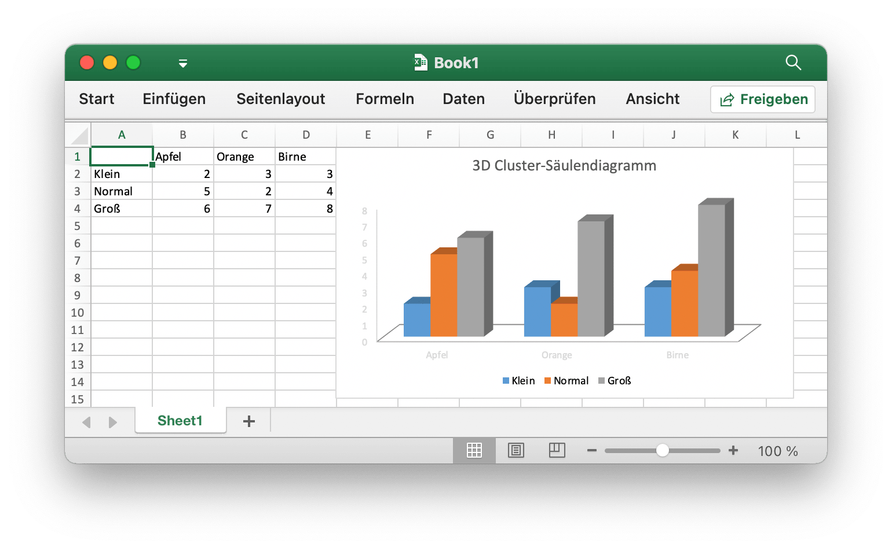

# Grundlegende Nutzung

## Installation {#install}

Für die Verwendung der neuesten Version Excelize Bibliothek erfordern, um Version 1.10 oder höher.

- Installation

```bash
go get github.com/360EntSecGroup-Skylar/excelize
```

- Wenn Ihre Paketverwaltung mit [Go Modules](https://blog.golang.org/using-go-modules), installieren Sie bitte mit dem folgenden Befehl.

```bash
go get github.com/360EntSecGroup-Skylar/excelize/v2
```

## Upgrade {#update}

- Upgrade

```bash
go get -u github.com/360EntSecGroup-Skylar/excelize/v2
```

## Erstellen einer Kalkulationstabelle {#NewFile}

Hier ist eine minimale Beispielverwendung, die eine Tabellenkalkulationsdatei erstellt:

```go
package main

import (
    "fmt"

    "github.com/360EntSecGroup-Skylar/excelize/v2"
)

func main() {
    f := excelize.NewFile()
    // Erstellen eines neuen Arbeitsblatts.
    index := f.NewSheet("Sheet2")
    // Festlegen des Wertes einer Zelle.
    f.SetCellValue("Sheet2", "A2", "Hello world.")
    f.SetCellValue("Sheet1", "B2", 100)
    // Aktives Arbeitsblatt der Arbeitsmappe festlegen.
    f.SetActiveSheet(index)
    // Speichern Sie die Tabelle unter dem angegebenen Pfad.
    if err := f.SaveAs("Book1.xlsx"); err != nil {
        fmt.Println(err)
    }
}
```

## Tabellenkalkulation lesen {#read}

Im Folgenden wird das Nackte zum Lesen eines Tabellendokuments dargestellt:

```go
package main

import (
    "fmt"

    "github.com/360EntSecGroup-Skylar/excelize/v2"
)

func main() {
    f, err := excelize.OpenFile("Book1.xlsx")
    if err != nil {
        fmt.Println(err)
        return
    }
    // Abrufen von Wert aus der Zelle durch angegebenen Arbeitsblattnamen und Achse.
    cell, err := f.GetCellValue("Sheet1", "B2")
    if err != nil {
        fmt.Println(err)
        return
    }
    fmt.Println(cell)
    // Abrufen aller Zeilen im Sheet1.
    rows, err := f.GetRows("Sheet1")
    for _, row := range rows {
        for _, colCell := range row {
            fmt.Print(colCell, "\t")
        }
        fmt.Println()
    }
}
```

## Hinzufügen eines Diagramms zur Tabellenkalkulation {#chart}

Mit Excelize Diagrammgenerierung und -verwaltung ist so einfach wie ein paar Zeilen Quellcode. Sie können Diagramme basierend auf Daten in Ihrem Arbeitsblatt erstellen oder Diagramme ohne Daten in Ihrem Arbeitsblatt generieren.

<p align="center"></p>

```go
package main

import (
    "fmt"

    "github.com/360EntSecGroup-Skylar/excelize/v2"
)

func main() {
    categories := map[string]string{
        "A2": "Klein", "A3": "Normal", "A4": "Groß", "B1": "Apfel", "C1": "Orange", "D1": "Birne"}
    values := map[string]int{
        "B2": 2, "C2": 3, "D2": 3, "B3": 5, "C3": 2, "D3": 4, "B4": 6, "C4": 7, "D4": 8}
    f := excelize.NewFile()
    for k, v := range categories {
        f.SetCellValue("Sheet1", k, v)
    }
    for k, v := range values {
        f.SetCellValue("Sheet1", k, v)
    }
    if err := f.AddChart("Sheet1", "E1", `{
        "type": "col3DClustered",
        "series": [
        {
            "name": "Sheet1!$A$2",
            "categories": "Sheet1!$B$1:$D$1",
            "values": "Sheet1!$B$2:$D$2"
        },
        {
            "name": "Sheet1!$A$3",
            "categories": "Sheet1!$B$1:$D$1",
            "values": "Sheet1!$B$3:$D$3"
        },
        {
            "name": "Sheet1!$A$4",
            "categories": "Sheet1!$B$1:$D$1",
            "values": "Sheet1!$B$4:$D$4"
        }],
        "title":
        {
            "name": "3D Cluster-Säulendiagramm"
        }
    }`); err != nil {
        fmt.Println(err)
        return
    }
    // Speichern Sie die Tabelle unter dem angegebenen Pfad.
    if err := f.SaveAs("Book1.xlsx"); err != nil {
        fmt.Println(err)
    }
}
```

## Hinzufügen eines Bildes zur Tabellenkalkulation {#image}

```go
package main

import (
    "fmt"
    _ "image/gif"
    _ "image/jpeg"
    _ "image/png"

    "github.com/360EntSecGroup-Skylar/excelize/v2"
)

func main() {
    f, err := excelize.OpenFile("Book1.xlsx")
    if err != nil {
        fmt.Println(err)
        return
    }
    // Fügen Sie ein Bild ein.
    if err := f.AddPicture("Sheet1", "A2", "image.png", ""); err != nil {
        fmt.Println(err)
    }
    // Fügen Sie ein Bild mit Skalierung in ein Arbeitsblatt ein.
    if err := f.AddPicture("Sheet1", "D2", "image.jpg", `{
        "x_scale": 0.5,
        "y_scale": 0.5
    }`); err != nil {
        fmt.Println(err)
    }
    // Fügen Sie mit Druckunterstützung einen Bildversatz in die Zelle ein.
    if err := f.AddPicture("Sheet1", "H2", "image.gif", `{
        "x_offset": 15,
        "y_offset": 10,
        "print_obj": true,
        "lock_aspect_ratio": false,
        "locked": false
    }`); err != nil {
        fmt.Println(err)
    }
    // Speichern Sie die Tabellenkalkulationsdatei mit dem Ursprungspfad.
    if err = f.Save(); err != nil {
        fmt.Println(err)
    }
}
```
