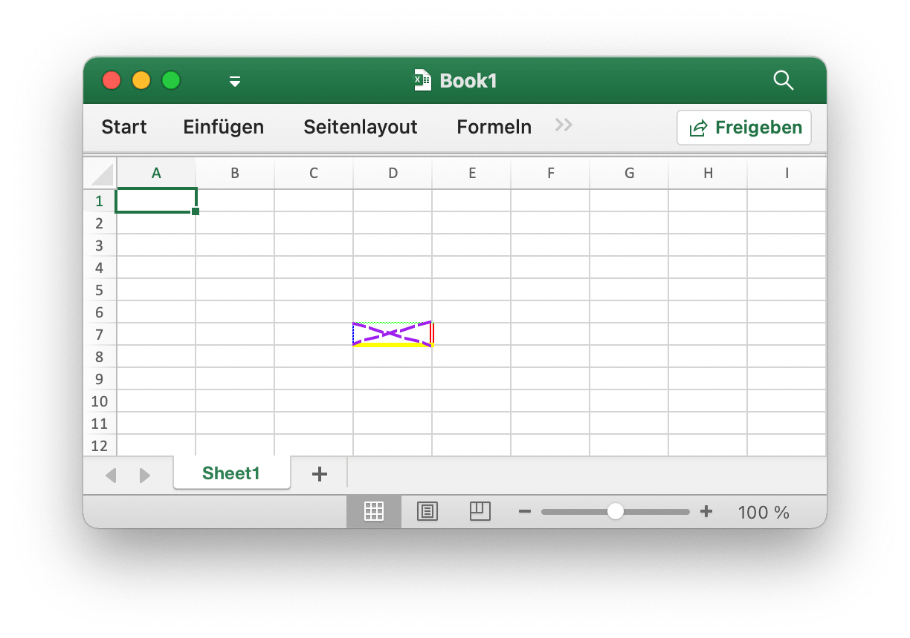
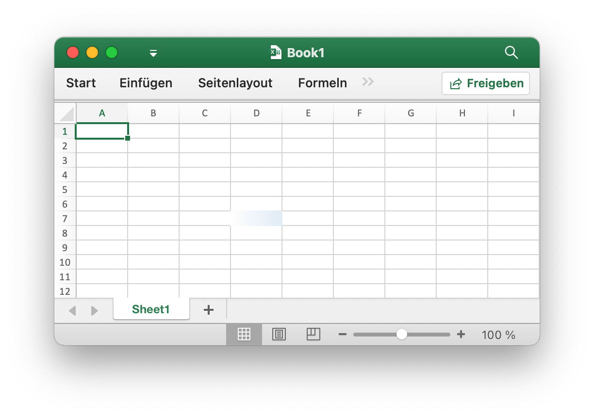
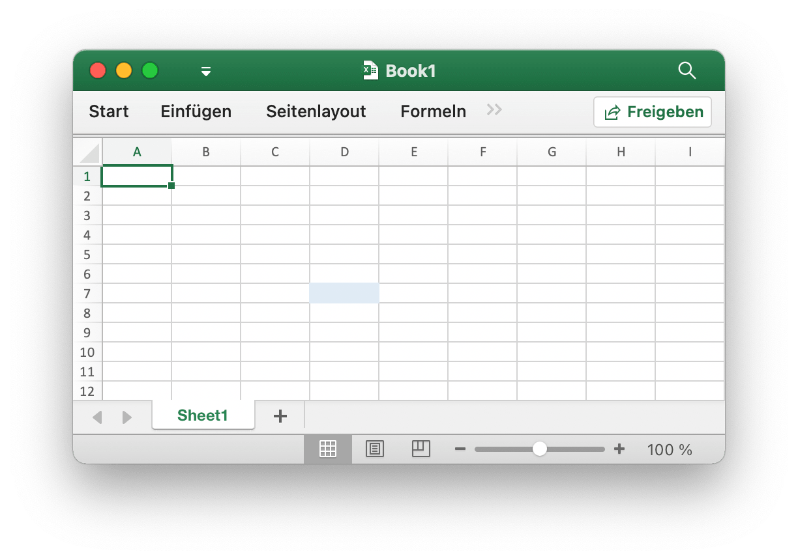
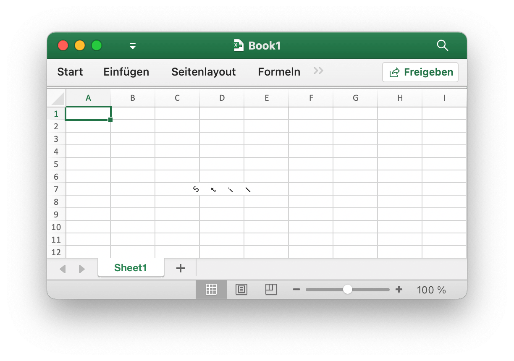
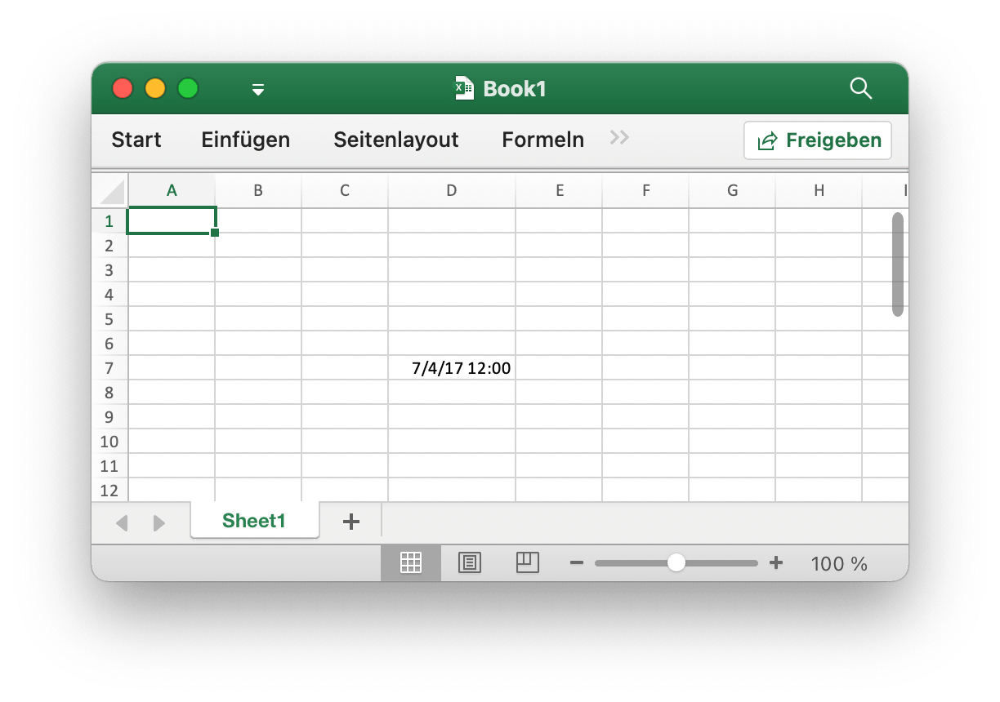
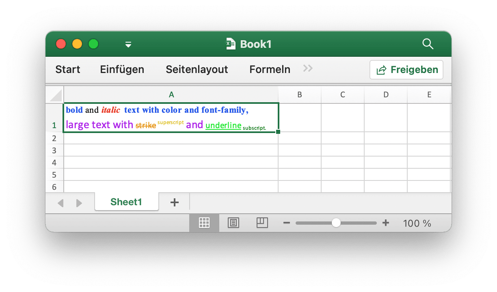
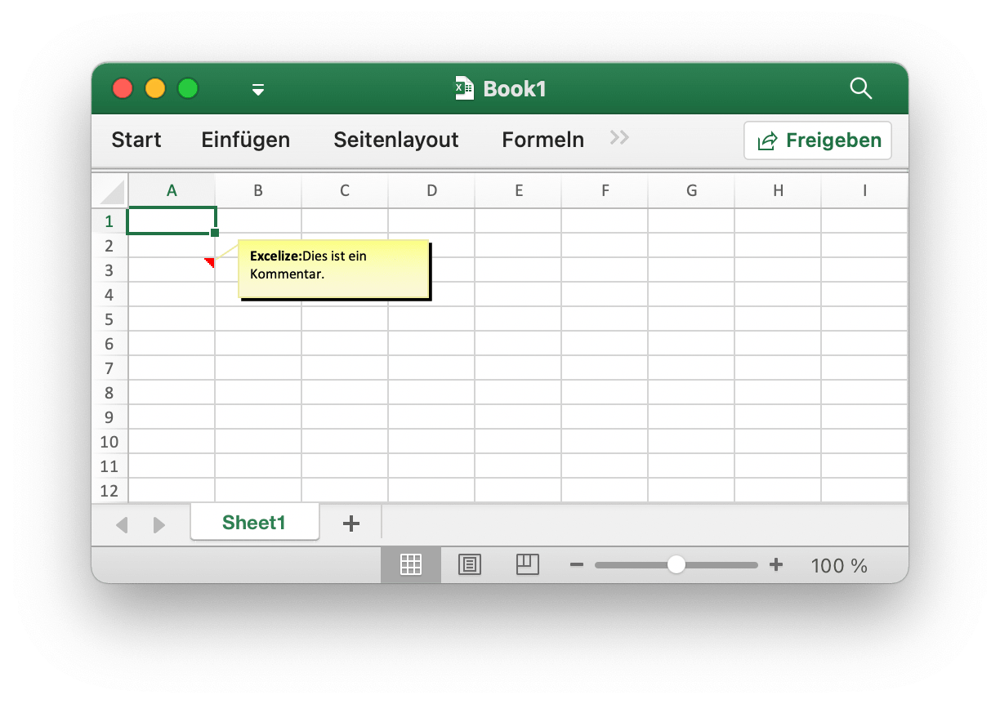

# Zelle

`RichTextRun` ordnet die Einstellungen des Rich-Text-Laufs direkt zu.

```go
type RichTextRun struct {
    Font *Font
    Text string
}
```

`HyperlinkOpts` können an [`SetCellHyperlink`](cell.md#SetCellHyperlink) übergeben werden, um optionale Hyperlink-Attribute festzulegen (z. B. anzugebender Text und Text mit Bildschirmtipps).

```go
type HyperlinkOpts struct {
    Display *string
    Tooltip *string
}
```

`FormulaOpts` können an [`SetCellFormula`](cell.md#SetCellFormula) übergeben werden, um andere Formeltypen zu verwenden.

```go
type FormulaOpts struct {
    Type *string // Formeltyp
    Ref  *string // Gemeinsame Formelreferenz
}
```

## Festlegen des Zellenwerts {#SetCellValue}

```go
func (f *File) SetCellValue(sheet, cell string, value interface{}) error
```

SetCellValue bietet eine Funktion zum Festlegen des Werts einer Zelle. Diese Funktion wird für die gleichzeitige Verwendung unterstützt. Die angegebenen Koordinaten sollten sich nicht in der ersten Zeile der Tabelle befinden. Im Folgenden werden die unterstützten Datentypen angezeigt:

|Unterstützte Datentypen|
|---|
|int|
|int8|
|int16|
|int32|
|int64|
|uint|
|uint8|
|uint16|
|uint32|
|uint64|
|float32|
|float64|
|string|
|[]byte|
|time.Duration|
|time.Time|
|bool|
|nil|

Beachten Sie, dass das standardmäßige Datumsformat `m/d/yy h:mm` mit dem Wert `time.Time` ist. Sie können das Zahlenformat mit der Methode [`SetCellStyle`](cell.md#SetCellStyle) festlegen. Wenn Sie das spezielle Datum in Excel wie den 0. Januar 1900 oder den 29. Februar 1900 festlegen müssen, können diese Zeiten nicht im Datentyp `time.Time` der Go-Sprache dargestellt werden. Bitte legen Sie den Zellenwert als Zahl 0 oder 60 fest, erstellen und binden Sie dann den Datum-Uhrzeit-Zahlenformatstil für die Zelle.

## Festlegen eines booleschen Werts {#SetCellBool}

```go
func (f *File) SetCellBool(sheet, cell string, value bool) error
```

SetCellBool bietet eine Funktion zum Festlegen des Bool-Typwerts einer Zelle anhand des angegebenen Arbeitsblattnamens, der Zellkoordinaten und des Zellenwerts.

## Festlegen des RAW-Werts {#SetCellDefault}

```go
func (f *File) SetCellDefault(sheet, cell, value string) error
```

SetCellDefault bietet eine Funktion zum Festlegen des Zeichenfolgentypwerts einer Zelle als Standardformat, ohne die Zelle zu verlassen.

## Ganzzahlwert festlegen {#SetCellInt}

```go
func (f *File) SetCellInt(sheet, cell string, value int) error
```

SetCellInt bietet eine Funktion zum Festlegen des Int-Typ-Werts einer Zelle anhand des angegebenen Arbeitsblattnamens, der Zellkoordinaten und des Zellenwerts.

## Gleitkommawert festlegen {#SetCellFloat}

```go
func (f *File) SetCellFloat(sheet, cell string, value float64, precision, bitSize int) error
```

SetCellFloat setzt einen Fließkommawert in eine Zelle. Der Parameter `precision` gibt an, wie viele Nachkommastellen angezeigt werden, während `-1` ein spezieller Wert ist, der so viele Dezimalstellen wie nötig verwendet, um die Zahl darzustellen. `bitSize` ist `32` oder `64`, je nachdem, ob `float32` oder `float64` ursprünglich für den Wert verwendet wurde.

## Festlegen des Zeichenfolgenwerts {#SetCellStr}

```go
func (f *File) SetCellStr(sheet, cell, value string) error
```

SetCellStr bietet eine Funktion zum Festlegen des Zeichenfolgentypwerts einer Zelle. Die Gesamtzahl der Zeichen, die eine Zelle `32767` Zeichen enthalten kann.

## Festlegen des Zellstils {#SetCellStyle}

```go
func (f *File) SetCellStyle(sheet, hCell, vCell string, styleID int) error
```

SetCellStyle bietet eine Funktion zum Hinzufügen von Stilattributen für Zellen anhand des angegebenen Arbeitsblattnamens, des Koordinatenbereichs und der Stil-ID. Diese Funktion wird für die gleichzeitige Verwendung unterstützt. Stilindizes können mit der Funktion [`NewStyle`](style.md#NewStyle) abgerufen werden. Beachten Sie, dass die Rahmen vom Typ `diagonalDown` und `diagonalUp` dieselbe Farbe im selben Koordinatenbereich verwenden sollten. SetCellStyle überschreibt die vorhandenen Stile für die Zelle, fügt Stile nicht an oder führt sie mit vorhandenen Stilen zusammen.

- Beispiel 1: Erstellen Sie Ränder der Zelle `D7` auf `Sheet1`:

```go
style, err := f.NewStyle(&excelize.Style{
    Border: []excelize.Border{
        {Type: "left", Color: "0000FF", Style: 3},
        {Type: "top", Color: "00FF00", Style: 4},
        {Type: "bottom", Color: "FFFF00", Style: 5},
        {Type: "right", Color: "FF0000", Style: 6},
        {Type: "diagonalDown", Color: "A020F0", Style: 7},
        {Type: "diagonalUp", Color: "A020F0", Style: 8},
    },
})
if err != nil {
    fmt.Println(err)
}
err = f.SetCellStyle("Sheet1", "D7", "D7", style)
```

<p align="center"></p>

Die vier Ränder der Zelle `D7` sind mit unterschiedlichen Stilen und Farben festgelegt. Dies hängt mit den Parametern beim Aufrufen der Funktion [`NewStyle`](style.md#NewStyle) zusammen. Sie müssen verschiedene Stile festlegen, um auf die Dokumentation zu diesem Kapitel zu verweisen.

- Beispiel 2: Festlegen des Verlaufsstils für die Arbeitsblattzelle `D7` mit dem Namen `Sheet1`:

```go
style, err := f.NewStyle(&excelize.Style{
    Fill: excelize.Fill{Type: "gradient", Color: []string{"#FFFFFF", "#E0EBF5"}, Shading: 1},
})
if err != nil {
    fmt.Println(err)
}
err = f.SetCellStyle("Sheet1", "D7", "D7", style)
```

<p align="center"></p>

Die Zelle `D7` wird mit der Farbfüllung des Verlaufseffekts eingestellt. Der Gradientenfüllungseffekt hängt mit dem Parameter zusammen, wenn die Funktion [`NewStyle`](style.md#NewStyle) aufgerufen wird. Sie müssen verschiedene Stile festlegen, um auf die Dokumentation dieses Kapitels zu verweisen.

- Beispiel 3: Legen Sie eine feste Füllung für die `D7`-Zelle mit dem Namen `Sheet1` fest:

```go
style, err := f.NewStyle(&excelize.Style{
    Fill: excelize.Fill{Type: "pattern", Color: []string{"#E0EBF5"}, Pattern: 1},
})
if err != nil {
    fmt.Println(err)
}
err = f.SetCellStyle("Sheet1", "D7", "D7", style)
```

<p align="center"></p>

Die Zelle `D7` wird mit einer festen Füllung gesetzt.

- Beispiel 4: Legen Sie den Zeichenabstand und den Drehwinkel für die `D7`-Zelle mit dem Namen `Sheet1` fest:

```go
f.SetCellValue("Sheet1", "D7", "Stil")
style, err := f.NewStyle(&excelize.Style{
    Alignment: &excelize.Alignment{
        Horizontal:      "center",
        Indent:          1,
        JustifyLastLine: true,
        ReadingOrder:    0,
        RelativeIndent:  1,
        ShrinkToFit:     true,
        TextRotation:    45,
        Vertical:        "",
        WrapText:        true,
    },
})
if err != nil {
    fmt.Println(err)
}
err = f.SetCellStyle("Sheet1", "D7", "D7", style)
```

<p align="center"></p>

- In Beispiel 5 werden Datum und Uhrzeit in Excel durch reelle Zahlen dargestellt. Beispiel: "2017/7/4 12:00:00 PM" kann durch die Zahl `42920.5` dargestellt werden. Legen Sie das Zeitformat für die Arbeitsblattzelle `D7` mit dem Namen `Sheet1` fest:

```go
f.SetCellValue("Sheet1", "D7", 42920.5)
f.SetColWidth("Sheet1", "D", "D", 13)
style, err := f.NewStyle(&excelize.Style{NumFmt: 22})
if err != nil {
    fmt.Println(err)
}
err = f.SetCellStyle("Sheet1", "D7", "D7", style)
```

<p align="center"></p>

Die Zelle `D7` ist auf das Zeitformat eingestellt. Beachten Sie, dass wenn die Zellenbreite mit dem angewendeten Zeitformat zu schmal ist, um vollständig angezeigt zu werden, sie als `####` angezeigt wird. Sie können die Spaltenbreite ziehen und ablegen oder die Spalte durch Aufrufen von auf die entsprechende Größe einstellen `SetColWidth` Funktion zur normalen Anzeige.

- Beispiel 6: Festlegen von Schriftart, Schriftgröße, Farbe und Versatzstil für die Arbeitsblattzelle `D7` mit dem Namen `Sheet1`:

```go
f.SetCellValue("Sheet1", "D7", "Excel")
style, err := f.NewStyle(&excelize.Style{
    Font: &excelize.Font{
        Bold:   true,
        Italic: true,
        Family: "Times New Roman",
        Size:   36,
        Color:  "#777777",
    },
})
if err != nil {
    fmt.Println(err)
}
err = f.SetCellStyle("Sheet1", "D7", "D7", style)
```

<p align="center"></p>

- Beispiel 7: Sperren und Ausblenden der `D7`-Zelle des Arbeitsblatts mit dem Namen `Sheet1`:

```go
style, err := f.NewStyle(&excelize.Style{
    Protection: &excelize.Protection{
        Hidden: true,
        Locked: true,
    },
})
if err != nil {
    fmt.Println(err)
}
err = f.SetCellStyle("Sheet1", "D7", "D7", style)
```

Schützen Sie das Arbeitsblatt, um eine Zelle zu sperren oder eine Formel auszublenden. Klicken Sie auf der Registerkarte "Überprüfen" auf "Arbeitsblatt schützen".

## Festlegen eines Hyperlinks {#SetCellHyperLink}

```go
func (f *File) SetCellHyperLink(sheet, cell, link, linkType string, opts ...HyperlinkOpts) error
```

SetCellHyperLink bietet eine Funktion zum Festlegen von Zellen-Hyperlinks anhand des angegebenen Arbeitsblattnamens und der Link-URL-Adresse. LinkType definiert zwei Arten von Hyperlinks: `External` für die Website oder `Location` für das Verschieben in eine der Zellen in dieser Arbeitsmappe. Die maximale Anzahl von Hyperlinks in einem Arbeitsblatt beträgt `65530`. Diese Funktion wird nur verwendet, um den Hyperlink der Zelle festzulegen und hat keinen Einfluss auf den Wert der Zelle. Wenn Sie den Wert der Zelle setzen müssen, verwenden Sie bitte die anderen Funktionen wie [`SetCellStyle`](cell.md#SetCellStyle) oder [`SetSheetRow`](sheet.md#SetSheetRow). Unten finden Sie ein Beispiel für einen externen Link.

- Beispiel 1: Hinzufügen eines externen Links zur `A3`-Zelle des Arbeitsblatts mit dem Namen `Sheet1`:

```go
display, tooltip := "https://github.com/xuri/excelize", "Excelize on GitHub"
if err := f.SetCellHyperLink("Sheet1", "A3",
    "https://github.com/xuri/excelize", "External", excelize.HyperlinkOpts{
        Display: &display,
        Tooltip: &tooltip,
    }); err != nil {
    fmt.Println(err)
}
// Legen Sie die Schriftart und den Unterstreichungsstil für die Zelle fest
style, err := f.NewStyle(&excelize.Style{
    Font: &excelize.Font{Color: "#1265BE", Underline: "single"},
})
if err != nil {
    fmt.Println(err)
}
err = f.SetCellStyle("Sheet1", "A3", "A3", style)
```

- Beispiel 2: Hinzufügen einer internen Standortverknüpfung zur `A3`-Zelle mit dem Namen `Sheet1`:

```go
err := f.SetCellHyperLink("Sheet1", "A3", "Sheet1!A40", "Location")
```

## Festlegen von Zell-Richtext {#SetCellRichText}

```go
func (f *File) SetCellRichText(sheet, cell string, runs []RichTextRun) error
```

SetCellRichText bietet eine Funktion zum Festlegen einer Zelle mit Rich Text anhand eines bestimmten Arbeitsblatts.

Legen Sie beispielsweise Rich Text in der Zelle `A1` des Arbeitsblatts mit dem Namen `Sheet1` fest:

<p align="center"></p>

```go
package main

import (
    "fmt"

    "github.com/xuri/excelize/v2"
)

func main() {
    f := excelize.NewFile()
    defer func() {
        if err := f.Close(); err != nil {
            fmt.Println(err)
        }
    }()
    if err := f.SetRowHeight("Sheet1", 1, 35); err != nil {
        fmt.Println(err)
        return
    }
    if err := f.SetColWidth("Sheet1", "A", "A", 44); err != nil {
        fmt.Println(err)
        return
    }
    if err := f.SetCellRichText("Sheet1", "A1", []excelize.RichTextRun{
        {
            Text: "bold",
            Font: &excelize.Font{
                Bold:   true,
                Color:  "2354e8",
                Family: "Times New Roman",
            },
        },
        {
            Text: " and ",
            Font: &excelize.Font{
                Family: "Times New Roman",
            },
        },
        {
            Text: "italic ",
            Font: &excelize.Font{
                Bold:   true,
                Color:  "e83723",
                Italic: true,
                Family: "Times New Roman",
            },
        },
        {
            Text: "text with color and font-family,",
            Font: &excelize.Font{
                Bold:   true,
                Color:  "2354e8",
                Family: "Times New Roman",
            },
        },
        {
            Text: "\r\nlarge text with ",
            Font: &excelize.Font{
                Size:  14,
                Color: "ad23e8",
            },
        },
        {
            Text: "strike",
            Font: &excelize.Font{
                Color:  "e89923",
                Strike: true,
            },
        },
        {
            Text: " superscript",
            Font: &excelize.Font{
                Color:     "dbc21f",
                VertAlign: "superscript",
            },
        },
        {
            Text: " and ",
            Font: &excelize.Font{
                Size:      14,
                Color:     "ad23e8",
                VertAlign: "baseline",
            },
        },
        {
            Text: "underline",
            Font: &excelize.Font{
                Color:     "23e833",
                Underline: "single",
            },
        },
        {
            Text: " subscript.",
            Font: &excelize.Font{
                Color:     "017505",
                VertAlign: "subscript",
            },
        },
    }); err != nil {
        fmt.Println(err)
        return
    }
    style, err := f.NewStyle(&excelize.Style{
        Alignment: &excelize.Alignment{
            WrapText: true,
        },
    })
    if err != nil {
        fmt.Println(err)
        return
    }
    if err := f.SetCellStyle("Sheet1", "A1", "A1", style); err != nil {
        fmt.Println(err)
        return
    }
    if err := f.SaveAs("Book1.xlsx"); err != nil {
        fmt.Println(err)
    }
}
```

## Holen Sie sich zellreichen Text {#GetCellRichText}

```go
func (f *File) GetCellRichText(sheet, cell string) ([]RichTextRun, error)
```

GetCellRichText bietet eine Funktion zum Abrufen des Rich-Textes von Zellen anhand eines bestimmten Arbeitsblatts.

## Abrufen des Zellenwerts {#GetCellValue}

```go
func (f *File) GetCellValue(sheet, cell string, opts ...Options) (string, error)
```

Der Wert der Zelle wird gemäß dem angegebenen Arbeitsblatt und den angegebenen Zellkoordinaten abgerufen, und der Rückgabewert wird in den Typ `string` konvertiert. Diese Funktion wird für die gleichzeitige Verwendung unterstützt. Wenn das Zellenformat auf den Wert einer Zelle angewendet werden kann, wird der angewendete Wert zurückgegeben, andernfalls wird der ursprüngliche Wert zurückgegeben. Die Werte aller Zellen sind in einem zusammengeführten Bereich gleich.

## Holen Sie sich den Zellendatentyp {#GetCellType}

```go
func (f *File) GetCellType(sheet, cell string) (CellType, error)
```

GetCellType bietet eine Funktion zum Abrufen des Datentyps der Zelle anhand des angegebenen Arbeitsblattnamens und der Achse in der Tabellenkalkulationsdatei.

## Abrufen des gesamten Zellenwerts nach Spalten {#GetCols}

```go
func (f *File) GetCols(sheet string, opts ...Options) ([][]string, error)
```

GetCols ruft den Wert aller Zellen nach Spalten auf dem Arbeitsblatt basierend auf dem angegebenen Arbeitsblattnamen ab und wird als zweidimensionales Array zurückgegeben, wobei der Wert der Zelle in den Typ `string` konvertiert wird. Wenn das Zellenformat auf den Wert der Zelle angewendet werden kann, wird der angewendete Wert verwendet, andernfalls wird der ursprüngliche Wert verwendet. Zum Beispiel:

Abrufen und Durchlaufen des Werts aller Zellen durch Spalten in einem Arbeitsblatt mit dem Namen `Sheet1`:

```go
cols, err := f.GetCols("Sheet1")
if err != nil {
    fmt.Println(err)
    return
}
for _, col := range cols {
    for _, rowCell := range col {
        fmt.Print(rowCell, "\t")
    }
    fmt.Println()
}
```

## Abrufen des gesamten Zellenwerts nach Zeilen {#GetRows}

```go
func (f *File) GetRows(sheet string, opts ...Options) ([][]string, error)
```

GetRows gibt alle Zeilen in einem Blatt mit dem angegebenen Arbeitsblattnamen zurück, der als zweidimensionales Array zurückgegeben wird, wobei der Wert der Zelle in den Typ `string` konvertiert wird. Wenn das Zellenformat auf den Wert der Zelle angewendet werden kann, wird der angewendete Wert verwendet, andernfalls wird der ursprüngliche Wert verwendet. GetRows die Zeilen mit Wert- oder Formelzellen abgerufen hat, werden die ständig leeren Zellen am Ende jeder Zeile übersprungen, sodass die Länge jeder Zeile möglicherweise inkonsistent ist.

Abrufen und Durchlaufen des Werts aller Zellen in Zeilen in einem Arbeitsblatt mit dem Namen `Sheet1`:

```go
rows, err := f.GetRows("Sheet1")
if err != nil {
    fmt.Println(err)
    return
}
for _, row := range rows {
    for _, colCell := range row {
        fmt.Print(colCell, "\t")
    }
    fmt.Println()
}
```

## Abrufen von Hyperlinks {#GetCellHyperLink}

```go
func (f *File) GetCellHyperLink(sheet, cell string) (bool, string, error)
```

GetCellHyperLink ruft einen Zell-Hyperlink basierend auf dem angegebenen Arbeitsblattnamen und Zellkoordinaten ab. Wenn die Zelle einen Hyperlink hat, gibt sie `true` und die Linkadresse zurück, andernfalls gibt sie `false` und eine leere Linkadresse zurück.

Holen Sie sich beispielsweise einen Hyperlink zu einer `H6`-Zelle in einem Arbeitsblatt mit dem Namen `Sheet1`:

```go
link, target, err := f.GetCellHyperLink("Sheet1", "H6")
```

## Stilindex abrufen {#GetCellStyle}

```go
func (f *File) GetCellStyle(sheet, cell string) (int, error)
```

Der Zellenstilindex wird aus dem angegebenen Arbeitsblattnamen und den Zellkoordinaten abgerufen, und der erhaltene Index kann als Parameter zum Aufrufen der Funktion `SetCellStyle` beim Kopieren des Zellenstils verwendet werden.

## Zusammenführen von Zellen {#MergeCell}

```go
func (f *File) MergeCell(sheet, hCell, vCell string) error
```

Führen Sie Zellen basierend auf dem angegebenen Arbeitsblattnamen und den Zellkoordinatenbereichen zusammen. Beim Zusammenführen von Zellen wird nur der obere linke Zellenwert beibehalten und die anderen Werte verworfen. Führen Sie beispielsweise Zellen im Bereich `D3:E9` in einem Arbeitsblatt mit dem Namen `Sheet1` zusammen:

```go
err := f.MergeCell("Sheet1", "D3", "E9")
```

Wenn sich der angegebene Zellkoordinatenbereich mit anderen vorhandenen zusammengeführten Zellen überschneidet, werden die vorhandenen zusammengeführten Zellen gelöscht.

## Unmerge-Zellen {#UnmergeCell}

```go
func (f *File) UnmergeCell(sheet string, hCell, vCell string) error
```

UnmergeCell bietet eine Funktion zum Aufheben der Zusammenführung eines bestimmten Koordinatenbereichs. Zum Beispiel den Bereich `D3:E9` auf `Sheet1` entfernen:

```go
err := f.UnmergeCell("Sheet1", "D3", "E9")
```

Achtung: Überlappende Bereiche werden ebenfalls nicht zusammengeführt.

## Abrufen von Zusammenführungszellen {#GetMergeCells}

GetMergeCells bietet eine Funktion zum Abrufen aller zusammengeführten Zellen aus einem aktuellen Arbeitsblatt.

```go
func (f *File) GetMergeCells(sheet string) ([]MergeCell, error)
```

### Wert der zusammengeführten Zelle abrufen

```go
func (m *MergeCell) GetCellValue() string
```

GetCellValue gibt den zusammengeführten Zellenwert zurück.

### Holen Sie sich die Zellenkoordinaten oben links des zusammengeführten Bereichs

```go
func (m *MergeCell) GetStartAxis() string
```

GetStartAxis gibt die oberen linken Zellenkoordinaten des zusammengeführten Bereichs zurück, zum Beispiel: `C2`.

### Holen Sie sich die unteren rechten Zellenkoordinaten des zusammengeführten Bereichs

```go
func (m *MergeCell) GetEndAxis() string
```

GetEndAxis gibt die unteren rechten Zellenkoordinaten des zusammengeführten Bereichs zurück, zum Beispiel: `D4`.

## Kommentar hinzufügen {#AddComment}

```go
func (f *File) AddComment(sheet string, comment Comment) error
```

AddComment bietet die Methode zum Hinzufügen von Kommentaren zu einem Blatt anhand eines bestimmten Arbeitsblattindex, einer bestimmten Zelle und eines bestimmten Formatsatzes (z. B. Autor und Text). Beachten Sie, dass die maximale Autorenlänge 255 und die maximale Textlänge 32512 beträgt. Fügen Sie beispielsweise einen Kommentar in `Sheet1!$A$3` hinzu:

<p align="center"></p>

```go
err := f.AddComment("Sheet1", excelize.Comment{
    Cell:   "A3",
    Author: "Excelize",
    Runs: []excelize.RichTextRun{
        {Text: "Excelize: ", Font: &excelize.Font{Bold: true}},
        {Text: "Dies ist ein Kommentar."},
    },
})
```

## Kommentar abrufen {#GetComments}

```go
func (f *File) GetComments() (map[string][]Comment, error)
```

GetComments ruft alle Kommentare ab und gibt eine Karte des Arbeitsblattnamens an die Arbeitsblattkommentare zurück.

## Kommentar löschen {#DeleteComment}

```go
func (f *File) DeleteComment(sheet, cell string) error
```

DeleteComment bietet die Methode zum Löschen von Kommentaren in einem Blatt nach gegebenem Arbeitsblatt. Löschen Sie beispielsweise den Kommentar in `Sheet1!$A$30`:

```go
err := f.DeleteComment("Sheet1", "A30")
```

## Festlegen der Zellenformel {#SetCellFormula}

```go
func (f *File) SetCellFormula(sheet, cell, formula string, opts ...FormulaOpts) error
```

SetCellFormula bietet eine Funktion zum Festlegen der Formel für die Zelle, die gemäß dem angegebenen Arbeitsblattnamen und den Zellformeleinstellungen verwendet wird. Das Ergebnis der Formelzelle kann berechnet werden, wenn das Arbeitsblatt von der Office Excel-Anwendung geöffnet wird, oder kann die [CalcCellValue](cell.md#CalcCellValue) Funktion auch den berechneten Zellenwert abrufen. Wenn die Excel-Anwendung die Formel beim Öffnen der Arbeitsmappe nicht automatisch berechnet, rufen Sie nach dem Einstellen der Zellenformelfunktionen [UpdateLinkedValue](utils.md#UpdateLinkedValue) auf.

- Beispiel 1, setzen Sie die normale Formel `=SUM(A1,B1)` für die Zelle `A3` auf `Sheet1`:

```go
err := f.SetCellFormula("Sheet1", "A3", "=SUM(A1,B1)")
```

- Beispiel 2, setze eindimensionale vertikale Konstantenarray (Spaltenarray) Formel `1;2;3` für die Zelle `A3` auf `Sheet1`:

```go
err := f.SetCellFormula("Sheet1", "A3", "={1;2;3}")
```

- Beispiel 3, setze eindimensionales horizontales konstantes Array (Zeilenarray) Formel `"a","b","c"` für die Zelle `A3` auf `Sheet1`:

```go
err := f.SetCellFormula("Sheet1", "A3", "={\"a\",\"b\",\"c\"}")
```

- Beispiel 4, setze die zweidimensionale konstante Arrayformel `{1,2;"a","b"}` für die Zelle `A3` auf `Sheet1`:

```go
formulaType, ref := excelize.STCellFormulaTypeArray, "A3:A3"
err := f.SetCellFormula("Sheet1", "A3", "={1,2;\"a\",\"b\"}",
    excelize.FormulaOpts{Ref: &ref, Type: &formulaType})
```

- Beispiel 5, setze die Range-Array-Formel `A1:A2` für die Zelle `A3` auf `Sheet1`:

```go
formulaType, ref := excelize.STCellFormulaTypeArray, "A3:A3"
err := f.SetCellFormula("Sheet1", "A3", "=A1:A2",
    excelize.FormulaOpts{Ref: &ref, Type: &formulaType})
```

- Beispiel 6, setze die gemeinsame Formel `=A1+B1` für die Zellen `C1:C5` auf `Sheet1`, `C1` ist die Masterzelle:

```go
formulaType, ref := excelize.STCellFormulaTypeShared, "C1:C5"
err := f.SetCellFormula("Sheet1", "C1", "=A1+B1",
    excelize.FormulaOpts{Ref: &ref, Type: &formulaType})
```

- Beispiel 7, setze die Tabellenformel `=SUM(Table1[[A]:[B]])` für die Zelle `C2` auf `Sheet1`:

```go
package main

import (
    "fmt"

    "github.com/xuri/excelize/v2"
)

func main() {
    f := excelize.NewFile()
    defer func() {
        if err := f.Close(); err != nil {
            fmt.Println(err)
        }
    }()
    for idx, row := range [][]interface{}{{"A", "B", "C"}, {1, 2}} {
        if err := f.SetSheetRow("Sheet1", fmt.Sprintf("A%d", idx+1), &row); err != nil {
            fmt.Println(err)
            return
        }
    }
    if err := f.AddTable("Sheet1", "A1:C2", &excelize.TableOptions{
        Name: "Table1", StyleName: "TableStyleMedium2",
    }); err != nil {
        fmt.Println(err)
        return
    }
    formulaType := excelize.STCellFormulaTypeDataTable
    if err := f.SetCellFormula("Sheet1", "C2", "=SUM(Table1[[A]:[B]])",
        excelize.FormulaOpts{Type: &formulaType}); err != nil {
        fmt.Println(err)
        return
    }
    if err := f.SaveAs("Book1.xlsx"); err != nil {
        fmt.Println(err)
    }
}
```

## Abrufen der Zellenformel {#GetCellFormula}

```go
func (f *File) GetCellFormula(sheet, cell string) (string, error)
```

Rufen Sie die Formel für die Zelle basierend auf dem angegebenen Arbeitsblattnamen und den Zellkoordinaten ab.

## Zellenwert berechnen {#CalcCellValue}

```go
func (f *File) CalcCellValue(sheet, cell string) (string, error)
```

CalcCellValue bietet eine Funktion zum Abrufen des berechneten Zellenwerts. Diese Funktion befindet sich derzeit in Bearbeitung. Iterative Berechnung, implizite Schnittmenge, explizite Schnittmenge, Matrixformel, Tabellenformel und einige andere Formeln werden derzeit nicht unterstützt.

Unterstützte Formeln:

```text
ABS
ACCRINT
ACCRINTM
ACOS
ACOSH
ACOT
ACOTH
ADDRESS
AGGREGATE
AMORDEGRC
AMORLINC
AND
ARABIC
ASIN
ASINH
ATAN
ATAN2
ATANH
AVEDEV
AVERAGE
AVERAGEA
AVERAGEIF
AVERAGEIFS
BASE
BESSELI
BESSELJ
BESSELK
BESSELY
BETADIST
BETA.DIST
BETAINV
BETA.INV
BIN2DEC
BIN2HEX
BIN2OCT
BINOMDIST
BINOM.DIST
BINOM.DIST.RANGE
BINOM.INV
BITAND
BITLSHIFT
BITOR
BITRSHIFT
BITXOR
CEILING
CEILING.MATH
CEILING.PRECISE
CHAR
CHIDIST
CHIINV
CHITEST
CHISQ.DIST
CHISQ.DIST.RT
CHISQ.INV
CHISQ.INV.RT
CHISQ.TEST
CHOOSE
CLEAN
CODE
COLUMN
COLUMNS
COMBIN
COMBINA
COMPLEX
CONCAT
CONCATENATE
CONFIDENCE
CONFIDENCE.NORM
CONFIDENCE.T
CONVERT
CORREL
COS
COSH
COT
COTH
COUNT
COUNTA
COUNTBLANK
COUNTIF
COUNTIFS
COUPDAYBS
COUPDAYS
COUPDAYSNC
COUPNCD
COUPNUM
COUPPCD
COVAR
COVARIANCE.P
COVARIANCE.S
CRITBINOM
CSC
CSCH
CUMIPMT
CUMPRINC
DATE
DATEDIF
DATEVALUE
DAVERAGE
DAY
DAYS
DAYS360
DB
DCOUNT
DCOUNTA
DDB
DEC2BIN
DEC2HEX
DEC2OCT
DECIMAL
DEGREES
DELTA
DEVSQ
DGET
DISC
DMAX
DMIN
DOLLARDE
DOLLARFR
DPRODUCT
DSTDEV
DSTDEVP
DSUM
DURATION
DVAR
DVARP
EFFECT
EDATE
ENCODEURL
EOMONTH
ERF
ERF.PRECISE
ERFC
ERFC.PRECISE
ERROR.TYPE
EUROCONVERT
EVEN
EXACT
EXP
EXPON.DIST
EXPONDIST
FACT
FACTDOUBLE
FALSE
F.DIST
F.DIST.RT
FDIST
FIND
FINDB
F.INV
F.INV.RT
FINV
FISHER
FISHERINV
FIXED
FLOOR
FLOOR.MATH
FLOOR.PRECISE
FORMULATEXT
F.TEST
FTEST
FV
FVSCHEDULE
GAMMA
GAMMA.DIST
GAMMADIST
GAMMA.INV
GAMMAINV
GAMMALN
GAMMALN.PRECISE
GAUSS
GCD
GEOMEAN
GESTEP
GROWTH
HARMEAN
HEX2BIN
HEX2DEC
HEX2OCT
HLOOKUP
HOUR
HYPERLINK
HYPGEOM.DIST
HYPGEOMDIST
IF
IFERROR
IFNA
IFS
IMABS
IMAGINARY
IMARGUMENT
IMCONJUGATE
IMCOS
IMCOSH
IMCOT
IMCSC
IMCSCH
IMDIV
IMEXP
IMLN
IMLOG10
IMLOG2
IMPOWER
IMPRODUCT
IMREAL
IMSEC
IMSECH
IMSIN
IMSINH
IMSQRT
IMSUB
IMSUM
IMTAN
INDEX
INDIRECT
INT
INTRATE
IPMT
IRR
ISBLANK
ISERR
ISERROR
ISEVEN
ISFORMULA
ISLOGICAL
ISNA
ISNONTEXT
ISNUMBER
ISODD
ISREF
ISTEXT
ISO.CEILING
ISOWEEKNUM
ISPMT
KURT
LARGE
LCM
LEFT
LEFTB
LEN
LENB
LN
LOG
LOG10
LOGINV
LOGNORM.DIST
LOGNORMDIST
LOGNORM.INV
LOOKUP
LOWER
MATCH
MAX
MAXA
MAXIFS
MDETERM
MDURATION
MEDIAN
MID
MIDB
MIN
MINA
MINIFS
MINUTE
MINVERSE
MIRR
MMULT
MOD
MODE
MODE.MULT
MODE.SNGL
MONTH
MROUND
MULTINOMIAL
MUNIT
N
NA
NEGBINOM.DIST
NEGBINOMDIST
NETWORKDAYS
NETWORKDAYS.INTL
NOMINAL
NORM.DIST
NORMDIST
NORM.INV
NORMINV
NORM.S.DIST
NORMSDIST
NORM.S.INV
NORMSINV
NOT
NOW
NPER
NPV
OCT2BIN
OCT2DEC
OCT2HEX
ODD
ODDFPRICE
OR
PDURATION
PEARSON
PERCENTILE.EXC
PERCENTILE.INC
PERCENTILE
PERCENTRANK.EXC
PERCENTRANK.INC
PERCENTRANK
PERMUT
PERMUTATIONA
PHI
PI
PMT
POISSON.DIST
POISSON
POWER
PPMT
PRICE
PRICEDISC
PRICEMAT
PRODUCT
PROPER
PV
QUARTILE
QUARTILE.EXC
QUARTILE.INC
QUOTIENT
RADIANS
RAND
RANDBETWEEN
RANK
RANK.EQ
RATE
RECEIVED
REPLACE
REPLACEB
REPT
RIGHT
RIGHTB
ROMAN
ROUND
ROUNDDOWN
ROUNDUP
ROW
ROWS
RRI
RSQ
SEC
SECH
SECOND
SERIESSUM
SHEET
SHEETS
SIGN
SIN
SINH
SKEW
SKEW.P
SLN
SLOPE
SMALL
SQRT
SQRTPI
STANDARDIZE
STDEV
STDEV.P
STDEV.S
STDEVA
STDEVP
STDEVPA
STEYX
SUBSTITUTE
SUBTOTAL
SUM
SUMIF
SUMIFS
SUMPRODUCT
SUMSQ
SUMX2MY2
SUMX2PY2
SUMXMY2
SWITCH
SYD
T
TAN
TANH
TBILLEQ
TBILLPRICE
TBILLYIELD
T.DIST
T.DIST.2T
T.DIST.RT
TDIST
TEXTJOIN
TIME
TIMEVALUE
T.INV
T.INV.2T
TINV
TODAY
TRANSPOSE
TREND
TRIM
TRIMMEAN
TRUE
TRUNC
T.TEST
TTEST
TYPE
UNICHAR
UNICODE
UPPER
VALUE
VAR
VAR.P
VAR.S
VARA
VARP
VARPA
VDB
VLOOKUP
WEEKDAY
WEEKNUM
WEIBULL
WEIBULL.DIST
WORKDAY
WORKDAY.INTL
XIRR
XLOOKUP
XNPV
XOR
YEAR
YEARFRAC
YIELD
YIELDDISC
YIELDMAT
Z.TEST
ZTEST
```
