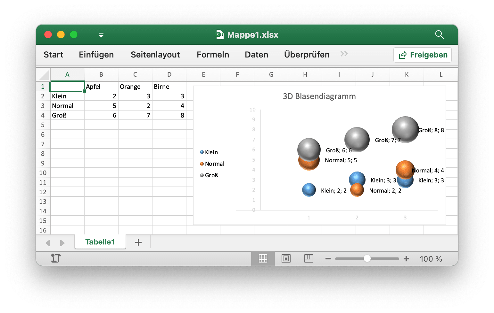

# 3D Blasendiagramm {#bubble3D}

Fügen Sie beispielsweise ein 3D Blasendiagramm wie dieses hinzu:

<p align="center"></p>

```go
package main

import (
    "fmt"

    "github.com/xuri/excelize/v2"
)

func main() {
    f := excelize.NewFile()
    defer func() {
        if err := f.Close(); err != nil {
            fmt.Println(err)
        }
    }()
    if err := f.SetSheetName("Sheet1", "Tabelle1"); err != nil {
        fmt.Println(err)
        return
    }
    for idx, row := range [][]interface{}{
        {nil, "Apfel", "Orange", "Birne"},
        {"Klein", 2, 3, 3},
        {"Normal", 5, 2, 4},
        {"Groß", 6, 7, 8},
    } {
        cell, err := excelize.CoordinatesToCellName(1, idx+1)
        if err != nil {
            fmt.Println(err)
            return
        }
        if err := f.SetSheetRow("Tabelle1", cell, &row); err != nil {
            fmt.Println(err)
            return
        }
    }
    if err := f.AddChart("Tabelle1", "E1", &excelize.Chart{
        Type: excelize.Bubble3D,
        Series: []excelize.ChartSeries{
            {
                Name:       "Tabelle1!$A$2",
                Categories: "Tabelle1!$B$1:$D$1",
                Values:     "Tabelle1!$B$2:$D$2",
            },
            {
                Name:       "Tabelle1!$A$3",
                Categories: "Tabelle1!$B$1:$D$1",
                Values:     "Tabelle1!$B$3:$D$3",
            },
            {
                Name:       "Tabelle1!$A$4",
                Categories: "Tabelle1!$B$1:$D$1",
                Values:     "Tabelle1!$B$4:$D$4",
            },
        },
        Format: excelize.GraphicOptions{
            OffsetX: 15,
            OffsetY: 10,
        },
        Legend: excelize.ChartLegend{
            Position: "left",
        },
        Title: excelize.ChartTitle{
            Name: "3D Blasendiagramm",
        },
        PlotArea: excelize.ChartPlotArea{
            ShowBubbleSize:  true,
            ShowCatName:     false,
            ShowLeaderLines: false,
            ShowPercent:     true,
            ShowSerName:     true,
            ShowVal:         true,
        },
        ShowBlanksAs: "zero",
    }); err != nil {
        fmt.Println(err)
        return
    }
    // Speichern Sie die Tabelle unter dem angegebenen Pfad.
    if err := f.SaveAs("Mappe1.xlsx"); err != nil {
        fmt.Println(err)
    }
}
```
