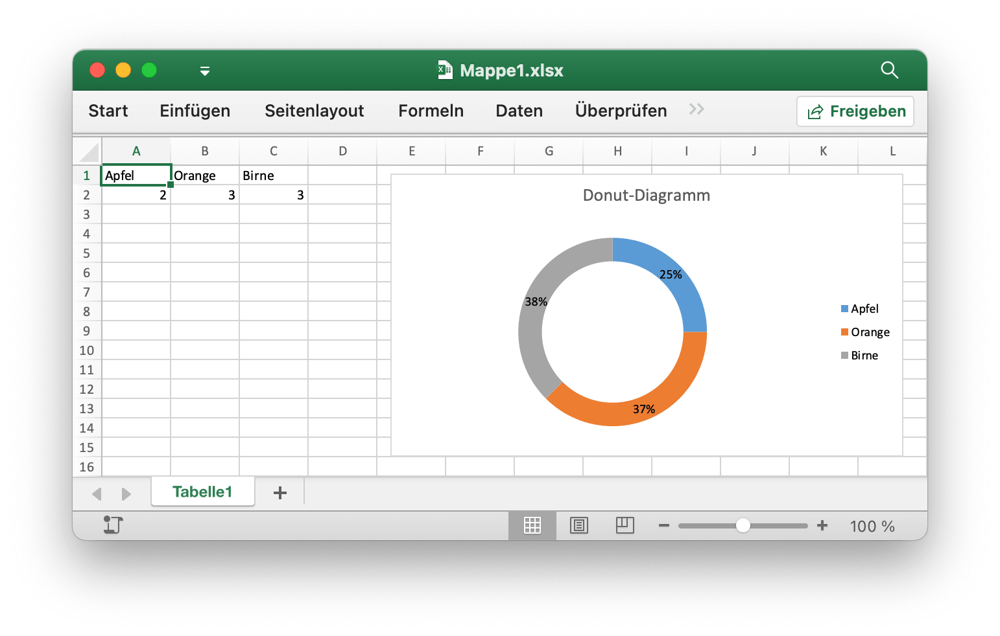

# Donut-Diagramm {#doughnut}

Fügen Sie beispielsweise ein Donut-Diagramm wie dieses hinzu:

<p align="center"></p>

```go
package main

import (
    "fmt"

    "github.com/xuri/excelize/v2"
)

func main() {
    categories := map[string]string{"A1": "Apfel", "B1": "Orange", "C1": "Birne"}
    values := map[string]int{"A2": 2, "B2": 3, "C2": 3}
    f := excelize.NewFile()
    f.SetSheetName("Sheet1", "Tabelle1")
    for k, v := range categories {
        f.SetCellValue("Tabelle1", k, v)
    }
    for k, v := range values {
        f.SetCellValue("Tabelle1", k, v)
    }
    if err := f.AddChart("Tabelle1", "E1", `{
        "type": "doughnut",
        "series": [
        {
            "name": "Tabelle1!$A$2",
            "categories": "Tabelle1!$A$1:$C$1",
            "values": "Tabelle1!$A$2:$C$2"
        }],
        "format":
        {
            "x_scale": 1.0,
            "y_scale": 1.0,
            "x_offset": 15,
            "y_offset": 10,
            "print_obj": true,
            "lock_aspect_ratio": false,
            "locked": false
        },
        "legend":
        {
            "position": "right",
            "show_legend_key": false
        },
        "title":
        {
            "name": "Donut-Diagramm"
        },
        "plotarea":
        {
            "show_bubble_size": false,
            "show_cat_name": false,
            "show_leader_lines": false,
            "show_percent": true,
            "show_series_name": false,
            "show_val": false
        },
        "show_blanks_as": "zero"
    }`); err != nil {
        fmt.Println(err)
    }
    // Speichern Sie die Tabelle unter dem angegebenen Pfad.
    if err := f.SaveAs("Mappe1.xlsx"); err != nil {
        fmt.Println(err)
    }
}
```
