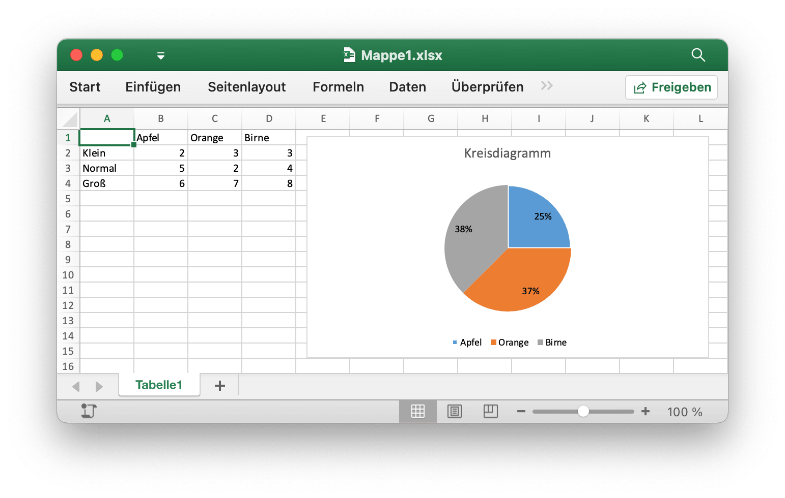

# Kreisdiagramm {#pie}

For example, add a pie chart that like the this:

<p align="center"></p>

```go
package main

import (
    "fmt"

    "github.com/360EntSecGroup-Skylar/excelize/v2"
)

func main() {
    categories := map[string]string{
        "A2": "Klein", "A3": "Normal", "A4": "Groß", "B1": "Apfel", "C1": "Orange", "D1": "Birne"}
    values := map[string]int{
        "B2": 2, "C2": 3, "D2": 3, "B3": 5, "C3": 2, "D3": 4, "B4": 6, "C4": 7, "D4": 8}
    f := excelize.NewFile()
    f.SetSheetName("Sheet1", "Tabelle1")
    for k, v := range categories {
        f.SetCellValue("Tabelle1", k, v)
    }
    for k, v := range values {
        f.SetCellValue("Tabelle1", k, v)
    }
    if err := f.AddChart("Tabelle1", "E1", `{
        "type": "pie",
        "series": [
        {
            "name": "Tabelle1!$A$2",
            "categories": "Tabelle1!$B$1:$D$1",
            "values": "Tabelle1!$B$2:$D$2"
        }],
        "format":
        {
            "x_scale": 1.0,
            "y_scale": 1.0,
            "x_offset": 15,
            "y_offset": 10,
            "print_obj": true,
            "lock_aspect_ratio": false,
            "locked": false
        },
        "legend":
        {
            "position": "bottom",
            "show_legend_key": false
        },
        "title":
        {
            "name": "Kreisdiagramm"
        },
        "plotarea":
        {
            "show_bubble_size": true,
            "show_cat_name": false,
            "show_leader_lines": false,
            "show_percent": true,
            "show_series_name": false,
            "show_val": false
        },
        "show_blanks_as": "gap"
    }`); err != nil {
        fmt.Println(err)
    }
    // Speichern Sie die Tabelle unter dem angegebenen Pfad.
    if err := f.SaveAs("Mappe1.xlsx"); err != nil {
        fmt.Println(err)
    }
}
```
