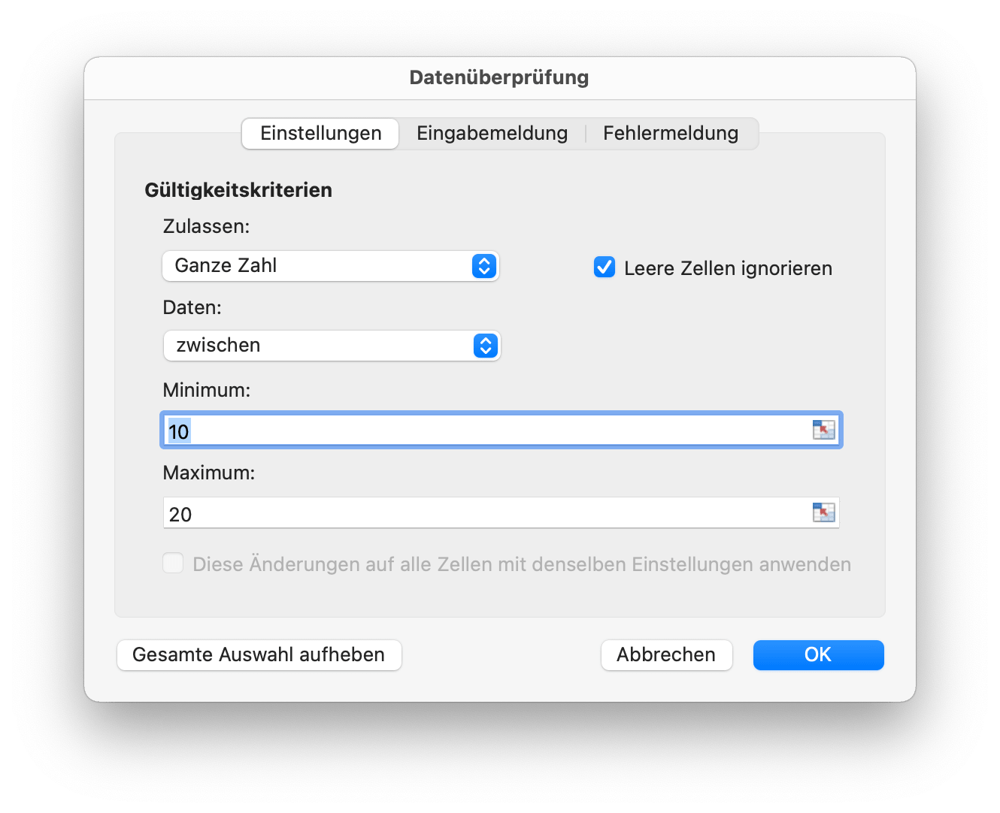
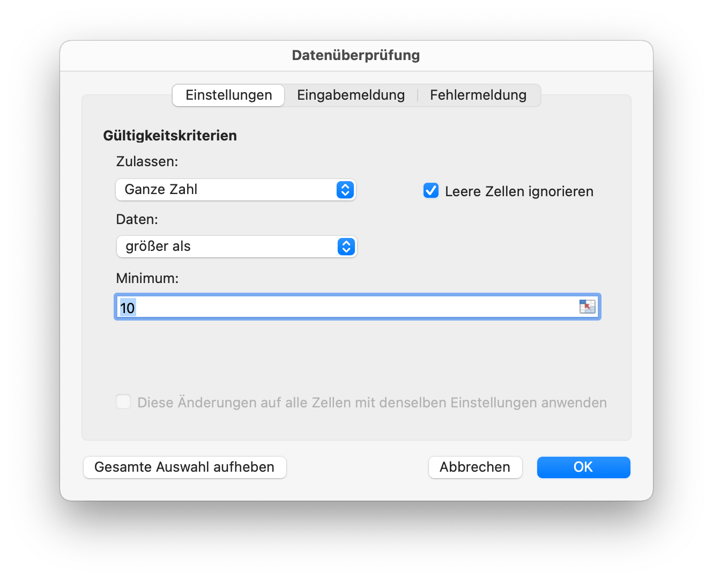
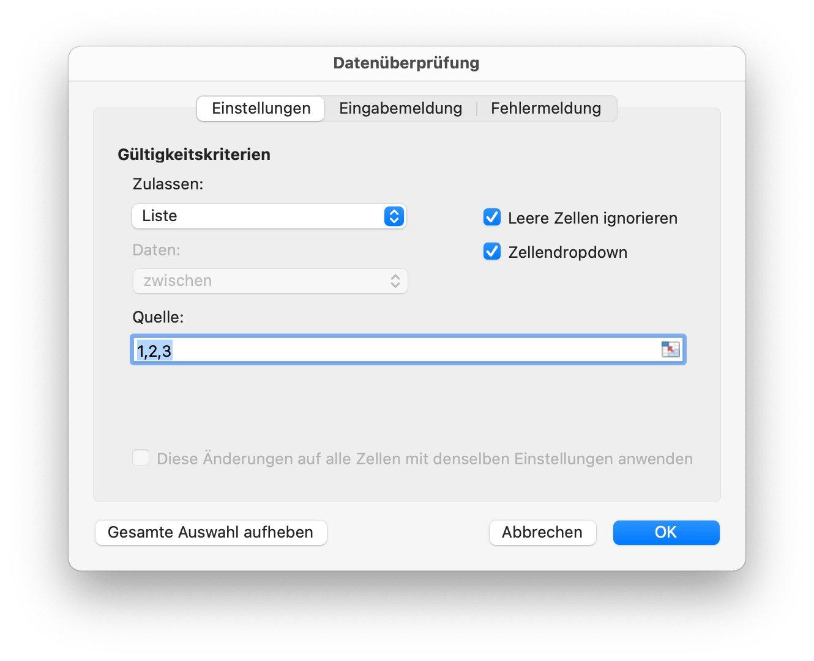
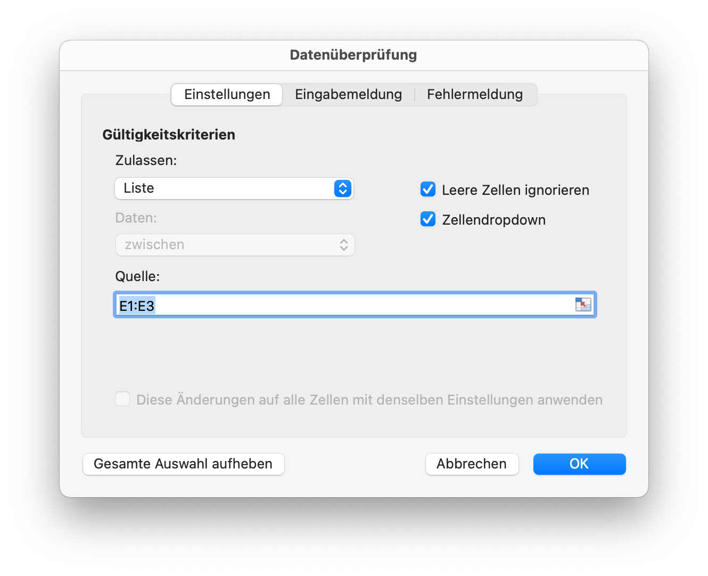

# Daten

## Hinzufügen von Datenüberprüfungen {#AddDataValidation}

```go
func (f *File) AddDataValidation(sheet string, dv *DataValidation)
```

AddDataValidation bietet eine festgelegte Datenüberprüfung für einen Bereich des Arbeitsblatts anhand des angegebenen Datenüberprüfungsobjekts und des Arbeitsblattnamens. Das Datenüberprüfungsobjekt kann mit der Funktion `NewDataValidation` erstellt werden. Datenvalidierungstyp und Operatoren finden Sie im Abschnitt [Constants](constants.md).

Beispiel 1: Setzen Sie die Datenvalidierung auf `Tabelle1!A1:B2` mit den Einstellungen für die Validierungskriterien. Zeigen Sie eine Fehlerwarnung an, nachdem ungültige Daten mit dem Stil "Stop" und dem benutzerdefinierten Titel "Fehlerkörper" eingegeben wurden:

<p align="center"></p>

```go
dv := excelize.NewDataValidation(true)
dv.SetSqref("A1:B2")
dv.SetRange(10, 20, excelize.DataValidationTypeWhole, excelize.DataValidationOperatorBetween)
dv.SetError(excelize.DataValidationErrorStyleStop, "error title", "Fehlerkörper")
f.AddDataValidation("Tabelle1", dv)
```

Beispiel 2: Stellen Sie die Datenvalidierung auf `Tabelle1!A3:B4` mit den Einstellungen für die Validierungskriterien ein und zeigen Sie die Eingabemeldung an, wenn die Zelle ausgewählt ist:

<p align="center"></p>

```go
dv = excelize.NewDataValidation(true)
dv.SetSqref("A3:B4")
dv.SetRange(10, 20, excelize.DataValidationTypeWhole, excelize.DataValidationOperatorGreaterThan)
dv.SetInput("input title", "input body")
f.AddDataValidation("Tabelle1", dv)
```

Beispiel 3: Setzen Sie die Datenvalidierung auf `Tabelle1!A5:B6` mit den Einstellungen für die Validierungskriterien. Erstellen Sie ein Dropdown-Menü in der Zelle, indem Sie die Listenquelle zulassen:

<p align="center"></p>

```go
dv = excelize.NewDataValidation(true)
dv.SetSqref("A5:B6")
dv.SetDropList([]string{"1", "2", "3"})
f.AddDataValidation("Tabelle1", dv)
```

Wenn Sie die Elemente in das Datenvalidierungsdialogfeld (eine durch Trennzeichen getrennte Liste) eingeben, beträgt die Grenze 255 Zeichen, einschließlich der Trennzeichen. Wenn die Quellformel Ihrer Datenvalidierungsliste die maximale Längenbeschränkung überschreitet, legen Sie bitte die zulässigen Werte in den Arbeitsblattzellen fest und verwenden Sie die Funktion `SetSqrefDropList`, um die Referenz für ihre Zellen festzulegen.

Beispiel 4: Setzen Sie die Datenvalidierung auf `Tabelle1!A7:B8` mit den Einstellungen der Validierungskriterienquelle `Tabelle1!E1:E3`. Erstellen Sie ein Dropdown-Menü in der Zelle, indem Sie die Listenquelle zulassen:

<p align="center"></p>

```go
dv := excelize.NewDataValidation(true)
dv.SetSqref("A7:B8")
dv.SetSqrefDropList("E1:E3")
f.AddDataValidation("Tabelle1", dv)
```

Die Anzahl der Elemente, die in einer Datenvalidierungs-Dropdown-Liste angezeigt werden, ist begrenzt: Die Liste kann bis zu 32768 Elemente aus einer Liste im Arbeitsblatt anzeigen. Wenn Sie mehr Elemente benötigen, können Sie eine abhängige Dropdown-Liste erstellen, die nach Kategorien aufgeschlüsselt ist.

## Datenvalidierung erhalten {#GetDataValidations}

```go
func (f *File) GetDataValidations(sheet string) ([]*DataValidation, error)
```

GetDataValidations gibt eine Datenvalidierungsliste nach dem angegebenen Arbeitsblattnamen zurück.

## Datenvalidierung löschen {#DeleteDataValidation}

```go
func (f *File) DeleteDataValidation(sheet string, sqref ...string) error
```

DeleteDataValidation Löscht die Datenvalidierung anhand des angegebenen Arbeitsblattnamens und der Referenzsequenz. Alle Datenvalidierungen im Arbeitsblatt werden gelöscht, wenn kein Referenzsequenzparameter angegeben wird.

## Slicer hinzufügen {#AddSlicer}

`SlicerOptions` repräsentiert die Einstellungen des Slicers.

```go
type SlicerOptions struct {
    Name          string
    Table         string
    Cell          string
    Caption       string
    Macro         string
    Width         uint
    Height        uint
    DisplayHeader *bool
    ItemDesc      bool
    Format        GraphicOptions
}
```

`Name` gibt den Slicer-Namen an. Es sollte ein vorhandener Feldname der angegebenen Tabelle oder Pivot-Tabelle sein. Diese Einstellung ist erforderlich.

`Table` gibt den Namen der Tabelle oder Pivot-Tabelle an, diese Einstellung ist erforderlich.

`Cell` gibt die linken oberen Zellkoordinaten und die Position zum Einfügen des Slicers an. Diese Einstellung ist erforderlich.

`Caption` gibt die Beschriftung des Slicers an, diese Einstellung ist optional.

`Macro` wird zum Festlegen des Makros für den Slicer verwendet. Die Arbeitsmappenerweiterung sollte XLSM oder XLTM sein.

`Width` gibt die Breite des Slicers an, diese Einstellung ist optional.

`Height` gibt die Höhe des Slicers an, diese Einstellung ist optional.

`DisplayHeader` gibt an, ob der Header des Slicers angezeigt wird. Diese Einstellung ist optional, die Standardeinstellung ist `Anzeige`.

`ItemDesc` gibt die absteigende Sortierung (Z-A) der Elemente an. Diese Einstellung ist optional und die Standardeinstellung ist `false` (steht für aufsteigend).

`Format` gibt das Format des Slicers an, diese Einstellung ist optional.

```go
func (f *File) AddSlicer(sheet string, opts *SlicerOptions) error
```

Die AddSlicer-Funktion fügt einen Slicer ein, indem sie den Arbeitsblattnamen und die Slicer-Einstellungen angibt. Fügen Sie beispielsweise einen Slicer auf `Tabelle1!E1` mit dem Feld `Column1` für die Tabelle `Table1` ein:

```go
err := f.AddSlicer("Tabelle1", &excelize.SlicerOptions{
    Name:       "Column1",
    Cell:       "E1",
    TableSheet: "Tabelle1",
    TableName:  "Table1",
    Caption:    "Column1",
    Width:      200,
    Height:     200,
})
```

## Slicer abrufen {#GetSlicers}

```go
func (f *File) GetSlicers(sheet string) ([]SlicerOptions, error)
```

GetSlicers bietet die Methode, um alle Slicer in einem Arbeitsblatt anhand eines bestimmten Arbeitsblattnamens abzurufen. Beachten Sie, dass diese Funktion derzeit das Abrufen der Höhe, Breite und Grafikoptionen der Slicer-Form nicht unterstützt.

## Slicer löschen {#DeleteSlicer}

```go
func (f *File) DeleteSlicer(name string) error
```

DeleteSlicer bietet die Methode zum Löschen eines Slicers anhand eines angegebenen Slicernamens.
