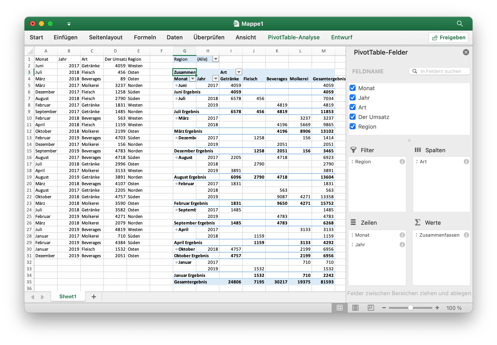

# Pivot-Tabelle {#PivotTable}

Eine Pivot-Tabelle ist eine Statistiktabelle, in der die Daten einer umfangreicheren Tabelle (z. B. aus einer Datenbank, einer Tabelle oder einem Business Intelligence-Programm) zusammengefasst sind. Diese Zusammenfassung kann Summen, Durchschnittswerte oder andere Statistiken enthalten, die in der Pivot-Tabelle auf sinnvolle Weise zusammengefasst werden.

`PivotTableOptions` ordnet die Formateinstellungen der Pivot-Tabelle direkt zu.

```go
type PivotTableOptions struct {
    pivotTableSheetName string
    DataRange           string            `json:"data_range"`
    PivotTableRange     string            `json:"pivot_table_range"`
    Rows                []PivotTableField `json:"rows"`
    Columns             []PivotTableField `json:"columns"`
    Data                []PivotTableField `json:"data"`
    Filter              []PivotTableField `json:"filter"`
    RowGrandTotals      bool              `json:"row_grand_totals"`
    ColGrandTotals      bool              `json:"col_grand_totals"`
    ShowDrill           bool              `json:"show_drill"`
    UseAutoFormatting   bool              `json:"use_auto_formatting"`
    PageOverThenDown    bool              `json:"page_over_then_down"`
    MergeItem           bool              `json:"merge_item"`
    CompactData         bool              `json:"compact_data"`
    ShowError           bool              `json:"show_error"`
    ShowRowHeaders      bool              `json:"show_row_headers"`
    ShowColHeaders      bool              `json:"show_col_headers"`
    ShowRowStripes      bool              `json:"show_row_stripes"`
    ShowColStripes      bool              `json:"show_col_stripes"`
    ShowLastColumn      bool              `json:"show_last_column"`
    PivotTableStyleName string            `json:"pivot_table_style_name"`
    // enthält gefilterte oder nicht exportierte Felder
}
```

`PivotTableStyleName`: Die integrierten Stilnamen für Pivot-Tabellen:

```text
PivotStyleLight1 - PivotStyleLight28
PivotStyleMedium1 - PivotStyleMedium28
PivotStyleDark1 - PivotStyleDark28
```

`PivotTableField` ordnet die Feldeinstellungen der Pivot-Tabelle direkt zu.

```go
type PivotTableField struct {
    Compact         bool   `json:"compact"`
    Data            string `json:"data"`
    Name            string `json:"name"`
    Outline         bool   `json:"outline"`
    Subtotal        string `json:"subtotal"`
    DefaultSubtotal bool   `json:"default_subtotal"`
}
```

`Subtotal` gibt die Aggregationsfunktion an, die für dieses Datenfeld gilt. Der Standardwert ist `Sum`. Die möglichen Werte für dieses Attribut sind:

|Optionaler Wert|
|---|
|Average|
|Count|
|CountNums|
|Max|
|Min|
|Product|
|StdDev|
|StdDevp|
|Sum|
|Var|
|Varp|

`Name` gibt den Namen des Datenfelds an. Im Namen des Datenfelds sind maximal `255` Zeichen zulässig, überschüssige Zeichen werden abgeschnitten.

## Erstellen einer Pivot-Tabelle {#AddPivotTable}

```go
func (f *File) AddPivotTable(opts *PivotTableOptions) error
```

AddPivotTable bietet die Methode zum Hinzufügen einer Pivot-Tabelle anhand der angegebenen Pivot-Tabellenoptionen.

Erstellen Sie beispielsweise eine Pivot-Tabelle im Bereich `Sheet1!$G$2:$M$34` mit der Region `Sheet1!$A$1:$E$31` als Datenquelle, zusammengefasst nach Umsatzsumme:

<p align="center"></p>

```go
package main

import (
    "fmt"
    "math/rand"

    "github.com/xuri/excelize/v2"
)

func main() {
    f := excelize.NewFile()
    // Erstellen Sie einige Daten in einem Arbeitsblatt
    month := []string{"Januar", "Februar", "März", "April", "Kann",
        "Juni", "Juli", "August", "September", "Oktober", "November", "Dezember"}
    year := []int{2017, 2018, 2019}
    types := []string{"Fleisch", "Molkerei", "Beverages", "Getränke"}
    region := []string{"Osten", "Westen", "Norden", "Süden"}
    f.SetSheetRow("Sheet1", "A1", &[]string{"Monat", "Jahr", "Art", "Der Umsatz", "Region"})
    for row := 2; row < 32; row++ {
        f.SetCellValue("Sheet1", fmt.Sprintf("A%d", row), month[rand.Intn(12)])
        f.SetCellValue("Sheet1", fmt.Sprintf("B%d", row), year[rand.Intn(3)])
        f.SetCellValue("Sheet1", fmt.Sprintf("C%d", row), types[rand.Intn(4)])
        f.SetCellValue("Sheet1", fmt.Sprintf("D%d", row), rand.Intn(5000))
        f.SetCellValue("Sheet1", fmt.Sprintf("E%d", row), region[rand.Intn(4)])
    }
    if err := f.AddPivotTable(&excelize.PivotTableOptions{
        DataRange:       "Sheet1!$A$1:$E$31",
        PivotTableRange: "Sheet1!$G$2:$M$34",
        Rows: []excelize.PivotTableField{
            {Data: "Monat", DefaultSubtotal: true}, {Data: "Jahr"}},
        Filter: []excelize.PivotTableField{
            {Data: "Region"}},
        Columns: []excelize.PivotTableField{
            {Data: "Type", DefaultSubtotal: true}},
        Data: []excelize.PivotTableField{
            {Data: "Der Umsatz", Name: "Zusammenfassen", Subtotal: "Sum"}},
        RowGrandTotals: true,
        ColGrandTotals: true,
        ShowDrill:      true,
        ShowRowHeaders: true,
        ShowColHeaders: true,
        ShowLastColumn: true,
    }); err != nil {
        fmt.Println(err)
    }
    if err := f.SaveAs("Mappe1.xlsx"); err != nil {
        fmt.Println(err)
    }
}
```
