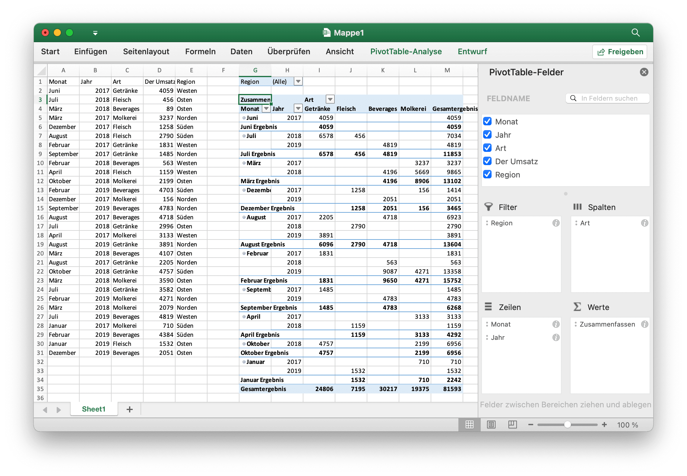

# Pivot-Tabelle {#PivotTable}

Eine Pivot-Tabelle ist eine Statistiktabelle, in der die Daten einer umfangreicheren Tabelle (z. B. aus einer Datenbank, einer Tabelle oder einem Business Intelligence-Programm) zusammengefasst sind. Diese Zusammenfassung kann Summen, Durchschnittswerte oder andere Statistiken enthalten, die in der Pivot-Tabelle auf sinnvolle Weise zusammengefasst werden.

`PivotTableOptions` ordnet die Formateinstellungen der Pivot-Tabelle direkt zu.

```go
type PivotTableOptions struct {
    DataRange           string
    PivotTableRange     string
    Name                string
    Rows                []PivotTableField
    Columns             []PivotTableField
    Data                []PivotTableField
    Filter              []PivotTableField
    RowGrandTotals      bool
    ColGrandTotals      bool
    ShowDrill           bool
    UseAutoFormatting   bool
    PageOverThenDown    bool
    MergeItem           bool
    ClassicLayout       bool
    CompactData         bool
    ShowError           bool
    ShowRowHeaders      bool
    ShowColHeaders      bool
    ShowRowStripes      bool
    ShowColStripes      bool
    ShowLastColumn      bool
    FieldPrintTitles    bool
    ItemPrintTitles     bool
    PivotTableStyleName string
    // enthält gefilterte oder nicht exportierte Felder
}
```

`PivotTableStyleName`: Die integrierten Stilnamen für Pivot-Tabellen:

```text
PivotStyleLight1 - PivotStyleLight28
PivotStyleMedium1 - PivotStyleMedium28
PivotStyleDark1 - PivotStyleDark28
```

`PivotTableField` ordnet die Feldeinstellungen der Pivot-Tabelle direkt zu.

```go
type PivotTableField struct {
    Compact         bool
    Data            string
    Name            string
    Outline         bool
    ShowAll         bool
    InsertBlankRow  bool
    Subtotal        string
    DefaultSubtotal bool
    NumFmt          int
    SelectedItems   []string
}
```

`Subtotal` gibt die Aggregationsfunktion an, die für dieses Datenfeld gilt. Der Standardwert ist `Sum`. Die möglichen Werte für dieses Attribut sind:

|Optionaler Wert|
|---|
|Average|
|Count|
|CountNums|
|Max|
|Min|
|Product|
|StdDev|
|StdDevp|
|Sum|
|Var|
|Varp|

`Name` gibt den Namen des Datenfelds an. Im Namen des Datenfelds sind maximal `255` Zeichen zulässig, überschüssige Zeichen werden abgeschnitten.

`SelectedItems` legt die standardmäßig ausgewählten Elemente in einem PivotTable-Feld fest. Die ausgewählten Elemente müssen Werte innerhalb des Zellbereichs sein, auf den dieses Feld verweist.

## Erstellen einer Pivot-Tabelle {#AddPivotTable}

```go
func (f *File) AddPivotTable(opts *PivotTableOptions) error
```

AddPivotTable bietet die Methode zum Hinzufügen einer Pivot-Tabelle anhand der angegebenen Pivot-Tabellenoptionen.

Erstellen Sie beispielsweise eine Pivot-Tabelle im Bereich `Sheet1!G4:M30` mit der Region `Sheet1!A1:E31` als Datenquelle, zusammengefasst nach Umsatzsumme:

<p align="center"></p>

```go
package main

import (
    "fmt"

    "github.com/xuri/excelize/v2"
)

func main() {
    f := excelize.NewFile()
    defer func() {
        if err := f.Close(); err != nil {
            fmt.Println(err)
        }
    }()
    if err := f.SetSheetName("Sheet1", "Tabelle1"); err != nil {
        fmt.Println(err)
        return
    }
    // Erstellen Sie einige Daten in einem Arbeitsblatt
    month := []string{"Januar", "Februar", "März", "April", "Kann",
        "Juni", "Juli", "August", "September", "Oktober", "November", "Dezember"}
    year := []int{2017, 2018, 2019}
    types := []string{"Fleisch", "Molkerei", "Beverages", "Getränke"}
    revenue := []int{3217, 4512, 3891, 4738, 3054, 4265, 3643, 4901, 3378, 4126}
    region := []string{"Osten", "Westen", "Norden", "Süden"}
    if err := f.SetSheetRow(
        "Tabelle1", "A1", &[]string{"Monat", "Jahr", "Art", "Einnahmen", "Region"},
    ); err != nil {
        fmt.Println(err)
        return
    }
    for row := 2; row < 32; row++ {
        f.SetCellValue("Tabelle1", fmt.Sprintf("A%d", row), month[(row-2)%len(month)])
        f.SetCellValue("Tabelle1", fmt.Sprintf("B%d", row), year[(row-2)%len(year)])
        f.SetCellValue("Tabelle1", fmt.Sprintf("C%d", row), types[(row-2)%len(types)])
        f.SetCellValue("Tabelle1", fmt.Sprintf("D%d", row), revenue[(row-2)%len(revenue)])
        f.SetCellValue("Tabelle1", fmt.Sprintf("E%d", row), region[(row-2)%len(region)])
    }
    if err := f.AddPivotTable(&excelize.PivotTableOptions{
        DataRange:       "Tabelle1!A1:E31",
        PivotTableRange: "Tabelle1!G4:M30",
        Rows: []excelize.PivotTableField{
            {Data: "Monat", DefaultSubtotal: true}, {Data: "Jahr"},
        },
        Filter: []excelize.PivotTableField{
            {Data: "Region"},
        },
        Columns: []excelize.PivotTableField{
            {Data: "Art", DefaultSubtotal: true},
        },
        Data: []excelize.PivotTableField{
            {Data: "Einnahmen", Name: "Zusammenfassen", Subtotal: "Sum"},
        },
        RowGrandTotals: true,
        ColGrandTotals: true,
        ShowDrill:      true,
        ShowRowHeaders: true,
        ShowColHeaders: true,
        ShowLastColumn: true,
    }); err != nil {
        fmt.Println(err)
        return
    }
    if err := f.SaveAs("Mappe1.xlsx"); err != nil {
        fmt.Println(err)
    }
}
```

## Holen Sie sich Pivot-Tabellen {#GetPivotTables}

```go
func (f *File) GetPivotTables(sheet string) ([]PivotTableOptions, error)
```

GetPivotTables gibt alle Pivot-Tabellendefinitionen in einem Arbeitsblatt nach dem angegebenen Arbeitsblattnamen zurück.

## Pivot-Tabelle entfernen {#DeletePivotTable}

```go
func (f *File) DeletePivotTable(sheet, name string) error
```

DeletePivotTable löscht eine Pivot-Tabelle durch Angabe des Arbeitsblattnamens und des Pivot-Tabellennamens. Beachten Sie, dass diese Funktion keine Zellwerte im Pivot-Tabellenbereich bereinigt.
