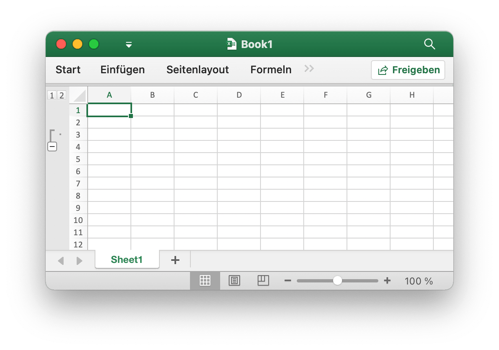
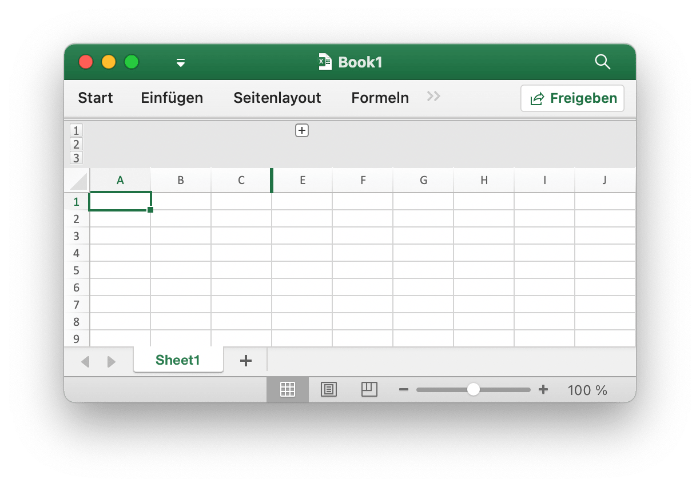

# Arbeitsblatt

## Festlegen der Spaltensichtbarkeit {#SetColVisible}

```go
func (f *File) SetColVisible(sheet, col string, visible bool) error
```

SetColVisible bietet eine Funktion zum Festlegen der Sichtbarkeit einer einzelnen Spalte anhand des angegebenen Arbeitsblattnamens und Spaltennamens. Verstecken Sie beispielsweise die Spalte `D` in `Sheet1`:

```go
err := f.SetColVisible("Sheet1", "D", false)
```

Blenden Sie die Spalten von `D` bis `F` aus (enthalten):

```go
err := f.SetColVisible("Sheet1", "D:F", false)
```

## Spaltenbreite festlegen {#SetColWidth}

```go
func (f *File) SetColWidth(sheet, startcol, endcol string, width float64) error
```

SetColWidth bietet eine Funktion zum Festlegen der Breite einer einzelnen Spalte oder mehrerer Spalten. Zum Beispiel:

```go
f := excelize.NewFile()
err := f.SetColWidth("Sheet1", "A", "H", 20)
```

## Zeilenhöhe festlegen {#SetRowHeight}

```go
func (f *File) SetRowHeight(sheet string, row int, height float64) error
```

SetRowHeight bietet eine Funktion zum Festlegen der Höhe einer einzelnen Zeile. Stellen Sie beispielsweise die Höhe der ersten Zeile in `Sheet1` ein:

```go
err := f.SetRowHeight("Sheet1", 1, 50)
```

## Festlegen der Zeilensichtbarkeit {#SetRowVisible}

```go
func (f *File) SetRowVisible(sheet string, row int, visible bool) error
```

SetRowVisible bietet eine Funktion zum Festlegen der Sichtbarkeit einer einzelnen Zeile anhand des angegebenen Arbeitsblattnamens und des Zeilenindex. Verstecken Sie beispielsweise die Zeile `2` in `Sheet1`:

```go
err := f.SetRowVisible("Sheet1", 2, false)
```

## Abrufen des Blattnamens {#GetSheetName}

```go
func (f *File) GetSheetName(index int) string
```

GetSheetName bietet eine Funktion zum Abrufen des Blattnamens der Arbeitsmappe anhand des angegebenen Blattindex. Wenn der angegebene Blattindex ungültig ist, wird eine leere Zeichenfolge zurückgegeben.

## Abrufen der Sichtbarkeit von Spalten {#GetColVisible}

```go
func (f *File) GetColVisible(sheet, column string) (bool, error)
```

GetColVisible bietet eine Funktion zum Anzeigen einer einzelnen Spalte anhand des angegebenen Arbeitsblattnamens und Spaltennamens. Holen Sie sich zum Beispiel den sichtbaren Zustand der Spalte `D` in `Sheet1`:

```go
visible, err := f.GetColVisible("Sheet1", "D")
```

## Spaltenbreite abrufen {#GetColWidth}

```go
func (f *File) GetColWidth(sheet, col string) (float64, error)
```

GetColWidth bietet eine Funktion zum Abrufen der Spaltenbreite anhand des Arbeitsblattnamens und des Spaltenindex.

## Abrufen der Zeilenhöhe {#GetRowHeight}

```go
func (f *File) GetRowHeight(sheet string, row int) (float64, error)
```

GetRowHeight bietet eine Funktion zum Abrufen der Zeilenhöhe anhand des angegebenen Arbeitsblattnamens und des Zeilenindex. Ermitteln Sie beispielsweise die Höhe der ersten Zeile in `Sheet1`:

```go
height, err := f.GetRowHeight("Sheet1", 1)
```

## Abrufen der Zeilensichtbarkeit {#GetRowVisible}

```go
func (f *File) GetRowVisible(sheet string, row int) (bool, error)
```

GetRowVisible bietet eine Funktion zum Anzeigen einer einzelnen Zeile anhand des angegebenen Arbeitsblattnamens und des Zeilenindex. Erhalten Sie beispielsweise den sichtbaren Status der Zeile `2` in `Sheet1`:

```go
err := f.GetRowVisible("Sheet1", 2)
```

## Abrufen des Blattindexes {#GetSheetIndex}

```go
func (f *File) GetSheetIndex(name string) int
```

GetSheetIndex bietet eine Funktion zum Abrufen eines Blattindex der Arbeitsmappe anhand des angegebenen Blattnamens. Wenn der angegebene Blattname ungültig ist oder das Arbeitsblatt nicht vorhanden ist, wird ein ganzzahliger Typwert `-1` zurückgegeben.

Der erhaltene Index kann als Parameter zum Aufrufen der Funktion [`SetActiveSheet()`](workbook.md#SetActiveSheet) verwendet werden, wenn das Standardarbeitsblatt der Arbeitsmappe festgelegt wird.

## Abrufen der Blattkarte {#GetSheetMap}

```go
func (f *File) GetSheetMap() map[int]string
```

GetSheetMap bietet eine Funktion zum Abrufen von Arbeitsblättern, Diagrammblättern, Dialogfeld-IDs und Namenskarten der Arbeitsmappe. Zum Beispiel:

```go
f, err := excelize.OpenFile("./Book1.xlsx")
if err != nil {
    return
}
for index, name := range f.GetSheetMap() {
    fmt.Println(index, name)
}
```

## Abrufen der Tabellenliste {#GetSheetList}

```go
func (f *File) GetSheetList() []string
```

GetSheetList bietet eine Funktion zum Abrufen der Arbeitsliste mit Arbeitsblättern, Diagrammblättern und Dialogblättern der Arbeitsmappe.

## Satzblattname festlegen {#SetSheetName}

```go
func (f *File) SetSheetName(oldName, newName string)
```

SetSheetName bietet eine Funktion zum Festlegen des Arbeitsblattnamens unter Angabe der alten und neuen Arbeitsblattnamen. Der Blatttitel darf maximal 31 Zeichen enthalten. Diese Funktion ändert nur den Namen des Blattes und aktualisiert den Blattnamen in der der Zelle zugeordneten Formel oder Referenz nicht. Möglicherweise fehlt ein Problemformelfehler oder eine Referenz.

## Festlegen von Blatteigenschaften {#SetSheetPrOptions}

```go
func (f *File) SetSheetPrOptions(name string, opts ...SheetPrOption) error
```

SetSheetPrOptions bietet eine Funktion zum Festlegen von Arbeitsblatteigenschaften.

Verfügbare Optionen:

|Optionales Attribut|Typ|
|---|---|
|CodeName|string|
|EnableFormatConditionsCalculation|bool|
|Published|bool|
|FitToPage|bool|
|TabColor|string|
|AutoPageBreaks|bool|
|OutlineSummaryBelow|bool|

Zum Beispiel:

```go
f := excelize.NewFile()
const sheet = "Sheet1"

if err := f.SetSheetPrOptions(sheet,
    excelize.CodeName("code"),
    excelize.EnableFormatConditionsCalculation(false),
    excelize.Published(false),
    excelize.FitToPage(true),
    excelize.TabColor("#FFFF00"),
    excelize.AutoPageBreaks(true),
    excelize.OutlineSummaryBelow(false),
); err != nil {
    fmt.Println(err)
}
```

## Abrufen von Blatteigenschaften {#GetSheetPrOptions}

```go
func (f *File) GetSheetPrOptions(name string, opts ...SheetPrOptionPtr) error
```

GetSheetPrOptions bietet eine Funktion zum Abrufen von Arbeitsblatteigenschaften.

|Optionales Attribut|Typ|
|---|---|
|CodeName|string|
|EnableFormatConditionsCalculation|bool|
|Published|bool|
|FitToPage|bool|
|TabColor|string|
|AutoPageBreaks|bool|
|OutlineSummaryBelow|bool|

Zum Beispiel:

```go
f := excelize.NewFile()
const sheet = "Sheet1"

var (
    codeName                          excelize.CodeName
    enableFormatConditionsCalculation excelize.EnableFormatConditionsCalculation
    published                         excelize.Published
    fitToPage                         excelize.FitToPage
    tabColor                          excelize.TabColor
    autoPageBreaks                    excelize.AutoPageBreaks
    outlineSummaryBelow               excelize.OutlineSummaryBelow
)

if err := f.GetSheetPrOptions(sheet,
    &codeName,
    &enableFormatConditionsCalculation,
    &published,
    &fitToPage,
    &tabColor,
    &autoPageBreaks,
    &outlineSummaryBelow,
); err != nil {
    fmt.Println(err)
}
fmt.Println("Defaults:")
fmt.Printf("- codeName: %q\n", codeName)
fmt.Println("- enableFormatConditionsCalculation:", enableFormatConditionsCalculation)
fmt.Println("- published:", published)
fmt.Println("- fitToPage:", fitToPage)
fmt.Printf("- tabColor: %q\n", tabColor)
fmt.Println("- autoPageBreaks:", autoPageBreaks)
fmt.Println("- outlineSummaryBelow:", outlineSummaryBelow)
```

Holen Sie sich die Ausgabe:

```text
Defaults:
- codeName: ""
- enableFormatConditionsCalculation: true
- published: true
- fitToPage: false
- tabColor: ""
- autoPageBreaks: false
- outlineSummaryBelow: true
```

## Spalte einfügen {#InsertCol}

```go
func (f *File) InsertCol(sheet, column string) error
```

InsertCol bietet eine Funktion zum Einfügen einer neuen Spalte vor dem angegebenen Spaltenindex. Erstellen Sie beispielsweise eine neue Spalte vor der Spalte `C` in `Sheet1`:

```go
err := f.InsertCol("Sheet1", "C")
```

## Zeile einfügen {#InsertRow}

```go
func (f *File) InsertRow(sheet string, row int) error
```

InsertRow bietet eine Funktion zum Einfügen einer neuen Zeile nach der angegebenen Excel-Zeilennummer ab 1. Erstellen Sie beispielsweise eine neue Zeile vor der Zeile `3` in `Sheet1`:

```go
err := f.InsertRow("Sheet1", 3)
```

## Doppelte Zeile anfügen {#DuplicateRow}

```go
func (f *File) DuplicateRow(sheet string, row int) error
```

DuplicateRow fügt eine Kopie einer bestimmten Zeile unter der unten angegebenen ein, Zum Beispiel:

```go
err := f.DuplicateRow("Sheet1", 2)
```

Verwenden Sie diese Methode mit Vorsicht, da sich dies auf Änderungen in Referenzen wie Formeln, Diagrammen usw. auswirkt. Wenn das Arbeitsblatt einen referenzierten Wert enthält, verursacht es beim Öffnen einen Dateifehler. Die Excelize aktualisiert diese Referenzen derzeit nur teilweise.

## Doppelte Zeile {#DuplicateRowTo}

```go
func (f *File) DuplicateRowTo(sheet string, row, row2 int) error
```

DuplicateRowTo fügt eine Kopie der angegebenen Zeile durch die Excel-Nummer in die angegebene Zeilenposition ein und verschiebt vorhandene Zeilen nach der Zielposition. Zum Beispiel:

```go
err := f.DuplicateRowTo("Sheet1", 2, 7)
```

Verwenden Sie diese Methode mit Vorsicht, da sich dies auf Änderungen in Referenzen wie Formeln, Diagrammen usw. auswirkt. Wenn das Arbeitsblatt einen referenzierten Wert enthält, verursacht es beim Öffnen einen Dateifehler. Die Excelize aktualisiert diese Referenzen derzeit nur teilweise.

## Erstellen einer Zeilenumrisslinie {#SetRowOutlineLevel}

```go
func (f *File) SetRowOutlineLevel(sheet string, row int, level uint8) error
```

SetRowOutlineLevel bietet eine Funktion zum Festlegen der Gliederungsebenennummer einer einzelnen Zeile anhand des angegebenen Arbeitsblattnamens und der Excel-Zeilennummer. Umreißen Sie beispielsweise Zeile 2 in `Sheet1` auf Ebene 1:

<p align="center"></p>

```go
err := f.SetRowOutlineLevel("Sheet1", 2, 1)
```

## Spaltenumriss erstellen {#SetColOutlineLevel}

```go
func (f *File) SetColOutlineLevel(sheet, col string, level uint8) error
```

SetColOutlineLevel bietet eine Funktion zum Festlegen der Gliederungsebene einer einzelnen Spalte anhand des angegebenen Arbeitsblattnamens und Spaltennamens. Setzen Sie beispielsweise die Gliederungsstufe der Spalte `D` in `Sheet1` auf 2:

<p align="center"></p>

```go
err := f.SetColOutlineLevel("Sheet1", "D", 2)
```

## Zeilenumriss abrufen {#GetRowOutlineLevel}

```go
func (f *File) GetRowOutlineLevel(sheet string, row int) (uint8, error)
```

GetRowOutlineLevel bietet eine Funktion zum Abrufen der Gliederungsebenennummer einer einzelnen Zeile anhand des angegebenen Arbeitsblattnamens und der Excel-Zeilennummer. Erhalten Sie beispielsweise die Umrissnummer von Zeile 2 in `Sheet1`:

```go
err := f.GetRowOutlineLevel("Sheet1", 2)
```

## Abrufen der Spaltenumrisslinie {#GetColOutlineLevel}

```go
func (f *File) GetColOutlineLevel(sheet, col string) (uint8, error)
```

GetColOutlineLevel bietet eine Funktion zum Abrufen der Gliederungsebene einer einzelnen Spalte anhand des angegebenen Arbeitsblattnamens und Spaltennamens. Holen Sie sich zum Beispiel die Gliederungsebene der Spalte `D` in `Sheet1`:

```go
level, err := f.GetColOutlineLevel("Sheet1", "D")
```

## Spalteniterator {#Cols}

```go
func (f *File) Cols(sheet string) (*Cols, error)
```

Cols gibt einen Spalteniterator zurück, der zum Streaming von Lesedaten für ein Arbeitsblatt mit großen Datenmengen verwendet wird. Zum Beispiel:

```go
cols, err := f.Cols("Sheet1")
if err != nil {
    fmt.Println(err)
    return
}
for cols.Next() {
    col, err := cols.Rows()
    if err != nil {
        fmt.Println(err)
    }
    for _, rowCell := range col {
        fmt.Print(rowCell, "\t")
    }
    fmt.Println()
}
```

### Spalteniterator - Säulen

```go
func (cols *Cols) Rows(opts ...Options) ([]string, error)
```

Rows gibt die aktuellen Spaltenzeilenwerte zurück.

### Spalteniterator - Durchqueren

```go
func (cols *Cols) Next() bool
```

Next gibt `true` zurück, wenn die nächste Spalte gefunden wird.

### Spalteniterator - Fehlerbehandlung

```go
func (cols *Cols) Error() error
```

Error gibt den `error` zurück, wenn der Fehler auftritt.

## Ruderiterator {#Rows}

```go
func (f *File) Rows(sheet string) (*Rows, error)
```

Rows gibt einen Zeileniterator zurück, der zum Streaming von Lesedaten für ein Arbeitsblatt mit großen Datenmengen verwendet wird. Zum Beispiel:

```go
rows, err := f.Rows("Sheet1")
if err != nil {
    fmt.Println(err)
    return
}
for rows.Next() {
    row, err := rows.Columns()
    if err != nil {
        fmt.Println(err)
    }
    for _, colCell := range row {
        fmt.Print(colCell, "\t")
    }
    fmt.Println()
}
```

### Ruderiterator - Säulen

```go
func (rows *Rows) Columns(opts ...Options) ([]string, error)
```

Spalten geben die Spaltenwerte der aktuellen Zeile zurück.

### Ruderiterator - Durchqueren

```go
func (rows *Rows) Next() bool
```

Next gibt `true` zurück, wenn das nächste Zeilenelement gefunden wird.

### Ruderiterator - Fehlerbehandlung

```go
func (rows *Rows) Error() error
```

Error gibt den `error` zurück, wenn der Fehler auftritt.

## Suchblatt {#SearchSheet}

```go
func (f *File) SearchSheet(sheet, value string, reg ...bool) ([]string, error)
```

SearchSheet bietet eine Funktion zum Abrufen von Koordinaten anhand des angegebenen Arbeitsblattnamens, des Zellenwerts und des regulären Ausdrucks. Die Funktion unterstützt derzeit keine Suche nach dem berechneten Ergebnis, den formatierten Zahlen und der bedingten Suche. Wenn es sich um eine zusammengeführte Zelle handelt, werden die Koordinaten der oberen linken Ecke des zusammengeführten Bereichs zurückgegeben.

For example, search the coordinates of the value of `100` on `Sheet1`:

```go
result, err := f.SearchSheet("Sheet1", "100")
```

Suchen Sie beispielsweise die Koordinaten, in denen der numerische Wert im Bereich von `0-9` von `Sheet1` beschrieben wird:

```go
result, err := f.SearchSheet("Sheet1", "[0-9]", true)
```

## Arbeitsblatt schützen {#ProtectSheet}

```go
func (f *File) ProtectSheet(sheet string, settings *FormatSheetProtection) error
```

ProtectSheet bietet eine Funktion, die verhindert, dass andere Benutzer versehentlich oder absichtlich Daten in einem Arbeitsblatt ändern, verschieben oder löschen. Schützen Sie beispielsweise `Sheet1` mit Schutzeinstellungen:

<p align="center"></p>

```go
err := f.ProtectSheet("Sheet1", &excelize.FormatSheetProtection{
    Password:      "password",
    EditScenarios: false,
})
```

## Ungeschützt Arbeitsblatt {#UnprotectSheet}

```go
func (f *File) UnprotectSheet(sheet string) error
```

UnprotectSheet bietet eine Funktion zum Aufheben des Schutzes eines Excel-Arbeitsblatts.

## Spalte entfernen {#RemoveCol}

```go
func (f *File) RemoveCol(sheet, col string) error
```

RemoveCol bietet eine Funktion zum Entfernen einer einzelnen Spalte unter Angabe des Arbeitsblattnamens und des Spaltenindex. Entfernen Sie beispielsweise die Spalte `C` in `Sheet1`:

```go
err := f.RemoveCol("Sheet1", "C")
```

Verwenden Sie diese Methode mit Vorsicht, da sich dies auf Änderungen in Referenzen wie Formeln, Diagrammen usw. auswirkt. Wenn das Arbeitsblatt einen referenzierten Wert enthält, verursacht es beim Öffnen einen Dateifehler. Die Excelize aktualisiert diese Referenzen derzeit nur teilweise.

## Zeile entfernen {#RemoveRow}

```go
func (f *File) RemoveRow(sheet string, row int) error
```

RemoveRow bietet eine Funktion zum Entfernen einer einzelnen Zeile anhand des angegebenen Arbeitsblattnamens und der Excel-Zeilennummer. Entfernen Sie beispielsweise die Zeile `3` in `Sheet1`:

```go
err := f.RemoveRow("Sheet1", 3)
```

Verwenden Sie diese Methode mit Vorsicht, da sich dies auf Änderungen in Referenzen wie Formeln, Diagrammen usw. auswirkt. Wenn das Arbeitsblatt einen referenzierten Wert enthält, verursacht es beim Öffnen einen Dateifehler. Die Excelize aktualisiert diese Referenzen derzeit nur teilweise.

## Festlegen von Zeilenwerten {#SetSheetRow}

```go
func (f *File) SetSheetRow(sheet, axis string, slice interface{}) error
```

SetSheetRow schreibt ein Array in eine Zeile mit dem angegebenen Arbeitsblattnamen, der Startkoordinate und einem Zeiger auf den Array-Typ `slice`. Schreibt beispielsweise ein Array in die Zeile `6`, beginnend mit der Zelle `B6` auf `Sheet1`:

```go
err := f.SetSheetRow("Sheet1", "B6", &[]interface{}{"1", nil, 2})
```

## Seitenumbruch einfügen {#InsertPageBreak}

```go
func (f *File) InsertPageBreak(sheet, cell string) (err error)
```

InsertPageBreak erstellt einen Seitenumbruch, um zu bestimmen, wo die gedruckte Seite endet und wo die nächste beginnt, indem der Name und die Achse des Arbeitsblatts angegeben werden, sodass der Inhalt vor dem Seitenumbruch auf einer Seite und nach dem Seitenumbruch auf einer anderen Seite gedruckt wird.

## Entfernen des Seitenumbruchs {#RemovePageBreak}

```go
func (f *File) RemovePageBreak(sheet, cell string) (err error)
```

RemovePageBreak entfernt einen Seitenumbruch anhand des angegebenen Arbeitsblattnamens und der angegebenen Achse.
