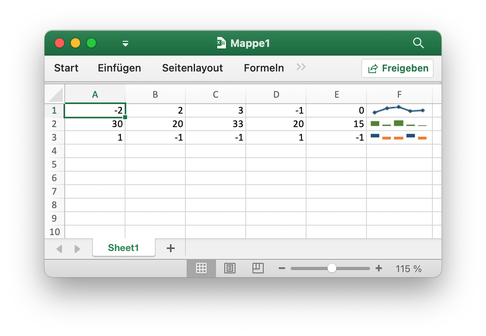
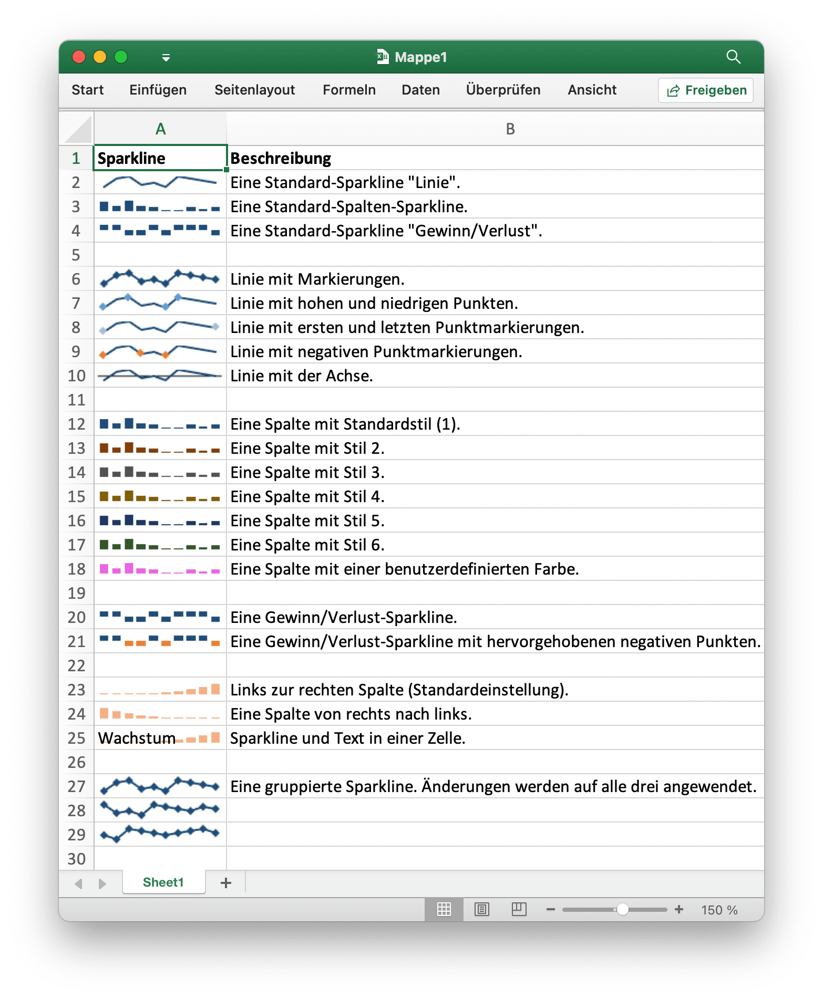

# Sparklines

Sparklines sind eine Funktion von Excel 2010+, mit der Sie Arbeitsblattzellen kleine Diagramme hinzufügen können. Diese sind nützlich, um visuelle Trends in Daten in einem kompakten Format anzuzeigen.

<p align="center"></p>

[Sparklines](https://en.wikipedia.org/wiki/Sparklines) wurde von [Edward Tufte](https://en.wikipedia.org/wiki/Edward_Tufte).

## Sparkline hinzufügen

```go
func (f *File) AddSparkline(sheet string, opts *SparklineOptions) error
```

AddSparkline bietet eine Funktion zum Hinzufügen von Sparklines zum Arbeitsblatt durch vorgegebene Formatierungsoptionen. Sparklines sind kleine Diagramme, die in eine einzelne Zelle passen und zum Anzeigen von Datentrends verwendet werden. Sparklines sind eine Funktion von Excel 2010 und höher. Sie können sie in eine Tabellenkalkulationsdatei schreiben, die von Excel 2007 gelesen werden kann, aber nicht angezeigt wird. Fügen Sie beispielsweise eine gruppierte Sparkline hinzu. Änderungen werden auf alle drei angewendet:

```go
err := f.AddSparkline("Sheet1", &excelize.SparklineOptions{
    Location: []string{"A1", "A2", "A3"},
    Range:    []string{"Sheet2!A1:J1", "Sheet2!A2:J2", "Sheet2!A3:J3"},
    Markers:  true,
})
```

<p align="center"></p>

Im Folgenden werden die Formatierungsoptionen der von Excelize unterstützten Sparkline dargestellt:

Parameter | Beschreibung
---|---
Location  | Erforderlich, muss dieselbe Nummer mit dem Parameter `Range` haben
Range     | Erforderlich, muss dieselbe Nummer mit dem Parameter `Location` haben
Type      | Aufzählungswert: `line`, `column`, `win_loss`
Style     | Wertebereich: 0 - 35
Hight     | Schalten Sie die Höhepunkte der Sparkline um
Low       | Schalten Sie die Tiefpunkte der Sparkline um
First     | Schalten Sie die ersten Punkte der Sparkline um
Last      | Schalten Sie die letzten Punkte der Sparkline um
Negative  | Negative Punkte der Sparkline umschalten
Markers   | Sparkline-Markierungen umschalten
ColorAxis | Eine RGB-Farbe wird als `RRGGBB` angegeben
Axis      | Sparkline-Achse anzeigen
