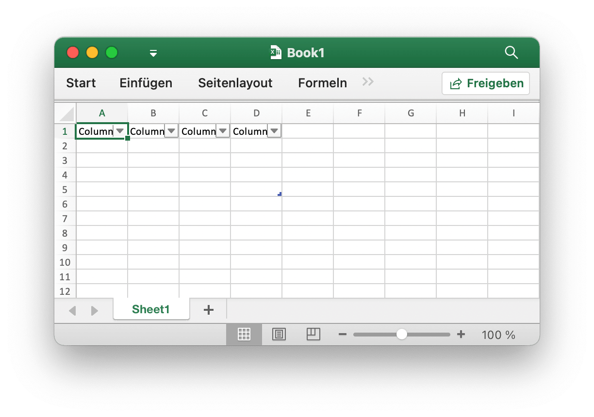
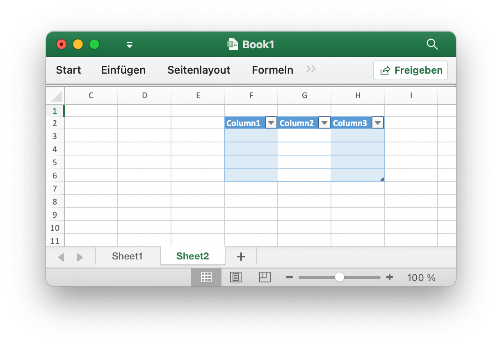
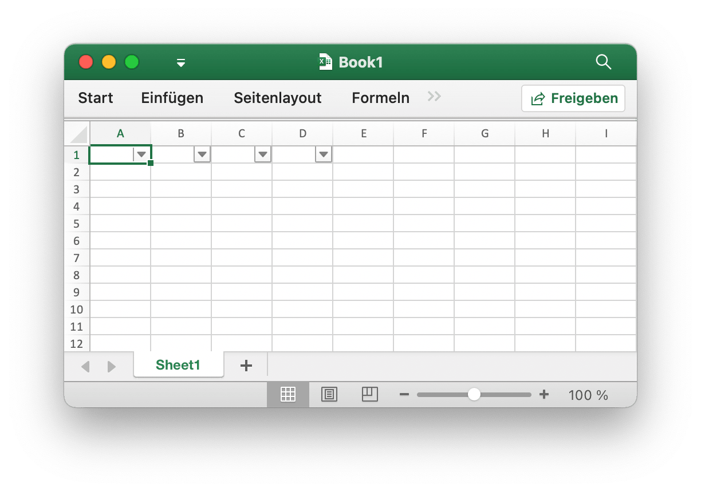
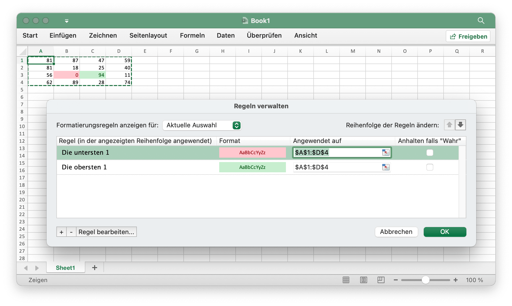
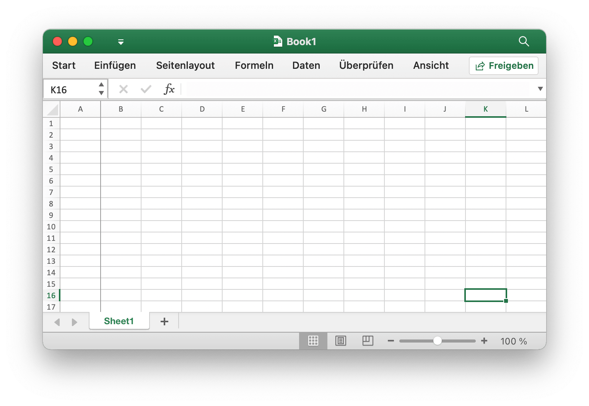
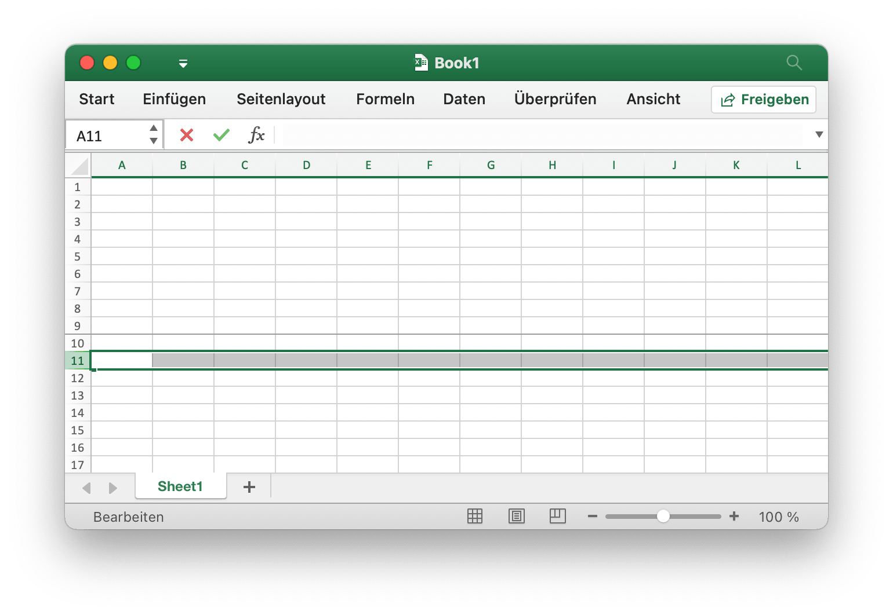
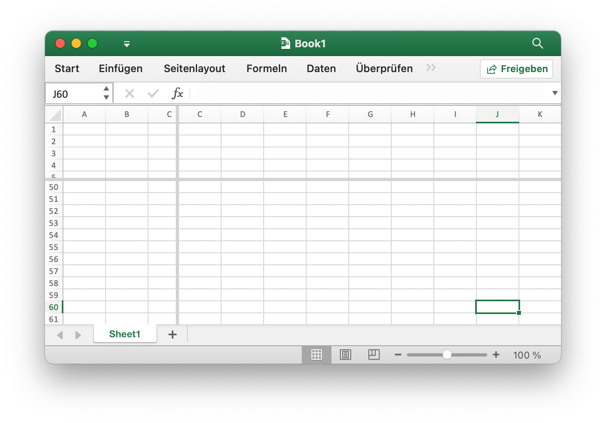

# Dienstprogramme

ZipWriter definiert eine Schnittstelle zum Schreiben von Dateien in ein ZIP-Archiv. Es bietet Methoden zum Erstellen neuer Dateien im Archiv, zum Hinzufügen von Dateien aus einem Dateisystem und zum Schließen des Archivs nach Abschluss des Schreibvorgangs.

```go
type ZipWriter interface {
    Create(name string) (io.Writer, error)
    AddFS(fsys fs.FS) error
    Close() error
}
```

## Tabelle hinzufügen {#AddTable}

```go
func (f *File) AddTable(sheet string, table *Table) error
```

AddTable bietet die Methode zum Hinzufügen einer Tabelle zu einem Arbeitsblatt anhand des angegebenen Arbeitsblattnamens, des Koordinatenbereichs und des Formatsatzes.

- Beispiel 1: Erstellen Sie eine Tabelle mit `A1:D5` auf `Sheet1`:

<p align="center"></p>

```go
err := f.AddTable("Sheet1", &excelize.Table{Range: "A1:D5"})
```

- Beispiel 2: Erstellen Sie eine Tabelle mit `F2:H6` auf `Sheet2` mit dem folgenden Format:

<p align="center"></p>

```go
disable := false
err := f.AddTable("Sheet2", &excelize.Table{
    Range:             "F2:H6",
    Name:              "table",
    StyleName:         "TableStyleMedium2",
    ShowFirstColumn:   true,
    ShowLastColumn:    true,
    ShowRowStripes:    &disable,
    ShowColumnStripes: true,
})
```

Beachten Sie, dass die Tabelle mindestens zwei Zeilen einschließlich der Kopfzeile enthalten muss. Die Header-Zellen müssen Zeichenfolgen enthalten und eindeutig sein und die Header-Zeilendaten der Tabelle festlegen, bevor die AddTable-Funktion aufgerufen wird. Mehrere Tabellen koordinieren Bereiche, die keinen Schnittpunkt haben können.

`Name`: Der Name der Tabelle im selben Arbeitsblattnamen der Tabelle sollte eindeutig sein.

`StyleName`: Die Namen der integrierten Tabellenstile:

```text
TableStyleLight1 - TableStyleLight21
TableStyleMedium1 - TableStyleMedium28
TableStyleDark1 - TableStyleDark11
```

Index|Stil|Index|Stil|Index|Stil
---|---|---|---|---|---
||TableStyleLight1||TableStyleLight2|
TableStyleLight3||TableStyleLight4||TableStyleLight5|
TableStyleLight6||TableStyleLight7||TableStyleLight8|
TableStyleLight9||TableStyleLight10||TableStyleLight11|
TableStyleLight12||TableStyleLight13||TableStyleLight14|
TableStyleLight15||TableStyleLight16||TableStyleLight17|
TableStyleLight18||TableStyleLight19||TableStyleLight20|
TableStyleLight21||TableStyleMedium1||TableStyleMedium2|
TableStyleMedium3||TableStyleMedium4||TableStyleMedium5|
TableStyleMedium6||TableStyleMedium7||TableStyleMedium8|
TableStyleMedium9||TableStyleMedium10||TableStyleMedium11|
TableStyleMedium12||TableStyleMedium13||TableStyleMedium14|
TableStyleMedium15||TableStyleMedium16||TableStyleMedium17|
TableStyleMedium18||TableStyleMedium19||TableStyleMedium20|
TableStyleMedium21||TableStyleMedium22||TableStyleMedium23|
TableStyleMedium24||TableStyleMedium25||TableStyleMedium26|
TableStyleMedium27||TableStyleMedium28||TableStyleDark1|
TableStyleDark2||TableStyleDark3||TableStyleDark4|
TableStyleDark5||TableStyleDark6||TableStyleDark7|
TableStyleDark8||TableStyleDark9||TableStyleDark10|
TableStyleDark11|||||

## Holen Sie sich Tische {#GetTables}

```go
func (f *File) GetTables(sheet string) ([]Table, error)
```

GetTables bietet die Methode zum Abrufen aller Tabellen in einem Arbeitsblatt anhand des angegebenen Arbeitsblattnamens.

## Tabelle löschen {#DeleteTable}

```go
func (f *File) DeleteTable(name string) error
```

DeleteTable bietet die Methode zum Löschen einer Tabelle anhand des angegebenen Tabellennamens.

## Automatischer Filter {#AutoFilter}

```go
func (f *File) AutoFilter(sheet, rangeRef string, opts []AutoFilterOptions) error
```

AutoFilter bietet die Methode zum Hinzufügen eines automatischen Filters in einem Arbeitsblatt anhand des angegebenen Arbeitsblattnamens, des Koordinatenbereichs und der Einstellungen. Ein automatischer Filter in Excel ist eine Möglichkeit, einen 2D-Datenbereich anhand einiger einfacher Kriterien zu filtern.

Beispiel 1: Anwenden eines automatischen Filters auf einen Zellbereich `A1:D4` in `Sheet1`:

<p align="center"></p>

```go
err := f.AutoFilter("Sheet1", "A1:D4", []excelize.AutoFilterOptions{})
```

Beispiel 2: Filtern von Daten in einem automatischen Filter:

```go
err := f.AutoFilter("Sheet1", "A1:D4", []excelize.AutoFilterOptions{
    {Column: "B", Expression: "x != blanks"},
})
```

`Column` definiert die Filterspalten in einem automatischen Filterbereich anhand einfacher Kriterien.

Es reicht nicht aus, nur die Filterbedingung anzugeben. Sie müssen auch alle Zeilen ausblenden, die nicht der Filterbedingung entsprechen. Zeilen werden mit der Methode [`SetRowVisible()`](sheet.md#SetRowVisible) ausgeblendet. Excelize kann Zeilen nicht automatisch filtern, da dies nicht Teil des Dateiformats ist.

Festlegen von Filterkriterien für eine Spalte:

`Expression` definiert die Bedingungen, die folgenden Operatoren stehen zum Festlegen der Filterkriterien zur Verfügung:

```text
==
!=
>
<
>=
<=
and
or
```

Ein Ausdruck kann eine einzelne Anweisung oder zwei Anweisungen umfassen, die durch die Operatoren `and` und `or` getrennt sind. Zum Beispiel:

```text
x <  2000
x >  2000
x == 2000
x >  2000 and x <  5000
x == 2000 or  x == 5000
```

Das Filtern von leeren oder nicht leeren Daten kann erreicht werden, indem ein Wert von Leer oder Nicht leer im Ausdruck verwendet wird:

```text
x == Blanks
x == NonBlanks
```

Office Excel ermöglicht auch einige einfache Zeichenfolgenabgleichsvorgänge:

```text
x == b*      // beginnt mit b
x != b*      // beginnt nicht mit b
x == *b      // endet mit b
x != *b      // endet nicht mit b
x == *b*     // enthält b
x != *b*     // enthält nicht b
```

Sie können auch `*` verwenden, um mit einem beliebigen Zeichen oder einer beliebigen Zahl übereinzustimmen, und `?`, Um mit einem einzelnen Zeichen oder einer einzelnen Zahl übereinzustimmen. Kein anderer Quantifizierer für reguläre Ausdrücke wird von den Excel-Filtern unterstützt. Die regulären Ausdruckszeichen von Excel können mit `~` maskiert werden.

Die Platzhaltervariable `x` in den obigen Beispielen kann durch eine einfache Zeichenfolge ersetzt werden. Der tatsächliche Platzhaltername wird intern ignoriert, sodass alle folgenden Elemente gleichwertig sind:

```text
x     < 2000
col   < 2000
Price < 2000
```

## Verknüpften Wert aktualisieren {#UpdateLinkedValue}

```go
func (f *File) UpdateLinkedValue() error
```

UpdateLinkedValue fix verknüpfte Werte in einer Tabelle werden in Office Excel 2007 und 2010 nicht aktualisiert. Diese Funktion entfernt das Wertetag, wenn eine Zelle einen verknüpften Wert hat. Referenz [https://learn.microsoft.com/en-us/archive/msdn-technet-forums/e16bae1f-6a2c-4325-8013-e989a3479066](https://learn.microsoft.com/en-us/archive/msdn-technet-forums/e16bae1f-6a2c-4325-8013-e989a3479066). Hinweis: Nach dem Öffnen der Tabellenkalkulationsdatei aktualisiert Excel den verknüpften Wert, generiert einen neuen Wert und fordert zum Speichern der Datei auf oder nicht.

Der Effekt des Löschens des Zellencaches in der Arbeitsmappe wird als Änderung des Tags `<v>` angezeigt, z. B. des Zellencaches vor dem Löschen:

```xml
<row r="19">
    <c r="B19">
        <f>SUM(Sheet2!D2,Sheet2!D11)</f>
        <v>100</v>
     </c>
</row>
```

Nach dem Löschen des Zellencaches:

```xml
<row r="19">
    <c r="B19">
        <f>SUM(Sheet2!D2,Sheet2!D11)</f>
    </c>
</row>
```

## Geteilter Zellname {#SplitCellName}

```go
func SplitCellName(cell string) (string, int, error)
```

SplitCellName teilt den Zellennamen in den Spaltennamen und die Zeilennummer auf. Zum Beispiel:

```go
excelize.SplitCellName("AK74") // rückkehr "AK", 74, nil
```

## Join-Zellenname {#JoinCellName}

```go
func JoinCellName(col string, row int) (string, error)
```

JoinCellName verbindet den Zellennamen aus dem Spaltennamen und der Zeilennummer.

## Spaltenname zu Nummer {#ColumnNameToNumber}

```go
func ColumnNameToNumber(name string) (int, error)
```

ColumnNameToNumber bietet eine Funktion zum Konvertieren des Spaltennamens einer Excel-Tabelle in `int`. Spaltenname ohne Berücksichtigung der Groß- und Kleinschreibung. Die Funktion gibt einen Fehler zurück, wenn der Spaltenname falsch ist. Zum Beispiel:

```go
excelize.ColumnNameToNumber("AK") // rückkehr 37, nil
```

## Die zu benennende Spaltennummer {#ColumnNumberToName}

```go
func ColumnNumberToName(num int) (string, error)
```

ColumnNumberToName bietet eine Funktion zum Konvertieren der Ganzzahl in den Spaltentitel des Excel-Arbeitsblatts. Zum Beispiel:

```go
excelize.ColumnNumberToName(37) // rückkehr "AK", nil
```

## Zellenname zu Koordinaten {#CellNameToCoordinates}

```go
func CellNameToCoordinates(cell string) (int, int, error)
```

CellNameToCoordinates konvertiert den alphanumerischen Zellennamen in `[X, Y]` Koordinaten oder gibt einen Fehler zurück. Zum Beispiel:

```go
excelize.CellNameToCoordinates("A1") // rückkehr 1, 1, nil
excelize.CellNameToCoordinates("Z3") // rückkehr 26, 3, nil
```

## Koordinaten zum Zellnamen {#CoordinatesToCellName}

```go
func CoordinatesToCellName(col, row int, abs ...bool) (string, error)
```

CoordinatesToCellName konvertiert `[X, Y]` Koordinaten in alphanumerische Zellennamen oder gibt einen Fehler zurück. Zum Beispiel:

```go
excelize.CoordinatesToCellName(1, 1) // rückkehr "A1", nil
excelize.CoordinatesToCellName(1, 1, true) // rückkehr "$A$1", nil
```

## Erstellen Sie einen bedingten Stil {#NewConditionalStyle}

```go
func (f *File) NewConditionalStyle(style *Style) (int, error)
```

NewConditionalStyle bietet eine Funktion zum Erstellen eines Stils für das bedingte Format anhand des angegebenen Stilformats. Die Parameter sind die gleichen wie bei der Funktion [`NewStyle`](style.md#NewStyle). Beachten Sie, dass das Farbfeld RGB-Farbcode verwendet und nur das Festlegen von Schriftart, Füllungen, Ausrichtung und Rahmen unterstützt.

## Holen Sie sich den bedingten Stil {#GetConditionalStyle}

```go
func (f *File) GetConditionalStyle(idx int) (*Style, error)
```

GetConditionalStyle gibt die Definition des bedingten Formatstils anhand des angegebenen Stilindex zurück.

## Bedingtes Format festlegen {#SetConditionalFormat}

```go
func (f *File) SetConditionalFormat(sheet, rangeRef string, opts []ConditionalFormatOptions) error
```

SetConditionalFormat bietet eine Funktion zum Erstellen einer bedingten Formatierungsregel für den Zellenwert. Die bedingte Formatierung ist eine Funktion von Office Excel, mit der Sie ein Format auf eine Zelle oder einen Zellbereich basierend auf bestimmten Kriterien anwenden können.

Die Option `Type` ist ein erforderlicher Parameter und hat keinen Standardwert. Zulässige Typwerte und die zugehörigen Parameter sind:

<table>
    <thead>
        <tr>
            <th>Typ</th>
            <th>Parameters</th>
        </tr>
    </thead>
    <tbody>
        <tr>
            <td rowspan=4>cell</td>
            <td>Criteria</td>
        </tr>
        <tr>
            <td>Value</td>
        </tr>
        <tr>
            <td>MinValue</td>
        </tr>
        <tr>
            <td>MaxValue</td>
        </tr>
        <tr>
            <td>time_period</td>
            <td>Criteria</td>
        </tr>
        <tr>
            <td rowspan=2>text</td>
            <td>Criteria</td>
        </tr>
        <tr>
            <td>Value</td>
        </tr>
        <tr>
            <td>average</td>
            <td>Criteria</td>
        </tr>
        <tr>
            <td>duplicate</td>
            <td>(none)</td>
        </tr>
        <tr>
            <td>unique</td>
            <td>(none)</td>
        </tr>
        <tr>
            <td rowspan=2>top</td>
            <td>Criteria</td>
        </tr>
        <tr>
            <td>Value</td>
        </tr>
        <tr>
            <td rowspan=2>bottom</td>
            <td>Criteria</td>
        </tr>
        <tr>
            <td>Value</td>
        </tr>
        <tr>
            <td>blanks</td>
            <td>(none)</td>
        </tr>
        <tr>
            <td>no_blanks</td>
            <td>(none)</td>
        </tr>
        <tr>
            <td>errors</td>
            <td>(none)</td>
        </tr>
        <tr>
            <td>no_errors</td>
            <td>(none)</td>
        </tr>
        <tr>
            <td rowspan=6>2_color_scale</td>
            <td>MinType</td>
        </tr>
        <tr>
            <td>MaxType</td>
        </tr>
        <tr>
            <td>MinValue</td>
        </tr>
        <tr>
            <td>MaxValue</td>
        </tr>
        <tr>
            <td>MinColor</td>
        </tr>
        <tr>
            <td>MaxColor</td>
        </tr>
        <tr>
            <td rowspan=9>3_color_scale</td>
            <td>MinType</td>
        </tr>
        <tr>
            <td>MidType</td>
        </tr>
        <tr>
            <td>MaxType</td>
        </tr>
        <tr>
            <td>MinValue</td>
        </tr>
        <tr>
            <td>MidValue</td>
        </tr>
        <tr>
            <td>MaxValue</td>
        </tr>
        <tr>
            <td>MinColor</td>
        </tr>
        <tr>
            <td>MidColor</td>
        </tr>
        <tr>
            <td>MaxColor</td>
        </tr>
        <tr>
            <td rowspan=9>data_bar</td>
            <td>MinType</td>
        </tr>
        <tr>
            <td>MaxType</td>
        </tr>
        <tr>
            <td>MinValue</td>
        </tr>
        <tr>
            <td>MaxValue</td>
        </tr>
        <tr>
            <td>BarBorderColor</td>
        </tr>
        <tr>
            <td>BarColor</td>
        </tr>
        <tr>
            <td>BarDirection</td>
        </tr>
        <tr>
            <td>BarOnly</td>
        </tr>
        <tr>
            <td>BarSolid</td>
        </tr>
        <tr>
            <td rowspan=3>iconSet</td>
            <td>IconStyle</td>
        </tr>
        <tr>
            <td>ReverseIcons</td>
        </tr>
        <tr>
            <td>IconsOnly</td>
        </tr>
        <tr>
            <td>formula</td>
            <td>Criteria</td>
        </tr>
    </tbody>
</table>

Der Parameter `Criteria` wird verwendet, um die Kriterien festzulegen, nach denen die Zellendaten ausgewertet werden. Es hat keinen Standardwert. Die häufigsten Kriterien für `excelize.ConditionalFormatOptions{Type: "cell"}` sind:

Textbeschreibung Charakter|Symbolische Darstellung
---|---
between|
not between|
equal to|==
not equal to|!=
greater than|>
less than|<
greater than or equal to|>=
less than or equal to|<=

Sie können entweder die Textbeschreibungszeichenfolgen von Excel in der ersten Spalte oben oder die gängigsten symbolischen Alternativen verwenden.

Zusätzliche Kriterien, die für andere bedingte Formattypen spezifisch sind, werden in den entsprechenden Abschnitten unten gezeigt.

`Value`: Der Wert wird im Allgemeinen zusammen mit dem Parameter `Criteria` verwendet, um die Regel festzulegen, nach der die Zellendaten ausgewertet werden:

```go
err := f.SetConditionalFormat("Sheet1", "D1:D10",
    []excelize.ConditionalFormatOptions{
        {
            Type:     "cell",
            Criteria: ">",
            Format:   &format,
            Value:    "6",
        },
    },
)
```

Die Eigenschaft `Value` kann auch eine Zellreferenz sein:

```go
err := f.SetConditionalFormat("Sheet1", "D1:D10",
    []excelize.ConditionalFormatOptions{
        {
            Type:     "cell",
            Criteria: ">",
            Format:   &format,
            Value:    "$C$1",
        },
    },
)
```

type: `Format` - Der Parameter `Format` wird verwendet, um das Format anzugeben, das auf die Zelle angewendet wird, wenn das Kriterium der bedingten Formatierung erfüllt ist. Das Format wird mit der Methode [`NewConditionalStyle()`](utils.md#NewConditionalStyle) auf dieselbe Weise wie die Zellenformate erstellt:

```go
format, err := f.NewConditionalStyle(
    &excelize.Style{
        Font: &excelize.Font{Color: "9A0511"},
        Fill: excelize.Fill{
            Type: "pattern", Color: []string{"FEC7CE"}, Pattern: 1,
        },
    },
)
if err != nil {
    fmt.Println(err)
}
err = f.SetConditionalFormat("Sheet1", "D1:D10",
    []excelize.ConditionalFormatOptions{
        {Type: "cell", Criteria: ">", Format: &format, Value: "6"},
    },
)
```

Hinweis: In Excel wird ein bedingtes Format über das vorhandene Zellenformat gelegt, und nicht alle Eigenschaften des Zellenformats können geändert werden. Eigenschaften, die in einem bedingten Format nicht geändert werden können, sind Schriftname, Schriftgröße, hochgestellt und tiefgestellt, diagonale Ränder, alle Ausrichtungseigenschaften und alle Schutzeigenschaften.

Excel gibt einige Standardformate an, die bei der bedingten Formatierung verwendet werden sollen. Diese können mit den folgenden Excel-Formaten repliziert werden:

```go
// Rosenformat für schlechte Bedingungen.
format1, err := f.NewConditionalStyle(
    &excelize.Style{
        Font: &excelize.Font{Color: "9A0511"},
        Fill: excelize.Fill{
            Type: "pattern", Color: []string{"FEC7CE"}, Pattern: 1,
        },
    },
)

// Hellgelbes Format für neutrale Bedingungen.
format2, err := f.NewConditionalStyle(
    &excelize.Style{
        Font: &excelize.Font{Color: "9B5713"},
        Fill: excelize.Fill{
            Type: "pattern", Color: []string{"FEEAA0"}, Pattern: 1,
        },
    },
)

// Hellgrünes Format für gute Bedingungen.
format3, err := f.NewConditionalStyle(
    &excelize.Style{
        Font: &excelize.Font{Color: "09600B"},
        Fill: excelize.Fill{
            Type: "pattern", Color: []string{"C7EECF"}, Pattern: 1,
        },
    },
)
```

type: `MinValue` - Der Parameter `MinValue` wird verwendet, um den unteren Grenzwert festzulegen, wenn das `Criteria` entweder `between` oder `not between` liegt.

```go
// Markieren Sie die Regel für Zellen: zwischen ...
err := f.SetConditionalFormat("Sheet1", "A1:A10",
    []excelize.ConditionalFormatOptions{
        {
            Type:     "cell",
            Criteria: "between",
            Format:   &format,
            MinValue: "6",
            MaxValue: "8",
        },
    },
)
```

type: `MaxValue` - Der Parameter `maximum` wird verwendet, um den oberen Grenzwert festzulegen, wenn die Kriterien entweder `between` oder `not between` liegen. Siehe das vorherige Beispiel.

type: `average` - Der Typ `average` wird verwendet, um das bedingte Format im "Durchschnitt" -Stil von Office Excel anzugeben:

```go
// Top/Bottom-Regeln: Überdurchschnittlich...
err := f.SetConditionalFormat("Sheet1", "A1:A10",
    []excelize.ConditionalFormatOptions{
        {
            Type:         "average",
            Criteria:     "=",
            Format:       &format1,
            AboveAverage: true,
        },
    },
)

// Top/Bottom-Regeln: Unterdurchschnittlich...
err := f.SetConditionalFormat("Sheet1", "B1:B10",
    []excelize.ConditionalFormatOptions{
        {
            Type:         "average",
            Criteria:     "=",
            Format:       &format2,
            AboveAverage: false,
        },
    },
)
```

type: `duplicate` - Der Typ `duplicate` wird verwendet, um doppelte Zellen in einem Bereich hervorzuheben:

```go
// Markieren Sie die Zellenregeln: Werte duplizieren...
err := f.SetConditionalFormat("Sheet1", "A1:A10",
    []excelize.ConditionalFormatOptions{
        {Type: "duplicate", Criteria: "=", Format: &format},
    },
)
```

type: `unique` - Der Typ `unique` wird verwendet, um eindeutige Zellen in einem Bereich hervorzuheben:

```go
// Markieren Sie die Zellenregeln: Nicht gleich...
err := f.SetConditionalFormat("Sheet1", "A1:A10",
    []excelize.ConditionalFormatOptions{
        {Type: "unique", Criteria: "=", Format: &format},
    },
)
```

type: `top` - Der Typ `top` wird verwendet, um die oberen n-Werte nach Anzahl oder Prozentsatz in einem Bereich anzugeben:

```go
// Top/Bottom-Regeln: Top 10.
err := f.SetConditionalFormat("Sheet1", "H1:H10",
    []excelize.ConditionalFormatOptions{
        {
            Type:     "top",
            Criteria: "=",
            Format:   &format,
            Value:    "6",
        },
    },
)
```

Die Kriterien können verwendet werden, um anzuzeigen, dass eine prozentuale Bedingung erforderlich ist:

```go
err := f.SetConditionalFormat("Sheet1", "A1:A10",
    []excelize.ConditionalFormatOptions{
        {
            Type:     "top",
            Criteria: "=",
            Format:   &format,
            Value:    "6",
            Percent:  true,
        },
    },
)
```

type: `2_color_scale` - Der Typ `2_color_scale` wird verwendet, um das bedingte Format im Excel-Stil "2 Farbskala" anzugeben:

```go
// Farbskalen: 2 Farben.
err := f.SetConditionalFormat("Sheet1", "A1:A10",
    []excelize.ConditionalFormatOptions{
        {
            Type:     "2_color_scale",
            Criteria: "=",
            MinType:  "min",
            MaxType:  "max",
            MinColor: "#F8696B",
            MaxColor: "#63BE7B",
        },
    },
)
```

Dieser bedingte Typ kann mit `MinType`, `MaxType`, `MinValue`, `MaxValue`, `MinColor` und `MaxColor` geändert werden (siehe unten).

type: `3_color_scale` - Der Typ `3_color_scale` wird verwendet, um das bedingte Format des Excel-Stils "3 Color Scale" anzugeben:

```go
// Farbskalen: 3 Farben.
err := f.SetConditionalFormat("Sheet1", "A1:A10",
    []excelize.ConditionalFormatOptions{
        {
            Type:     "3_color_scale",
            Criteria: "=",
            MinType:  "min",
            MidType:  "percentile",
            MaxType:  "max",
            MinColor: "#F8696B",
            MidColor: "#FFEB84",
            MaxColor: "#63BE7B",
        },
    },
)
```

Dieser bedingte Typ kann mit `MinType`, `MidType`, `MaxType`, `MinValue`, `MidValue`, `MaxValue`, `MinColor`, `MidColor` und `MaxColor` geändert werden (siehe unten).

type: `data_bar` - Der Typ `data_bar` wird verwendet, um das bedingte Format im Excel-Stil "Data Bar" anzugeben.

`MinType` - Die Eigenschaften `MinType` und `MaxType` sind verfügbar, wenn der bedingte Formatierungstyp `2_color_scale`, `3_color_scale` oder `data_bar` ist. Der `MidType` ist für `3_color_scale` verfügbar. Die Eigenschaften werden wie folgt verwendet:

```go
// Datenbalken: Verlaufsfüllung.
err := f.SetConditionalFormat("Sheet1", "K1:K10",
    []excelize.ConditionalFormatOptions{
        {
            Type:     "data_bar",
            Criteria: "=",
            MinType:  "min",
            MaxType:  "max",
            BarColor: "#638EC6",
        },
    },
)
```

Die verfügbaren `min/mid/max` -Typen sind:

Parameter|Erläuterung
---|---
min|Minimalwert (nur für `MinType`)
num|Numerisch
percent|Prozentsatz
percentile|Perzentil
formula|Formel
max|MaxValue (nur für `MaxType`)

`MidType` - Wird für `3_color_scale` verwendet. Gleich wie `MinType`, siehe oben.

`MaxType` - Gleich wie `MinType`, siehe oben.

`MinValue` - Die Eigenschaften `MinValue` und `MaxValue` sind verfügbar, wenn der bedingte Formatierungstyp `2_color_scale`, `3_color_scale` oder `data_bar` ist. Der `MidValue` ist für `3_color_scale` verfügbar.

`MidValue` - Wird für `3_color_scale` verwendet. Gleich wie `MinValue`, siehe oben.

`MaxValue` - Gleich wie `MinValue`, siehe oben.

`MinColor` - Die Eigenschaften `MinColor` und `MaxColor` sind verfügbar, wenn der bedingte Formatierungstyp `2_color_scale`, `3_color_scale` oder `data_bar` ist. Die `MidColor` ist für `3_color_scale` verfügbar. Die Eigenschaften werden wie folgt verwendet:

```go
// Farbskalen: 3 Farben.
err := f.SetConditionalFormat("Sheet1", "B1:B10",
    []excelize.ConditionalFormatOptions{
        {
            Type:     "3_color_scale",
            Criteria: "=",
            MinType:  "min",
            MidType:  "percentile",
            MaxType:  "max",
            MinColor: "#F8696B",
            MidColor: "#FFEB84",
            MaxColor: "#63BE7B",
        },
    },
)
```

`MidColor` - Wird für `3_color_scale` verwendet. Gleich wie `MinColor`, siehe oben.

`MaxColor` - Gleich wie `MinColor`, siehe oben.

`BarColor` - Wird für `data_bar` verwendet. Gleich wie `MinColor`, siehe oben.

`BarBorderColor` - Verwendet für legt die Farbe für die Umrandungslinie eines Datenbalkens fest, dies ist nur in Excel 2010 und höher sichtbar.

`BarDirection` - Verwendet für legt die Richtung für Datenbalken fest. Die verfügbaren Optionen sind:

Wert|Erklärung
---|---
context     | Die Richtung der Datenleiste wird von der Tabellenkalkulationsanwendung basierend auf dem Kontext der angezeigten Daten festgelegt.
leftToRight | Die Richtung der Datenleiste verläuft von rechts nach links.
rightToLeft | Die Richtung der Datenleiste ist von links nach rechts.

`BarOnly` - Verwendet für Set zeigt Balkendaten an, aber nicht die Daten in den Zellen.

`BarSolid` - Wird verwendet, um eine durchgehende Füllung (ohne Farbverlauf) für Datenbalken zu aktivieren, dies ist nur in Excel 2010 und höher sichtbar:

`IconStyle` - Die verfügbaren Optionen sind:

|Wert|
|---|
|3Arrows        |
|3ArrowsGray    |
|3Flags         |
|3Signs         |
|3Stars         |
|3Symbols       |
|3Symbols2      |
|3TrafficLights1|
|3TrafficLights2|
|3Triangles     |
|4Arrows        |
|4ArrowsGray    |
|4Rating        |
|4RedToBlack    |
|4TrafficLights |
|5Arrows        |
|5ArrowsGray    |
|5Boxes         |
|5Quarters      |
|5Rating        |

`ReverseIcons` - Wird für umgekehrte Symbolsätze verwendet.

`IconsOnly` - Wird für den Satz verwendet, der ohne den Zellenwert angezeigt wird.

`StopIfTrue` - Wird verwendet, um die Funktion "Stoppen, wenn wahr" einer Regel zur bedingten Formatierung festzulegen, wenn mehr als eine Regel auf eine Zelle oder einen Zellbereich angewendet wird. Wenn dieser Parameter gesetzt ist, werden nachfolgende Regeln nicht ausgewertet, wenn die aktuelle Regel wahr ist.

Heben Sie beispielsweise die höchsten und niedrigsten Werte in einem Zellbereich `A1:D4` hervor, indem Sie die bedingte Formatierung auf `Sheet1` festlegen:

<p align="center"></p>

```go
func main() {
    f := excelize.NewFile()
    defer func() {
        if err := f.Close(); err != nil {
            fmt.Println(err)
        }
    }()
    for r := 1; r <= 4; r++ {
        row := []int{
            rand.Intn(100), rand.Intn(100), rand.Intn(100), rand.Intn(100),
        }
        if err := f.SetSheetRow("Sheet1", fmt.Sprintf("A%d", r), &row); err != nil {
            fmt.Println(err)
            return
        }
    }
    red, err := f.NewConditionalStyle(
        &excelize.Style{
            Font: &excelize.Font{
                Color: "9A0511",
            },
            Fill: excelize.Fill{
                Type:    "pattern",
                Color:   []string{"FEC7CE"},
                Pattern: 1,
            },
        },
    )
    if err != nil {
        fmt.Println(err)
        return
    }
    if err := f.SetConditionalFormat("Sheet1", "A1:D4",
        []excelize.ConditionalFormatOptions{
            {
                Type:     "bottom",
                Criteria: "=",
                Value:    "1",
                Format:   &red,
            },
        },
    ); err != nil {
        fmt.Println(err)
        return
    }
    green, err := f.NewConditionalStyle(
        &excelize.Style{
            Font: &excelize.Font{
                Color: "09600B",
            },
            Fill: excelize.Fill{
                Type:    "pattern",
                Color:   []string{"C7EECF"},
                Pattern: 1,
            },
        },
    )
    if err != nil {
        fmt.Println(err)
        return
    }
    if err := f.SetConditionalFormat("Sheet1", "A1:D4",
        []excelize.ConditionalFormatOptions{
            {
                Type:     "top",
                Criteria: "=",
                Value:    "1",
                Format:   &green,
            },
        },
    ); err != nil {
        fmt.Println(err)
        return
    }
    if err := f.SaveAs("Book1.xlsx"); err != nil {
        fmt.Println(err)
        return
    }
}
```

## Bedingtes Format erhalten {#GetConditionalFormats}

```go
func (f *File) GetConditionalFormats(sheet string) (map[string][]ConditionalFormatOptions, error)
```

GetConditionalFormats gibt bedingte Formateinstellungen nach dem angegebenen Arbeitsblattnamen zurück.

## Entfernen des bedingten Formats {#UnsetConditionalFormat}

```go
func (f *File) UnsetConditionalFormat(sheet, rangeRef string) error
```

UnsetConditionalFormat bietet eine Funktion zum Aufheben des bedingten Formats anhand des angegebenen Arbeitsblattnamens und -bereichs.

## Festlegen von Fenstern {#SetPanes}

```go
func (f *File) SetPanes(sheet string, panes *Panes) error
```

SetPanes bietet eine Funktion zum Erstellen und Entfernen von Freeze-Fenstern und zum Teilen von Fenstern anhand des angegebenen Arbeitsblattnamens und des festgelegten Fensterformats.

`ActivePane` definiert das aktive Fenster. Die möglichen Werte für dieses Attribut sind in der folgenden Tabelle definiert:

Aufzählungswert|Beschreibung
---|---
bottomLeft (Unten links) |Unten links, wenn sowohl vertikale als auch horizontale Teilungen angewendet werden.<br><br>Dieser Wert wird auch verwendet, wenn nur eine horizontale Aufteilung angewendet wurde, die den Bereich in obere und untere Bereiche unterteilt. In diesem Fall gibt dieser Wert den unteren Bereich an.
bottomRight (Unten rechts) | Unten rechts, wenn sowohl vertikale als auch horizontale Teilungen angewendet werden.
topLeft (Oben links)|Oben links, wenn sowohl vertikale als auch horizontale Teilungen angewendet werden.<br><br>Dieser Wert wird auch verwendet, wenn nur eine horizontale Aufteilung angewendet wurde, die den Bereich in obere und untere Bereiche unterteilt. In diesem Fall gibt dieser Wert den oberen Bereich an.<br><br>Dieser Wert wird auch verwendet, wenn nur eine vertikale Teilung angewendet wurde, die den Bereich in rechte und linke Bereiche unterteilt. In diesem Fall gibt dieser Wert den linken Bereich an.
topRight (Top Right Pane)|Oben rechts, wenn sowohl vertikale als auch horizontale Teilungen angewendet werden.<br><br> Dieser Wert wird auch verwendet, wenn nur eine vertikale Teilung angewendet wurde, die den Bereich in rechte und linke Bereiche unterteilt. In diesem Fall gibt dieser Wert den rechten Bereich an.

Der Statusstatus des Bereichs ist auf die unterstützten Werte beschränkt, die derzeit in der folgenden Tabelle aufgeführt sind:

Aufzählungswert|Beschreibung
---|---
frozen (Gefroren)|Die Scheiben sind eingefroren, wurden aber beim Teilen nicht gespalten. In diesem Zustand wird beim erneuten Auffrieren der Fenster ein einzelnes Fenster ohne Teilung erstellt.<br><br>In diesem Zustand sind die geteilten Balken nicht einstellbar.
split (Teilt)|Die Scheiben sind geteilt, aber nicht gefroren. In diesem Zustand sind die geteilten Balken vom Benutzer einstellbar.

`XSplit` - Horizontale Position der Teilung in 1/20 eines Punktes; 0 (Null) wenn keine. Wenn der Bereich eingefroren ist, gibt dieser Wert die Anzahl der im oberen Bereich sichtbaren Spalten an.

`YSplit` - Vertikale Position der Teilung in 1/20 eines Punktes; 0 (Null) wenn keine. Wenn der Bereich eingefroren ist, gibt dieser Wert die Anzahl der im linken Bereich sichtbaren Zeilen an. Die möglichen Werte für dieses Attribut werden durch den doppelten Datentyp W3C XML Schema definiert.

`TopLeftCell` - Position der sichtbaren Zelle oben links im unteren rechten Bereich (im Modus von links nach rechts).

`SQRef` - Bereich der Auswahl. Kann ein nicht zusammenhängender Satz von Bereichen sein.

Beispiel 1: Spalte `A` in `Sheet1` einfrieren und die aktive Zelle auf `Sheet1!K16` setzen:

<p align="center"></p>

```go
err := f.SetPanes("Sheet1", &excelize.Panes{
    Freeze:      true,
    XSplit:      1,
    TopLeftCell: "B1",
    ActivePane:  "topRight",
    Selection: []excelize.Selection{
        {SQRef: "K16", ActiveCell: "K16", Pane: "topRight"},
    },
})
```

Beispiel 2: Frieren Sie die Zeilen 1 bis 9 in `Sheet1` ein und setzen Sie die aktiven Zellbereiche auf AA `Sheet1!A11:XFD11`:

<p align="center"></p>

```go
err := f.SetPanes("Sheet1", &excelize.Panes{
    Freeze:      true,
    YSplit:      9,
    TopLeftCell: "A34",
    ActivePane:  "bottomLeft",
    Selection: []excelize.Selection{
        {SQRef: "A11:XFD11", ActiveCell: "A11", Pane: "bottomLeft"},
    },
})
```

Beispiel 3: Erstellen Sie geteilte Fenster in `Sheet1` und setzen Sie die aktive Zelle auf `Sheet1!J60`:

<p align="center"></p>

```go
err := f.SetPanes("Sheet1", &excelize.Panes{
    Split:       true,
    XSplit:      3270,
    YSplit:      1800,
    TopLeftCell: "N57",
    ActivePane:  "bottomLeft",
    Selection: []excelize.Selection{
        {SQRef: "I36", ActiveCell: "I36"},
        {SQRef: "G33", ActiveCell: "G33", Pane: "topRight"},
        {SQRef: "J60", ActiveCell: "J60", Pane: "bottomLeft"},
        {SQRef: "O60", ActiveCell: "O60", Pane: "bottomRight"},
    },
})
```

Beispiel 4: Entfrieren und entfernen Sie alle Fenster auf `Sheet1`:

```go
err := f.SetPanes("Sheet1", &excelize.Panes{Freeze: false, Split: false})
```

## Abrufen von Fenstern {#GetPanes}

```go
func (f *File) GetPanes(sheet string) (Panes, error)
```

GetPanes bietet eine Funktion zum Abrufen von fixierten Bereichen, geteilten Bereichen und Arbeitsblattansichten anhand des angegebenen Arbeitsblattnamens.

## Farbe {#ThemeColor}

```go
func (f *File) GetBaseColor(hexColor string, indexedColor int, themeColor *int) string
```

GetBaseColor gibt den bevorzugten Hex-Farbcode zurück, indem es den Hex-Farbcode, die indizierte Farbe und die Designfarbe angibt.

```go
func ThemeColor(baseColor string, tint float64) string
```

ThemeColor hat die Farbe mit dem Farbtonwert angewendet.

Es gibt drei Arten von Farben für den Text in der Tabelle: Hexadezimalfarbe, indizierte Farbe und Designfarbe. Die Priorität dieser Farben besteht darin, dass die Hex-Farbe Vorrang vor der Designfarbe hat und die Designfarbe Vorrang vor der indizierten Farbe hat. Darüber hinaus unterstützt die Farbe auch das Anwenden eines Farbtonwerts basierend auf der Hex-Farbe. Daher müssen wir die ThemeColor-Funktion verwenden, um den Farbton für die Basisfarbe anzuwenden, um den berechneten Hex-Farbwert zu erhalten. Zum Beispiel:

```go
package main

import (
    "fmt"

    "github.com/xuri/excelize/v2"
)

func main() {
    f, err := excelize.OpenFile("Book1.xlsx")
    if err != nil {
        fmt.Println(err)
        return
    }
    defer func() {
        if err := f.Close(); err != nil {
            fmt.Println(err)
        }
    }()
    runs, err := f.GetCellRichText("Sheet1", "A1")
    if err != nil {
        fmt.Println(err)
        return
    }
    for _, run := range runs {
        var hexColor string
        if run.Font != nil {
            baseColor := f.GetBaseColor(run.Font.Color, run.Font.ColorIndexed, run.Font.ColorTheme)
            hexColor = strings.TrimPrefix(excelize.ThemeColor(baseColor, run.Font.ColorTint), "FF")
        }
        fmt.Printf("text: %s, color: %s\r\n", run.Text, hexColor)
    }
}
```

## Konvertieren von RGB in HSL {#RGBToHSL}

```go
func RGBToHSL(r, g, b uint8) (h, s, l float64)
```

RGBToHSL konvertiert ein RGB-Tripel in ein HSL-Tripel.

## Konvertieren von HSL in RGB {#HSLToRGB}

```go
func HSLToRGB(h, s, l float64) (r, g, b uint8)
```

HSLToRGB konvertiert ein HSL-Tripel in ein RGB-Tripel.

## Datei-Brenner {#FileWriter}

### Write {#Write}

```go
func (f *File) Write(w io.Writer, opts ...Options) error
```

Write bietet eine Funktion zum Schreiben in einen `io.Writer`.

### WriteTo {#WriteTo}

```go
func (f *File) WriteTo(w io.Writer, opts ...Options) (int64, error)
```

WriteTo implementiert `io.WriterTo`, um die Datei zu schreiben.

### WriteToBuffer {#WriteToBuffer}

```go
func (f *File) WriteToBuffer() (*bytes.Buffer, error)
```

WriteToBuffer bietet eine Funktion zum Abrufen von `*bytes.Buffer` aus der gespeicherten Datei.

## VBA-Projekt hinzufügen {#AddVBAProject}

```go
func (f *File) AddVBAProject(file []byte) error
```

AddVBAProject bietet die Methode zum Hinzufügen der Datei `vbaProject.bin`, die Funktionen und/oder Makros enthält. Die Dateierweiterung sollte `.xlsm` oder `.xltm` sein. Zum Beispiel:

```go
codeName := "Sheet1"
if err := f.SetSheetProps("Sheet1", &excelize.SheetPropsOptions{
    CodeName: &codeName,
}); err != nil {
    fmt.Println(err)
    return
}
file, err := os.ReadFile("vbaProject.bin")
if err != nil {
    fmt.Println(err)
    return
}
if err := f.AddVBAProject(file); err != nil {
    fmt.Println(err)
    return
}
if err := f.SaveAs("macros.xlsm"); err != nil {
    fmt.Println(err)
    return
}
```

## Excel-Datum zur Uhrzeit {#ExcelDateToTime}

```go
func ExcelDateToTime(excelDate float64, use1904Format bool) (time.Time, error)
```

ExcelDateToTime konvertiert eine Float-basierte Excel-Datumsdarstellung in eine `time.Time`.

## Zeichentranscoder {#CharsetTranscoder}

```go
func (f *File) CharsetTranscoder(fn func(charset string, input io.Reader) (rdr io.Reader, err error)) *File
```

CharsetTranscoder Legt die benutzerdefinierte Codepage-Transcoder-Funktion zum Öffnen der Tabelle mit Nicht-UTF-8-Codierung fest.

## ZIP-Writer einstellen {#SetZipWriter}

```go
func (f *File) SetZipWriter(fn func(io.Writer) ZipWriter) *File
```

SetZipWriter legt eine benutzerdefinierte ZIP Writer-Funktion zum Speichern der Arbeitsmappe fest.
