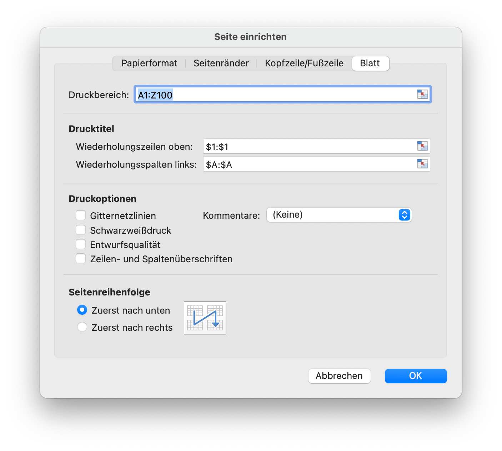

# Arbeitsmappe

`Options` definiert die Optionen zum Lesen und Schreiben von Tabellenkalkulationen.

```go
type Options struct {
    MaxCalcIterations uint
    Password          string
    RawCellValue      bool
    UnzipSizeLimit    int64
    UnzipXMLSizeLimit int64
    ShortDatePattern  string
    LongDatePattern   string
    LongTimePattern   string
    CultureInfo       CultureName
}
```

`MaxCalcIterations` gibt die maximalen Iterationen für die iterative Berechnung an, der Standardwert ist 0.

`Password` gibt das Passwort der Tabellenkalkulation im Klartext an.

`RawCellValue` gibt an, ob das Zahlenformat für den Zellenwert angewendet oder der Rohwert abgerufen wird.

`UnzipSizeLimit` gibt die Entpack-Größenbeschränkung in Bytes beim Öffnen der Tabelle an. Dieser Wert sollte größer oder gleich `UnzipXMLSizeLimit` sein, die Standardgrößenbeschränkung beträgt 16GB.

`UnzipXMLSizeLimit` gibt das Speicherlimit beim Entpacken des Arbeitsblatts und der freigegebenen Stringtabelle in Bytes an. Arbeitsblatt-XML wird in das temporäre Systemverzeichnis extrahiert, wenn die Dateigröße diesen Wert überschreitet. Dieser Wert sollte kleiner oder gleich `UnzipSizeLimit` sein, der Standardeinstellung Wert ist 16MB.

`ShortDatePattern` gibt den Formatcode für kurze Datumszahlen an. In den Tabellenkalkulationsanwendungen zeigen Datumsformate Datums- und Uhrzeitseriennummern als Datumswerte an. Datumsformate, die mit einem Sternchen (\*) beginnen, reagieren auf Änderungen der regionalen Datums- und Uhrzeiteinstellungen, die für das Betriebssystem angegeben sind. Formate ohne Sternchen werden von den Betriebssystemeinstellungen nicht beeinflusst. Das `ShortDatePattern`, das für verwendet wird, gibt Datumsformate an, die mit einem Sternchen beginnen.

`LongDatePattern` gibt den Formatcode für lange Datumszahlen an.

`LongTimePattern` gibt den Formatcode für Langzeitzahlen an.

`CultureInfo` gibt den Ländercode für die Anwendung des integrierten Zahlenformatcodes in der Sprache an, der sich auf die lokalen Spracheinstellungen des Systems auswirkt.

`HeaderFooterImagePositionType` ist der Typ der Kopf- und Fußzeilenbildposition.

```go
type HeaderFooterImagePositionType byte
```

In diesem Abschnitt wird die Aufzählung der Bildpositionstypen für Kopf- und Fußzeilen des Arbeitsblatts definiert.

```go
const (
    HeaderFooterImagePositionLeft HeaderFooterImagePositionType = iota
    HeaderFooterImagePositionCenter
    HeaderFooterImagePositionRight
)
```

`CalcPropsOptions` definiert die Sammlung von Eigenschaften, die die Anwendung zum Aufzeichnen des Berechnungsstatus und von Berechnungsdetails verwendet.

```go
type CalcPropsOptions struct {
    CalcID                *uint
    CalcMode              *string
    FullCalcOnLoad        *bool
    RefMode               *string
    Iterate               *bool
    IterateCount          *uint
    IterateDelta          *float64
    FullPrecision         *bool
    CalcCompleted         *bool
    CalcOnSave            *bool
    ConcurrentCalc        *bool
    ConcurrentManualCount *uint
    ForceFullCalc         *bool
}
```

## Erstellen einer Kalkulationstabelle {#NewFile}

```go
func NewFile(opts ...Options) *File
```

NewFile bietet eine Funktion zum Erstellen einer neuen Datei als Standardvorlage. Die neu erstellte Arbeitsmappe enthält standardmäßig ein Arbeitsblatt mit dem Namen `Sheet1`. Zum Beispiel:

## Öffnen {#OpenFile}

```go
func OpenFile(filename string, opts ...Options) (*File, error)
```

OpenFile nimmt den Namen einer Tabellenkalkulationsdatei an und gibt dafür eine aufgefüllte Tabellenkalkulationsdateistruktur zurück. Öffnen Sie beispielsweise eine Kalkulationstabelle mit Kennwortschutz:

```go
f, err := excelize.OpenFile("Book1.xlsx", excelize.Options{Password: "password"})
if err != nil {
    return
}
```

Schließen Sie die Datei von [`Close()`](workbook.md#Close), nachdem Sie die Tabelle geöffnet haben.

## Offener Datenstrom {#OpenReader}

```go
func OpenReader(r io.Reader, opts ...Options) (*File, error)
```

OpenReader liest Datenstrom von `io.Reader` und gibt eine gefüllte Tabellenkalkulationsdatei zurück.

Erstellen Sie beispielsweise http-Server, um die Upload-Vorlage zu verarbeiten, und senden Sie dann eine Antwortdownloaddatei mit einem neuen Arbeitsblatt:

```go
package main

import (
    "fmt"
    "net/http"

    "github.com/xuri/excelize/v2"
)

func process(w http.ResponseWriter, req *http.Request) {
    file, _, err := req.FormFile("file")
    if err != nil {
        fmt.Fprint(w, err.Error())
        return
    }
    defer file.Close()
    f, err := excelize.OpenReader(file)
    if err != nil {
        fmt.Fprint(w, err.Error())
        return
    }
    f.Path = "Book1.xlsx"
    f.NewSheet("NewSheet")
    w.Header().Set("Content-Disposition", fmt.Sprintf("attachment; filename=%s", f.Path))
    w.Header().Set("Content-Type", req.Header.Get("Content-Type"))
    if err := f.Write(w); err != nil {
        fmt.Fprint(w, err.Error())
    }
}

func main() {
    http.HandleFunc("/process", process)
    http.ListenAndServe(":8090", nil)
}
```

Test mit cURL:

```bash
curl --location --request GET 'http://127.0.0.1:8090/process' \
--form 'file=@/tmp/template.xltx' -O -J
```

## Speichern {#Save}

```go
func (f *File) Save(opts ...Options) error
```

Save bietet eine Funktion zum Überschreiben der Tabellenkalkulationsdatei mit dem Ursprungspfad.

## Speichern als {#SaveAs}

```go
func (f *File) SaveAs(name string, opts ...Options) error
```

SaveAs bietet eine Funktion zum Erstellen oder Aktualisieren einer Tabellenkalkulationsdatei unter dem angegebenen Pfad.

## Arbeitsmappe schließen {#Close}

```go
func (f *File) Close() error
```

Close schließt und bereinigt die geöffnete temporäre Datei für die Kalkulationstabelle.

## Arbeitsblatt erstellen {#NewSheet}

```go
func (f *File) NewSheet(sheet string) (int, error)
```

NewSheet bietet die Funktion zum Erstellen eines neuen Blatts, indem ein Arbeitsblattname angegeben wird, und gibt den Index der Blätter in der Arbeitsmappe (Spreadsheet) zurück, nachdem es angehängt wurde. Beachten Sie, dass beim Erstellen einer neuen Tabellenkalkulationsdatei das Standardarbeitsblatt mit dem Namen `Sheet1` erstellt wird.

## Arbeitsblatt löschen {#DeleteSheet}

```go
func (f *File) DeleteSheet(sheet string) error
```

DeleteSheet bietet eine Funktion zum Löschen von Arbeitsblättern in einer Arbeitsmappe nach dem angegebenen Arbeitsblattnamen, bei den Blattnamen wird nicht zwischen Groß- und Kleinschreibung unterschieden. Verwenden Sie diese Methode mit Vorsicht, da sie sich auf Änderungen in Referenzen wie Formeln, Diagrammen usw. auswirkt. Wenn es einen referenzierten Wert des gelöschten Arbeitsblatts gibt, führt dies zu einem Dateifehler, wenn Sie es öffnen. Diese Funktion ist ungültig, wenn nur noch ein Arbeitsblatt übrig ist.

## Arbeitsblatt verschieben {#MoveSheet}

```go
func (f *File) MoveSheet(source, target string) error
```

MoveSheet verschiebt ein Blatt an eine bestimmte Position in der Arbeitsmappe. Die Funktion verschiebt das Quellblatt vor das Zielblatt. Nach dem Verschieben werden andere Blätter nach links oder rechts verschoben. Wenn sich das Blatt bereits an der Zielposition befindet, führt die Funktion keine Aktion aus. Beachten Sie, dass diese Funktion nach dem Verschieben alle Blätter auflöst. Verschieben Sie beispielsweise `Tabelle2` vor `Tabelle1`:

```go
err := f.MoveSheet("Tabelle2", "Tabelle1")
```

## Arbeitsblatt kopieren {#CopySheet}

```go
func (f *File) CopySheet(from, to int) error
```

CopySheet bietet eine Funktion zum Duplizieren eines Arbeitsblatts nach dem gegebenen Quell- und Zielarbeitsblattindex. Beachten Sie, dass derzeit keine doppelten Arbeitsmappen unterstützt werden, die Tabellen, Diagramme oder Bilder enthalten. Zum Beispiel:

```go
// Sheet1 ist bereits vorhanden...
index, err := f.NewSheet("Sheet2")
if err != nil {
    fmt.Println(err)
    return
}
err := f.CopySheet(1, index)
```

## Gruppenarbeitsblätter {#GroupSheets}

```go
func (f *File) GroupSheets(sheets []string) error
```

GroupSheets bietet eine Funktion zum Gruppieren von Arbeitsblättern nach bestimmten Arbeitsblattnamen. Gruppenarbeitsblätter müssen ein aktives Arbeitsblatt enthalten.

## Gruppierung von Arbeitsblättern aufheben {#UngroupSheets}

```go
func (f *File) UngroupSheets() error
```

UngroupSheets bietet eine Funktion zum Aufheben der Gruppierung von Arbeitsblättern.

## Festlegen des Arbeitsblatthintergrunds {#SetSheetBackground}

```go
func (f *File) SetSheetBackground(sheet, picture string) error
```

SetSheetBackground bietet eine Funktion zum Festlegen eines Hintergrundbilds anhand des angegebenen Arbeitsblattnamens und Dateipfads. Unterstützte Bildtypen: BMP, EMF, EMZ, GIF, JPEG, JPG, PNG, SVG, TIF, TIFF, WMF und WMZ.

```go
func (f *File) SetSheetBackgroundFromBytes(sheet, extension string, picture []byte) error
```

SetSheetBackgroundFromBytes bietet eine Funktion zum Festlegen des Hintergrundbilds anhand des angegebenen Arbeitsblattnamens, Erweiterungsnamens und der Bilddaten. Unterstützte Bildtypen: BMP, EMF, EMZ, GIF, JPEG, JPG, PNG, SVG, TIF, TIFF, WMF und WMZ.

## Festlegen eines Standardarbeitsblatts {#SetActiveSheet}

```go
func (f *File) SetActiveSheet(index int)
```

SetActiveSheet bietet eine Funktion zum Festlegen des aktiven Standardblatts der Arbeitsmappe durch einen bestimmten Index. Beachten Sie, dass sich der aktive Index von der ID unterscheidet, die von der Funktion [`GetSheetMap`](sheet.md#GetSheetMap) zurückgegeben wird. Sie sollte größer oder gleich 0 und kleiner als die Gesamten der Arbeitsblattnummern sein.

## Aktives Blattindex abrufen {#GetActiveSheetIndex}

```go
func (f *File) GetActiveSheetIndex() int
```

GetActiveSheetIndex bietet eine Funktion zum Abrufen eines aktiven Arbeitsblatts der Arbeitsmappe. Wenn das aktive Blatt nicht gefunden wurde, wird die ganze Zahl `0` zurückgegeben.

## Set-Arbeitsblatt sichtbar {#SetSheetVisible}

```go
func (f *File) SetSheetVisible(sheet string, visible bool, veryHidden ...bool) error
```

SetSheetVisible bietet eine Funktion zum Festlegen eines Arbeitsblatts, das durch den angegebenen Arbeitsblattnamen sichtbar ist. Eine Arbeitsmappe muss mindestens ein sichtbares Arbeitsblatt enthalten. Wenn das angegebene Arbeitsblatt aktiviert wurde, wird diese Einstellung ungültig. Der dritte optionale `veryHidden`-Parameter funktioniert nur, wenn `visible` `false` war.

Geben Sie beispielsweise `Sheet1` aus:

```go
err := f.SetSheetVisible("Sheet1", false)
```

## Arbeitsblatt sichtbar machen {#GetSheetVisible}

```go
func (f *File) GetSheetVisible(sheet string) (bool, error)
```

GetSheetVisible bietet eine Funktion, mit der das Arbeitsblatt unter dem angegebenen Arbeitsblattnamen sichtbar gemacht wird. Erhalten Sie beispielsweise den sichtbaren Status von `Sheet1`:

```go
visible, err := f.GetSheetVisible("Sheet1")
```

## Festlegen von Blatteigenschaften {#SetSheetProps}

```go
func (f *File) SetSheetProps(sheet string, opts *SheetPropsOptions) error
```

SetSheetProps bietet eine Funktion zum Festlegen von Arbeitsblatteigenschaften. Die Eigenschaften, die festgelegt werden können, sind:

Options|Typ|Beschreibung
---|---|---
CodeName                          | `*string`  | Gibt einen stabilen Namen des Blatts an, der sich im Laufe der Zeit nicht ändern sollte und sich nicht durch Benutzereingaben ändert. Dieser Name sollte vom Code verwendet werden, um auf ein bestimmtes Blatt zu verweisen.
EnableFormatConditionsCalculation | `*bool`    | Gibt an, ob die Berechnungen der bedingten Formatierung ausgewertet werden sollen. Wenn diese Option auf false festgelegt ist, werden die Min/Max-Werte von Farbskalen oder Datenbalken oder Schwellenwerten in Top-N-Regeln nicht aktualisiert. Im Wesentlichen ist die bedingte Formatierung "calc" deaktiviert
Published                         | `*bool`    | Gibt an, ob das Arbeitsblatt veröffentlicht wurde, und der Standardwert ist `true`
AutoPageBreaks                    | `*bool`    | Gibt an, ob auf dem Blatt "Automatische Seitenumbrüche" angezeigt werden, ist der Standardwert `true`
FitToPage                         | `*bool`    | Gibt an, ob die Option An Seite anpassen (Anpassen an Seite drucken) aktiviert ist, und der Standardwert ist `false`
TabColorIndexed                   | `*int`     | Stellt den indizierten Farbwert dar
TabColorRGB                       | `*string`  | Stellt den standardmäßigen ARGB-Farbwert (Alpha Red Green Blue) dar
TabColorTheme                     | `*int`     | Stellt den nullbasierten Index in der Auflistung dar und verweist auf einen bestimmten Wert, der im Designteil ausgedrückt wird
TabColorTint                      | `*float64` | Gibt den Farbtonwert an, der auf die Farbe angewendet wird, der Standardwert ist `0.0`
OutlineSummaryBelow               | `*bool`    | Gibt an, ob Zusammenfassungszeilen in einer Gliederung unter dem Detail angezeigt werden, beim Anwenden einer Gliederung ist der Standardwert `true`
OutlineSummaryRight               | `*bool`    | Gibt an, ob Zusammenfassungsspalten in einer Gliederung rechts vom Detail angezeigt werden, und beim Anwenden einer Gliederung ist der Standardwert `true`
BaseColWidth                      | `*uint8`   | Gibt die Anzahl der Zeichen der maximalen Ziffernbreite der Schriftart des normalen Stils an. Dieser Wert enthält keinen Randabstand oder zusätzlichen Abstand für Rasterlinien. Es ist nur die Anzahl der Zeichen, der Standardwert ist `8`
DefaultColWidth                   | `*float64` | Gibt die Standardspaltenbreite an, gemessen als die Anzahl der Zeichen der maximalen Ziffernbreite der Schriftart des normalen Stils
DefaultRowHeight                  | `*float64` | Gibt die in Punktgröße gemessene Standardzeilenhöhe an. Optimierung, damit wir die Höhe nicht auf alle Zeilen schreiben müssen. Dies kann ausgeschrieben werden, wenn die meisten Zeilen eine benutzerdefinierte Höhe haben, um die Optimierung zu erreichen
CustomHeight                      | `*bool`    | Gibt die benutzerdefinierte Höhe an, der Standardwert ist `false`
ZeroHeight                        | `*bool`    | Gibt an, ob Zeilen ausgeblendet sind, der Standardwert ist `false`
ThickTop                          | `*bool`    | Gibt an, ob Zeilen standardmäßig einen dicken oberen Rahmen haben, der Standardwert ist `false`
ThickBottom                       | `*bool`    | Gibt an, ob Zeilen standardmäßig einen dicken unteren Rahmen haben, der Standardwert ist `false`

Legen Sie beispielsweise fest, dass Arbeitsblattzeilen standardmäßig ausgeblendet sind:

<p align="center"></p>

```go
f, enable := excelize.NewFile(), true
if err := f.SetSheetProps("Sheet1", &excelize.SheetPropsOptions{
    ZeroHeight: &enable,
}); err != nil {
    fmt.Println(err)
}
if err := f.SetRowVisible("Sheet1", 10, true); err != nil {
    fmt.Println(err)
}
f.SaveAs("Book1.xlsx")
```

Es gibt 4 Arten von Voreinstellungen "Benutzerdefinierte Skalierungsoptionen" in den Tabellenkalkulationsanwendungen, wenn Sie diese Art von Skalierungsoptionen festlegen müssen, verwenden Sie bitte die Funktionen [`SetSheetProps`](workbook.md#SetSheetProps) und [`SetPageLayout`](workbook.md#SetPageLayout), um sich diesen 4 Skalierungsoptionen zu nähern:

1. Keine Skalierung (Drucken Sie Blätter in ihrer tatsächlichen Größe):

    ```go
    disable := false
    if err := f.SetSheetProps("Tabelle1", &excelize.SheetPropsOptions{
        FitToPage: &disable,
    }); err != nil {
        fmt.Println(err)
    }
    ```

2. Blatt auf eine Seite anpassen (Verkleinern Sie den Ausdruck, sodass er auf eine Seite passt):

    ```go
    enable := true
    if err := f.SetSheetProps("Tabelle1", &excelize.SheetPropsOptions{
        FitToPage: &enable,
    }); err != nil {
        fmt.Println(err)
    }
    ```

3. Alle Spalten auf einer Seite einpassen (Verkleinern Sie den Ausdruck so, dass er eine Seite breit ist):

    ```go
    enable, zero := true, 0
    if err := f.SetSheetProps("Tabelle1", &excelize.SheetPropsOptions{
        FitToPage: &enable,
    }); err != nil {
        fmt.Println(err)
    }
    if err := f.SetPageLayout("Tabelle1", &excelize.PageLayoutOptions{
        FitToHeight: &zero,
    }); err != nil {
        fmt.Println(err)
    }
    ```

4. Alle Zeilen auf einer Seite einpassen (Verkleinern Sie den Ausdruck so, dass er eine Seite hoch ist):

    ```go
    enable, zero := true, 0
    if err := f.SetSheetProps("Tabelle1", &excelize.SheetPropsOptions{
        FitToPage: &enable,
    }); err != nil {
        fmt.Println(err)
    }
    if err := f.SetPageLayout("Tabelle1", &excelize.PageLayoutOptions{
        FitToWidth: &zero,
    }); err != nil {
        fmt.Println(err)
    }
    ```

## Abrufen von Blatteigenschaften {#GetSheetProps}

```go
func (f *File) GetSheetProps(sheet string) (SheetPropsOptions, error)
```

GetSheetProps bietet eine Funktion zum Abrufen von Arbeitsblatteigenschaften. Die Eigenschaften, die festgelegt werden können, sind:

Options|Typ|Beschreibung
---|---|---
DefaultGridColor  | `*bool`    | Gibt an, dass die konsumierende Anwendung die Standardfarbe der Rasterlinien verwenden sollte (systemabhängig). Überschreibt jede in colorId angegebene Farbe, der Standardwert ist `true`
RightToLeft       | `*bool`    | Gibt an, ob sich das Blatt im Anzeigemodus "von rechts nach links" befindet. In diesem Modus befindet sich Spalte A ganz rechts, Spalte B; ist eine Spalte links von Spalte A usw. Außerdem werden Informationen in Zellen im Format von rechts nach links angezeigt, der Standardwert ist `false`
ShowFormulas      | `*bool`    | Wenn Sie angeben, ob in diesem Blatt Formeln angezeigt werden sollen, ist der Standardwert `false`
ShowGridLines     | `*bool`    | Gibt an, ob auf diesem Blatt Rasterlinien angezeigt werden sollen, ist der Standardwert `true`
ShowRowColHeaders | `*bool`    | Wenn Sie angeben, ob auf dem Blatt Zeilen- und Spaltenüberschriften angezeigt werden sollen, ist der Standardwert `true`
ShowRuler         | `*bool`    | Wenn Sie angeben, dass auf diesem Blatt ein Lineal angezeigt werden soll, ist der Standardwert `true`
ShowZeros         | `*bool`    | Gibt an, ob "in Zellen mit Nullwert eine Null angezeigt werden soll". Wenn Sie eine Formel verwenden, um auf eine andere leere Zelle zu verweisen, wird der referenzierte Wert zu `0`, wenn das Flag `true` ist, der Standardwert `true` ist
TopLeftCell       | `*string`  | Gibt eine Position der oberen linken sichtbaren Zelle an Position der oberen linken sichtbaren Zelle im unteren rechten Bereich an (im Links-nach-Rechts-Modus)
View              | `*string`  | Um anzugeben, wie das Blatt angezeigt wird, verwendet es standardmäßig eine leere Zeichenfolge, verfügbare Optionen: `normal`, `pageBreakPreview` und `pageLayout`
ZoomScale         | `*float64` | Gibt eine Fensterzoomvergrößerung für die aktuelle Ansicht an, die Prozentwerte darstellt. Dieses Attribut ist auf Werte im Bereich von `10` bis `400` beschränkt. Horizontale und vertikale Skalierung zusammen, der Standardwert ist `100`

## Festlegen von Arbeitsblattansichtseigenschaften {#SetSheetView}

```go
func (f *File) SetSheetView(sheet string, viewIndex int, opts *ViewOptions) error
```

SetSheetView legt die Blattansichtseigenschaften fest. Der `viewIndex` darf negativ sein und wird dann rückwärts gezählt (`-1` ist der letzte View).

## Abrufen von Arbeitsblattansichtseigenschaften {#GetSheetView}

```go
func (f *File) GetSheetView(sheet string, viewIndex int) (ViewOptions, error)
```

GetSheetView ruft den Wert der Blattansichtseigenschaften ab. Der `viewIndex` darf negativ sein und wird dann rückwärts gezählt (`-1` ist der letzte View).

## Festlegen des Layouts der Arbeitsblattseite {#SetPageLayout}

```go
func (f *File) SetPageLayout(sheet string, opts *PageLayoutOptions) error
```

SetPageLayout bietet eine Funktion zum Festlegen des Seitenlayouts von Arbeitsblättern. Verfügbare Optionen:

`Size` gibt die Papiergröße des Arbeitsblatts an, die Standardpapiergröße des Arbeitsblatts ist "Briefpapier (8.5 Zoll x 11 Zoll)". Das Folgende zeigt die Papiergröße, sortiert nach der Excelize-Indexnummer:

Index|Papiergröße
---|---
1   | Briefpapier (8.5 Zoll × 11 Zoll)
2   | Brief kleines Papier (8.5 Zoll × 11 Zoll)
3   | Tabloidpapier (11 Zoll × 17 Zoll)
4   | Hauptbuchpapier (17 Zoll × 11 Zoll)
5   | Rechtsdokument (8.5 Zoll × 14 Zoll)
6   | Statement Papier (5.5 Zoll × 8.5 Zoll)
7   | Executive Papier (7.25 Zoll × 10.5 Zoll)
8   | A3 Papier (297 mm × 420 mm)
9   | A4 Papier (210 mm × 297 mm)
10  | A4 kleines Papier (210 mm × 297 mm)
11  | A5 Papier (148 mm × 210 mm)
12  | B4 Papier (250 mm × 353 mm)
13  | B5 Papier (176 mm × 250 mm)
14  | Foliopapier (8.5 Zoll × 13 Zoll)
15  | Quartopapier (215 mm × 275 mm)
16  | Standardpapier (10 Zoll × 14 Zoll)
17  | Standardpapier (11 Zoll × 17 Zoll)
18  | Notizpapier (8.5 Zoll × 11 Zoll)
19  | Umschlag Nr. 9 (3.875 Zoll × 8.875 Zoll)
20  | Umschlag Nr. 10 (4.125 Zoll × 9.5 Zoll)
21  | Umschlag Nr. 11 (4.5 Zoll × 10.375 Zoll)
22  | Umschlag Nr. 12 (4.75 Zoll × 11 Zoll)
23  | Umschlag Nr. 14 (5 Zoll × 11.5 Zoll)
24  | C Papier (17 Zoll × 22 Zoll)
25  | D Papier (22 Zoll × 34 Zoll)
26  | E Papier (34 Zoll × 44 Zoll)
27  | DL-Umschlag (110 mm × 220 mm)
28  | C5-Umschlag (162 mm × 229 mm)
29  | C3-Umschlag (324 mm × 458 mm)
30  | C4-Umschlag (229 mm × 324 mm)
31  | C6-Umschlag (114 mm × 162 mm)
32  | C65-Umschlag (114 mm × 229 mm)
33  | B4-Umschlag (250 mm × 353 mm)
34  | B5-Umschlag (176 mm × 250 mm)
35  | B6-Umschlag (176 mm × 125 mm)
36  | Italien Umschlag (110 mm × 230 mm)
37  | Monarch Umschlag (3.875 Zoll × 7.5 Zoll)
38  | 6¾ Umschlag (3.625 Zoll × 6.5 Zoll)
39  | US Standard-Lüfterfalte (14.875 Zoll × 11 Zoll)
40  | Deutsche Standard-Lüfterfalte (8.5 Zoll × 12 Zoll)
41  | Deutsche Rechtsfanfalte (8.5 Zoll × 13 Zoll)
42  | ISO B4 (250 mm × 353 mm)
43  | Japanische Postkarte (100 mm × 148 mm)
44  | Standardpapier (9 Zoll × 11 Zoll)
45  | Standardpapier (10 Zoll × 11 Zoll)
46  | Standardpapier (15 Zoll × 11 Zoll)
47  | Umschlag einladen (220 mm × 220 mm)
50  | Brief extra Papier (9.275 Zoll × 12 Zoll)
51  | Legal zusätzliches Papier (9.275 Zoll × 15 Zoll)
52  | Tabloid zusätzliches Papier (11.69 Zoll × 18 Zoll)
53  | A4 zusätzliches Papier (236 mm × 322 mm)
54  | Brief Querpapier (8.275 Zoll × 11 Zoll)
55  | A4 Querpapier (210 mm × 297 mm)
56  | Brief extra Querpapier (9.275 Zoll × 12 Zoll)
57  | SuperA/SuperA/A4 papier (227 mm × 356 mm)
58  | SuperB/SuperB/A3 papier (305 mm × 487 mm)
59  | Brief plus Papier (8.5 Zoll × 12.69 Zoll)
60  | A4 plus Papier (210 mm × 330 mm)
61  | A5 Querpapier (148 mm × 210 mm)
62  | JIS B5 Querpapier (182 mm × 257 mm)
63  | A3 zusätzliches Papier (322 mm × 445 mm)
64  | A5 zusätzliches Papier (174 mm × 235 mm)
65  | ISO B5 zusätzliches Papier (201 mm × 276 mm)
66  | A2 papier (420 mm × 594 mm)
67  | A3 Querpapier (297 mm × 420 mm)
68  | A3 zusätzliches Querpapier (322 mm × 445 mm)
69  | Japanische Doppelpostkarte (200 mm × 148 mm)
70  | A6 (105 mm × 148 mm)
71  | Japanischer Umschlag Kaku # 2
72  | Japanischer Umschlag Kaku # 3
73  | Japanischer Umschlag Chou # 3
74  | Japanischer Umschlag Chou # 4
75  | Buchstabe gedreht (11 Zoll × 8½ Zoll)
76  | A3 gedreht (420 mm × 297 mm)
77  | A4 gedreht (297 mm × 210 mm)
78  | A5 gedreht (210 mm × 148 mm)
79  | B4 (JIS) gedreht (364 mm × 257 mm)
80  | B5 (JIS) gedreht (257 mm × 182 mm)
81  | Japanische Postkarte gedreht (148 mm × 100 mm)
82  | Doppelte japanische Postkarte gedreht (148 mm × 200 mm)
83  | A6 gedreht (148 mm × 105 mm)
84  | Japanischer Umschlag Kaku # 2 gedreht
85  | Japanischer Umschlag Kaku # 3 gedreht
86  | Japanischer Umschlag Chou # 3 gedreht
87  | Japanischer Umschlag Chou # 4 gedreht
88  | B6 (JIS) (128 mm × 182 mm)
89  | B6 (JIS) gedreht (182 mm × 128 mm)
90  | 12 Zoll × 11 Zoll
91  | Japanischer Umschlag Sie # 4
92  | Japanischer Umschlag Sie # 4 gedreht
93  | PRC 16K (146 mm × 215 mm)
94  | PRC 32K (97 mm × 151 mm)
95  | PRC 32K(Big) (97 mm × 151 mm)
96  | PRC-Umschlag Nr. #1 (102 mm × 165 mm)
97  | PRC-Umschlag Nr. #2 (102 mm × 176 mm)
98  | PRC-Umschlag Nr. #3 (125 mm × 176 mm)
99  | PRC-Umschlag Nr. #4 (110 mm × 208 mm)
100 | PRC-Umschlag Nr. #5 (110 mm × 220 mm)
101 | PRC-Umschlag Nr. #6 (120 mm × 230 mm)
102 | PRC-Umschlag Nr. #7 (160 mm × 230 mm)
103 | PRC-Umschlag Nr. #8 (120 mm × 309 mm)
104 | PRC-Umschlag Nr. #9 (229 mm × 324 mm)
105 | PRC-Umschlag Nr. #10 (324 mm × 458 mm)
106 | PRC 16K gedreht
107 | PRC 32K gedreht
108 | PRC 32K (groß) gedreht
109 | PRC-Umschlag Nr. 1 gedreht (165 mm × 102 mm)
110 | PRC-Umschlag Nr. 2 gedreht (176 mm × 102 mm)
111 | PRC-Umschlag Nr. 3 gedreht (176 mm × 125 mm)
112 | PRC-Umschlag Nr. 4 gedreht (208 mm × 110 mm)
113 | PRC-Umschlag Nr. 5 gedreht (220 mm × 110 mm)
114 | PRC-Umschlag Nr. 6 gedreht (230 mm × 120 mm)
115 | PRC-Umschlag Nr. 7 gedreht (230 mm × 160 mm)
116 | PRC-Umschlag Nr. 8 gedreht (309 mm × 120 mm)
117 | PRC-Umschlag Nr. 9 gedreht (324 mm × 229 mm)
118 | PRC-Umschlag Nr. 10 gedreht (458 mm × 324 mm)

`Orientation` gibt die Arbeitsblattausrichtung an, die Standardausrichtung ist `portrait`. Die möglichen Werte für dieses Feld sind `portrait` und `landscape`.

`FirstPageNumber` gibt die erste gedruckte Seitenzahl an. Wenn kein Wert angegeben ist, wird "automatisch" angenommen.

`AdjustTo` spezifiziert die Druckskalierung. Dieses Attribut ist auf Werte zwischen 10 (10 %) und 400 (400 %) beschränkt. Diese Einstellung wird außer Kraft gesetzt, wenn `FitToWidth` und/oder `FitToHeight` verwendet werden.

`FitToHeight` gibt die Anzahl der vertikalen Seiten an, auf die angepasst werden soll.

`FitToWidth` gibt die Anzahl der horizontalen Seiten an, die angepasst werden sollen.

`BlackAndWhite` spezifiziert Schwarz-Weiß-Druck.

`PageOrder` gibt die Reihenfolge mehrerer Seiten an. Akzeptierte Werte: `overThenDown` und `downThenOver`.

Legen Sie beispielsweise das Seitenlayout für `Sheet1` mit Schwarzweißdruck, erste gedruckte Seitenzahl von `2`, kleines A4-Querformatpapier (210 mm x 297 mm), 2 vertikale Seiten zum Anpassen und 2 horizontale Seiten zum Anpassen:

```go
f := excelize.NewFile()
var (
    size                 = 10
    orientation          = "landscape"
    firstPageNumber uint = 2
    adjustTo        uint = 100
    fitToHeight          = 2
    fitToWidth           = 2
    blackAndWhite        = true
)
if err := f.SetPageLayout("Sheet1", &excelize.PageLayoutOptions{
    Size:            &size,
    Orientation:     &orientation,
    FirstPageNumber: &firstPageNumber,
    AdjustTo:        &adjustTo,
    FitToHeight:     &fitToHeight,
    FitToWidth:      &fitToWidth,
    BlackAndWhite:   &blackAndWhite,
}); err != nil {
    fmt.Println(err)
}
```

## Abrufen des Layouts der Arbeitsblattseite {#GetPageLayout}

```go
func (f *File) GetPageLayout(sheet string) (PageLayoutOptions, error)
```

GetPageLayout bietet eine Funktion zum Abrufen des Seitenlayouts des Arbeitsblatts.

## Festlegen von Arbeitsblattseitenrändern {#SetPageMargins}

```go
func (f *File) SetPageMargins(sheet string, opts *PageLayoutMarginsOptions) error
```

SetPageMargins bietet eine Funktion zum Festlegen der Seitenränder von Arbeitsblättern. Verfügbare Optionen:

Options|Typ|Beschreibung
---|---|---
Bottom       | `*float64` | Unten
Footer       | `*float64` | Fußzeile
Header       | `*float64` | Kopfball
Left         | `*float64` | Links
Right        | `*float64` | Rechts
Top          | `*float64` | Oben
Horizontally | `*bool`    | Auf Seite zentrieren: Horizontal
Vertically   | `*bool`    | Auf Seite zentrieren: Vertikal

## Abrufen von Arbeitsblattseitenrändern {#GetPageMargins}

```go
func (f *File) GetPageMargins(sheet string) (PageLayoutMarginsOptions, error)
```

GetPageMargins bietet eine Funktion zum Abrufen von Arbeitsblattseitenrändern.

## Arbeitsmappeneigenschaften festlegen {#SetWorkbookProps}

```go
func (f *File) SetWorkbookProps(opts *WorkbookPropsOptions) error
```

SetWorkbookProps bietet eine Funktion zum Festlegen von Arbeitsmappeneigenschaften. Verfügbare Optionen:

Options|Typ|Beschreibung
---|---|---
Date1904      | `*bool`   | Gibt an, ob beim Konvertieren serieller Datums-/Uhrzeitangaben in der Arbeitsmappe in Datumsangaben ein Datumssystem von 1900 oder 1904 verwendet werden soll.
FilterPrivacy | `*bool`   | Gibt einen booleschen Wert an, der angibt, ob die Anwendung die Arbeitsmappe auf personenbezogene Daten (Personally Identifying Information, PII) überprüft hat. Wenn dieses Flag gesetzt ist, warnt die Anwendung den Benutzer jedes Mal, wenn der Benutzer eine Aktion ausführt, die PII in das Dokument einfügt.
CodeName      | `*string` | Gibt den Codenamen der Anwendung an, die diese Arbeitsmappe erstellt hat. Verwenden Sie dieses Attribut, um Dateiinhalte in inkrementellen Versionen der Anwendung nachzuverfolgen.

## Arbeitsmappeneigenschaften abrufen {#GetWorkbookProps}

```go
func (f *File) GetWorkbookProps() (WorkbookPropsOptions, error)
```

GetWorkbookProps bietet eine Funktion zum Abrufen von Arbeitsmappeneigenschaften.

## Kopf- und Fußzeile einstellen {#SetHeaderFooter}

```go
func (f *File) SetHeaderFooter(sheet string, opts *HeaderFooterOptions) error
```

SetHeaderFooter bietet eine Funktion zum Festlegen von Kopf- und Fußzeilen anhand des angegebenen Arbeitsblattnamens und der Steuerzeichen.

Kopf- und Fußzeilen werden in den folgenden Einstellungsfeldern angegeben:

Felder           | Beschreibung
---|---
AlignWithMargins | Richten Sie die Fußzeilenränder der Kopfzeilen an den Seitenrändern aus
DifferentFirst   | Unterschiedliche Kopf- und Fußzeile der ersten Seite
DifferentOddEven | Unterschiedliche ungerade und gerade Seitenkopf- und Fußzeilenanzeige
ScaleWithDoc     | Skalieren Sie Kopf- und Fußzeile mit Dokumentenskalierung
OddFooter        | Ungerade Seitenfußzeile oder primäre Seitenfußzeile, wenn `DifferentOddEven` `false` ist
OddHeader        | Ungerader Header oder primärer Seitenheader, wenn `DifferentOddEven` `false` ist
EvenFooter       | Sogar Seitenfußzeile
EvenHeader       | Sogar Seitenüberschriften
FirstFooter      | Fußzeile der ersten Seite
FirstHeader      | Kopfzeile der ersten Seite

Die folgenden Formatierungscodes können in Feldern mit 6 Zeichenfolgentypen verwendet werden: `OddHeader`, `OddFooter`, `EvenHeader`, `EvenFooter`, `FirstFooter`, `FirstHeader`

<table>
    <thead>
        <tr>
            <th>Code formatieren</th>
            <th>Beschreibung</th>
        </tr>
    </thead>
    <tbody>
        <tr>
            <td><code>&amp;&amp;</code></td>
            <td>Der Charakter &quot;&amp;&quot;</td>
        </tr>
        <tr>
            <td><code>&amp;font-size</code></td>
            <td>Größe der Textschrift, wobei die Schriftgröße eine dezimale Schriftgröße in Punkten ist</td>
        </tr>
        <tr>
            <td><code>&amp;&quot;font name,font type&quot;</code></td>
            <td>Eine Textschriftartennamenzeichenfolge, ein Schriftartname und eine Textschriftartenzeichenfolge, ein Schrifttyp</td>
        </tr>
        <tr>
            <td><code>&amp;&quot;-,Regular&quot;</code></td>
            <td>Normales Textformat. Schaltet den Fett- und Kursivmodus aus</td>
        </tr>
        <tr>
            <td><code>&amp;A</code></td>
            <td>Name der Registerkarte des aktuellen Arbeitsblatts</td>
        </tr>
        <tr>
            <td><code>&amp;B</code> or <code>&amp;&quot;-,Bold&quot;</code></td>
            <td>Fettgedrucktes Textformat von Aus nach Ein oder umgekehrt. Der Standardmodus ist ausgeschaltet</td>
        </tr>
        <tr>
            <td><code>&amp;D</code></td>
            <td>Aktuelles Datum</td>
        </tr>
        <tr>
            <td><code>&amp;C</code></td>
            <td>Mittelteil</td>
        </tr>
        <tr>
            <td><code>&amp;E</code></td>
            <td>Textformat mit doppelter Unterstreichung</td>
        </tr>
        <tr>
            <td><code>&amp;F</code></td>
            <td>Dateiname der aktuellen Arbeitsmappe</td>
        </tr>
        <tr>
            <td><code>&amp;G</code></td>
            <td>Objekt als Hintergrund zeichnen (Verwenden Sie AddHeaderFooterImage)</td>
        </tr>
        <tr>
            <td><code>&amp;H</code></td>
            <td>Schattentextformat</td>
        </tr>
        <tr>
            <td><code>&amp;I</code> or <code>&amp;&quot;-,Italic&quot;</code></td>
            <td>Kursives Textformat</td>
        </tr>
        <tr>
            <td><code>&amp;K</code></td>
            <td>Textschriftfarbe<br>Eine RGB-Farbe wird als RRGGBB angegeben<br>Eine Themenfarbe wird als TTSNNN angegeben, wobei TT die Themenfarben-ID ist, S ist entweder &quot;+&quot; oder &quot;-&quot; des Farbton- / Farbtonwerts und NNN ist der Farbton- / Farbtonwert</td>
        </tr>
        <tr>
            <td><code>&amp;L</code></td>
            <td>Linker Abschnitt</td>
        </tr>
        <tr>
            <td><code>&amp;N</code></td>
            <td>Gesamtzahl der Seiten</td>
        </tr>
        <tr>
            <td><code>&amp;O</code></td>
            <td>Gliederungstextformat</td>
        </tr>
        <tr>
            <td><code>&amp;P[[+\|-]n]</code></td>
            <td>Ohne das optionale Suffix wird die aktuelle Seitenzahl dezimal angegeben</td>
        </tr>
        <tr>
            <td><code>&amp;R</code></td>
            <td>Rechter Abschnitt</td>
        </tr>
        <tr>
            <td><code>&amp;S</code></td>
            <td>Durchgestrichenes Textformat</td>
        </tr>
        <tr>
            <td><code>&amp;T</code></td>
            <td>Aktuelle Uhrzeit</td>
        </tr>
        <tr>
            <td><code>&amp;U</code></td>
            <td>Textformat mit einer Unterstreichung. Wenn der Doppelunterstreichungsmodus aktiviert ist, schaltet das nächste Vorkommen in einem Abschnittsspezifizierer den Doppelunterstreichungsmodus aus. Andernfalls wird der Einzelunterstreichungsmodus von Aus auf Ein oder umgekehrt umgeschaltet. Der Standardmodus ist ausgeschaltet</td>
        </tr>
        <tr>
            <td><code>&amp;X</code></td>
            <td>Hochgestelltes Textformat</td>
        </tr>
        <tr>
            <td><code>&amp;Y</code></td>
            <td>Tiefgestelltes Textformat</td>
        </tr>
        <tr>
            <td><code>&amp;Z</code></td>
            <td>Aktueller Pfad der Arbeitsmappendatei</td>
        </tr>
    </tbody>
</table>

Zum Beispiel:

```go
err := f.SetHeaderFooter("Sheet1", &excelize.HeaderFooterOptions{
    DifferentFirst:   true,
    DifferentOddEven: true,
    OddHeader:        "&R&P",
    OddFooter:        "&C&F",
    EvenHeader:       "&L&P",
    EvenFooter:       "&L&D&R&T",
    FirstHeader:      `&CCenter &"-,Bold"Bold&"-,Regular"HeaderU+000A&D`,
})
```

Dieses Beispiel zeigt:

- Die erste Seite hat eine eigene Kopf- und Fußzeile
- Ungerade und gerade nummerierte Seiten haben unterschiedliche Kopf- und Fußzeilen
- Aktuelle Seitenzahl im rechten Bereich der Überschriften für ungerade Seiten
- Der Dateiname der aktuellen Arbeitsmappe im mittleren Bereich der Fußzeilen für ungerade Seiten
- Aktuelle Seitenzahl im linken Bereich der Überschriften mit geraden Seiten
- Aktuelles Datum im linken Bereich und aktuelle Uhrzeit im rechten Bereich der Fußzeilen mit geraden Seiten
- Der Text "Center Bold Header" in der ersten Zeile des mittleren Abschnitts der ersten Seite und das Datum in der zweiten Zeile des mittleren Abschnitts derselben Seite
- Keine Fußzeile auf der ersten Seite

## Kopf- und Fußzeilenbild hinzufügen {#AddHeaderFooterImage}

```go
func (f *File) AddHeaderFooterImage(sheet string, opts *HeaderFooterImageOptions) error
```

AddHeaderFooterImage bietet einen Mechanismus zum Festlegen der Grafiken, auf die in den Kopf- und Fußzeilendefinitionen über `&G` verwiesen werden kann. Unterstützte Bildtypen: EMF, EMZ, GIF, JPEG, JPG, PNG, SVG, TIF, TIFF, WMF und WMZ.

## Definierter Name festlegen {#SetDefinedName}

```go
func (f *File) SetDefinedName(definedName *DefinedName) error
```

SetDefinedName bietet eine Funktion zum Festlegen der definierten Namen der Arbeitsmappe oder des Arbeitsblatts. Wenn kein Bereich angegeben ist, ist der Standardbereich die Arbeitsmappe. Zum Beispiel:

```go
err := f.SetDefinedName(&excelize.DefinedName{
    Name:     "Amount",
    RefersTo: "Sheet1!$A$2:$D$5",
    Comment:  "defined name comment",
    Scope:    "Sheet2",
})
```

Einstellungen für Druckbereich und Drucktitel für das Arbeitsblatt:

<p align="center"></p>

```go
if err := f.SetDefinedName(&excelize.DefinedName{
    Name:     "_xlnm.Print_Area",
    RefersTo: "Sheet1!$A$1:$Z$100",
    Scope:    "Sheet1",
}); err != nil {
    fmt.Println(err)
}
if err := f.SetDefinedName(&excelize.DefinedName{
    Name:     "_xlnm.Print_Titles",
    RefersTo: "Sheet1!$A:$A,Sheet1!$1:$1",
    Scope:    "Sheet1",
}); err != nil {
    fmt.Println(err)
}
```

Wenn Sie die Eigenschaft `RefersTo` mit nur einem Spaltenbereich ohne Komma füllen, funktioniert sie nur als "Links zu wiederholende Spalten". Beispiel:

```go
if err := f.SetDefinedName(&excelize.DefinedName{
    Name:     "_xlnm.Print_Titles",
    RefersTo: "Sheet1!$A:$A",
    Scope:    "Sheet1",
}); err != nil {
    fmt.Println(err)
}
```

Wenn Sie die Eigenschaft `RefersTo` mit nur einem Zeilenbereich ohne Komma füllen, funktioniert sie nur als "Zeilen, die oben wiederholt werden sollen". Beispiel:

```go
if err := f.SetDefinedName(&excelize.DefinedName{
    Name:     "_xlnm.Print_Titles",
    RefersTo: "Sheet1!$1:$1",
    Scope:    "Sheet1",
}); err != nil {
    fmt.Println(err)
}
```

## Definierten Namen abrufen {#GetDefinedName}

```go
func (f *File) GetDefinedName() []DefinedName
```

GetDefinedName bietet eine Funktion zum Abrufen der definierten Namen der Arbeitsmappe oder des Arbeitsblatts.

## Definierter Name löschen {#DeleteDefinedName}

```go
func (f *File) DeleteDefinedName(definedName *DefinedName) error
```

DeleteDefinedName bietet eine Funktion zum Löschen der definierten Namen der Arbeitsmappe oder des Arbeitsblatts. Wenn kein Bereich angegeben ist, ist der Standardbereich die Arbeitsmappe. Zum Beispiel:

```go
err := f.DeleteDefinedName(&excelize.DefinedName{
    Name:     "Amount",
    Scope:    "Sheet2",
})
```

## Anwendungseigenschaften festlegen {#SetAppProps}

```go
func (f *File) SetAppProps(appProperties *AppProperties) error
```

SetAppProps bietet eine Funktion zum Festlegen von Dokumentanwendungseigenschaften. Folgende Eigenschaften können eingestellt werden:

Eigentum       | Beschreibung
---|---
Application       | Der Name der Anwendung, die dieses Dokument erstellt hat.
ScaleCrop         | Zeigt den Anzeigemodus der Dokumentminiaturansicht an. Setzen Sie dieses Element auf `true`, um die Skalierung der Dokumentminiaturansicht auf die Anzeige zu ermöglichen. Setzen Sie dieses Element auf `false`, um das Zuschneiden der Dokumentminiaturansicht zu ermöglichen, um nur Abschnitte anzuzeigen, die in die Anzeige passen.
DocSecurity       | Sicherheitsstufe eines Dokuments als numerischer Wert. Die Dokumentsicherheit ist wie folgt definiert:<br>1 - Das Dokument ist passwortgeschützt.<br>2 - Es wird empfohlen, dass das Dokument schreibgeschützt geöffnet wird.<br>3 - Das Öffnen des Dokuments wird erzwungen als schreibgeschützt.<br >4 - Dokument ist für Anmerkungen gesperrt.
Company           | Der Name einer mit dem Dokument verknüpften Firma.
LinksUpToDate     | Gibt an, ob Hyperlinks in einem Dokument aktuell sind. Setzen Sie dieses Element auf `true`, um anzuzeigen, dass Hyperlinks aktualisiert werden. Setzen Sie dieses Element auf `false`, um anzuzeigen, dass Hyperlinks veraltet sind.
HyperlinksChanged | Gibt an, dass ein oder mehrere Hyperlinks in diesem Teil ausschließlich in diesem Teil von einem Produzenten aktualisiert wurden. Der nächste Produzent, der dieses Dokument öffnet, aktualisiert die Hyperlink-Beziehungen mit den neuen Hyperlinks, die in diesem Teil angegeben sind.
AppVersion        | Gibt die Version der Anwendung an, die dieses Dokument erstellt hat. Der Inhalt dieses Elements muss die Form XX.YYYY haben, wobei X und Y numerische Werte darstellen, oder das Dokument gilt als nicht konform.

Zum Beispiel:

```go
err := f.SetAppProps(&excelize.AppProperties{
    Application:       "Microsoft Excel",
    ScaleCrop:         true,
    DocSecurity:       3,
    Company:           "Company Name",
    LinksUpToDate:     true,
    HyperlinksChanged: true,
    AppVersion:        "16.0000",
})
```

## Anwendungseigenschaften abrufen {#GetAppProps}

```go
func (f *File) GetAppProps() (*AppProperties, error)
```

GetAppProps bietet eine Funktion zum Abrufen von Dokumentanwendungseigenschaften.

## Festlegen von Dokumenteigenschaften {#SetDocProps}

```go
func (f *File) SetDocProps(docProperties *DocProperties) error
```

SetDocProps bietet eine Funktion zum Festlegen der Eigenschaften des Dokumentkerns. Folgende Eigenschaften können festgelegt werden:

Eigentum       | Beschreibung
---|---
Category       | Eine Kategorisierung des Inhalts dieses Pakets.
ContentStatus  | Der Status des Inhalts. Zum Beispiel: Zu den Werten gehören Draft", "Reviewed" und "Final"
Created        | Die Erstellungszeit des Inhalts der Ressource.
Creator        | Eine Entität, die hauptsächlich für die Erstellung des Inhalts der Ressource verantwortlich ist.
Description    | Eine Erläuterung des Inhalts der Ressource.
Identifier     | Ein eindeutiger Verweis auf die Ressource in einem bestimmten Kontext.
Keywords       | Eine begrenzte Anzahl von Schlüsselwörtern zur Unterstützung der Suche und Indizierung. Dies ist normalerweise eine Liste von Begriffen, die an keiner anderen Stelle in den Eigenschaften verfügbar sind.
Language       | Die Sprache des intellektuellen Inhalts der Ressource.
LastModifiedBy | Der Benutzer, der die letzte Änderung vorgenommen hat. Die Identifizierung ist umgebungsspezifisch.
Modified       | Die Änderungszeit des Inhalts der Ressource.
Revision       | Die Revisionsnummer des Inhalts der Ressource.
Subject        | Das Thema des Inhalts der Ressource.
Title          | Der Name wurde der Ressource gegeben.
Version        | Die Versionsnummer. Dieser Wert wird vom Benutzer oder von der Anwendung festgelegt.

Zum Beispiel:

```go
err := f.SetDocProps(&excelize.DocProperties{
    Category:       "category",
    ContentStatus:  "Draft",
    Created:        "2019-06-04T22:00:10Z",
    Creator:        "Go Excelize",
    Description:    "This file created by Go Excelize",
    Identifier:     "xlsx",
    Keywords:       "Spreadsheet",
    LastModifiedBy: "Go Author",
    Modified:       "2019-06-04T22:00:10Z",
    Revision:       "0",
    Subject:        "Test Subject",
    Title:          "Test Title",
    Language:       "en-US",
    Version:        "1.0.0",
})
```

## Abrufen von Dokumenteigenschaften {#GetDocProps}

```go
func (f *File) GetDocProps() (*DocProperties, error)
```

GetDocProps bietet eine Funktion zum Abrufen der Eigenschaften des Dokumentkerns.

## Festlegen von Berechnungseigenschaften {#SetCalcProps}

```go
func (f *File) SetCalcProps(opts *CalcPropsOptions) error
```

SetCalcProps bietet eine Funktion zum Festlegen von Berechnungseigenschaften.

Der optionale Wert der Eigenschaft `CalcMode` ist: `manual`, `auto` oder `autoNoTable`.

Der optionale Wert der Eigenschaft `RefMode` ist: `A1` oder `R1C1`.

## Abrufen von Berechnungseigenschaften {#GetCalcProps}

```go
func (f *File) GetCalcProps() (CalcPropsOptions, error)
```

GetCalcProps bietet eine Funktion, um Berechnungs Eigenschaften zu erhalten.

## Arbeitsbuch schützen {#ProtectWorkbook}

```go
func (f *File) ProtectWorkbook(opts *WorkbookProtectionOptions) error
```

ProtectWorkbook bietet eine Funktion, um zu verhindern, dass andere Benutzer versehentlich oder absichtlich Daten in einer Arbeitsmappe ändern, verschieben oder löschen. Das optionale Feld `AlgorithmName` gibt den Hash-Algorithmus an, unterstützt XOR, MD4, MD5, SHA-1, SHA2-56, SHA-384 und SHA-512, wenn derzeit kein Hash-Algorithmus angegeben ist, wird der XOR-Algorithmus standardmäßig verwendet. Schützen Sie beispielsweise die Arbeitsmappe mit Schutzeinstellungen:

```go
err := f.ProtectWorkbook(&excelize.WorkbookProtectionOptions{
    Password:      "password",
    LockStructure: true,
})
```

WorkbookProtectionOptions bildet die Einstellungen des Arbeitsmappenschutzes direkt ab.

```go
type WorkbookProtectionOptions struct {
    AlgorithmName string
    Password      string
    LockStructure bool
    LockWindows   bool
}
```

## Schutz der Arbeitsmappe aufheben {#UnprotectWorkbook}

```go
func (f *File) UnprotectWorkbook(password ...string) error
```

UnprotectWorkbook bietet eine Funktion zum Aufheben des Schutzes für Arbeitsmappen und gibt den optionalen Kennwortparameter an, um den Arbeitsmappenschutz mit Kennwortüberprüfung zu entfernen.
