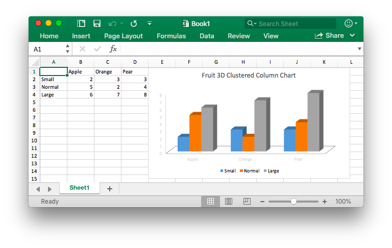

# Basic Usage

## Installation {#install}

The following table shows the minimum requirements of Go language with each Excelize released version:

Excelize Version | Minimum Go Language Version Requirements
---|---
v2.7.0 | 1.16
v2.4.0 ~ v2.6.1 | 1.15
v2.0.2 ~ v2.3.2 | 1.10
v1.0.0 ~ v2.0.1 | 1.6

Using the latest version Excelize library require to Go version 1.16 or later.

- Installation

```bash
go get github.com/xuri/excelize
```

- If your package management with [Go Modules](https://go.dev/blog/using-go-modules), please install with the following command.

```bash
go get github.com/xuri/excelize/v2
```

## Upgrade {#update}

- Upgrade

```bash
go get -u github.com/xuri/excelize/v2
```

## Create Excel document {#NewFile}

Here is a minimal example usage that will create spreadsheet file:

```go
package main

import (
    "fmt"

    "github.com/xuri/excelize/v2"
)

func main() {
    f := excelize.NewFile()
    defer func() {
        if err := f.Close(); err != nil {
            fmt.Println(err)
        }
    }()
    // Create a new sheet.
    index, err := f.NewSheet("Sheet2")
    if err != nil {
        fmt.Println(err)
        return
    }
    // Set value of a cell.
    f.SetCellValue("Sheet2", "A2", "Hello world.")
    f.SetCellValue("Sheet1", "B2", 100)
    // Set active sheet of the workbook.
    f.SetActiveSheet(index)
    // Save spreadsheet by the given path.
    if err := f.SaveAs("Book1.xlsx"); err != nil {
        fmt.Println(err)
    }
}
```

## Reading Excel document {#read}

The following constitutes the bare to read a spreadsheet document:

```go
package main

import (
    "fmt"

    "github.com/xuri/excelize/v2"
)

func main() {
    f, err := excelize.OpenFile("Book1.xlsx")
    if err != nil {
        fmt.Println(err)
        return
    }
    defer func() {
        // Close the spreadsheet.
        if err := f.Close(); err != nil {
            fmt.Println(err)
        }
    }()
    // Get value from cell by given worksheet name and cell reference.
    cell, err := f.GetCellValue("Sheet1", "B2")
    if err != nil {
        fmt.Println(err)
        return
    }
    fmt.Println(cell)
    // Get all the rows in the Sheet1.
    rows, err := f.GetRows("Sheet1")
    if err != nil {
        fmt.Println(err)
        return
    }
    for _, row := range rows {
        for _, colCell := range row {
            fmt.Print(colCell, "\t")
        }
        fmt.Println()
    }
}
```

## Add chart to Excel document {#chart}

With Excelize chart generation and management is as easy as a few lines of code. You can build charts based on data in your worksheet or generate charts without any data in your worksheet at all.

<p align="center"></p>

```go
package main

import (
    "fmt"

    "github.com/xuri/excelize/v2"
)

func main() {
    f := excelize.NewFile()
    defer func() {
        if err := f.Close(); err != nil {
            fmt.Println(err)
        }
    }()
    for idx, row := range [][]interface{}{
        {nil, "Apple", "Orange", "Pear"}, {"Small", 2, 3, 3},
        {"Normal", 5, 2, 4}, {"Large", 6, 7, 8},
    } {
        cell, err := excelize.CoordinatesToCellName(1, idx+1)
        if err != nil {
            fmt.Println(err)
            return
        }
        f.SetSheetRow("Sheet1", cell, &row)
    }
    if err := f.AddChart("Sheet1", "E1", &excelize.Chart{
        Type: excelize.Col3DClustered,
        Series: []excelize.ChartSeries{
            {
                Name:       "Sheet1!$A$2",
                Categories: "Sheet1!$B$1:$D$1",
                Values:     "Sheet1!$B$2:$D$2",
            },
            {
                Name:       "Sheet1!$A$3",
                Categories: "Sheet1!$B$1:$D$1",
                Values:     "Sheet1!$B$3:$D$3",
            },
            {
                Name:       "Sheet1!$A$4",
                Categories: "Sheet1!$B$1:$D$1",
                Values:     "Sheet1!$B$4:$D$4",
            }},
        Title: excelize.ChartTitle{
            Name: "Fruit 3D Clustered Column Chart",
        },
    }); err != nil {
        fmt.Println(err)
        return
    }
    // Save spreadsheet by the given path.
    if err := f.SaveAs("Book1.xlsx"); err != nil {
        fmt.Println(err)
    }
}
```

## Add picture to Excel document {#image}

```go
package main

import (
    "fmt"
    _ "image/gif"
    _ "image/jpeg"
    _ "image/png"

    "github.com/xuri/excelize/v2"
)

func main() {
    f, err := excelize.OpenFile("Book1.xlsx")
    if err != nil {
        fmt.Println(err)
        return
    }
    defer func() {
        // Close the spreadsheet.
        if err := f.Close(); err != nil {
            fmt.Println(err)
        }
    }()
    // Insert a picture.
    if err := f.AddPicture("Sheet1", "A2", "image.png", nil); err != nil {
        fmt.Println(err)
    }
    // Insert a picture to worksheet with scaling.
    if err := f.AddPicture("Sheet1", "D2", "image.jpg",
        &excelize.GraphicOptions{ScaleX: 0.5, ScaleY: 0.5}); err != nil {
        fmt.Println(err)
    }
    // Insert a picture offset in the cell with printing support.
    enable, disable := true, false
    if err := f.AddPicture("Sheet1", "H2", "image.gif",
        &excelize.GraphicOptions{
            PrintObject:     &enable,
            LockAspectRatio: false,
            OffsetX:         15,
            OffsetY:         10,
            Locked:          &disable,
        }); err != nil {
        fmt.Println(err)
    }
    // Save the spreadsheet with the origin path.
    if err = f.Save(); err != nil {
        fmt.Println(err)
    }
}
```
