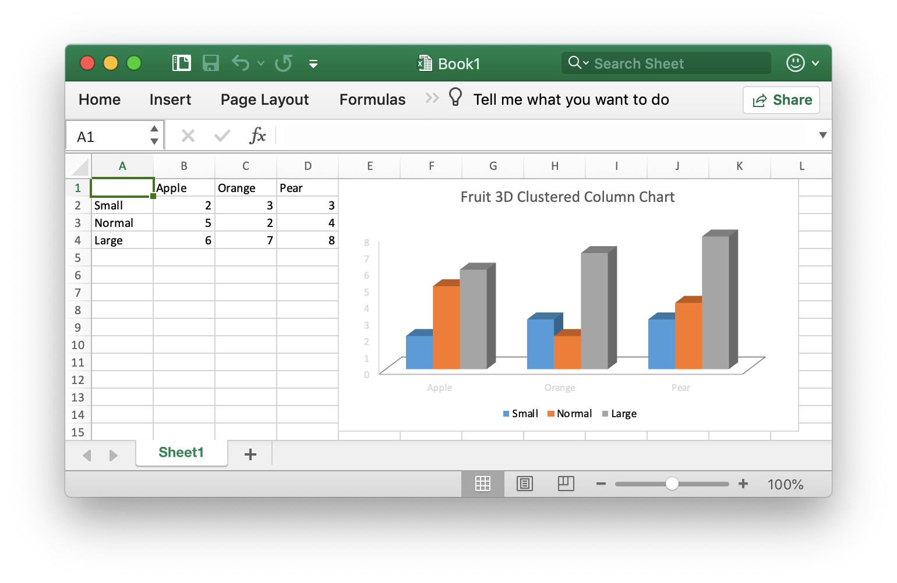

# Basic Usage

## Installation {#install}

Using Excelize library needs Go version 1.8 or later.

- Installation

```go
go get github.com/360EntSecGroup-Skylar/excelize
```

## Upgrade {#update}

- Upgrade

```go
go get -u github.com/360EntSecGroup-Skylar/excelize
```

## Create Excel document {#NewFile}

Here is a minimal example usage that will create XLSX file:

```go
package main

import (
    "fmt"

    "github.com/360EntSecGroup-Skylar/excelize"
)

func main() {
    xlsx := excelize.NewFile()
    // Create a new sheet.
    index := xlsx.NewSheet("Sheet2")
    // Set value of a cell.
    xlsx.SetCellValue("Sheet2", "A2", "Hello world.")
    xlsx.SetCellValue("Sheet1", "B2", 100)
    // Set active sheet of the workbook.
    xlsx.SetActiveSheet(index)
    // Save xlsx file by the given path.
    err := xlsx.SaveAs("./Book1.xlsx")
    if err != nil {
        fmt.Println(err)
    }
}
```

## Reading Excel document {#read}

The following constitutes the bare to read a XLSX document:

```go
package main

import (
    "fmt"

    "github.com/360EntSecGroup-Skylar/excelize"
)

func main() {
    xlsx, err := excelize.OpenFile("./Book1.xlsx")
    if err != nil {
        fmt.Println(err)
        return
    }
    // Get value from cell by given worksheet name and axis.
    cell := xlsx.GetCellValue("Sheet1", "B2")
    fmt.Println(cell)
    // Get all the rows in the Sheet1.
    rows := xlsx.GetRows("Sheet1")
    for _, row := range rows {
        for _, colCell := range row {
            fmt.Print(colCell, "\t")
        }
        fmt.Println()
    }
}
```

## Add chart to Excel document {#chart}

With Excelize chart generation and management is as easy as a few lines of code. You can build charts based off data in your worksheet or generate charts without any data in your worksheet at all.

<p align="center"></p>

```go
package main

import (
    "fmt"

    "github.com/360EntSecGroup-Skylar/excelize"
)

func main() {
    categories := map[string]string{"A2": "Small", "A3": "Normal", "A4": "Large", "B1": "Apple", "C1": "Orange", "D1": "Pear"}
    values := map[string]int{"B2": 2, "C2": 3, "D2": 3, "B3": 5, "C3": 2, "D3": 4, "B4": 6, "C4": 7, "D4": 8}
    xlsx := excelize.NewFile()
    for k, v := range categories {
        xlsx.SetCellValue("Sheet1", k, v)
    }
    for k, v := range values {
        xlsx.SetCellValue("Sheet1", k, v)
    }
    xlsx.AddChart("Sheet1", "E1", `{"type":"col3DClustered","series":[{"name":"Sheet1!$A$2","categories":"Sheet1!$B$1:$D$1","values":"Sheet1!$B$2:$D$2"},{"name":"Sheet1!$A$3","categories":"Sheet1!$B$1:$D$1","values":"Sheet1!$B$3:$D$3"},{"name":"Sheet1!$A$4","categories":"Sheet1!$B$1:$D$1","values":"Sheet1!$B$4:$D$4"}],"title":{"name":"Fruit 3D Clustered Column Chart"}}`)
    // Save xlsx file by the given path.
    err := xlsx.SaveAs("./Book1.xlsx")
    if err != nil {
        fmt.Println(err)
    }
}
```

## Add picture to Excel document {#image}

```go
package main

import (
    "fmt"
    _ "image/gif"
    _ "image/jpeg"
    _ "image/png"

    "github.com/360EntSecGroup-Skylar/excelize"
)

func main() {
    xlsx, err := excelize.OpenFile("./Book1.xlsx")
    if err != nil {
        fmt.Println(err)
        return
    }
    // Insert a picture.
    err = xlsx.AddPicture("Sheet1", "A2", "./image1.png", "")
    if err != nil {
        fmt.Println(err)
    }
    // Insert a picture to worksheet with scaling.
    err = xlsx.AddPicture("Sheet1", "D2", "./image2.jpg", `{"x_scale": 0.5, "y_scale": 0.5}`)
    if err != nil {
        fmt.Println(err)
    }
    // Insert a picture offset in the cell with printing support.
    err = xlsx.AddPicture("Sheet1", "H2", "./image3.gif", `{"x_offset": 15, "y_offset": 10, "print_obj": true, "lock_aspect_ratio": false, "locked": false}`)
    if err != nil {
        fmt.Println(err)
    }
    // Save the xlsx file with the origin path.
    err = xlsx.Save()
    if err != nil {
        fmt.Println(err)
    }
}
```