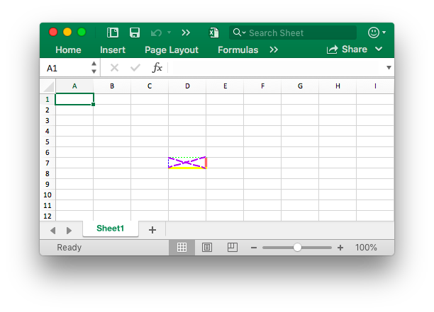
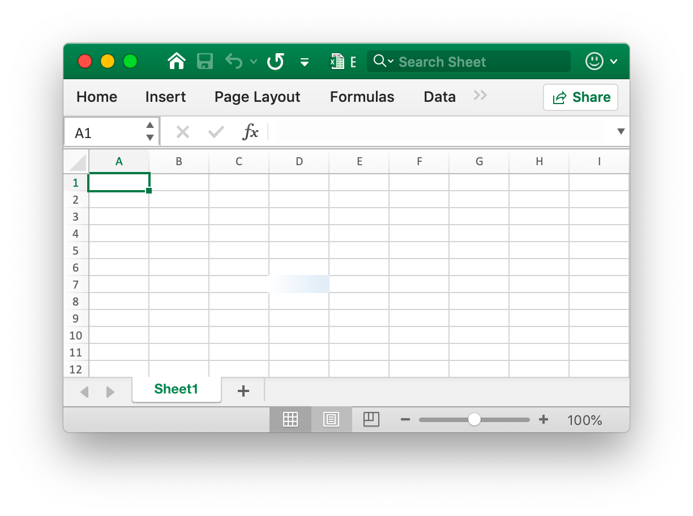
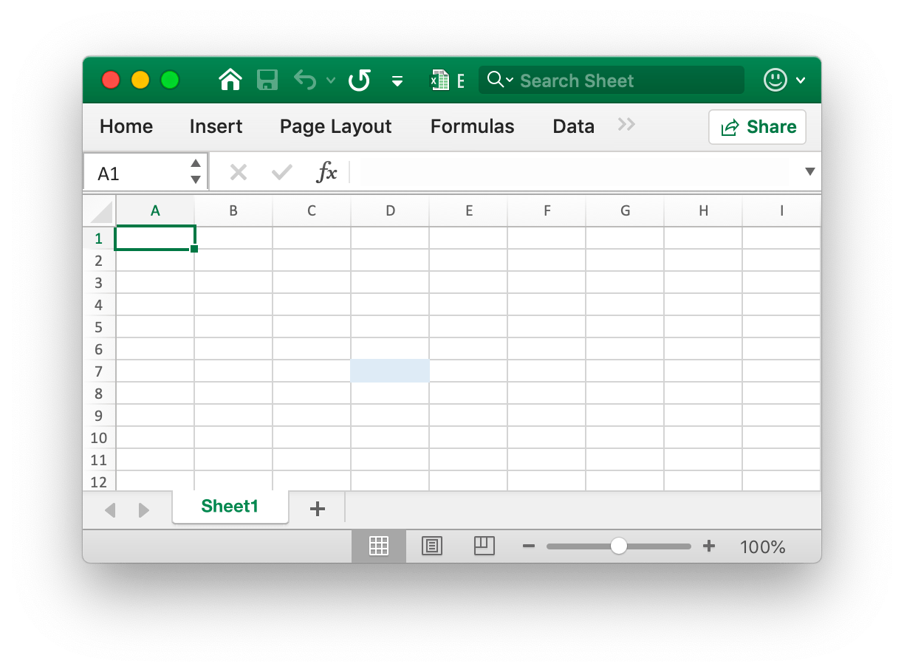
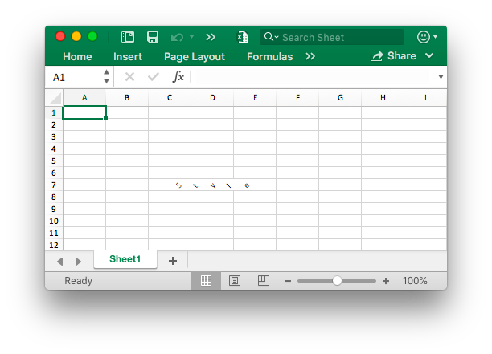
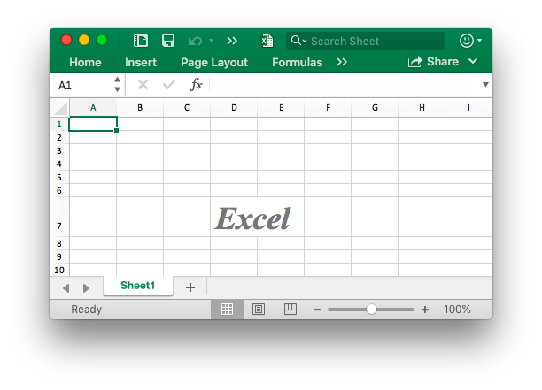
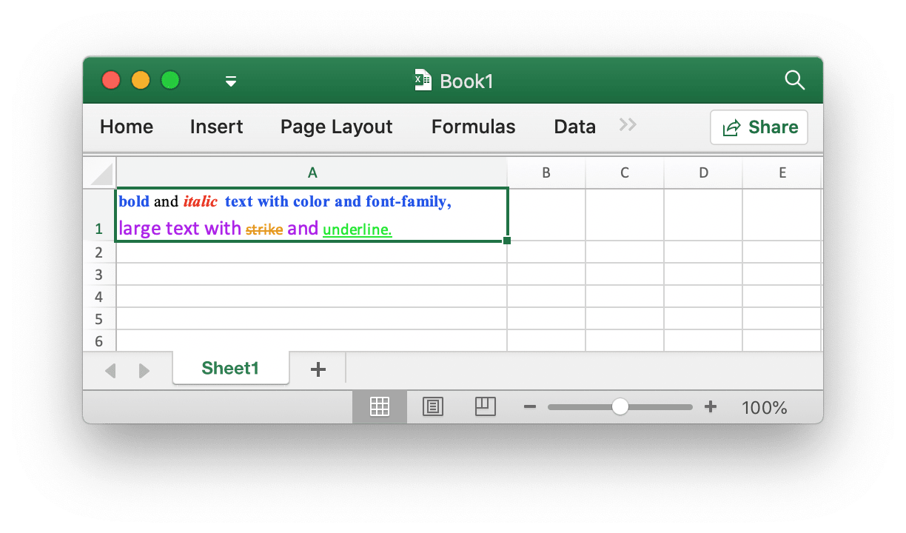
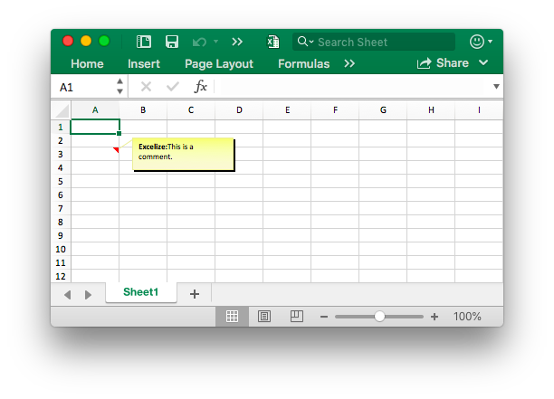

# Cell

`RichTextRun` directly maps the settings of the rich text run.

```go
type RichTextRun struct {
    Font *Font
    Text string
}
```

`HyperlinkOpts` can be passed to [`SetCellHyperlink`](cell.md#SetCellHyperlink) to set optional hyperlink attributes (e.g. text to display and screen tip text).

```go
type HyperlinkOpts struct {
    Display *string
    Tooltip *string
}
```

`FormulaOpts` can be passed to [`SetCellFormula`](cell.md#SetCellFormula) to use other formula types.

```go
type FormulaOpts struct {
    Type *string // Formula type
    Ref  *string // Shared formula reference
}
```

## Set cell value {#SetCellValue}

```go
func (f *File) SetCellValue(sheet, cell string, value interface{}) error
```

SetCellValue provides a function to set the value of a cell. This function is concurrency safe. The specified coordinates should not be in the first row of the table, a complex number can be set with string text. The following shows the supported data types:

|Supported data types|
|---|
|int|
|int8|
|int16|
|int32|
|int64|
|uint|
|uint8|
|uint16|
|uint32|
|uint64|
|float32|
|float64|
|string|
|[]byte|
|time.Duration|
|time.Time|
|bool|
|nil|

Note that default date format is `m/d/yy h:mm` of `time.Time` type value. You can set numbers format by the [`SetCellStyle`](cell.md#SetCellStyle) function. If you need to set the specialized date in Excel like January 0, 1900 or February 29, 1900, these times can not representation in Go language `time.Time` data type. Please set the cell value as number 0 or 60, then create and bind the date-time number format style for the cell.

## Set boolean value {#SetCellBool}

```go
func (f *File) SetCellBool(sheet, cell string, value bool) error
```

SetCellBool provides a function to set the bool type value of a cell by given worksheet name, cell reference, and cell value.

## Set RAW value {#SetCellDefault}

```go
func (f *File) SetCellDefault(sheet, cell, value string) error
```

SetCellDefault provides a function to set the string type value of a cell as a default format without escaping the cell.

## Set integer value {#SetCellInt}

```go
func (f *File) SetCellInt(sheet, cell string, value int64) error
```

SetCellInt provides a function to set the `int64` type value of a cell by given worksheet name, cell reference, and cell value.

## Set unsigned integer value {#SetCellUint}

```go
func (f *File) SetCellUint(sheet, cell string, value uint64) error
```

SetCellUint provides a function to set unsigned integer data type value of a cell by given worksheet name, cell reference and cell value.

## Set floating point value {#SetCellFloat}

```go
func (f *File) SetCellFloat(sheet, cell string, value float64, precision, bitSize int) error
```

SetCellFloat sets a floating point value into a cell. The `precision` parameter specifies how many places after the decimal will be shown while `-1` is a special value that will use as many decimal places as necessary to represent the number. `bitSize` is `32` or `64` depending on if a `float32` or `float64` was originally used for the value.

## Set string value {#SetCellStr}

```go
func (f *File) SetCellStr(sheet, cell, value string) error
```

SetCellStr provides a function to set the string type value of a cell. The total number of characters that a cell can contain `32767` characters.

## Set cell style {#SetCellStyle}

```go
func (f *File) SetCellStyle(sheet, topLeftCell, bottomRightCell string, styleID int) error
```

SetCellStyle provides a function to add style attribute for cells by given worksheet name, range reference and style ID. This function is concurrency safe. Style indexes can be obtained with the [`NewStyle`](style.md#NewStyle) function. Note that `diagonalDown` and `diagonalUp` type border should use the same color in the same range. SetCellStyle will overwrite the existing styles for the cell, it won't append or merge style with existing styles.

- Example 1, create borders of cell `D7` on `Sheet1`:

```go
style, err := f.NewStyle(&excelize.Style{
    Border: []excelize.Border{
        {Type: "left", Color: "0000FF", Style: 3},
        {Type: "top", Color: "00FF00", Style: 4},
        {Type: "bottom", Color: "FFFF00", Style: 5},
        {Type: "right", Color: "FF0000", Style: 6},
        {Type: "diagonalDown", Color: "A020F0", Style: 8},
        {Type: "diagonalUp", Color: "A020F0", Style: 8},
    },
})
if err != nil {
    fmt.Println(err)
}
err = f.SetCellStyle("Sheet1", "D7", "D7", style)
```

<p align="center"></p>

The four borders of the cell `D7` are set with different styles and colors. This is related to the parameters when calling the [`NewStyle`](style.md#NewStyle) function. You need to set different styles to refer to the documentation for that chapter.

- Example 2, setting the gradient style for the worksheet `D7` cell named `Sheet1`:

```go
style, err := f.NewStyle(&excelize.Style{
    Fill: excelize.Fill{Type: "gradient", Color: []string{"FFFFFF", "E0EBF5"}, Shading: 1},
})
if err != nil {
    fmt.Println(err)
}
err = f.SetCellStyle("Sheet1", "D7", "D7", style)
```

<p align="center"></p>

The cell `D7` is set with the color fill of the gradient effect. The gradient fill effect is related to the parameter when the [`NewStyle`](style.md#NewStyle) function is called. You need to set different styles to refer to the documentation of this chapter.

- Example 3, set a solid fill for the `D7` cell named `Sheet1`:

```go
style, err := f.NewStyle(&excelize.Style{
    Fill: excelize.Fill{Type: "pattern", Color: []string{"E0EBF5"}, Pattern: 1},
})
if err != nil {
    fmt.Println(err)
}
err = f.SetCellStyle("Sheet1", "D7", "D7", style)
```

<p align="center"></p>

The cell `D7` is set with a solid fill.

- Example 4, set the character spacing and rotation angle for the `D7` cell named `Sheet1`:

```go
f.SetCellValue("Sheet1", "D7", "Style")
style, err := f.NewStyle(&excelize.Style{
    Alignment: &excelize.Alignment{
        Horizontal:      "center",
        Indent:          1,
        JustifyLastLine: true,
        ReadingOrder:    0,
        RelativeIndent:  1,
        ShrinkToFit:     true,
        TextRotation:    45,
        Vertical:        "",
        WrapText:        true,
    },
})
if err != nil {
    fmt.Println(err)
}
err = f.SetCellStyle("Sheet1", "D7", "D7", style)
```

<p align="center"></p>

- Example 5, the date and time in Excel are represented by real numbers, for example `2017/7/4 12:00:00 PM` can be represented by the number `42920.5`. Set the time format for the worksheet `D7` cell named `Sheet1`:

```go
f.SetCellValue("Sheet1", "D7", 42920.5)
f.SetColWidth("Sheet1", "D", "D", 13)
style, err := f.NewStyle(&excelize.Style{NumFmt: 22})
if err != nil {
    fmt.Println(err)
}
err = f.SetCellStyle("Sheet1", "D7", "D7", style)
```

<p align="center"></p>

The cell `D7` is set to the time format. Note that when the cell width with the time format applied is too narrow to be fully displayed, it will be displayed as `####`, you can drag and drop the column width or set the column to the appropriate size by calling the `SetColWidth` function to make it normal display.

- Example 6, setting the font, font size, color, and skew style for the worksheet `D7` cell named `Sheet1`:

```go
f.SetCellValue("Sheet1", "D7", "Excel")
style, err := f.NewStyle(&excelize.Style{
    Font: &excelize.Font{
        Bold:   true,
        Italic: true,
        Family: "Times New Roman",
        Size:   36,
        Color:  "777777",
    },
})
if err != nil {
    fmt.Println(err)
}
err = f.SetCellStyle("Sheet1", "D7", "D7", style)
```

<p align="center"></p>

- Example 7, locking and hiding the worksheet `D7` cell named `Sheet1`:

```go
style, err := f.NewStyle(&excelize.Style{
    Protection: &excelize.Protection{
        Hidden: true,
        Locked: true,
    },
})
if err != nil {
    fmt.Println(err)
}
err = f.SetCellStyle("Sheet1", "D7", "D7", style)
```

To lock a cell or hide a formula, protect the worksheet. On the "Review" tab, click "Protect Worksheet".

## Set hyperlink {#SetCellHyperLink}

```go
func (f *File) SetCellHyperLink(sheet, cell, link, linkType string, opts ...HyperlinkOpts) error
```

SetCellHyperLink provides a function to set cell hyperlinks by given worksheet name and link URL address. LinkType defines two types of hyperlinks `External` for the website or `Location` for moving to one of the cells in this workbook. The maximum limit of hyperlinks in a worksheet is `65530`. This function is only used to set the hyperlink of the cell and doesn't affect the value of the cell. If you need to set the value of the cell, please use the other functions such as [`SetCellStyle`](cell.md#SetCellStyle) or [`SetSheetRow`](sheet.md#SetSheetRow). Below is an example of an external link.

- Example 1, adding an external link to the `A3` cell of the worksheet named `Sheet1`:

```go
display, tooltip := "https://github.com/xuri/excelize", "Excelize on GitHub"
if err := f.SetCellHyperLink("Sheet1", "A3",
    "https://github.com/xuri/excelize", "External", excelize.HyperlinkOpts{
        Display: &display,
        Tooltip: &tooltip,
    }); err != nil {
    fmt.Println(err)
}
// Set the font and underline style for the cell
style, err := f.NewStyle(&excelize.Style{
    Font: &excelize.Font{Color: "1265BE", Underline: "single"},
})
if err != nil {
    fmt.Println(err)
}
err = f.SetCellStyle("Sheet1", "A3", "A3", style)
```

- Example 2, adding an internal location link to the `A3` cell named `Sheet1`:

```go
err := f.SetCellHyperLink("Sheet1", "A3", "Sheet1!A40", "Location")
```

## Set cell rich text {#SetCellRichText}

```go
func (f *File) SetCellRichText(sheet, cell string, runs []RichTextRun) error
```

SetCellRichText provides a function to set a cell with rich text by given worksheet.

For example, set rich text on the `A1` cell of the worksheet named `Sheet1`:

<p align="center"></p>

```go
package main

import (
    "fmt"

    "github.com/xuri/excelize/v2"
)

func main() {
    f := excelize.NewFile()
    defer func() {
        if err := f.Close(); err != nil {
            fmt.Println(err)
        }
    }()
    if err := f.SetRowHeight("Sheet1", 1, 35); err != nil {
        fmt.Println(err)
        return
    }
    if err := f.SetColWidth("Sheet1", "A", "A", 44); err != nil {
        fmt.Println(err)
        return
    }
    if err := f.SetCellRichText("Sheet1", "A1", []excelize.RichTextRun{
        {
            Text: "bold",
            Font: &excelize.Font{
                Bold:   true,
                Color:  "2354E8",
                Family: "Times New Roman",
            },
        },
        {
            Text: " and ",
            Font: &excelize.Font{
                Family: "Times New Roman",
            },
        },
        {
            Text: "italic ",
            Font: &excelize.Font{
                Bold:   true,
                Color:  "E83723",
                Italic: true,
                Family: "Times New Roman",
            },
        },
        {
            Text: "text with color and font-family,",
            Font: &excelize.Font{
                Bold:   true,
                Color:  "2354E8",
                Family: "Times New Roman",
            },
        },
        {
            Text: "\r\nlarge text with ",
            Font: &excelize.Font{
                Size:  14,
                Color: "AD23E8",
            },
        },
        {
            Text: "strike",
            Font: &excelize.Font{
                Color:  "E89923",
                Strike: true,
            },
        },
        {
            Text: " superscript",
            Font: &excelize.Font{
                Color:     "DBC21F",
                VertAlign: "superscript",
            },
        },
        {
            Text: " and ",
            Font: &excelize.Font{
                Size:      14,
                Color:     "AD23E8",
                VertAlign: "baseline",
            },
        },
        {
            Text: "underline",
            Font: &excelize.Font{
                Color:     "23E833",
                Underline: "single",
            },
        },
        {
            Text: " subscript.",
            Font: &excelize.Font{
                Color:     "017505",
                VertAlign: "subscript",
            },
        },
    }); err != nil {
        fmt.Println(err)
        return
    }
    style, err := f.NewStyle(&excelize.Style{
        Alignment: &excelize.Alignment{
            WrapText: true,
        },
    })
    if err != nil {
        fmt.Println(err)
        return
    }
    if err := f.SetCellStyle("Sheet1", "A1", "A1", style); err != nil {
        fmt.Println(err)
        return
    }
    if err := f.SaveAs("Book1.xlsx"); err != nil {
        fmt.Println(err)
    }
}
```

## Get cell rich text {#GetCellRichText}

```go
func (f *File) GetCellRichText(sheet, cell string) ([]RichTextRun, error)
```

GetCellRichText provides a function to get the rich text of cells by given worksheet.

## Get cell value {#GetCellValue}

```go
func (f *File) GetCellValue(sheet, cell string, opts ...Options) (string, error)
```

GetCellValue provides a function to get formatted value from cell by given worksheet name and cell reference in spreadsheet. The return value is converted to the `string` type. This function is concurrency safe. If the cell format can be applied to the value of a cell, the applied value will be returned, otherwise the original value will be returned. All cells' values will be the same in a merged range.

## Get cell type {#GetCellType}

```go
func (f *File) GetCellType(sheet, cell string) (CellType, error)
```

GetCellType provides a function to get the cell's data type by given worksheet name and cell reference in spreadsheet file.

## Get all cell value by cols {#GetCols}

```go
func (f *File) GetCols(sheet string, opts ...Options) ([][]string, error)
```

GetCols gets the value of all cells by columns on the worksheet based on the given worksheet name, returned as a two-dimensional array, where the value of the cell is converted to the `string` type. If the cell format can be applied to the value of the cell, the applied value will be used, otherwise the original value will be used.

For example, get and traverse the value of all cells by columns on a worksheet named `Sheet1`:

```go
cols, err := f.GetCols("Sheet1")
if err != nil {
    fmt.Println(err)
    return
}
for _, col := range cols {
    for _, rowCell := range col {
        fmt.Print(rowCell, "\t")
    }
    fmt.Println()
}
```

## Get all cell value by rows {#GetRows}

```go
func (f *File) GetRows(sheet string, opts ...Options) ([][]string, error)
```

GetRows return all the rows in a sheet by given worksheet name, returned as a two-dimensional array, where the value of the cell is converted to the `string` type. If the cell format can be applied to the value of the cell, the applied value will be used, otherwise the original value will be used. GetRows fetched the rows with value or formula cells, the continually blank cells in the tail of each row will be skipped, so the length of each row may be inconsistent.

For example, get and traverse the value of all cells by rows on a worksheet named `Sheet1`:

```go
rows, err := f.GetRows("Sheet1")
if err != nil {
    fmt.Println(err)
    return
}
for _, row := range rows {
    for _, colCell := range row {
        fmt.Print(colCell, "\t")
    }
    fmt.Println()
}
```

## Get hyperlink {#GetCellHyperLink}

```go
func (f *File) GetCellHyperLink(sheet, cell string) (bool, string, error)
```

GetCellHyperLink gets a cell hyperlink based on the given worksheet name and cell reference. If the cell has a hyperlink, it will return `true` and the link address, otherwise it will return `false` and an empty link address.

For example, get a hyperlink to a `H6` cell on a worksheet named `Sheet1`:

```go
link, target, err := f.GetCellHyperLink("Sheet1", "H6")
```

## Get style index {#GetCellStyle}

```go
func (f *File) GetCellStyle(sheet, cell string) (int, error)
```

The cell style index is obtained from the given worksheet name and cell reference, and the obtained index can be used as a parameter to call the `SetCellStyle` function when copying the cell style.

## Merge cells {#MergeCell}

```go
func (f *File) MergeCell(sheet, topLeftCell, bottomRightCell string) error
```

MergeCell provides a function to merge cells by given range reference and sheet name. Merging cells only keeps the upper-left cell value, and discards the other values. For example, merge cells in the `D3:E9` area on a worksheet named `Sheet1`:

```go
err := f.MergeCell("Sheet1", "D3", "E9")
```

If you create a merged cell that overlaps with another existing merged cell, those merged cells that already exist will be removed.

## Unmerge cells {#UnmergeCell}

```go
func (f *File) UnmergeCell(sheet, topLeftCell, bottomRightCell string) error
```

UnmergeCell provides a function to unmerge a given range reference. For example unmerge area `D3:E9` on `Sheet1`:

```go
err := f.UnmergeCell("Sheet1", "D3", "E9")
```

Attention: overlapped areas will also be unmerged.

## Get merge cells {#GetMergeCells}

```go
func (f *File) GetMergeCells(sheet string, withoutValues ...bool) ([]MergeCell, error)
```

GetMergeCells provides a function to get all merged cells from a specific worksheet. If the `withoutValues` parameter is set to `true`, it will not return the cell values of merged cells, only the range reference will be returned. For example get all merged cells on `Sheet1`:

```go
mergeCells, err := f.GetMergeCells("Sheet1")
```

If you want to get merged cells without cell values, you can use the following code:

```go
mergeCells, err := f.GetMergeCells("Sheet1", true)
```

### Get merged cell value

```go
func (m *MergeCell) GetCellValue() string
```

GetCellValue returns merged cell value.

### Get the top left cell reference of merged range

```go
func (m *MergeCell) GetStartAxis() string
```

GetStartAxis returns the top left cell reference of merged range, for example: `C2`.

### Get the bottom right cell reference of merged range

```go
func (m *MergeCell) GetEndAxis() string
```

GetEndAxis returns the bottom right cell reference of merged range, for example: `D4`.

## Get picture cells {#GetPictureCells}

```go
func (f *File) GetPictureCells(sheet string) ([]string, error)
```

GetPictureCells returns all picture cell references in a worksheet by a specific worksheet name.

## Add comment {#AddComment}

```go
func (f *File) AddComment(sheet string, comment Comment) error
```

AddComment provides the method to add comments in a sheet by given worksheet index, cell and format set (such as author and text). Note that the max author length is 255 and the max text length is 32512. For example, add a comment in `Sheet1!$A$3`:

<p align="center"></p>

```go
err := f.AddComment("Sheet1", excelize.Comment{
    Cell:   "A3",
    Author: "Excelize",
    Paragraph: []excelize.RichTextRun{
        {Text: "Excelize: ", Font: &excelize.Font{Bold: true}},
        {Text: "This is a comment."},
    },
})
```

## Get comment {#GetComments}

```go
func (f *File) GetComments(sheet string) ([]Comment, error)
```

GetComments retrieves all comments in a worksheet by given worksheet name.

## Delete comment {#DeleteComment}

```go
func (f *File) DeleteComment(sheet, cell string) error
```

DeleteComment provides the method to delete comment in a sheet by given worksheet name. For example, delete the comment in `Sheet1!$A$30`:

```go
err := f.DeleteComment("Sheet1", "A30")
```

## Add ignored errors {#AddIgnoredErrors}

```go
func (f *File) AddIgnoredErrors(sheet, rangeRef string, ignoredErrorsType IgnoredErrorsType) error
```

AddIgnoredErrors provides the method to ignored error for a range of cells. For example: ignore "number stored as text" error on `Sheet1` for range of cells `D15 C18:D19`:

```go
err := f.AddIgnoredErrors("Sheet1", "D15 C18:D19", excelize.IgnoredErrorsNumberStoredAsText)
```

## Set cell formula {#SetCellFormula}

```go
func (f *File) SetCellFormula(sheet, cell, formula string, opts ...FormulaOpts) error
```

SetCellFormula provides a function to set the formula on the cell is taken according to the given worksheet name and cell formula settings. The result of the formula cell can be calculated when the worksheet is opened by the Office Excel application or can be using the [CalcCellValue](cell.md#CalcCellValue) function also can get the calculated cell value. If the Excel application doesn't calculate the formula automatically when the workbook has been opened, please call [UpdateLinkedValue](utils.md#UpdateLinkedValue) after setting the cell formula functions.

- Example 1, set normal formula `=SUM(A1,B1)` for the cell `A3` on `Sheet1`:

```go
err := f.SetCellFormula("Sheet1", "A3", "SUM(A1,B1)")
```

- Example 2, set one-dimensional vertical constant array (column array) formula `1;2;3` for the cell `A3` on `Sheet1`:

```go
err := f.SetCellFormula("Sheet1", "A3", "{1;2;3}")
```

- Example 3, set one-dimensional horizontal constant array (row array) formula `"a","b","c"` for the cell `A3` on `Sheet1`:

```go
err := f.SetCellFormula("Sheet1", "A3", "{\"a\",\"b\",\"c\"}")
```

- Example 4, set two-dimensional constant array formula `{1,2;"a","b"}` for the cell `A3` on `Sheet1`:

```go
formulaType, ref := excelize.STCellFormulaTypeArray, "A3:A3"
err := f.SetCellFormula("Sheet1", "A3", "{1,2;\"a\",\"b\"}",
    excelize.FormulaOpts{Ref: &ref, Type: &formulaType})
```

- Example 5, set range array formula `A1:A2` for the cell `A3` on `Sheet1`:

```go
formulaType, ref := excelize.STCellFormulaTypeArray, "A3:A3"
err := f.SetCellFormula("Sheet1", "A3", "A1:A2",
    excelize.FormulaOpts{Ref: &ref, Type: &formulaType})
```

- Example 6, set shared formula `=A1+B1` for the cells `C1:C5` on `Sheet1`, `C1` is the master cell:

```go
formulaType, ref := excelize.STCellFormulaTypeShared, "C1:C5"
err := f.SetCellFormula("Sheet1", "C1", "A1+B1",
    excelize.FormulaOpts{Ref: &ref, Type: &formulaType})
```

- Example 7, set table formula `=SUM(Table1[[A]:[B]])` for the cell `C2` on `Sheet1`:

```go
package main

import (
    "fmt"

    "github.com/xuri/excelize/v2"
)

func main() {
    f := excelize.NewFile()
    defer func() {
        if err := f.Close(); err != nil {
            fmt.Println(err)
        }
    }()
    for idx, row := range [][]interface{}{{"A", "B", "C"}, {1, 2}} {
        if err := f.SetSheetRow("Sheet1", fmt.Sprintf("A%d", idx+1), &row); err != nil {
            fmt.Println(err)
            return
        }
    }
    if err := f.AddTable("Sheet1",
        &excelize.Table{
            Range:     "A1:C2",
            Name:      "Table1",
            StyleName: "TableStyleMedium2",
        }); err != nil {
        fmt.Println(err)
        return
    }
    formulaType := excelize.STCellFormulaTypeDataTable
    if err := f.SetCellFormula("Sheet1", "C2", "SUM(Table1[[A]:[B]])",
        excelize.FormulaOpts{Type: &formulaType}); err != nil {
        fmt.Println(err)
        return
    }
    if err := f.SaveAs("Book1.xlsx"); err != nil {
        fmt.Println(err)
    }
}
```

## Get cell formula {#GetCellFormula}

```go
func (f *File) GetCellFormula(sheet, cell string) (string, error)
```

GetCellFormula provides a function to get formula from cell by given worksheet name and cell reference in spreadsheet.

## Calculate cell value {#CalcCellValue}

```go
func (f *File) CalcCellValue(sheet, cell string, opts ...Options) (string, error)
```

CalcCellValue provides a function to get calculated cell value. This feature is currently in working processing. Iterative calculation, implicit intersection, explicit intersection, array formula, table formula and some other formulas are not supported currently.

Supported formulas:

Function name | Description
---|---
ABS                      | Returns the absolute value of a number
ACCRINT                  | Returns the accrued interest for a security that pays periodic interest
ACCRINTM                 | Returns the accrued interest for a security that pays interest at maturity
ACOS                     | Returns the arccosine of a number
ACOSH                    | Returns the inverse hyperbolic cosine of a number
ACOT                     | Returns the arccotangent of a number
ACOTH                    | Returns the hyperbolic arccotangent of a number
AGGREGATE                | Returns an aggregate in a list or database
ADDRESS                  | Returns a reference as text to a single cell in a worksheet
AMORDEGRC                | Returns the depreciation for each accounting period by using a depreciation coefficient
AMORLINC                 | Returns the depreciation for each accounting period
AND                      | Returns TRUE if all of its arguments are TRUE
ARABIC                   | Converts a Roman number to Arabic, as a number
ARRAYTOTEXT              | Returns an array of text values from any specified range
ASIN                     | Returns the arcsine of a number
ASINH                    | Returns the inverse hyperbolic sine of a number
ATAN                     | Returns the arctangent of a number
ATAN2                    | Returns the arctangent from x- and y-coordinates
ATANH                    | Returns the inverse hyperbolic tangent of a number
AVEDEV                   | Returns the average of the absolute deviations of data points from their mean
AVERAGE                  | Returns the average of its arguments
AVERAGEA                 | Returns the average of its arguments, including numbers, text, and logical values
AVERAGEIF                | Returns the average (arithmetic mean) of all the cells in a range that meet a given criteria
AVERAGEIFS               | Returns the average (arithmetic mean) of all cells that meet multiple criteria.
BAHTTEXT                 | Converts a number to Thai text and adds a suffix of "Baht."
BASE                     | Converts a number into a text representation with the given radix (base)
BESSELI                  | Returns the modified Bessel function In(x)
BESSELJ                  | Returns the Bessel function Jn(x)
BESSELK                  | Returns the modified Bessel function Kn(x)
BESSELY                  | Returns the Bessel function Yn(x)
BETADIST                 | Returns the beta cumulative distribution function
BETA.DIST                | Returns the beta cumulative distribution function
BETAINV                  | Returns the inverse of the cumulative distribution function for a specified beta distribution
BETA.INV                 | Returns the inverse of the cumulative distribution function for a specified beta distribution
BIN2DEC                  | Converts a binary number to decimal
BIN2HEX                  | Converts a binary number to hexadecimal
BIN2OCT                  | Converts a binary number to octal
BINOMDIST                | Returns the individual term binomial distribution probability
BINOM.DIST               | Returns the individual term binomial distribution probability
BINOM.DIST.RANGE         | Returns the probability of a trial result using a binomial distribution
BINOM.INV                | Returns the smallest value for which the cumulative binomial distribution is less than or equal to a criterion value
BITAND                   | Returns a 'Bitwise And' of two numbers
BITLSHIFT                | Returns a value number shifted left by shift_amount bits
BITOR                    | Returns a bitwise OR of 2 numbers
BITRSHIFT                | Returns a value number shifted right by shift_amount bits
BITXOR                   | Returns a bitwise 'Exclusive Or' of two numbers
CEILING                  | Rounds a number to the nearest integer or to the nearest multiple of significance
CEILING.MATH             | Rounds a number up, to the nearest integer or to the nearest multiple of significance
CEILING.PRECISE          | Rounds a number the nearest integer or to the nearest multiple of significance. Regardless of the sign of the number, the number is rounded up.
CHAR                     | Returns the character specified by the code number
CHIDIST                  | Returns the one-tailed probability of the chi-squared distribution
CHIINV                   | Returns the inverse of the one-tailed probability of the chi-squared distribution
CHITEST                  | Returns the test for independence
CHISQ.DIST               | Returns the cumulative beta probability density function
CHISQ.DIST.RT            | Returns the one-tailed probability of the chi-squared distribution
CHISQ.INV                | Returns the cumulative beta probability density function
CHISQ.INV.RT             | Returns the inverse of the one-tailed probability of the chi-squared distribution
CHISQ.TEST               | Returns the test for independence
CHOOSE                   | Chooses a value from a list of values
CLEAN                    | Removes all nonprintable characters from text
CODE                     | Returns a numeric code for the first character in a text string
COLUMN                   | Returns the column number of a reference
COLUMNS                  | Returns the number of columns in a reference
COMBIN                   | Returns the number of combinations for a given number of objects
COMBINA                  | Returns the number of combinations with repetitions for a given number of items
COMPLEX                  | Converts real and imaginary coefficients into a complex number
CONCAT                   | Combines the text from multiple ranges and/or strings, but it doesn't provide the delimiter or IgnoreEmpty arguments.
CONCATENATE              | Joins several text items into one text item
CONFIDENCE               | Returns the confidence interval for a population mean
CONFIDENCE.NORM          | Returns the confidence interval for a population mean
CONFIDENCE.T             | Returns the confidence interval for a population mean, using a Student's t distribution
CONVERT                  | Converts a number from one measurement system to another
CORREL                   | Returns the correlation coefficient between two data sets
COS                      | Returns the cosine of a number
COSH                     | Returns the hyperbolic cosine of a number
COT                      | Returns the hyperbolic cosine of a number
COTH                     | Returns the cotangent of an angle
COUNT                    | Counts how many numbers are in the list of arguments
COUNTA                   | Counts how many values are in the list of arguments
COUNTBLANK               | Counts the number of blank cells within a range
COUNTIF                  | Counts the number of cells within a range that meet the given criteria
COUNTIFS                 | Counts the number of cells within a range that meet multiple criteria
COUPDAYBS                | Returns the number of days from the beginning of the coupon period to the settlement date
COUPDAYS                 | Returns the number of days in the coupon period that contains the settlement date
COUPDAYSNC               | Returns the number of days from the settlement date to the next coupon date
COUPNCD                  | Returns the next coupon date after the settlement date
COUPNUM                  | Returns the number of coupons payable between the settlement date and maturity date
COUPPCD                  | Returns the previous coupon date before the settlement date
COVAR                    | Returns covariance, the average of the products of paired deviations
COVARIANCE.P             | Returns covariance, the average of the products of paired deviations
COVARIANCE.S             | Returns the sample covariance, the average of the products deviations for each data point pair in two data sets
CRITBINOM                | Returns the smallest value for which the cumulative binomial distribution is less than or equal to a criterion value
CSC                      | Returns the cosecant of an angle
CSCH                     | Returns the hyperbolic cosecant of an angle
CUMIPMT                  | Returns the cumulative interest paid between two periods
CUMPRINC                 | Returns the cumulative principal paid on a loan between two periods
DATE                     | Returns the serial number of a particular date
DATEDIF                  | Calculates the number of days, months, or years between two dates. This function is useful in formulas where you need to calculate an age.
DATEVALUE                | Converts a date in the form of text to a serial number
DAVERAGE                 | Returns the average of selected database entries
DAY                      | Converts a serial number to a day of the month
DAYS                     | Returns the number of days between two dates
DAYS360                  | Calculates the number of days between two dates based on a 360-day year
DB                       | Returns the depreciation of an asset for a specified period by using the fixed-declining balance method
DCOUNT                   | Counts the cells that contain numbers in a database
DCOUNTA                  | Counts non blank cells in a database
DDB                      | Returns the depreciation of an asset for a specified period by using the double-declining balance method or some other method that you specify
DEC2BIN                  | Converts a decimal number to binary
DEC2HEX                  | Converts a decimal number to hexadecimal
DEC2OCT                  | Converts a decimal number to octal
DECIMAL                  | Converts a text representation of a number in a given base into a decimal number
DEGREES                  | Converts radians to degrees
DELTA                    | Tests whether two values are equal
DEVSQ                    | Returns the sum of squares of deviations
DGET                     | Extracts from a database a single record that matches the specified criteria
DISC                     | Returns the discount rate for a security
DMAX                     | Returns the maximum value from selected database entries
DMIN                     | Returns the minimum value from selected database entries
DOLLAR                   | Converts a number to text using currency format, with the decimals rounded to the number of places you specify
DOLLARDE                 | Converts a dollar price, expressed as a fraction, into a dollar price, expressed as a decimal number
DOLLARFR                 | Converts a dollar price, expressed as a decimal number, into a dollar price, expressed as a fraction
DPRODUCT                 | Multiplies the values in a particular field of records that match the criteria in a database
DSTDEV                   | Estimates the standard deviation based on a sample of selected database entries
DSTDEVP                  | Calculates the standard deviation based on the entire population of selected database entries
DSUM                     | Adds the numbers in the field column of records in the database that match the criteria
DURATION                 | Returns the annual duration of a security with periodic interest payments
DVAR                     | Estimates variance based on a sample from selected database entries
DVARP                    | Calculates variance based on the entire population of selected database entries
EDATE                    | Returns the serial number of the date that is the indicated number of months before or after the start date
EFFECT                   | Returns the effective annual interest rate
ENCODEURL                | Returns a URL-encoded string
EOMONTH                  | Returns the serial number of the last day of the month before or after a specified number of months
ERF                      | Returns the error function
ERF.PRECISE              | Returns the error function
ERFC                     | Returns the complementary error function
ERFC.PRECISE             | Returns the complementary ERF function integrated between x and infinity
ERROR.TYPE               | Returns a number corresponding to an error type
EUROCONVERT              | Converts a number to euros, converts a number from euros to a euro member currency, or converts a number from one euro member currency to another by using the euro as an intermediary (triangulation).
EVEN                     | Rounds a number up to the nearest even integer
EXACT                    | Checks to see if two text values are identical
EXP                      | Returns e raised to the power of a given number
EXPON.DIST               | Returns the exponential distribution
EXPONDIST                | Returns the exponential distribution
FACT                     | Returns the factorial of a number
FACTDOUBLE               | Returns the double factorial of a number
FALSE                    | Returns the logical value FALSE
F.DIST                   | Returns the F probability distribution
FDIST                    | Returns the F probability distribution
F.DIST.RT                | Returns the F probability distribution
FIND                     | Finds one text value within another (case-sensitive)
FINDB                    | Finds one text value within another (case-sensitive)
F.INV                    | Returns the inverse of the F probability distribution
F.INV.RT                 | Returns the inverse of the F probability distribution
FINV                     | Returns the inverse of the F probability distribution
FISHER                   | Returns the Fisher transformation
FISHERINV                | Returns the inverse of the Fisher transformation
FIXED                    | Formats a number as text with a fixed number of decimals
FLOOR                    | Rounds a number down, toward zero
FLOOR.MATH               | Rounds a number down, to the nearest integer or to the nearest multiple of significance
FLOOR.PRECISE            | Rounds a number the nearest integer or to the nearest multiple of significance. Regardless of the sign of the number, the number is rounded up
FORECAST                 | Returns a value along a linear trend
FORECAST.LINEAR          | Returns a value along a linear trend
FORMULATEXT              | Returns the formula at the given reference as text
FREQUENCY                | Returns a frequency distribution as a vertical array
F.TEST                   | Returns the result of an F-test
FTEST                    | Returns the result of an F-test
FV                       | Returns the future value of an investment
FVSCHEDULE               | Returns the future value of an initial principal after applying a series of compound interest rates
GAMMA                    | Returns the Gamma function value
GAMMA.DIST               | Returns the gamma distribution
GAMMADIST                | Returns the gamma distribution
GAMMA.INV                | Returns the inverse of the gamma cumulative distribution
GAMMAINV                 | Returns the inverse of the gamma cumulative distribution
GAMMALN                  | Returns the natural logarithm of the gamma function, Γ(x)
GAMMALN.PRECISE          | Returns the natural logarithm of the gamma function, Γ(x)
GAUSS                    | Returns 0.5 less than the standard normal cumulative distribution
GCD                      | Returns the greatest common divisor
GEOMEAN                  | Returns the geometric mean
GESTEP                   | Tests whether a number is greater than a threshold value
GROWTH                   | Returns values along an exponential trend
HARMEAN                  | Returns the harmonic mean
HEX2BIN                  | Converts a hexadecimal number to binary
HEX2DEC                  | Converts a hexadecimal number to decimal
HEX2OCT                  | Converts a hexadecimal number to octal
HLOOKUP                  | Looks in the top row of an array and returns the value of the indicated cell
HOUR                     | Converts a serial number to an hour
HYPERLINK                | Creates a shortcut or jump that opens a document stored on a network server, an intranet, or the Internet
HYPGEOM.DIST             | Returns the hypergeometric distribution
HYPGEOMDIST              | Returns the hypergeometric distribution
IF                       | Specifies a logical test to perform
IFERROR                  | Returns a value you specify if a formula evaluates to an error; otherwise, returns the result of the formula
IFNA                     | Returns the value you specify if the expression resolves to #N/A, otherwise returns the result of the expression
IFS                      | Checks whether one or more conditions are met and returns a value that corresponds to the first TRUE condition.
IMABS                    | Returns the absolute value (modulus) of a complex number
IMAGINARY                | Returns the imaginary coefficient of a complex number
IMARGUMENT               | Returns the argument theta, an angle expressed in radians
IMCONJUGATE              | Returns the complex conjugate of a complex number
IMCOS                    | Returns the cosine of a complex number
IMCOSH                   | Returns the hyperbolic cosine of a complex number
IMCOT                    | Returns the cotangent of a complex number
IMCSC                    | Returns the cosecant of a complex number
IMCSCH                   | Returns the hyperbolic cosecant of a complex number
IMDIV                    | Returns the quotient of two complex numbers
IMEXP                    | Returns the exponential of a complex number
IMLN                     | Returns the natural logarithm of a complex number
IMLOG10                  | Returns the base-10 logarithm of a complex number
IMLOG2                   | Returns the base-2 logarithm of a complex number
IMPOWER                  | Returns a complex number raised to an integer power
IMPRODUCT                | Returns the product of complex numbers
IMREAL                   | Returns the real coefficient of a complex number
IMSEC                    | Returns the secant of a complex number
IMSECH                   | Returns the hyperbolic secant of a complex number
IMSIN                    | Returns the sine of a complex number
IMSINH                   | Returns the hyperbolic sine of a complex number
IMSQRT                   | Returns the square root of a complex number
IMSUB                    | Returns the difference between two complex numbers
IMSUM                    | Returns the sum of complex numbers
IMTAN                    | Returns the tangent of a complex number
INDEX                    | Uses an index to choose a value from a reference or array
INDIRECT                 | Returns a reference indicated by a text value
INT                      | Rounds a number down to the nearest integer
INTERCEPT                | Returns the intercept of the linear regression line
INTRATE                  | Returns the interest rate for a fully invested security
IPMT                     | Returns the interest payment for an investment for a given period
IRR                      | Returns the internal rate of return for a series of cash flows
ISBLANK                  | Returns TRUE if the value is blank
ISERR                    | Returns TRUE if the value is any error value except #N/A
ISERROR                  | Returns TRUE if the value is any error value
ISEVEN                   | Returns TRUE if the number is even
ISFORMULA                | Returns TRUE if there is a reference to a cell that contains a formula
ISLOGICAL                | Returns TRUE if the value is a logical value
ISNA                     | Returns TRUE if the value is the #N/A error value
ISNONTEXT                | Returns TRUE if the value is not text
ISNUMBER                 | Returns TRUE if the value is a number
ISODD                    | Returns TRUE if the number is odd
ISREF                    | Returns TRUE if the value is a reference
ISTEXT                   | Returns TRUE if the value is text
ISO.CEILING              | Returns a number that is rounded up to the nearest integer or to the nearest multiple of significance
ISOWEEKNUM               | Returns the number of the ISO week number of the year for a given date
ISPMT                    | Calculates the interest paid during a specific period of an investment
KURT                     | Returns the kurtosis of a data set
LARGE                    | Returns the k-th largest value in a data set
LCM                      | Returns the least common multiple
LEFT                     | Returns the leftmost characters from a text value
LEFTB                    | Returns the leftmost characters from a text value
LEN                      | Returns the number of characters in a text string
LENB                     | Returns the number of characters in a text string
LN                       | Returns the natural logarithm of a number
LOG                      | Returns the logarithm of a number to a specified base
LOG10                    | Returns the base-10 logarithm of a number
LOGINV                   | Returns the inverse of the lognormal cumulative distribution
LOGNORM.DIST             | Returns the cumulative lognormal distribution
LOGNORMDIST              | Returns the cumulative lognormal distribution
LOGNORM.INV              | Returns the inverse of the lognormal cumulative distribution
LOOKUP                   | Looks up values in a vector or array
LOWER                    | Converts text to lowercase
MATCH                    | Looks up values in a reference or array
MAX                      | Returns the maximum value in a list of arguments
MAXA                     | Returns the maximum value in a list of arguments, including numbers, text, and logical values
MAXIFS                   | Returns the maximum value among cells specified by a given set of conditions or criteria
MDETERM                  | Returns the matrix determinant of an array
MDURATION                | Returns the Macauley modified duration for a security with an assumed par value of $100
MEDIAN                   | Returns the median of the given numbers
MID                      | Returns a specific number of characters from a text string starting at the position you specify
MIDB                     | Returns a specific number of characters from a text string starting at the position you specify
MIN                      | Returns the minimum value in a list of arguments
MINIFS                   | Returns the minimum value among cells specified by a given set of conditions or criteria.
MINA                     | Returns the smallest value in a list of arguments, including numbers, text, and logical values
MINUTE                   | Converts a serial number to a minute
MINVERSE                 | Returns the matrix inverse of an array
MIRR                     | Returns the internal rate of return where positive and negative cash flows are financed at different rates
MMULT                    | Returns the matrix product of two arrays
MOD                      | Returns the remainder from division
MODE                     | Returns the most common value in a data set
MODE.MULT                | Returns a vertical array of the most frequently occurring, or repetitive values in an array or range of data
MODE.SNGL                | Returns the most common value in a data set
MONTH                    | Converts a serial number to a month
MROUND                   | Returns a number rounded to the desired multiple
MULTINOMIAL              | Returns the multinomial of a set of numbers
MUNIT                    | Returns the unit matrix or the specified dimension
N                        | Returns a value converted to a number
NA                       | Returns the error value #N/A
NEGBINOM.DIST            | Returns the negative binomial distribution
NEGBINOMDIST             | Returns the negative binomial distribution
NETWORKDAYS              | Returns the number of whole workdays between two dates
NETWORKDAYS.INTL         | Returns the number of whole workdays between two dates using parameters to indicate which and how many days are weekend days
NOMINAL                  | Returns the annual nominal interest rate
NORM.DIST                | Returns the normal cumulative distribution
NORMDIST                 | Returns the normal cumulative distribution
NORMINV                  | Returns the inverse of the normal cumulative distribution
NORM.INV                 | Returns the inverse of the normal cumulative distribution
NORM.S.DIST              | Returns the standard normal cumulative distribution
NORMSDIST                | Returns the standard normal cumulative distribution
NORM.S.INV               | Returns the inverse of the standard normal cumulative distribution
NORMSINV                 | Returns the inverse of the standard normal cumulative distribution
NOT                      | Reverses the logic of its argument
NOW                      | Returns the serial number of the current date and time
NPER                     | Returns the number of periods for an investment
NPV                      | Returns the net present value of an investment based on a series of periodic cash flows and a discount rate
OCT2BIN                  | Converts an octal number to binary
OCT2DEC                  | Converts an octal number to decimal
OCT2HEX                  | Converts an octal number to hexadecimal
ODD                      | Rounds a number up to the nearest odd integer
ODDFPRICE                | Returns the price per $100 face value of a security with an odd first period
ODDFYIELD                | Returns the yield of a security with an odd first period
ODDLPRICE                | Returns the price per $100 face value of a security with an odd last period
ODDLYIELD                | Returns the yield of a security with an odd last period
OR                       | Returns TRUE if any argument is TRUE
PDURATION                | Returns the number of periods required by an investment to reach a specified value
PEARSON                  | Returns the Pearson product moment correlation coefficient
PERCENTILE.EXC           | Returns the k-th percentile of values in a range, where k is in the range 0..1, exclusive
PERCENTILE.INC           | Returns the k-th percentile of values in a range
PERCENTILE               | Returns the k-th percentile of values in a range
PERCENTRANK.EXC          | Returns the rank of a value in a data set as a percentage (0..1, exclusive) of the data set
PERCENTRANK.INC          | Returns the percentage rank of a value in a data set
PERCENTRANK              | Returns the percentage rank of a value in a data set
PERMUT                   | Returns the number of permutations for a given number of objects
PERMUTATIONA             | Returns the number of permutations for a given number of objects (with repetitions) that can be selected from the total objects
PHI                      | Returns the value of the density function for a standard normal distribution
PI                       | Returns the value of pi
PMT                      | Returns the periodic payment for an annuity
POISSON.DIST             | Returns the Poisson distribution
POISSON                  | Returns the Poisson distribution
POWER                    | Returns the result of a number raised to a power
PPMT                     | Returns the payment on the principal for an investment for a given period
PRICE                    | Returns the price per $100 face value of a security that pays periodic interest
PRICEDISC                | Returns the price per $100 face value of a discounted security
PRICEMAT                 | Returns the price per $100 face value of a security that pays interest at maturity
PROB                     | Returns the probability that values in a range are between two limits
PRODUCT                  | Multiplies its arguments
PROPER                   | Capitalizes the first letter in each word of a text value
PV                       | Returns the present value of an investment
QUARTILE                 | Returns the quartile of a data set
QUARTILE.EXC             | Returns the quartile of the data set, based on percentile values from 0..1, exclusive
QUARTILE.INC             | Returns the quartile of a data set
QUOTIENT                 | Returns the integer portion of a division
RADIANS                  | Converts degrees to radians
RAND                     | Returns a random number between 0 and 1
RANDBETWEEN              | Returns a random number between the numbers you specify
RANK.EQ                  | Returns the rank of a number in a list of numbers
RANK                     | Returns the rank of a number in a list of numbers
RATE                     | Returns the interest rate per period of an annuity
RECEIVED                 | Returns the amount received at maturity for a fully invested security
REPLACE                  | Replaces characters within text
REPLACEB                 | Replaces characters within text
REPT                     | Repeats text a given number of times
RIGHT                    | Returns the rightmost characters from a text value
RIGHTB                   | Returns the rightmost characters from a text value
ROMAN                    | Converts an arabic numeral to roman, as text
ROUND                    | Rounds a number to a specified number of digits
ROUNDDOWN                | Rounds a number down, toward zero
ROUNDUP                  | Rounds a number up, away from zero
ROW                      | Returns the row number of a reference
ROWS                     | Returns the number of rows in a reference
RRI                      | Returns an equivalent interest rate for the growth of an investment
RSQ                      | Returns the square of the Pearson product moment correlation coefficient
SEARCH                   | Finds one text value within another (not case-sensitive)
SEARCHB                  | Finds one text value within another (not case-sensitive)
SEC                      | Returns the secant of an angle
SECH                     | Returns the hyperbolic secant of an angle
SECOND                   | Converts a serial number to a second
SERIESSUM                | Returns the sum of a power series based on the formula
SHEET                    | Returns the sheet number of the referenced sheet
SHEETS                   | Returns the number of sheets in a reference
SIGN                     | Returns the sign of a number
SIN                      | Returns the sine of the given angle
SINH                     | Returns the hyperbolic sine of a number
SKEW                     | Returns the skewness of a distribution
SKEW.P                   | Returns the skewness of a distribution based on a population: a characterization of the degree of asymmetry of a distribution around its mean
SLN                      | Returns the straight-line depreciation of an asset for one period
SLOPE                    | Returns the slope of the linear regression line
SMALL                    | Returns the k-th smallest value in a data set
SQRT                     | Returns a positive square root
SQRTPI                   | Returns the square root of (number * pi)
STANDARDIZE              | Returns a normalized value
STDEV                    | Estimates standard deviation based on a sample
STDEV.P                  | Calculates standard deviation based on the entire population
STDEV.S                  | Estimates standard deviation based on a sample
STDEVA                   | Estimates standard deviation based on a sample, including numbers, text, and logical values
STDEVP                   | Calculates standard deviation based on the entire population
STDEVPA                  | Calculates standard deviation based on the entire population, including numbers, text, and logical values
STEYX                    | Returns the standard error of the predicted y-value for each x in the regression
SUBSTITUTE               | Substitutes new text for old text in a text string
SUBTOTAL                 | Returns a subtotal in a list or database
SUM                      | Adds its arguments
SUMIF                    | Adds the cells specified by a given criteria
SUMIFS                   | Adds the cells in a range that meet multiple criteria
SUMPRODUCT               | Returns the sum of the products of corresponding array components
SUMSQ                    | Returns the sum of the squares of the arguments
SUMX2MY2                 | Returns the sum of the difference of squares of corresponding values in two arrays
SUMX2PY2                 | Returns the sum of the sum of squares of corresponding values in two arrays
SUMXMY2                  | Returns the sum of squares of differences of corresponding values in two arrays
SWITCH                   | Evaluates an expression against a list of values and returns the result corresponding to the first matching value. If there is no match, an optional default value may be returned.
SYD                      | Returns the sum-of-years' digits depreciation of an asset for a specified period
T                        | Converts its arguments to text
TAN                      | Returns the tangent of a number
TANH                     | Returns the hyperbolic tangent of a number
TBILLEQ                  | Returns the bond-equivalent yield for a Treasury bill
TBILLPRICE               | Returns the price per $100 face value for a Treasury bill
TBILLYIELD               | Returns the yield for a Treasury bill
T.DIST                   | Returns the Percentage Points (probability) for the Student t-distribution
T.DIST.2T                | Returns the Percentage Points (probability) for the Student t-distribution
T.DIST.RT                | Returns the Student's t-distribution
TDIST                    | Returns the Student's t-distribution
TEXT                     | Formats a number and converts it to text
TEXTAFTER                | Returns text that occurs after given character or string
TEXTBEFORE               | Returns text that occurs before a given character or string
TEXTJOIN                 | Combines the text from multiple ranges and/or strings
TIME                     | Returns the serial number of a particular time
TIMEVALUE                | Converts a time in the form of text to a serial number
T.INV                    | Returns the t-value of the Student's t-distribution as a function of the probability and the degrees of freedom
T.INV.2T                 | Returns the inverse of the Student's t-distribution
TINV                     | Returns the inverse of the Student's t-distribution
TODAY                    | Returns the serial number of today's date
TRANSPOSE                | Returns the transpose of an array
TREND                    | Returns values along a linear trend
TRIM                     | Removes spaces from text
TRIMMEAN                 | Returns the mean of the interior of a data set
TRUE                     | Returns the logical value TRUE
TRUNC                    | Truncates a number to an integer
T.TEST                   | Returns the probability associated with a Student's t-test
TTEST                    | Returns the probability associated with a Student's t-test
TYPE                     | Returns a number indicating the data type of a value
UNICHAR                  | Returns the Unicode character that is references by the given numeric value
UNICODE                  | Returns the number (code point) that corresponds to the first character of the text
UPPER                    | Converts text to uppercase
VALUE                    | Converts a text argument to a number
VALUETOTEXT              | Returns text from any specified value
VAR                      | Estimates variance based on a sample
VAR.P                    | Calculates variance based on the entire population
VAR.S                    | Estimates variance based on a sample
VARA                     | Estimates variance based on a sample, including numbers, text, and logical values
VARP                     | Calculates variance based on the entire population
VARPA                    | Calculates variance based on the entire population, including numbers, text, and logical values
VDB                      | Returns the depreciation of an asset for a specified or partial period by using a declining balance method
VLOOKUP                  | Looks in the first column of an array and moves across the row to return the value of a cell
WEEKDAY                  | Converts a serial number to a day of the week
WEEKNUM                  | Converts a serial number to a number representing where the week falls numerically with a year
WEIBULL                  | Calculates variance based on the entire population, including numbers, text, and logical values
WEIBULL.DIST             | Returns the Weibull distribution
WORKDAY                  | Returns the serial number of the date before or after a specified number of workdays
WORKDAY.INTL             | Returns the serial number of the date before or after a specified number of workdays using parameters to indicate which and how many days are weekend days
XIRR                     | Returns the internal rate of return for a schedule of cash flows that is not necessarily periodic
XLOOKUP                  | Searches a range or an array, and returns an item corresponding to the first match it finds. If a match doesn't exist, then XLOOKUP can return the closest (approximate) match.
XNPV                     | Returns the net present value for a schedule of cash flows that is not necessarily periodic
XOR                      | Returns a logical exclusive OR of all arguments
YEAR                     | Converts a serial number to a year
YEARFRAC                 | Returns the year fraction representing the number of whole days between start_date and end_date
YIELD                    | Returns the yield on a security that pays periodic interest
YIELDDISC                | Returns the annual yield for a discounted security; for example, a Treasury bill
YIELDMAT                 | Returns the annual yield of a security that pays interest at maturity
Z.TEST                   | Returns the one-tailed probability-value of a z-test
ZTEST                    | Returns the one-tailed probability-value of a z-test
