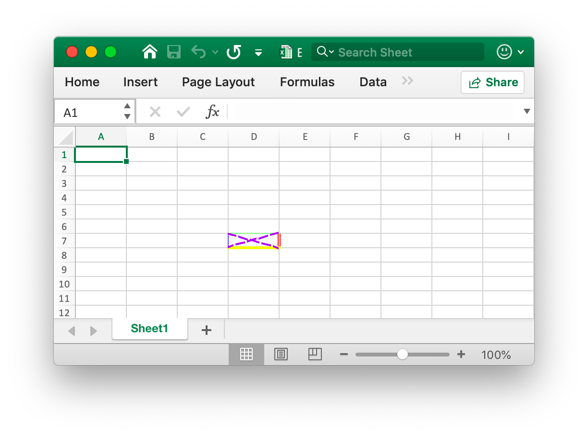

# Cell

RichTextRun directly maps the settings of the rich text run.

```go
type RichTextRun struct {
    Font *Font
    Text string
}
```

HyperlinkOpts can be passed to [`SetCellHyperlink`](cell.md#SetCellHyperlink) to set optional hyperlink attributes (e.g. text to display and screen tip text).

```go
type HyperlinkOpts struct {
    Display *string
    Tooltip *string
}
```

FormulaOpts can be passed to [`SetCellFormula`](cell.md#SetCellFormula) to use other formula types.

```go
type FormulaOpts struct {
    Type *string // Formula type
    Ref  *string // Shared formula reference
}
```

## Set cell value {#SetCellValue}

```go
func (f *File) SetCellValue(sheet, axis string, value interface{}) error
```

SetCellValue provides a function to set the value of a cell. The specified coordinates should not be in the first row of the table, a complex number can be set with string text. The following shows the supported data types:

|Supported data types|
|---|
|int|
|int8|
|int16|
|int32|
|int64|
|uint|
|uint8|
|uint16|
|uint32|
|uint64|
|float32|
|float64|
|string|
|[]byte|
|time.Duration|
|time.Time|
|bool|
|nil|

Note that default date format is `m/d/yy h:mm` of `time.Time` type value. You can set numbers format by [`SetCellStyle`](cell.md#SetCellStyle) method. If you need to set the specialized date in Excel like January 0, 1900 or February 29, 1900, these times can not representation in Go language `time.Time` data type. Please set the cell value as number 0 or 60, then create and bind the date-time number format style for the cell.

## Set boolean value {#SetCellBool}

```go
func (f *File) SetCellBool(sheet, axis string, value bool) error
```

SetCellBool provides a function to set the bool type value of a cell by given worksheet name, cell coordinates, and cell value.

## Set RAW value {#SetCellDefault}

```go
func (f *File) SetCellDefault(sheet, axis, value string) error
```

SetCellDefault provides a function to set the string type value of a cell as a default format without escaping the cell.

## Set integer value {#SetCellInt}

```go
func (f *File) SetCellInt(sheet, axis string, value int) error
```

SetCellInt provides a function to set the int type value of a cell by given worksheet name, cell coordinates, and cell value.

## Set string value {#SetCellStr}

```go
func (f *File) SetCellStr(sheet, axis, value string) error
```

SetCellStr provides a function to set the string type value of a cell. The total number of characters that a cell can contain `32767` characters.

## Set cell style {#SetCellStyle}

```go
func (f *File) SetCellStyle(sheet, hCell, vCell string, styleID int) error
```

SetCellStyle provides a function to add style attribute for cells by given worksheet name, coordinate area and style ID. Style indexes can be obtained with the [`NewStyle`](style.md#NewStyle) function. Note that `diagonalDown` and `diagonalUp` type border should use the same color in the same coordinate area. SetCellStyle will overwrite the existing styles for the cell, it won't append or merge style with existing styles.

- Example 1, create borders of cell `D7` on `Sheet1`:

```go
style, err := f.NewStyle(&excelize.Style{
    Border: []excelize.Border{
        {Type: "left", Color: "0000FF", Style: 3},
        {Type: "top", Color: "00FF00", Style: 4},
        {Type: "bottom", Color: "FFFF00", Style: 5},
        {Type: "right", Color: "FF0000", Style: 6},
        {Type: "diagonalDown", Color: "A020F0", Style: 7},
        {Type: "diagonalUp", Color: "A020F0", Style: 8},
    },
})
if err != nil {
    fmt.Println(err)
}
err = f.SetCellStyle("Sheet1", "D7", "D7", style)
```

<p align="center"></p>

The four borders of the cell `D7` are set with different styles and colors. This is related to the parameters when calling the [`NewStyle`](style.md#NewStyle) function. You need to set different styles to refer to the documentation for that chapter.

- Example 2, setting the gradient style for the worksheet `D7` cell named `Sheet1`:

```go
style, err := f.NewStyle(&excelize.Style{
    Fill: excelize.Fill{Type: "gradient", Color: []string{"#FFFFFF", "#E0EBF5"}, Shading: 1},
})
if err != nil {
    fmt.Println(err)
}
err = f.SetCellStyle("Sheet1", "D7", "D7", style)
```

<p align="center"></p>

The cell `D7` is set with the color fill of the gradient effect. The gradient fill effect is related to the parameter when the [`NewStyle`](style.md#NewStyle) function is called. You need to set different styles to refer to the documentation of this chapter.

- Example 3, set a solid fill for the `D7` cell named `Sheet1`:

```go
style, err := f.NewStyle(&excelize.Style{
    Fill: excelize.Fill{Type: "pattern", Color: []string{"#E0EBF5"}, Pattern: 1},
})
if err != nil {
    fmt.Println(err)
}
err = f.SetCellStyle("Sheet1", "D7", "D7", style)
```

<p align="center"></p>

The cell `D7` is set with a solid fill.

- Example 4, set the character spacing and rotation angle for the `D7` cell named `Sheet1`:

```go
f.SetCellValue("Sheet1", "D7", "Style")
style, err := f.NewStyle(&excelize.Style{
    Alignment: &excelize.Alignment{
        Horizontal:      "center",
        Indent:          1,
        JustifyLastLine: true,
        ReadingOrder:    0,
        RelativeIndent:  1,
        ShrinkToFit:     true,
        TextRotation:    45,
        Vertical:        "",
        WrapText:        true,
    },
})
if err != nil {
    fmt.Println(err)
}
err = f.SetCellStyle("Sheet1", "D7", "D7", style)
```

<p align="center"></p>

- Example 5, the date and time in Excel are represented by real numbers, for example `2017/7/4 12:00:00 PM` can be represented by the number `42920.5`. Set the time format for the worksheet `D7` cell named `Sheet1`:

```go
f.SetCellValue("Sheet1", "D7", 42920.5)
f.SetColWidth("Sheet1", "D", "D", 13)
style, err := f.NewStyle(&excelize.Style{NumFmt: 22})
if err != nil {
    fmt.Println(err)
}
err = f.SetCellStyle("Sheet1", "D7", "D7", style)
```

<p align="center"></p>

The cell `D7` is set to the time format. Note that when the cell width with the time format applied is too narrow to be fully displayed, it will be displayed as `####`, you can drag and drop the column width or set the column to the appropriate size by calling the `SetColWidth` function to make it normal display.

- Example 6, setting the font, font size, color, and skew style for the worksheet `D7` cell named `Sheet1`:

```go
f.SetCellValue("Sheet1", "D7", "Excel")
style, err := f.NewStyle(&excelize.Style{
    Font: &excelize.Font{
        Bold:   true,
        Italic: true,
        Family: "Times New Roman",
        Size:   36,
        Color:  "#777777",
    },
})
if err != nil {
    fmt.Println(err)
}
err = f.SetCellStyle("Sheet1", "D7", "D7", style)
```

<p align="center"></p>

- Example 7, locking and hiding the worksheet `D7` cell named `Sheet1`:

```go
style, err := f.NewStyle(&excelize.Style{
    Protection: &excelize.Protection{
        Hidden: true,
        Locked: true,
    },
})
if err != nil {
    fmt.Println(err)
}
err = f.SetCellStyle("Sheet1", "D7", "D7", style)
```

To lock a cell or hide a formula, protect the worksheet. On the "Review" tab, click "Protect Worksheet".

## Set hyperlink {#SetCellHyperLink}

```go
func (f *File) SetCellHyperLink(sheet, axis, link, linkType string, opts ...HyperlinkOpts) error
```

SetCellHyperLink provides a function to set cell hyperlinks by given worksheet name and link URL address. LinkType defines two types of hyperlinks `External` for the website or `Location` for moving to one of the cells in this workbook. The maximum limit of hyperlinks in a worksheet is `65530`. This function is only used to set the hyperlink of the cell and doesn't affect the value of the cell. If you need to set the value of the cell, please use the other functions such as [`SetCellStyle`](cell.md#SetCellStyle) or [`SetSheetRow`](sheet.md#SetSheetRow). Below is an example of an external link.

- Example 1, adding an external link to the `A3` cell of the worksheet named `Sheet1`:

```go
display, tooltip := "https://github.com/xuri/excelize", "Excelize on GitHub"
if err := f.SetCellHyperLink("Sheet1", "A3",
    "https://github.com/xuri/excelize", "External", excelize.HyperlinkOpts{
        Display: &display,
        Tooltip: &tooltip,
    }); err != nil {
    fmt.Println(err)
}
// Set the font and underline style for the cell
style, err := f.NewStyle(&excelize.Style{
    Font: &excelize.Font{Color: "#1265BE", Underline: "single"},
})
if err != nil {
    fmt.Println(err)
}
err = f.SetCellStyle("Sheet1", "A3", "A3", style)
```

- Example 2, adding an internal location link to the `A3` cell named `Sheet1`:

```go
err := f.SetCellHyperLink("Sheet1", "A3", "Sheet1!A40", "Location")
```

## Set cell rich text {#SetCellRichText}

```go
func (f *File) SetCellRichText(sheet, cell string, runs []RichTextRun) error
```

SetCellRichText provides a function to set a cell with rich text by given worksheet.

For example, set rich text on the `A1` cell of the worksheet named `Sheet1`:

<p align="center"></p>

```go
package main

import (
    "fmt"

    "github.com/xuri/excelize/v2"
)

func main() {
    f := excelize.NewFile()
    if err := f.SetRowHeight("Sheet1", 1, 35); err != nil {
        fmt.Println(err)
        return
    }
    if err := f.SetColWidth("Sheet1", "A", "A", 44); err != nil {
        fmt.Println(err)
        return
    }
    if err := f.SetCellRichText("Sheet1", "A1", []excelize.RichTextRun{
        {
            Text: "bold",
            Font: &excelize.Font{
                Bold:   true,
                Color:  "2354e8",
                Family: "Times New Roman",
            },
        },
        {
            Text: " and ",
            Font: &excelize.Font{
                Family: "Times New Roman",
            },
        },
        {
            Text: "italic ",
            Font: &excelize.Font{
                Bold:   true,
                Color:  "e83723",
                Italic: true,
                Family: "Times New Roman",
            },
        },
        {
            Text: "text with color and font-family,",
            Font: &excelize.Font{
                Bold:   true,
                Color:  "2354e8",
                Family: "Times New Roman",
            },
        },
        {
            Text: "\r\nlarge text with ",
            Font: &excelize.Font{
                Size:  14,
                Color: "ad23e8",
            },
        },
        {
            Text: "strike",
            Font: &excelize.Font{
                Color:  "e89923",
                Strike: true,
            },
        },
        {
            Text: " superscript",
            Font: &excelize.Font{
                Color:     "dbc21f",
                VertAlign: "superscript",
            },
        },
        {
            Text: " and ",
            Font: &excelize.Font{
                Size:      14,
                Color:     "ad23e8",
                VertAlign: "baseline",
            },
        },
        {
            Text: "underline",
            Font: &excelize.Font{
                Color:     "23e833",
                Underline: "single",
            },
        },
        {
            Text: " subscript.",
            Font: &excelize.Font{
                Color:     "017505",
                VertAlign: "subscript",
            },
        },
    }); err != nil {
        fmt.Println(err)
        return
    }
    style, err := f.NewStyle(&excelize.Style{
        Alignment: &excelize.Alignment{
            WrapText: true,
        },
    })
    if err != nil {
        fmt.Println(err)
        return
    }
    if err := f.SetCellStyle("Sheet1", "A1", "A1", style); err != nil {
        fmt.Println(err)
        return
    }
    if err := f.SaveAs("Book1.xlsx"); err != nil {
        fmt.Println(err)
    }
}
```

## Get cell rich text {#GetCellRichText}

```go
func (f *File) GetCellRichText(sheet, cell string) ([]RichTextRun, error)
```

GetCellRichText provides a function to get the rich text of cells by given worksheet.

## Get cell value {#GetCellValue}

```go
func (f *File) GetCellValue(sheet, axis string, opts ...Options) (string, error)
```

The value of the cell is retrieved according to the given worksheet and cell coordinates, and the return value is converted to the `string` type. If the cell format can be applied to the value of a cell, the applied value will be returned, otherwise the original value will be returned. All cells' values will be the same in a merged range.

## Get cell type {#GetCellType}

```go
func (f *File) GetCellType(sheet, axis string) (CellType, error)
```

GetCellType provides a function to get the cell's data type by given worksheet name and axis in spreadsheet file.

## Get all cell value by cols {#GetCols}

```go
func (f *File) GetCols(sheet string, opts ...Options) ([][]string, error)
```

Gets the value of all cells by columns on the worksheet based on the given worksheet name (case sensitive), returned as a two-dimensional array, where the value of the cell is converted to the `string` type. If the cell format can be applied to the value of the cell, the applied value will be used, otherwise the original value will be used.

For example, get and traverse the value of all cells by columns on a worksheet named `Sheet1`:

```go
cols, err := f.GetCols("Sheet1")
if err != nil {
    fmt.Println(err)
    return
}
for _, col := range cols {
    for _, rowCell := range col {
        fmt.Print(rowCell, "\t")
    }
    fmt.Println()
}
```

## Get all cell value by rows {#GetRows}

```go
func (f *File) GetRows(sheet string, opts ...Options) ([][]string, error)
```

GetRows return all the rows in a sheet by given worksheet name (case sensitive), returned as a two-dimensional array, where the value of the cell is converted to the `string` type. If the cell format can be applied to the value of the cell, the applied value will be used, otherwise the original value will be used. GetRows fetched the rows with value or formula cells, the continually blank cells in the tail of each row will be skipped, so the length of each row may be inconsistent.

For example, get and traverse the value of all cells by rows on a worksheet named `Sheet1`:

```go
rows, err := f.GetRows("Sheet1")
if err != nil {
    fmt.Println(err)
    return
}
for _, row := range rows {
    for _, colCell := range row {
        fmt.Print(colCell, "\t")
    }
    fmt.Println()
}
if err = rows.Close(); err != nil {
    fmt.Println(err)
}
```

## Get hyperlink {#GetCellHyperLink}

```go
func (f *File) GetCellHyperLink(sheet, axis string) (bool, string, error)
```

Gets a cell hyperlink based on the given worksheet name (case sensitive) and cell coordinates. If the cell has a hyperlink, it will return `true` and the link address, otherwise it will return `false` and an empty link address.

For example, get a hyperlink to a `H6` cell on a worksheet named `Sheet1`:

```go
link, target, err := f.GetCellHyperLink("Sheet1", "H6")
```

## Get style index {#GetCellStyle}

```go
func (f *File) GetCellStyle(sheet, axis string) (int, error)
```

The cell style index is obtained from the given worksheet name (case sensitive) and cell coordinates, and the obtained index can be used as a parameter to call the `SetCellValue` function when copying the cell style.

## Merge cells {#MergeCell}

```go
func (f *File) MergeCell(sheet, hCell, vCell string) error
```

Merge cells based on the given worksheet name (case sensitive) and cell coordinate regions. Merging cells only keeps the upper-left cell value, and discards the other values. For example, merge cells in the `D3:E9` area on a worksheet named `Sheet1`:

```go
err := f.MergeCell("Sheet1", "D3", "E9")
```

If the given cell coordinate area overlaps with other existing merged cells, the existing merged cells will be deleted.

## Unmerge cells {#UnmergeCell}

```go
func (f *File) UnmergeCell(sheet string, hCell, vCell string) error
```

UnmergeCell provides a function to unmerge a given coordinate area. For example unmerge area `D3:E9` on `Sheet1`:

```go
err := f.UnmergeCell("Sheet1", "D3", "E9")
```

Attention: overlapped areas will also be unmerged.

## Get merge cells {#GetMergeCells}

GetMergeCells provides a function to get all merged cells from a worksheet currently.

```go
func (f *File) GetMergeCells(sheet string) ([]MergeCell, error)
```

### Get merged cell value

```go
func (m *MergeCell) GetCellValue() string
```

GetCellValue returns merged cell value.

### Get the top left cell coordinates of merged range

```go
func (m *MergeCell) GetStartAxis() string
```

GetStartAxis returns the top left cell coordinates of merged range, for example: `C2`.

### Get the bottom right cell coordinates of merged range

```go
func (m *MergeCell) GetEndAxis() string
```

GetEndAxis returns the bottom right cell coordinates of merged range, for example: `D4`.

## Add comment {#AddComment}

```go
func (f *File) AddComment(sheet, cell, format string) error
```

AddComment provides the method to add comments in a sheet by given worksheet index, cell and format set (such as author and text). Note that the max author length is 255 and the max text length is 32512. For example, add a comment in `Sheet1!$A$3`:

<p align="center"></p>

```go
err := f.AddComment("Sheet1", "A3", `{"author":"Excelize: ","text":"This is a comment."}`)
```

## Get comment {#GetComments}

```go
func (f *File) GetComments() (comments map[string][]Comment)
```

GetComments retrieve all comments and return a map of worksheet name to the worksheet comments.

## Set cell formula {#SetCellFormula}

```go
func (f *File) SetCellFormula(sheet, axis, formula string, opts ...FormulaOpts) error
```

SetCellFormula provides a function to set the formula on the cell is taken according to the given worksheet name (case sensitive) and cell formula settings. The result of the formula cell can be calculated when the worksheet is opened by the Office Excel application or can be using the [CalcCellValue](cell.md#CalcCellValue) function also can get the calculated cell value. If the Excel application doesn't calculate the formula automatically when the workbook has been opened, please call [UpdateLinkedValue](utils.md#UpdateLinkedValue) after setting the cell formula functions.

- Example 1, set normal formula `=SUM(A1,B1)` for the cell `A3` on `Sheet1`:

```go
err := f.SetCellFormula("Sheet1", "A3", "=SUM(A1,B1)")
```

- Example 2, set one-dimensional vertical constant array (row array) formula `1,2,3` for the cell `A3` on `Sheet1`:

```go
err := f.SetCellFormula("Sheet1", "A3", "={1,2,3}")
```

- Example 3, set one-dimensional horizontal constant array (column array) formula `"a","b","c"` for the cell `A3` on `Sheet1`:

```go
err := f.SetCellFormula("Sheet1", "A3", "={\"a\",\"b\",\"c\"}")
```

- Example 4, set two-dimensional constant array formula `{1,2,"a","b"}` for the cell `A3` on `Sheet1`:

```go
formulaType, ref := excelize.STCellFormulaTypeArray, "A3:A3"
err := f.SetCellFormula("Sheet1", "A3", "={1,2,\"a\",\"b\"}",
    excelize.FormulaOpts{Ref: &ref, Type: &formulaType})
```

- Example 5, set range array formula `A1:A2` for the cell `A3` on `Sheet1`:

```go
formulaType, ref := excelize.STCellFormulaTypeArray, "A3:A3"
err := f.SetCellFormula("Sheet1", "A3", "=A1:A2",
    excelize.FormulaOpts{Ref: &ref, Type: &formulaType})
```

- Example 6, set shared formula `=A1+B1` for the cells `C1:C5` on `Sheet1`, `C1` is the master cell:

```go
formulaType, ref := excelize.STCellFormulaTypeShared, "C1:C5"
err := f.SetCellFormula("Sheet1", "C1", "=A1+B1",
    excelize.FormulaOpts{Ref: &ref, Type: &formulaType})
```

- Example 7, set table formula `=SUM(Table1[[A]:[B]])` for the cell `C2` on `Sheet1`:

```go
package main

import (
    "fmt"

    "github.com/xuri/excelize/v2"
)

func main() {
    f := excelize.NewFile()
    for idx, row := range [][]interface{}{{"A", "B", "C"}, {1, 2}} {
        if err := f.SetSheetRow("Sheet1", fmt.Sprintf("A%d", idx+1), &row); err != nil {
            fmt.Println(err)
            return
        }
    }
    if err := f.AddTable("Sheet1", "A1", "C2",
        `{"table_name":"Table1","table_style":"TableStyleMedium2"}`); err != nil {
        fmt.Println(err)
        return
    }
    formulaType := excelize.STCellFormulaTypeDataTable
    if err := f.SetCellFormula("Sheet1", "C2", "=SUM(Table1[[A]:[B]])",
        excelize.FormulaOpts{Type: &formulaType}); err != nil {
        fmt.Println(err)
        return
    }
    if err := f.SaveAs("Book1.xlsx"); err != nil {
        fmt.Println(err)
    }
}
```

## Get cell formula {#GetCellFormula}

```go
func (f *File) GetCellFormula(sheet, axis string) (string, error)
```

Get the formula on the cell based on the given worksheet name (case sensitive) and cell coordinates.

## Calculate cell value {#CalcCellValue}

```go
func (f *File) CalcCellValue(sheet, cell string) (string, error)
```

CalcCellValue provides a function to get calculated cell value. This feature is currently in working processing. Iterative calculation, implicit intersection, explicit intersection, array formula, table formula and some other formulas are not supported currently.

Supported formulas:

```text
ABS
ACCRINT
ACCRINTM
ACOS
ACOSH
ACOT
ACOTH
ADDRESS
AMORDEGRC
AMORLINC
AND
ARABIC
ASIN
ASINH
ATAN
ATAN2
ATANH
AVEDEV
AVERAGE
AVERAGEA
AVERAGEIF
AVERAGEIFS
BASE
BESSELI
BESSELJ
BESSELK
BESSELY
BETADIST
BETA.DIST
BETAINV
BETA.INV
BIN2DEC
BIN2HEX
BIN2OCT
BINOMDIST
BINOM.DIST
BINOM.DIST.RANGE
BINOM.INV
BITAND
BITLSHIFT
BITOR
BITRSHIFT
BITXOR
CEILING
CEILING.MATH
CEILING.PRECISE
CHAR
CHIDIST
CHIINV
CHITEST
CHISQ.DIST
CHISQ.DIST.RT
CHISQ.INV
CHISQ.INV.RT
CHISQ.TEST
CHOOSE
CLEAN
CODE
COLUMN
COLUMNS
COMBIN
COMBINA
COMPLEX
CONCAT
CONCATENATE
CONFIDENCE
CONFIDENCE.NORM
CONFIDENCE.T
CONVERT
CORREL
COS
COSH
COT
COTH
COUNT
COUNTA
COUNTBLANK
COUNTIF
COUNTIFS
COUPDAYBS
COUPDAYS
COUPDAYSNC
COUPNCD
COUPNUM
COUPPCD
COVAR
COVARIANCE.P
COVARIANCE.S
CRITBINOM
CSC
CSCH
CUMIPMT
CUMPRINC
DATE
DATEDIF
DATEVALUE
DAVERAGE
DAY
DAYS
DAYS360
DB
DCOUNT
DCOUNTA
DDB
DEC2BIN
DEC2HEX
DEC2OCT
DECIMAL
DEGREES
DELTA
DEVSQ
DGET
DISC
DMAX
DMIN
DOLLARDE
DOLLARFR
DPRODUCT
DSTDEV
DSTDEVP
DSUM
DURATION
DVAR
DVARP
EFFECT
EDATE
ENCODEURL
EOMONTH
ERF
ERF.PRECISE
ERFC
ERFC.PRECISE
ERROR.TYPE
EUROCONVERT
EVEN
EXACT
EXP
EXPON.DIST
EXPONDIST
FACT
FACTDOUBLE
FALSE
F.DIST
F.DIST.RT
FDIST
FIND
FINDB
F.INV
F.INV.RT
FINV
FISHER
FISHERINV
FIXED
FLOOR
FLOOR.MATH
FLOOR.PRECISE
FORMULATEXT
F.TEST
FTEST
FV
FVSCHEDULE
GAMMA
GAMMA.DIST
GAMMADIST
GAMMA.INV
GAMMAINV
GAMMALN
GAMMALN.PRECISE
GAUSS
GCD
GEOMEAN
GESTEP
GROWTH
HARMEAN
HEX2BIN
HEX2DEC
HEX2OCT
HLOOKUP
HOUR
HYPERLINK
HYPGEOM.DIST
HYPGEOMDIST
IF
IFERROR
IFNA
IFS
IMABS
IMAGINARY
IMARGUMENT
IMCONJUGATE
IMCOS
IMCOSH
IMCOT
IMCSC
IMCSCH
IMDIV
IMEXP
IMLN
IMLOG10
IMLOG2
IMPOWER
IMPRODUCT
IMREAL
IMSEC
IMSECH
IMSIN
IMSINH
IMSQRT
IMSUB
IMSUM
IMTAN
INDEX
INDIRECT
INT
INTRATE
IPMT
IRR
ISBLANK
ISERR
ISERROR
ISEVEN
ISFORMULA
ISLOGICAL
ISNA
ISNONTEXT
ISNUMBER
ISODD
ISREF
ISTEXT
ISO.CEILING
ISOWEEKNUM
ISPMT
KURT
LARGE
LCM
LEFT
LEFTB
LEN
LENB
LN
LOG
LOG10
LOGINV
LOGNORM.DIST
LOGNORMDIST
LOGNORM.INV
LOOKUP
LOWER
MATCH
MAX
MAXA
MAXIFS
MDETERM
MDURATION
MEDIAN
MID
MIDB
MIN
MINA
MINIFS
MINUTE
MINVERSE
MIRR
MMULT
MOD
MODE
MODE.MULT
MODE.SNGL
MONTH
MROUND
MULTINOMIAL
MUNIT
N
NA
NEGBINOM.DIST
NEGBINOMDIST
NETWORKDAYS
NETWORKDAYS.INTL
NOMINAL
NORM.DIST
NORMDIST
NORM.INV
NORMINV
NORM.S.DIST
NORMSDIST
NORM.S.INV
NORMSINV
NOT
NOW
NPER
NPV
OCT2BIN
OCT2DEC
OCT2HEX
ODD
ODDFPRICE
OR
PDURATION
PEARSON
PERCENTILE.EXC
PERCENTILE.INC
PERCENTILE
PERCENTRANK.EXC
PERCENTRANK.INC
PERCENTRANK
PERMUT
PERMUTATIONA
PHI
PI
PMT
POISSON.DIST
POISSON
POWER
PPMT
PRICE
PRICEDISC
PRICEMAT
PRODUCT
PROPER
PV
QUARTILE
QUARTILE.EXC
QUARTILE.INC
QUOTIENT
RADIANS
RAND
RANDBETWEEN
RANK
RANK.EQ
RATE
RECEIVED
REPLACE
REPLACEB
REPT
RIGHT
RIGHTB
ROMAN
ROUND
ROUNDDOWN
ROUNDUP
ROW
ROWS
RRI
RSQ
SEC
SECH
SECOND
SERIESSUM
SHEET
SHEETS
SIGN
SIN
SINH
SKEW
SKEW.P
SLN
SLOPE
SMALL
SQRT
SQRTPI
STANDARDIZE
STDEV
STDEV.P
STDEV.S
STDEVA
STDEVP
STDEVPA
STEYX
SUBSTITUTE
SUM
SUMIF
SUMIFS
SUMPRODUCT
SUMSQ
SUMX2MY2
SUMX2PY2
SUMXMY2
SWITCH
SYD
T
TAN
TANH
TBILLEQ
TBILLPRICE
TBILLYIELD
T.DIST
T.DIST.2T
T.DIST.RT
TDIST
TEXTJOIN
TIME
TIMEVALUE
T.INV
T.INV.2T
TINV
TODAY
TRANSPOSE
TREND
TRIM
TRIMMEAN
TRUE
TRUNC
T.TEST
TTEST
TYPE
UNICHAR
UNICODE
UPPER
VALUE
VAR
VAR.P
VAR.S
VARA
VARP
VARPA
VDB
VLOOKUP
WEEKDAY
WEEKNUM
WEIBULL
WEIBULL.DIST
WORKDAY
WORKDAY.INTL
XIRR
XLOOKUP
XNPV
XOR
YEAR
YEARFRAC
YIELD
YIELDDISC
YIELDMAT
Z.TEST
ZTEST
```
