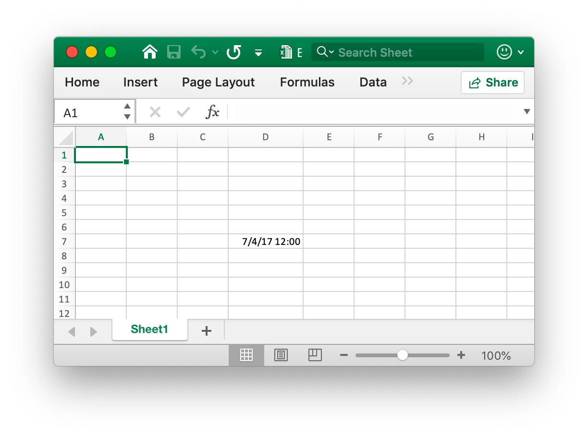
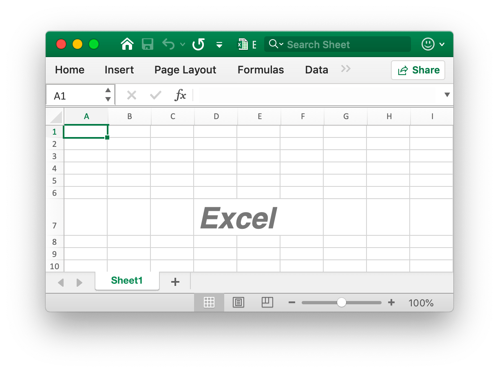
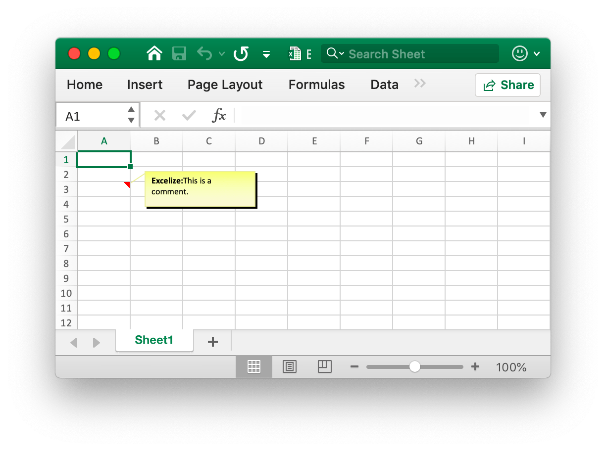

# Cell

RichTextRun directly maps the settings of the rich text run.

```go
type RichTextRun struct {
    Font *Font
    Text string
}
```

## Set cell value {#SetCellValue}

```go
func (f *File) SetCellValue(sheet, axis string, value interface{}) error
```

SetCellValue provides a function to set the value of a cell. The specified coordinates should not be in the first row of the table. The following shows the supported data types:

|Supported data types|
|---|
|int|
|int8|
|int16|
|int32|
|int64|
|uint|
|uint8|
|uint16|
|uint32|
|uint64|
|float32|
|float64|
|string|
|[]byte|
|time.Duration|
|time.Time|
|bool|
|nil|

## Set boolean value {#SetCellBool}

```go
func (f *File) SetCellBool(sheet, axis string, value bool) error
```

SetCellBool provides a function to set bool type value of a cell by given worksheet name, cell coordinates and cell value.

## Set RAW value {#SetCellDefault}

```go
func (f *File) SetCellDefault(sheet, axis, value string) error
```

SetCellDefault provides a function to set string type value of a cell as default format without escaping the cell.

## Set integer value {#SetCellInt}

```go
func (f *File) SetCellInt(sheet, axis string, value int) error
```

SetCellInt provides a function to set int type value of a cell by given worksheet name, cell coordinates, and cell value.

## Set string value {#SetCellStr}

```go
func (f *File) SetCellStr(sheet, axis, value string) error
```

SetCellStr provides a function to set string type value of a cell. Total number of characters that a cell can contain `32767` characters.

## Set cell style {#SetCellStyle}

```go
func (f *File) SetCellStyle(sheet, hcell, vcell string, styleID int) error
```

SetCellStyle provides a function to add style attribute for cells by given worksheet name, coordinate area and style ID. Style indexes can be obtained with the [`NewStyle`](style.md#NewStyle) function. Note that `diagonalDown` and `diagonalUp` type border should be use same color in the same coordinate area.

- Example 1, create borders of cell `D7` on `Sheet1`:

```go
style, err := f.NewStyle(`{"border":[{"type":"left","color":"0000FF","style":3},{"type":"top","color":"00FF00","style":4},{"type":"bottom","color":"FFFF00","style":5},{"type":"right","color":"FF0000","style":6},{"type":"diagonalDown","color":"A020F0","style":7},{"type":"diagonalUp","color":"A020F0","style":8}]}`)
if err != nil {
    println(err.Error())
}
err = f.SetCellStyle("Sheet1", "D7", "D7", style)
```

<p align="center"></p>

The four borders of the cell `D7` are set with different styles and colors. This is related to the parameters when calling the [`NewStyle`](style.md#NewStyle) function. You need to set different styles to refer to the documentation for that chapter.

- Example 2, setting the gradient style for the worksheet `D7` cell named `Sheet1`:

```go
style, err := f.NewStyle(`{"fill":{"type":"gradient","color":["#FFFFFF","#E0EBF5"],"shading":1}}`)
if err != nil {
    println(err.Error())
}
err = f.SetCellStyle("Sheet1", "D7", "D7", style)
```

<p align="center"></p>

The cell `D7` is set with the color fill of the gradient effect. The gradient fill effect is related to the parameter when the [`NewStyle`](style.md#NewStyle) function is called. You need to set different styles to refer to the documentation of this chapter.

- Example 3, set a solid fill for the `D7` cell named `Sheet1`:

```go
style, err := f.NewStyle(`{"fill":{"type":"pattern","color":["#E0EBF5"],"pattern":1}}`)
if err != nil {
    println(err.Error())
}
err = f.SetCellStyle("Sheet1", "D7", "D7", style)
```

<p align="center"></p>

The cell `D7` is set with a solid fill.

- Example 4, set the character spacing and rotation angle for the `D7` cell named `Sheet1`:

```go
f.SetCellValue("Sheet1", "D7", "Style")
style, err := f.NewStyle(`{"alignment":{"horizontal":"center","ident":1,"justify_last_line":true,"reading_order":0,"relative_indent":1,"shrink_to_fit":true,"text_rotation":45,"vertical":"","wrap_text":true}}`)
if err != nil {
    println(err.Error())
}
err = f.SetCellStyle("Sheet1", "D7", "D7", style)
```

<p align="center"></p>

- Example 5, the date and time in Excel are represented by real numbers, for example `2017/7/4 12:00:00 PM` can be represented by the number `42920.5`. Set the time format for the worksheet `D7` cell named `Sheet1`:

```go
f.SetCellValue("Sheet1", "D7", 42920.5)
f.SetColWidth("Sheet1", "D", "D", 13)
style, err := f.NewStyle(`{"number_format": 22}`)
if err != nil {
    println(err.Error())
}
err = f.SetCellStyle("Sheet1", "D7", "D7", style)
```

<p align="center"></p>

The cell `D7` is set to the time format. Note that when the cell width with the time format applied is too narrow to be fully displayed, it will be displayed as `####`, you can drag and drop the column width or set the column to the appropriate size by calling the `SetColWidth` function to make it normal display.

- Example 6, setting the font, font size, color, and skew style for the worksheet `D7` cell named `Sheet1`:

```go
f.SetCellValue("Sheet1", "D7", "Excel")
style, err := f.NewStyle(`{"font":{"bold":true,"italic":true,"family":"Times New Roman","size":36,"color":"#777777"}}`)
if err != nil {
    println(err.Error())
}
err = f.SetCellStyle("Sheet1", "D7", "D7", style)
```

<p align="center"></p>

- Example 7, locking and hiding the worksheet `D7` cell named `Sheet1`:

```go
style, err := f.NewStyle(`{"protection":{"hidden":true, "locked":true}}`)
if err != nil {
    println(err.Error())
}
err = f.SetCellStyle("Sheet1", "D7", "D7", style)
```

To lock a cell or hide a formula, protect the worksheet. On the "Review" tab, click "Protect Worksheet".

## Set hyperlink {#SetCellHyperLink}

```go
func (f *File) SetCellHyperLink(sheet, axis, link, linkType string) error
```

SetCellHyperLink provides a function to set cell hyperlink by given worksheet name and link URL address. LinkType defines two types of hyperlink `External` for website or `Location` for moving to one of cell in this workbook. Maximum limit hyperlinks in a worksheet is `65530`. The below is an example of an external link.

- Example 1, adding an external link to the `A3` cell of the worksheet named `Sheet1`:

```go
err := f.SetCellHyperLink("Sheet1", "A3", "https://github.com/360EntSecGroup-Skylar/excelize", "External")
// Set the font and underline style for the cell
style, err := f.NewStyle(`{"font":{"color":"#1265BE","underline":"single"}}`)
err = f.SetCellStyle("Sheet1", "A3", "A3", style)
```

- Example 2, adding an internal location link to the `A3` cell named `Sheet1`:

```go
err := f.SetCellHyperLink("Sheet1", "A3", "Sheet1!A40", "Location")
```

## Set cell rich text {#SetCellRichText}

```go
func (f *File) SetCellRichText(sheet, cell string, runs []RichTextRun) error
```

SetCellRichText provides a function to set cell with rich text by given worksheet.

For example, set rich text on the `A1` cell of the worksheet named `Sheet1`:

<p align="center"></p>

```go
package main

import (
    "fmt"

    "github.com/360EntSecGroup-Skylar/excelize"
)

func main() {
    f := excelize.NewFile()
    if err := f.SetRowHeight("Sheet1", 1, 35); err != nil {
        fmt.Println(err)
        return
    }
    if err := f.SetColWidth("Sheet1", "A", "A", 44); err != nil {
        fmt.Println(err)
        return
    }
    if err := f.SetCellRichText("Sheet1", "A1", []excelize.RichTextRun{
        {
            Text: "blod",
            Font: &excelize.Font{
                Bold:   true,
                Color:  "2354e8",
                Family: "Times New Roman",
            },
        },
        {
            Text: " and ",
            Font: &excelize.Font{
                Family: "Times New Roman",
            },
        },
        {
            Text: " italic",
            Font: &excelize.Font{
                Bold:   true,
                Color:  "e83723",
                Italic: true,
                Family: "Times New Roman",
            },
        },
        {
            Text: "text with color and font-family,",
            Font: &excelize.Font{
                Bold:   true,
                Color:  "2354e8",
                Family: "Times New Roman",
            },
        },
        {
            Text: "\r\nlarge text with ",
            Font: &excelize.Font{
                Size:  14,
                Color: "ad23e8",
            },
        },
        {
            Text: "strike",
            Font: &excelize.Font{
                Color:  "e89923",
                Strike: true,
            },
        },
        {
            Text: " and ",
            Font: &excelize.Font{
                Size:  14,
                Color: "ad23e8",
            },
        },
        {
            Text: "underline.",
            Font: &excelize.Font{
                Color:     "23e833",
                Underline: "single",
            },
        },
    }); err != nil {
        fmt.Println(err)
        return
    }
    style, err := f.NewStyle(&excelize.Style{
        Alignment: &excelize.Alignment{
            WrapText: true,
        },
    })
    if err != nil {
        fmt.Println(err)
        return
    }
    if err := f.SetCellStyle("Sheet1", "A1", "A1", style); err != nil {
        fmt.Println(err)
        return
    }
    if err := f.SaveAs("Book1.xlsx"); err != nil {
        fmt.Println(err)
    }
}
```

## Get cell value {#GetCellValue}

```go
func (f *File) GetCellValue(sheet, axis string) (string, error)
```

The value of the cell is retrieved according to the given worksheet and cell coordinates, and the return value is converted to the `string` type. If the cell format can be applied to the value of a cell, the applied value will be returned, otherwise the original value will be returned.

## Get all cell value by cols {#GetCols}

```go
func (f *File) GetCols(sheet string) ([][]string, error)
```

Gets the value of all cells by columns on the worksheet based on the given worksheet name (case sensitive), returned as a two-dimensional array, where the value of the cell is converted to the `string` type. If the cell format can be applied to the value of the cell, the applied value will be used, otherwise the original value will be used.

For example, get and traverse the value of all cells by columns on a worksheet named `Sheet1`:

```go
cols, err := f.GetCols("Sheet1")
if err != nil {
    fmt.Println(err)
    return
}
for _, col := range cols {
    for _, colCell := range col {
        fmt.Println(colCell, "\t")
    }
    fmt.Println()
}
```

## Get all cell value by rows {#GetRows}

```go
func (f *File) GetRows(sheet string) ([][]string, error)
```

Gets the value of all cells by rows on the worksheet based on the given worksheet name (case sensitive), returned as a two-dimensional array, where the value of the cell is converted to the `string` type. If the cell format can be applied to the value of the cell, the applied value will be used, otherwise the original value will be used.

For example, get and traverse the value of all cells by rows on a worksheet named `Sheet1`:

```go
rows, err := f.GetRows("Sheet1")
if err != nil {
    fmt.Println(err)
    return
}
for _, row := range rows {
    for _, colCell := range row {
        fmt.Println(colCell, "\t")
    }
    fmt.Println()
}
```

## Get hyperlink {#GetCellHyperLink}

```go
func (f *File) GetCellHyperLink(sheet, axis string) (bool, string, error)
```

Gets a cell hyperlink based on the given worksheet name (case sensitive) and cell coordinates. If the cell has a hyperlink, it will return `true` and the link address, otherwise it will return `false` and an empty link address.

For example, get a hyperlink to a `H6` cell on a worksheet named `Sheet1`:

```go
link, target, err := f.GetCellHyperLink("Sheet1", "H6")
```

## Get style index {#GetCellStyle}

```go
func (f *File) GetCellStyle(sheet, axis string) (int, error)
```

The cell style index is obtained from the given worksheet name (case sensitive) and cell coordinates, and the obtained index can be used as a parameter to call the `SetCellValue` function when copying the cell style.

## Merge cells {#MergeCell}

```go
func (f *File) MergeCell(sheet, hcell, vcell string) error
```

Merge cells based on the given worksheet name (case sensitive) and cell coordinate regions. For example, merge cells in the `D3:E9` area on a worksheet named `Sheet1`:

```go
err := f.MergeCell("Sheet1", "D3", "E9")
```

If the given cell coordinate area overlaps with other existing merged cells, the existing merged cells will be deleted.

##  Unmerge cells {#UnmergeCell}

```go
func (f *File) UnmergeCell(sheet string, hcell, vcell string) error
```

UnmergeCell provides a function to unmerge a given coordinate area. For example unmerge area `D3:E9` on `Sheet1`:

```go
err := f.UnmergeCell("Sheet1", "D3", "E9")
```

Attention: overlapped areas will also be unmerged.

## Get merge cells {#GetMergeCells}

GetMergeCells provides a function to get all merged cells from a worksheet currently.

```go
func (f *File) GetMergeCells(sheet string) ([]MergeCell, error)
```

## Add comment {#AddComment}

```go
func (f *File) AddComment(sheet, cell, format string) error
```

AddComment provides the method to add comment in a sheet by given worksheet index, cell and format set (such as author and text). Note that the max author length is 255 and the max text length is 32512. For example, add a comment in `Sheet1!$A$3`:

<p align="center"></p>

```go
err := f.AddComment("Sheet1", "A3", `{"author":"Excelize: ","text":"This is a comment."}`)
```

## Get comment {#GetComments}

```go
func (f *File) GetComments() (comments map[string][]Comment)
```

GetComments retrieves all comments and returns a map of worksheet name to the worksheet comments.

## Set cell formula {#SetCellFormula}

```go
func (f *File) SetCellFormula(sheet, axis, formula string, opts ...FormulaOpts) error
```

The formula on the cell is taken according to the given worksheet name (case sensitive) and cell formula settings. The result of the formula is calculated when the worksheet is opened by the Office Excel application, and Excelize does not currently provide a formula calculation engine, so the formula results cannot be calculated.

## Get cell formula {#GetCellFormula}

```go
func (f *File) GetCellFormula(sheet, axis string) (string, error)
```

Get the formula on the cell based on the given worksheet name (case sensitive) and cell coordinates.
