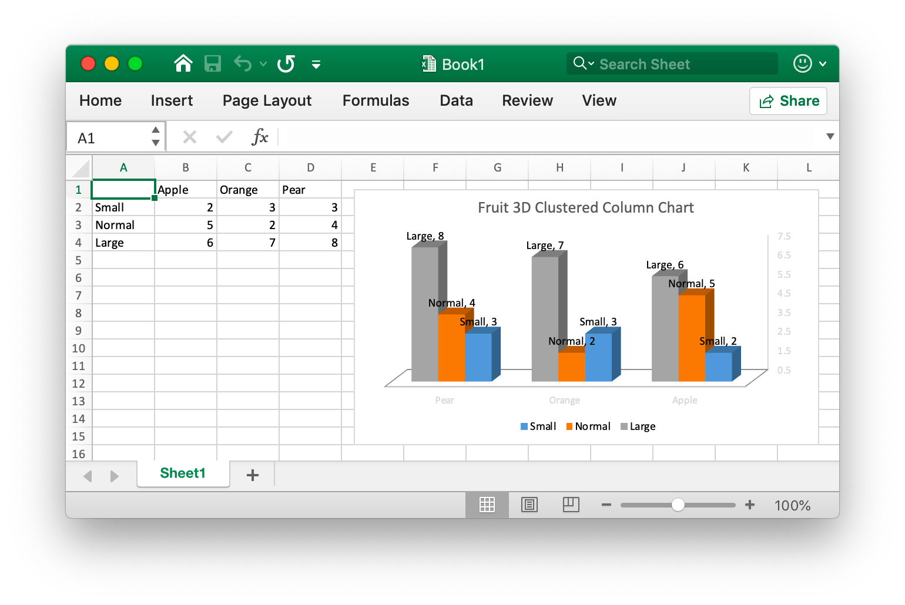
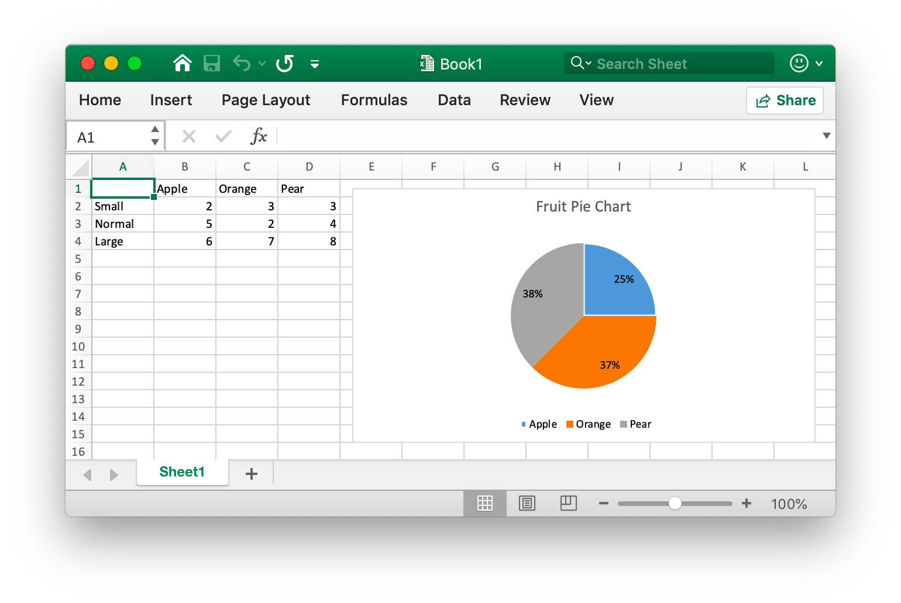

# Chart

## Add chart

```go
func (f *File) AddChart(sheet, cell, format string) error
```

AddChart provides the method to add chart in a sheet by given chart format set (such as offset, scale, aspect ratio setting and print settings) and properties set.

The following shows the `type` of chart supported by excelize:

Type|Chart
---|---
bar                 | 2D clustered bar chart
barStacked          | 2D stacked bar chart
barPercentStacked   | 2D 100% stacked bar chart
bar3DClustered      | 3D clustered bar chart
bar3DStacked        | 3D stacked bar chart
bar3DPercentStacked | 3D 100% stacked bar chart
col                 | 2D clustered column chart
colStacked          | 2D stacked column chart
colPercentStacked   | 2D 100% stacked column chart
col3DClustered      | 3D clustered column chart
col3D               | 3D column chart
col3DStacked        | 3D stacked column chart
col3DPercentStacked | 3D 100% stacked column chart
doughnut            | doughnut chart
line                | line chart
pie                 | pie chart
pie3D               | 3D pie chart
radar               | radar chart
scatter             | scatter chart

In the Office Excel chart data area `series` specifies the set of information for which data to draw, the legend item (series), and the horizontal (category) axis label.

The `series` options that can be set are:

Parameter|Explanation
---|---
name|Legend item (series), displayed in the chart legend and formula bar. The `name` parameter is optional. If you don't specify this value, the default will be `Series 1 .. n`. `name` support for formula representation, for example: `Sheet1!$A$1`.
categories|Horizontal (category) axis label. The `categories` parameter is optional in most chart types, the default is a contiguous sequence of the form `1..n`.
values|The chart data area, which is the most important parameter in `series`, is also the only required parameter when creating a chart. This option links the chart to the worksheet data it displays.

Set properties of the chart legend. The options that can be set are:

Parameter|Type|Explanation
---|---|---
position|string|The position of the chart legend
show_legend_key|bool|Show legend but not overlap with chart

Set the `position` of the chart legend. The default legend position is `right`. The available positions are:

Parameter|Explanation
---|---
top|On top
bottom|On bottom
left|On left
right|On right
top_right|On top right

The `show_legend_key` parameter set the legend keys shall be shown in data labels. The default value is `false`.

The chart title is set by selecting the `name` parameter of the `title` object, and the title will be displayed above the chart. The parameter `name` supports the use of formula representations, such as `Sheet1!$A$1`, if you do not specify an icon title, the default value is null.

The parameter `show_blanks_as` provides the "Hide and empty cells" setting. The default value is: `gap`. In Excel application "empty cell is displayed as": "space". The following are optional values for this parameter:

Parameter|Explanation
---|---
gap|space
span|Connect data points with straight lines
zero|zero value

The parameter `format` provides settings for parameters such as chart offset, scale, aspect ratio settings, and print properties, as well as those used in the [`AddPicture()`](image.md#AddPicture) function.

Set the position of the chart plot area by plotarea. The properties that can be set are:

Parameter|Type|Default|Explanation
---|---|---|---
show_bubble_size|bool|`false`|Specifies the bubble size shall be shown in a data label.
show_cat_name|bool|`true`|Category name
show_leader_lines|bool|`false`|Specifies that the category name shall be shown in the data label.
show_percent|bool|`false`|Specifies that the percentage shall be shown in a data label.
show_series_name|bool|`false`|Specifies that the series name shall be shown in a data label.
show_val|bool|`false`|Specifies that the value shall be shown in a data label.

Set the primary horizontal and vertical axis options by `x_axis` and `y_axis`. The properties that can be set are:

Parameter|Type|Default|Explanation
---|---|---|---
reverse_order|bool|`false`|Specifies that the categories or values on reverse order (orientation of the chart). The `reverse_order` property is optional.
maximum|int|`0`|Specifies that the fixed maximum, 0 is auto. The maximum property is optional.
minimum|int|`0`| Specifies that the fixed minimum, 0 is auto. The minimum property is optional. The default value is auto.

Set the chart size by `dimension` property. The dimension property is optional. The properties that can be set are:

Parameter|Type|Default|Explanation
---|---|---|---
height|int|290|Height
width|int|480|Width

### 3D clustered column chart {#col3DClustered}

For example, add a chart that like the this:



```go
package main

import (
    "fmt"

    "github.com/360EntSecGroup-Skylar/excelize"
)

func main() {
    categories := map[string]string{"A2": "Small", "A3": "Normal", "A4": "Large", "B1": "Apple", "C1": "Orange", "D1": "Pear"}
    values := map[string]int{"B2": 2, "C2": 3, "D2": 3, "B3": 5, "C3": 2, "D3": 4, "B4": 6, "C4": 7, "D4": 8}
    xlsx := excelize.NewFile()
    for k, v := range categories {
        xlsx.SetCellValue("Sheet1", k, v)
    }
    for k, v := range values {
        xlsx.SetCellValue("Sheet1", k, v)
    }
    err := xlsx.AddChart("Sheet1", "E1", `{"type":"col3DClustered","series":[{"name":"Sheet1!$A$2","categories":"Sheet1!$B$1:$D$1","values":"Sheet1!$B$2:$D$2"},{"name":"Sheet1!$A$3","categories":"Sheet1!$B$1:$D$1","values":"Sheet1!$B$3:$D$3"},{"name":"Sheet1!$A$4","categories":"Sheet1!$B$1:$D$1","values":"Sheet1!$B$4:$D$4"}],"format":{"x_scale":1.0,"y_scale":1.0,"x_offset":15,"y_offset":10,"print_obj":true,"lock_aspect_ratio":false,"locked":false},"legend":{"position":"bottom","show_legend_key":false},"title":{"name":"Fruit 3D Clustered Column Chart"},"plotarea":{"show_bubble_size":true,"show_cat_name":false,"show_leader_lines":false,"show_percent":true,"show_series_name":true,"show_val":true},"show_blanks_as":"zero","x_axis":{"reverse_order":true},"y_axis":{"maximum":7.5,"minimum":0.5}}`)
    if err != nil {
        fmt.Println(err)
    }
    // Save workbook
    err = xlsx.SaveAs("./Book1.xlsx")
    if err != nil {
        fmt.Println(err)
    }
}
```

### Pie chart {#pie}

For example, add a pie chart that like the this:



```go
package main

import (
    "fmt"

    "github.com/360EntSecGroup-Skylar/excelize"
)

func main() {
    categories := map[string]string{"A2": "Small", "A3": "Normal", "A4": "Large", "B1": "Apple", "C1": "Orange", "D1": "Pear"}
    values := map[string]int{"B2": 2, "C2": 3, "D2": 3, "B3": 5, "C3": 2, "D3": 4, "B4": 6, "C4": 7, "D4": 8}
    xlsx := excelize.NewFile()
    for k, v := range categories {
        xlsx.SetCellValue("Sheet1", k, v)
    }
    for k, v := range values {
        xlsx.SetCellValue("Sheet1", k, v)
    }

    xlsx.AddChart("Sheet1", "E1", `{"type":"pie","series":[{"name":"Sheet1!$A$2","categories":"Sheet1!$B$1:$D$1","values":"Sheet1!$B$2:$D$2"}],"format":{"x_scale":1.0,"y_scale":1.0,"x_offset":15,"y_offset":10,"print_obj":true,"lock_aspect_ratio":false,"locked":false},"legend":{"position":"bottom","show_legend_key":false},"title":{"name":"Fruit Pie Chart"},"plotarea":{"show_bubble_size":true,"show_cat_name":false,"show_leader_lines":false,"show_percent":true,"show_series_name":false,"show_val":false},"show_blanks_as":"gap"}`)
    // Save workbook
    err := xlsx.SaveAs("./Book1.xlsx")
    if err != nil {
        fmt.Println(err)
    }
}
```