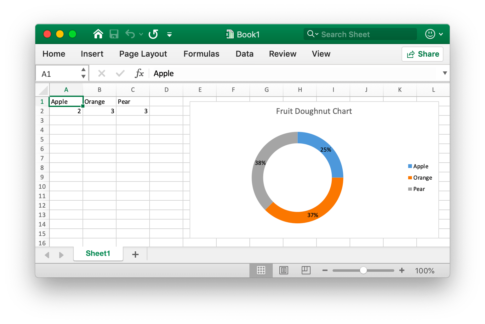

# Doughnut chart {#doughnut}

For example, add a pie chart that like the this:

<p align="center"></p>

```go
package main

import "github.com/360EntSecGroup-Skylar/excelize"

func main() {
    categories := map[string]string{"A1": "Apple", "B1": "Orange", "C1": "Pear"}
    values := map[string]int{"A2": 2, "B2": 3, "C2": 3}
    f := excelize.NewFile()
    for k, v := range categories {
        f.SetCellValue("Sheet1", k, v)
    }
    for k, v := range values {
        f.SetCellValue("Sheet1", k, v)
    }
    if err := f.AddChart("Sheet1", "E1", `{"type":"doughnut","series":[{"name":"Sheet1!$A$2","categories":"Sheet1!$A$1:$C$1","values":"Sheet1!$A$2:$C$2"}],"format":{"x_scale":1.0,"y_scale":1.0,"x_offset":15,"y_offset":10,"print_obj":true,"lock_aspect_ratio":false,"locked":false},"legend":{"position":"right","show_legend_key":false},"title":{"name":"Fruit Doughnut Chart"},"plotarea":{"show_bubble_size":false,"show_cat_name":false,"show_leader_lines":false,"show_percent":true,"show_series_name":false,"show_val":false},"show_blanks_as":"zero"}`); err != nil {
        println(err.Error())
    }
    // Save workbook
    if err := f.SaveAs("Book1.xlsx"); err != nil {
        println(err.Error())
    }
}
```
