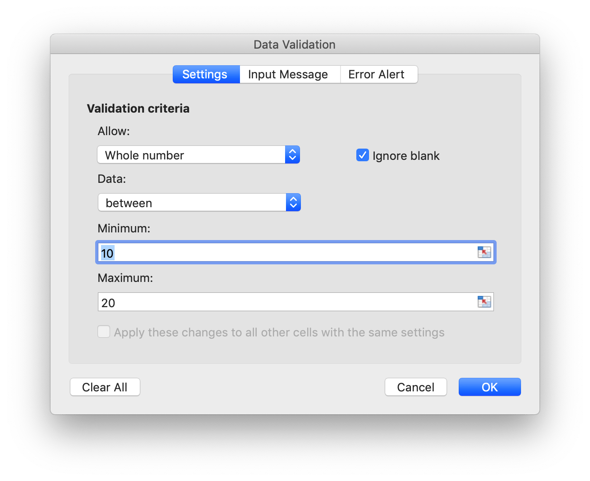
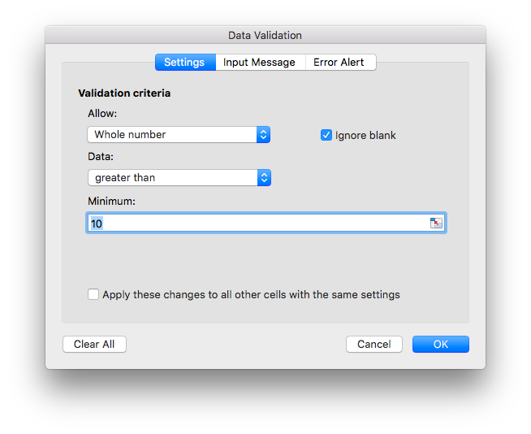
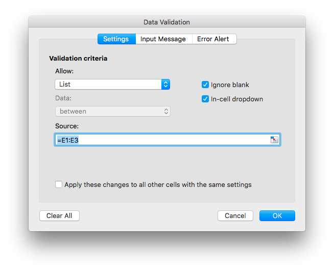

# Data

## Add data validation {#AddDataValidation}

```go
func (f *File) AddDataValidation(sheet string, dv *DataValidation)
```

AddDataValidation provides set data validation on a range of the worksheet by given data validation object and worksheet name. The data validation object can be created by `NewDataValidation` function. Data validation type and operators can be found in the [Constants](constants.md) section.

Example 1, set data validation on `Sheet1!A1:B2` with validation criteria settings, show error alert after invalid data is entered with "Stop" style and custom title "error body":

<p align="center"></p>

```go
dv := excelize.NewDataValidation(true)
dv.SetSqref("A1:B2")
dv.SetRange(10, 20, excelize.DataValidationTypeWhole, excelize.DataValidationOperatorBetween)
dv.SetError(excelize.DataValidationErrorStyleStop, "error title", "error body")
f.AddDataValidation("Sheet1", dv)
```

Example 2, set data validation on `Sheet1!A3:B4` with validation criteria settings, and show input message when cell is selected:

<p align="center"></p>

```go
dv = excelize.NewDataValidation(true)
dv.SetSqref("A3:B4")
dv.SetRange(10, 20, excelize.DataValidationTypeWhole, excelize.DataValidationOperatorGreaterThan)
dv.SetInput("input title", "input body")
f.AddDataValidation("Sheet1", dv)
```

Example 3, set data validation on `Sheet1!A5:B6` with validation criteria settings, create in-cell dropdown by allowing list source:

<p align="center"></p>

```go
dv = excelize.NewDataValidation(true)
dv.SetSqref("A5:B6")
dv.SetDropList([]string{"1", "2", "3"})
f.AddDataValidation("Sheet1", dv)
```

If you type the items into the data validation dialog box (a delimited list), the limit is 255 characters, including the separators. If your data validation list source formula is over the maximum length limit, please set the allowed values in the worksheet cells, and use the `SetSqrefDropList` function to set the reference for their cells.

Example 4，set data validation on `Sheet1!A7:B8` with validation criteria source `Sheet1!E1:E3` settings, create in-cell dropdown by allowing list source:

<p align="center"></p>

```go
dv := excelize.NewDataValidation(true)
dv.SetSqref("A7:B8")
dv.SetSqrefDropList("E1:E3")
f.AddDataValidation("Sheet1", dv)
```

There are limits to the number of items that will show in a data validation drop down list: The list can show up to show 32768 items from a list on the worksheet. If you need more items than that, you could create a dependent drop down list, broken down by category.

## Get data validations {#GetDataValidations}

```go
func (f *File) GetDataValidations(sheet string) ([]*DataValidation, error)
```

GetDataValidations returns data validations list by given worksheet name.

## Delete data validation {#DeleteDataValidation}

```go
func (f *File) DeleteDataValidation(sheet string, sqref ...string) error
```

DeleteDataValidation delete data validation by given worksheet name and reference sequence. All data validations in the worksheet will be deleted if not specify reference sequence parameter.

## Add slicer {#AddSlicer}

`SlicerOptions` represents the settings of the slicer.

```go
type SlicerOptions struct {
    Name          string
    Table         string
    Cell          string
    Caption       string
    Macro         string
    Width         uint
    Height        uint
    DisplayHeader *bool
    ItemDesc      bool
    Format        GraphicOptions
}
```

`Name` specifies the slicer name, should be an existing field name of the given table or pivot table, this setting is required.

`Table` specifies the name of the table or pivot table, this setting is required.

`Cell` specifies the left top cell coordinates the position for inserting the slicer, this setting is required.

`Caption` specifies the caption of the slicer, this setting is optional.

`Macro` used for set macro for the slicer, the workbook extension should be XLSM or XLTM.

`Width` specifies the width of the slicer, this setting is optional.

`Height` specifies the height of the slicer, this setting is optional.

`DisplayHeader` specifies if display header of the slicer, this setting is optional, the default setting is display.

`ItemDesc` specifies descending (Z-A) item sorting, this setting is optional, and the default setting is `false` (represents ascending).

`Format` specifies the format of the slicer, this setting is optional.

```go
func (f *File) AddSlicer(sheet string, opts *SlicerOptions) error
```

AddSlicer function inserts a slicer by giving the worksheet name and slicer settings. For example, insert a slicer on the `Sheet1!E1` with field `Column1` for the table named `Table1`:

```go
err := f.AddSlicer("Sheet1", &excelize.SlicerOptions{
    Name:       "Column1",
    Cell:       "E1",
    TableSheet: "Sheet1",
    TableName:  "Table1",
    Caption:    "Column1",
    Width:      200,
    Height:     200,
})
```
