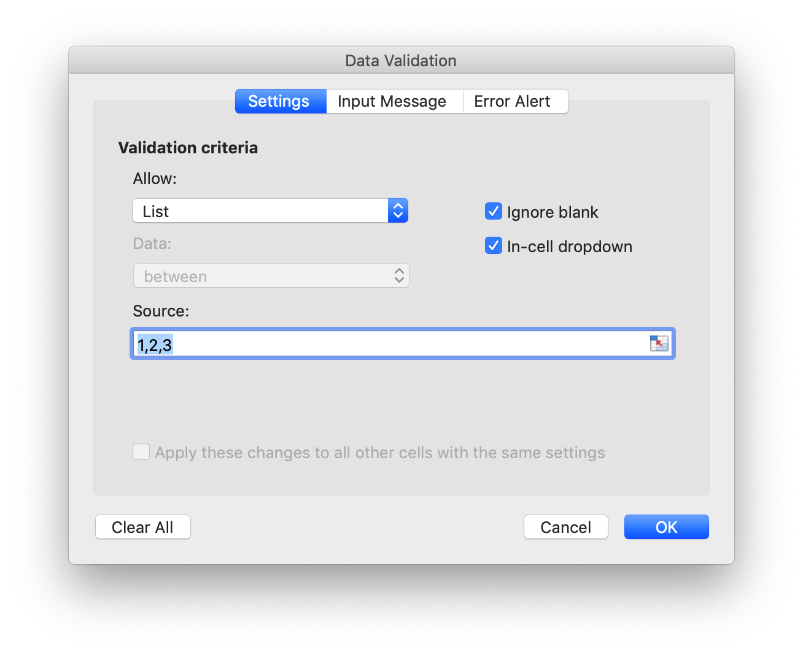

# Data

## Data validation {#AddDataValidation}

```go
func (f *File) AddDataValidation(sheet string, dv *DataValidation)
```

AddDataValidation provides set data validation on a range of the worksheet by given data validation object and worksheet name. The data validation object can be created by `NewDataValidation` function. Data validation type and operators can be found in the [Constants](constants.md) section.

Example 1, set data validation on `Sheet1!A1:B2` with validation criteria settings, show error alert after invalid data is entered with "Stop" style and custom title "error body":


```go
dvRange := excelize.NewDataValidation(true)
dvRange.Sqref = "A1:B2"
dvRange.SetRange(10, 20, excelize.DataValidationTypeWhole, excelize.DataValidationOperatorBetween)
dvRange.SetError(excelize.DataValidationErrorStyleStop, "error title", "error body")
xlsx.AddDataValidation("Sheet1", dvRange)
```

Example 2, set data validation on `Sheet1!A3:B4` with validation criteria settings, and show input message when cell is selected:


```go
dvRange = excelize.NewDataValidation(true)
dvRange.Sqref = "A3:B4"
dvRange.SetRange(10, 20, excelize.DataValidationTypeWhole, excelize.DataValidationOperatorGreaterThan)
dvRange.SetInput("input title", "input body")
xlsx.AddDataValidation("Sheet1", dvRange)
```

Example 3, set data validation on `Sheet1!A5:B6` with validation criteria settings, create in-cell dropdown by allowing list source:



```go
dvRange = excelize.NewDataValidation(true)
dvRange.Sqref = "A5:B6"
dvRange.SetDropList([]string{"1", "2", "3"})
xlsx.AddDataValidation("Sheet1", dvRange)
```

Example 4，set data validation on `Sheet1!A7:B8` with validation criteria source `Sheet1!E1:E3` settings, create in-cell dropdown by allowing list source:


```go
dvRange := excelize.NewDataValidation(true)
dvRange.Sqref = "A7:B8"
dvRange.SetSqrefDropList("E1:E3", true)
xlsx.AddDataValidation("Sheet1", dvRange)
```
