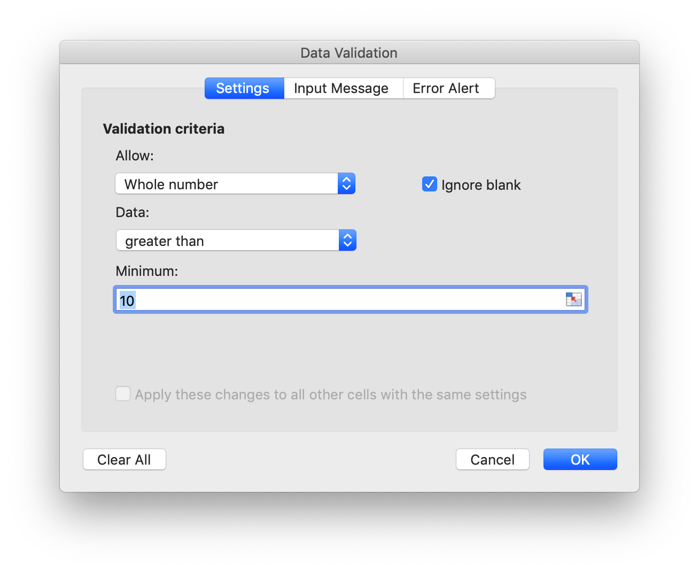
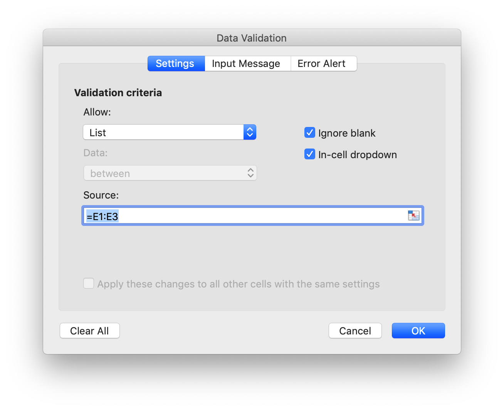

# Data

## Add data validation {#AddDataValidation}

```go
func (f *File) AddDataValidation(sheet string, dv *DataValidation)
```

AddDataValidation provides set data validation on a range of the worksheet by given data validation object and worksheet name. The data validation object can be created by `NewDataValidation` function. Data validation type and operators can be found in the [Constants](constants.md) section.

Example 1, set data validation on `Sheet1!A1:B2` with validation criteria settings, show error alert after invalid data is entered with "Stop" style and custom title "error body":

<p align="center"></p>

```go
dvRange := excelize.NewDataValidation(true)
dvRange.Sqref = "A1:B2"
dvRange.SetRange(10, 20, excelize.DataValidationTypeWhole, excelize.DataValidationOperatorBetween)
dvRange.SetError(excelize.DataValidationErrorStyleStop, "error title", "error body")
f.AddDataValidation("Sheet1", dvRange)
```

Example 2, set data validation on `Sheet1!A3:B4` with validation criteria settings, and show input message when cell is selected:

<p align="center"></p>

```go
dvRange = excelize.NewDataValidation(true)
dvRange.Sqref = "A3:B4"
dvRange.SetRange(10, 20, excelize.DataValidationTypeWhole, excelize.DataValidationOperatorGreaterThan)
dvRange.SetInput("input title", "input body")
f.AddDataValidation("Sheet1", dvRange)
```

Example 3, set data validation on `Sheet1!A5:B6` with validation criteria settings, create in-cell dropdown by allowing list source:

<p align="center"></p>

```go
dvRange = excelize.NewDataValidation(true)
dvRange.Sqref = "A5:B6"
dvRange.SetDropList([]string{"1", "2", "3"})
f.AddDataValidation("Sheet1", dvRange)
```

Example 4，set data validation on `Sheet1!A7:B8` with validation criteria source `Sheet1!E1:E3` settings, create in-cell dropdown by allowing list source:

<p align="center"></p>

```go
dvRange := excelize.NewDataValidation(true)
dvRange.Sqref = "A7:B8"
dvRange.SetSqrefDropList("$E$1:$E$3")
f.AddDataValidation("Sheet1", dvRange)
```

## Get data validations {#GetDataValidations}

```go
func (f *File) GetDataValidations(sheet string) ([]*DataValidation, error)
```

GetDataValidations returns data validations list by given worksheet name.

## Delete data validation {#DeleteDataValidation}

```go
func (f *File) DeleteDataValidation(sheet string, sqref ...string) error
```

DeleteDataValidation delete data validation by given worksheet name and reference sequence. All data validations in the worksheet will be deleted if not specify reference sequence parameter.
