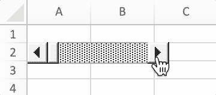

# Form Controls

FormControl directly maps the form controls information.

```go
type FormControl struct {
    Cell         string
    Macro        string
    Width        uint
    Height       uint
    Checked      bool
    CurrentVal   uint
    MinVal       uint
    MaxVal       uint
    IncChange    uint
    PageChange   uint
    Horizontally bool
    CellLink     string
    Text         string
    Paragraph    []RichTextRun
    Type         FormControlType
    Format       GraphicOptions
}
```

## Add form control {#AddFormControl}

```go
func (f *File) AddFormControl(sheet string, opts FormControl) error
```

AddFormControl provides the method to add form control button in a worksheet by given worksheet name and form control options. Supported form control type: button, check box, group box, label, option button, scroll bar and spinner. If set macro for the form control, the workbook extension should be `.xlsm` or `.xltm`. Scroll value must be between 0 and 30000.

Example 1, add button form control with macro, rich-text, custom button size, print property on `Sheet1!A2`, and let the button do not move or size with cells:

<p align="center"></p>

```go
err := f.AddFormControl("Sheet1", excelize.FormControl{
    Cell:   "A2",
    Type:   excelize.FormControlButton,
    Macro:  "Button1_Click",
    Width:  140,
    Height: 60,
    Text:   "Button 1\r\n",
    Paragraph: []excelize.RichTextRun{
        {
            Font: &excelize.Font{
                Bold:      true,
                Italic:    true,
                Underline: "single",
                Family:    "Times New Roman",
                Size:      14,
                Color:     "777777",
            },
            Text: "C1=A1+B1",
        },
    },
    Format: excelize.GraphicOptions{
        PrintObject: &enable,
        Positioning: "absolute",
    },
})
```

Example 2, add option button form controls with checked status and text on `Sheet1!A1` and `Sheet1!A2`:

<p align="center"></p>

```go
if err := f.AddFormControl("Sheet1", excelize.FormControl{
    Cell:    "A1",
    Type:    excelize.FormControlOptionButton,
    Text:    "Option Button 1",
    Checked: true,
}); err != nil {
    fmt.Println(err)
}
if err := f.AddFormControl("Sheet1", excelize.FormControl{
    Cell:    "A2",
    Type:    excelize.FormControlOptionButton,
    Text:    "Option Button 2",
}); err != nil {
    fmt.Println(err)
}
```

Example 3, add spin button form control on `Sheet1!B1` to increase or decrease the value of `Sheet1!A1`:

<p align="center"></p>

```go
err := f.AddFormControl("Sheet1", excelize.FormControl{
    Cell:       "B1",
    Type:       excelize.FormControlSpinButton,
    Width:      15,
    Height:     40,
    CurrentVal: 7,
    MinVal:     5,
    MaxVal:     10,
    IncChange:  1,
    CellLink:   "A1",
})
```

Example 4, add horizontally scroll bar form control on `Sheet1!A2` to change the value of `Sheet1!A1` by click the scroll arrows or drag the scroll box:

<p align="center"></p>

```go
err := f.AddFormControl("Sheet1", excelize.FormControl{
    Cell:         "A2",
    Type:         excelize.FormControlScrollBar,
    Width:        140,
    Height:       20,
    CurrentVal:   50,
    MinVal:       10,
    MaxVal:       100,
    IncChange:    1,
    PageChange:   1,
    CellLink:     "A1",
    Horizontally: true,
})
```

## Get form controls {#GetFormControls}

```go
func (f *File) GetFormControls(sheet string) ([]FormControl, error)
```

GetFormControls retrieves all form controls in a worksheet by a given worksheet name. Note that, this function does not support getting the width and height of the form controls currently.

## Delete form control {#DeleteFormControl}

```go
func (f *File) DeleteFormControl(sheet, cell string) error
```

DeleteFormControl provides the method to delete form control in a worksheet by given worksheet name and cell reference. For example, delete the form control in `Sheet1!$A$1`:

```go
err := f.DeleteFormControl("Sheet1", "A1")
```
