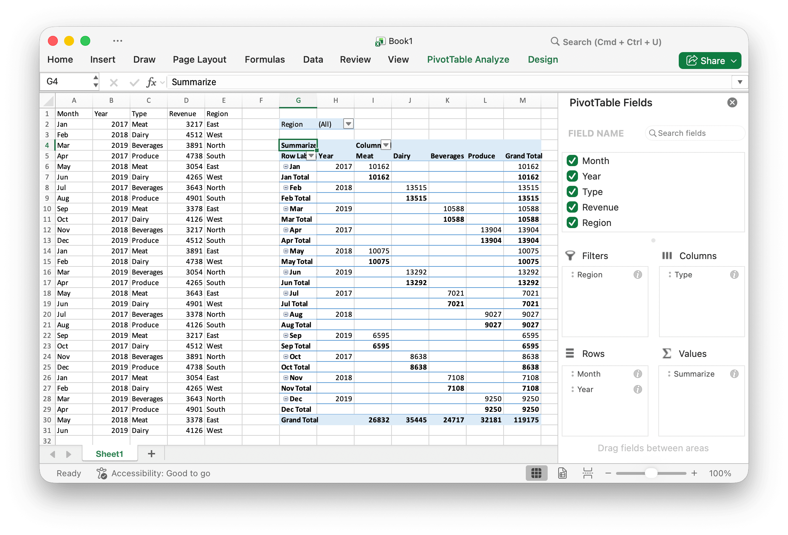

# Pivot Table {#PivotTable}

A pivot table is a table of statistics that summarizes the data of a more extensive table (such as from a database, spreadsheet, or business intelligence program). This summary might include sums, averages, or other statistics, which the pivot table groups together in a meaningful way.

## Create Pivot Table {#AddPivotTable}

```go
func (f *File) AddPivotTable(opt *PivotTableOption) error
```

AddPivotTable provides the method to add pivot table by given pivot table options. For example, create a pivot table on the `Sheet1!$G$2:$M$34` area with the region `Sheet1!$A$1:$E$31` as the data source, summarize by sum for sales:

<p align="center"></p>

```go
package main

import (
    "fmt"
    "math/rand"

    "github.com/360EntSecGroup-Skylar/excelize"
)

func main() {
    f := excelize.NewFile()
    // Create some data in a sheet
    month := []string{"Jan", "Feb", "Mar", "Apr", "May", "Jun", "Jul", "Aug", "Sep", "Oct", "Nov", "Dec"}
    year := []int{2017, 2018, 2019}
    types := []string{"Meat", "Dairy", "Beverages", "Produce"}
    region := []string{"East", "West", "North", "South"}
    f.SetSheetRow("Sheet1", "A1", &[]string{"Month", "Year", "Type", "Sales", "Region"})
    for i := 0; i < 30; i++ {
        f.SetCellValue("Sheet1", fmt.Sprintf("A%d", i+2), month[rand.Intn(12)])
        f.SetCellValue("Sheet1", fmt.Sprintf("B%d", i+2), year[rand.Intn(3)])
        f.SetCellValue("Sheet1", fmt.Sprintf("C%d", i+2), types[rand.Intn(4)])
        f.SetCellValue("Sheet1", fmt.Sprintf("D%d", i+2), rand.Intn(5000))
        f.SetCellValue("Sheet1", fmt.Sprintf("E%d", i+2), region[rand.Intn(4)])
    }
    if err := f.AddPivotTable(&excelize.PivotTableOption{
        DataRange:       "Sheet1!$A$1:$E$31",
        PivotTableRange: "Sheet1!$G$2:$M$34",
        Rows:            []string{"Month", "Year"},
        Columns:         []string{"Type"},
        Data:            []string{"Sales"},
    }); err != nil {
        println(err.Error())
    }
    if err := f.SaveAs("Book1.xlsx"); err != nil {
        println(err.Error())
    }
}
```