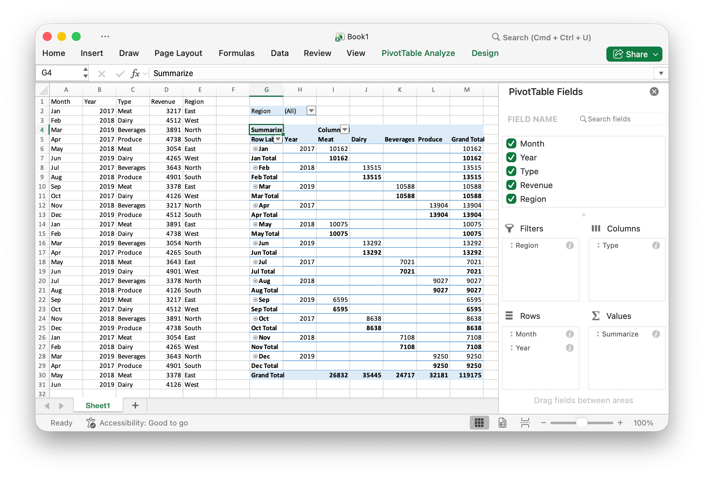

# Pivot Table {#PivotTable}

A pivot table is a table of statistics that summarizes the data of a more extensive table (such as from a database, spreadsheet, or business intelligence program). This summary might include sums, averages, or other statistics, which the pivot table groups together in a meaningful way.

`PivotTableOptions` directly maps the format settings of the pivot table.

```go
type PivotTableOptions struct {
    DataRange           string
    PivotTableRange     string
    Name                string
    Rows                []PivotTableField
    Columns             []PivotTableField
    Data                []PivotTableField
    Filter              []PivotTableField
    RowGrandTotals      bool
    ColGrandTotals      bool
    ShowDrill           bool
    UseAutoFormatting   bool
    PageOverThenDown    bool
    MergeItem           bool
    ClassicLayout       bool
    CompactData         bool
    ShowError           bool
    ShowRowHeaders      bool
    ShowColHeaders      bool
    ShowRowStripes      bool
    ShowColStripes      bool
    ShowLastColumn      bool
    FieldPrintTitles    bool
    ItemPrintTitles     bool
    PivotTableStyleName string
    // contains filtered or unexported fields
}
```

`PivotTableStyleName`: The built-in pivot table style names:

```text
PivotStyleLight1 - PivotStyleLight28
PivotStyleMedium1 - PivotStyleMedium28
PivotStyleDark1 - PivotStyleDark28
```

`PivotTableField` directly maps the field settings of the pivot table.

```go
type PivotTableField struct {
    Compact         bool
    Data            string
    Name            string
    Outline         bool
    ShowAll         bool
    InsertBlankRow  bool
    Subtotal        string
    DefaultSubtotal bool
    NumFmt          int
    SelectedItems   []string
}
```

`Subtotal` specifies the aggregation function that applies to this data field. The default value is `Sum`. The possible values for this attribute are:

|Optional Value|
|---|
|Average|
|Count|
|CountNums|
|Max|
|Min|
|Product|
|StdDev|
|StdDevp|
|Sum|
|Var|
|Varp|

`Name` specifies the name of the data field. Maximum `255` characters are allowed in data field name, excess characters will be truncated.

`SelectedItems` option is used to specify the default selected items in a pivot table field. The selected items must fall within the range of items selected in the pivot table.

`SelectedItems` specifies the default selected items in a pivot table field. The selected items must be values within the cell range referenced by that field.

## Create pivot table {#AddPivotTable}

```go
func (f *File) AddPivotTable(opts *PivotTableOptions) error
```

AddPivotTable provides the method to add pivot table by given pivot table options.

For example, create a pivot table on the `Sheet1!G4:M31` area with the region `Sheet1!A1:E31` as the data source, summarize by sum for sales:

<p align="center"></p>

```go
package main

import (
    "fmt"

    "github.com/xuri/excelize/v2"
)

func main() {
    f := excelize.NewFile()
    defer func() {
        if err := f.Close(); err != nil {
            fmt.Println(err)
        }
    }()
 Create some data in a sheet
    month := []string{"Jan", "Feb", "Mar", "Apr", "May",
        "Jun", "Jul", "Aug", "Sep", "Oct", "Nov", "Dec"}
    year := []int{2017, 2018, 2019}
    types := []string{"Meat", "Dairy", "Beverages", "Produce"}
    revenue := []int{3217, 4512, 3891, 4738, 3054, 4265, 3643, 4901, 3378, 4126}
    region := []string{"East", "West", "North", "South"}
    if err := f.SetSheetRow(
        "Sheet1", "A1", &[]string{"Month", "Year", "Type", "Revenue", "Region"},
    ); err != nil {
        fmt.Println(err)
        return
    }
    for row := 2; row < 32; row++ {
        f.SetCellValue("Sheet1", fmt.Sprintf("A%d", row), month[(row-2)%len(month)])
        f.SetCellValue("Sheet1", fmt.Sprintf("B%d", row), year[(row-2)%len(year)])
        f.SetCellValue("Sheet1", fmt.Sprintf("C%d", row), types[(row-2)%len(types)])
        f.SetCellValue("Sheet1", fmt.Sprintf("D%d", row), revenue[(row-2)%len(revenue)])
        f.SetCellValue("Sheet1", fmt.Sprintf("E%d", row), region[(row-2)%len(region)])
    }
    if err := f.AddPivotTable(&excelize.PivotTableOptions{
        DataRange:       "Sheet1!A1:E31",
        PivotTableRange: "Sheet1!G4:M31",
        Rows: []excelize.PivotTableField{
            {Data: "Month", DefaultSubtotal: true}, {Data: "Year"},
        },
        Filter: []excelize.PivotTableField{
            {Data: "Region"}},
        Columns: []excelize.PivotTableField{
            {Data: "Type", DefaultSubtotal: true},
        },
        Data: []excelize.PivotTableField{
            {Data: "Revenue", Name: "Summarize", Subtotal: "Sum"},
        },
        RowGrandTotals: true,
        ColGrandTotals: true,
        ShowDrill:      true,
        ShowRowHeaders: true,
        ShowColHeaders: true,
        ShowLastColumn: true,
    }); err != nil {
        fmt.Println(err)
        return
    }
    if err := f.SaveAs("Book1.xlsx"); err != nil {
        fmt.Println(err)
    }
}
```

## Get pivot tables {#GetPivotTables}

```go
func (f *File) GetPivotTables(sheet string) ([]PivotTableOptions, error)
```

GetPivotTables returns all pivot table definitions in a worksheet by given worksheet name.

## Delete pivot table {#DeletePivotTable}

```go
func (f *File) DeletePivotTable(sheet, name string) error
```

DeletePivotTable delete a pivot table by giving the worksheet name and pivot table name. Note that this function does not clean cell values in the pivot table range.
