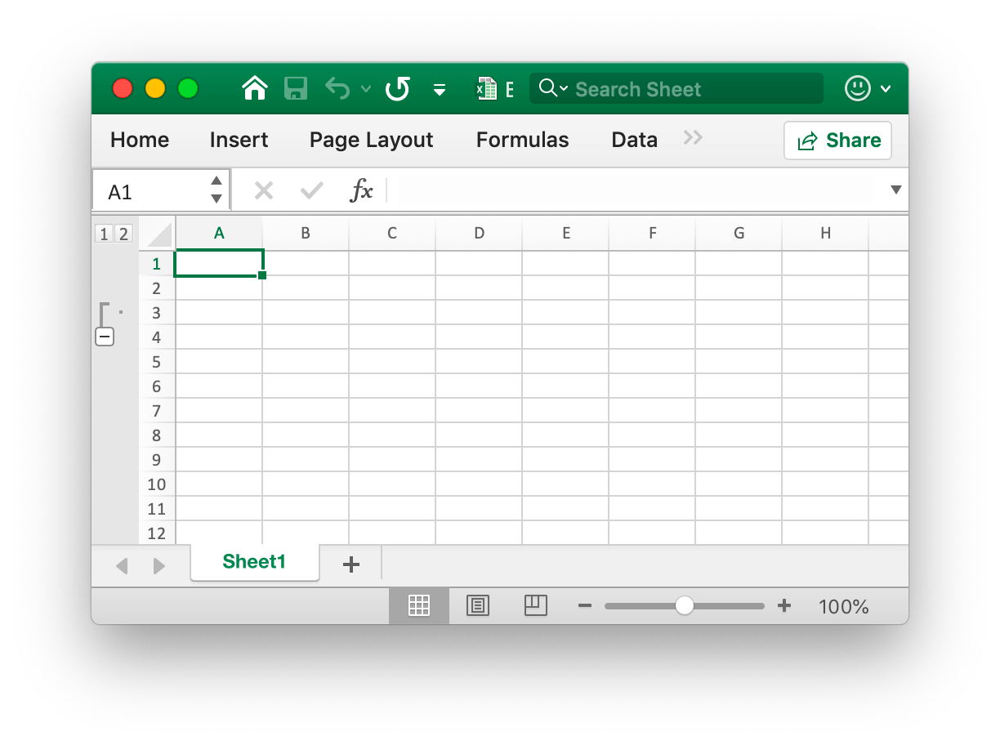

# Worksheet

## Set column visibility {#SetColVisible}

```go
func (f *File) SetColVisible(sheet, column string, visible bool)
```

SetColVisible provides a function to set visible of a single column by given worksheet name and column name. For example, hide column `D` in `Sheet1`:

```go
xlsx.SetColVisible("Sheet1", "D", false)
```

## Set column width {#SetColWidth}

```go
func (f *File) SetColWidth(sheet, startcol, endcol string, width float64)
```

SetColWidth provides a function to set the width of a single column or multiple columns. For example:

```go
xlsx := excelize.NewFile()
xlsx.SetColWidth("Sheet1", "A", "H", 20)
err := xlsx.Save()
if err != nil {
    fmt.Println(err)
}
```

## Set row height {#SetRowHeight}

```go
func (f *File) SetRowHeight(sheet string, row int, height float64)
```

SetRowHeight provides a function to set the height of a single row. For example, set the height of the first row in `Sheet1`:

```go
xlsx.SetRowHeight("Sheet1", 1, 50)
```

## Set row visibility {#SetRowVisible}

```go
func (f *File) SetRowVisible(sheet string, rowIndex int, visible bool)
```

SetRowVisible provides a function to set visible of a single row by given worksheet name and row index. For example, hide row `2` in `Sheet1`:

```go
xlsx.SetRowVisible("Sheet1", 2, false)
```

## Get worksheet name {#GetSheetName}

```go
func (f *File) GetSheetName(index int) string
```

GetSheetName provides a function to get worksheet name of XLSX by given worksheet index. If given sheet index is invalid, will return an empty string.

## Get column visibility {#GetColVisible}

```go
func (f *File) GetColVisible(sheet, column string) bool
```

GetColVisible provides a function to get visible of a single column by given worksheet name and column name. For example, get visible state of column `D` in `Sheet1`:

```go
xlsx.GetColVisible("Sheet1", "D")
```

## Get column width {#GetColWidth}

```go
func (f *File) GetColWidth(sheet, column string) float64
```

GetColWidth provides a function to get column width by given worksheet name and column index.

## Get row height {#GetRowHeight}

```go
func (f *File) GetRowHeight(sheet string, row int) float64
```

GetRowHeight provides a function to get row height by given worksheet name and row index. For example, get the height of the first row in `Sheet1`:

```go
xlsx.GetRowHeight("Sheet1", 1)
```

## Get row visibility {#GetRowVisible}

```go
func (f *File) GetRowVisible(sheet string, rowIndex int) bool
```

GetRowVisible provides a function to get visible of a single row by given worksheet name and row index. For example, get visible state of row `2` in `Sheet1`:

```go
xlsx.GetRowVisible("Sheet1", 2)
```

## Get worksheet index {#GetSheetIndex}

```go
func (f *File) GetSheetIndex(name string) int
```

GetSheetIndex provides a function to get worksheet index of XLSX by given sheet name. If given worksheet name is invalid, will return an integer type value `0`.

The obtained index can be used as a parameter to call the [`SetActiveSheet()`](workbook.md#SetActiveSheet) function when setting the workbook default worksheet.

## Get worksheets list {#GetSheetMap}

```go
func (f *File) GetSheetMap() map[int]string
```

GetSheetMap provides a function to get worksheet name and index map of XLSX. For example:

```go
xlsx, err := excelize.OpenFile("./Book1.xlsx")
if err != nil {
    return
}
for index, name := range xlsx.GetSheetMap() {
    fmt.Println(index, name)
}
```

## Get worksheet properties {#GetSheetPrOptions}

```go
func (f *File) GetSheetPrOptions(name string, opts ...SheetPrOptionPtr) error
```

GetSheetPrOptions provides a function to gets worksheet properties.

|Optional Attribute|Type|
|---|---|
|CodeName|string|
|EnableFormatConditionsCalculation|bool|
|Published|bool|
|FitToPage|bool|
|AutoPageBreaks|bool|

For example:

```go
xl := excelize.NewFile()
const sheet = "Sheet1"

var (
    codeName                          excelize.CodeName
    enableFormatConditionsCalculation excelize.EnableFormatConditionsCalculation
    published                         excelize.Published
    fitToPage                         excelize.FitToPage
    autoPageBreaks                    excelize.AutoPageBreaks
)

if err := xl.GetSheetPrOptions(sheet,
    &codeName,
    &enableFormatConditionsCalculation,
    &published,
    &fitToPage,
    &autoPageBreaks,
); err != nil {
    panic(err)
}
fmt.Println("Defaults:")
fmt.Printf("- codeName: %q\n", codeName)
fmt.Println("- enableFormatConditionsCalculation:", enableFormatConditionsCalculation)
fmt.Println("- published:", published)
fmt.Println("- fitToPage:", fitToPage)
fmt.Println("- autoPageBreaks:", autoPageBreaks)
```

Output:

```text
Defaults:
- codeName: ""
- enableFormatConditionsCalculation: true
- published: true
- fitToPage: false
- autoPageBreaks: false
```

## Insert column {#InsertCol}

```go
func (f *File) InsertCol(sheet, column string)
```

InsertCol provides a function to insert a new column before given column index. For example, create a new column before column `C` in `Sheet1`:

```go
xlsx.InsertCol("Sheet1", "C")
```

## Insert row {#InsertRow}

```go
func (f *File) InsertRow(sheet string, row int)
```

InsertRow provides a function to insert a new row before given row index. For example, create a new row before row `3` in `Sheet1`:

```go
xlsx.InsertRow("Sheet1", 2)
```

## Create row outline {#SetRowOutlineLevel}

```go
func (f *File) SetRowOutlineLevel(sheet string, rowIndex int, level uint8)
```

SetRowOutlineLevel provides a function to set outline level number of a single row by given worksheet name and row index. For example, outline row 2 in `Sheet1` to level 1:



```go
xlsx.SetRowOutlineLevel("Sheet1", 2, 1)
```

## Create column outline {#SetColOutlineLevel}

```go
func (f *File) SetColOutlineLevel(sheet, column string, level uint8)
```

SetColOutlineLevel provides a function to set outline level of a single column by given worksheet name and column name. For example, set outline level of column `D` in `Sheet1` to 2:


```go
xlsx.SetColOutlineLevel("Sheet1", "D", 2)
```

## Get row outline {#GetRowOutlineLevel}

```go
func (f *File) GetRowOutlineLevel(sheet string, rowIndex int) uint8
```

GetRowOutlineLevel provides a function to get outline level number of a single row by given worksheet name and row index. For example, get outline number of row 2 in `Sheet1`:

```go
xlsx.GetRowOutlineLevel("Sheet1", 2)
```

## Get column outline {#GetColOutlineLevel}

```go
func (f *File) GetColOutlineLevel(sheet, column string) uint8
```

GetColOutlineLevel provides a function to get outline level of a single column by given worksheet name and column name. For example, get outline level of column `D` in `Sheet1`:

```go
xlsx.GetColOutlineLevel("Sheet1", "D")
```

## Row iterator {#Rows}

```go
func (f *File) Rows(sheet string) (*Rows, error)
```

Rows return a rows iterator. For example:

```go
rows, err := xlsx.Rows("Sheet1")
for rows.Next() {
    for _, colCell := range rows.Columns() {
        fmt.Print(colCell, "\t")
    }
    fmt.Println()
}
```

### Row iterator - Columns

```go
func (rows *Rows) Columns() []string
```

Columns return the current row's column values.

### Row iterator - Traversing

```go
func (rows *Rows) Next() bool
```

Next will return `true` if find the next row element.

### Row iterator - Error handling

```go
func (rows *Rows) Error() error
```

Error will return the `error` when the find next row element.

## Search Sheet {#SearchSheet}

```go
func (f *File) SearchSheet(sheet, value string) []string
```

SearchSheet provides a function to get coordinates by given worksheet name and cell value. This function only supports exact match of strings and numbers, doesn't support the calculated result, formatted numbers and conditional lookup currently. If it is a merged cell, it will return the coordinates of the upper left corner of the merged area. For example, search the coordinates of the value of `100` on `Sheet1`:

```go
xlsx.SearchSheet("Sheet1", "100")
```

## Protect Sheet {#ProtectSheet}

```go
func (f *File) ProtectSheet(sheet string, settings *FormatSheetProtection)
```

ProtectSheet provides a function to prevent other users from accidentally or deliberately changing, moving, or deleting data in a worksheet. For example, protect `Sheet1` with protection settings:


```go
xlsx.ProtectSheet("Sheet1", &excelize.FormatSheetProtection{
    Password:      "password",
    EditScenarios: false,
})
```

## Unprotect Sheet {#UnprotectSheet}

```go
func (f *File) UnprotectSheet(sheet string)
```

UnprotectSheet provides a function to unprotect an Excel worksheet.
