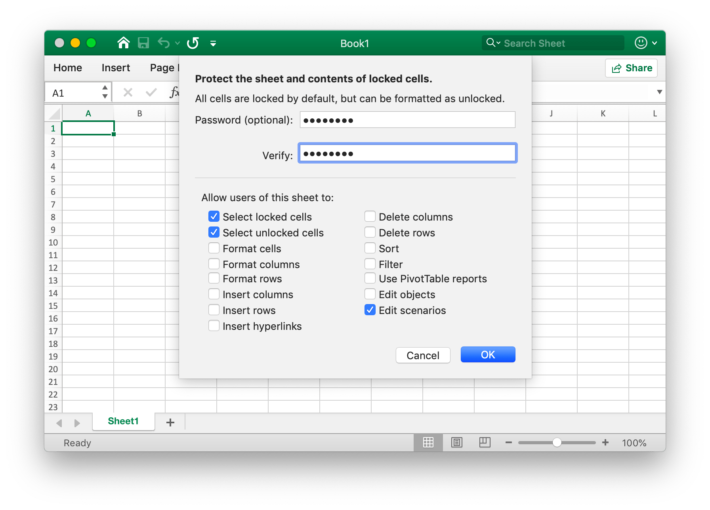

# Worksheet

## Set column visibility {#SetColVisible}

```go
func (f *File) SetColVisible(sheet, col string, visible bool) error
```

SetColVisible provides a function to set visible of a single column by given worksheet name and column name. For example, hide column `D` in `Sheet1`:

```go
err := f.SetColVisible("Sheet1", "D", false)
```

Hide the columns from `D` to `F` (included):

```go
err := f.SetColVisible("Sheet1", "D:F", false)
```

## Set column width {#SetColWidth}

```go
func (f *File) SetColWidth(sheet, startcol, endcol string, width float64) error
```

SetColWidth provides a function to set the width of a single column or multiple columns. For example:

```go
f := excelize.NewFile()
err := f.SetColWidth("Sheet1", "A", "H", 20)
```

## Set row height {#SetRowHeight}

```go
func (f *File) SetRowHeight(sheet string, row int, height float64) error
```

SetRowHeight provides a function to set the height of a single row. For example, set the height of the first row in `Sheet1`:

```go
err := f.SetRowHeight("Sheet1", 1, 50)
```

## Set row visibility {#SetRowVisible}

```go
func (f *File) SetRowVisible(sheet string, row int, visible bool) error
```

SetRowVisible provides a function to set visible of a single row by given worksheet name and row index. For example, hide row `2` in `Sheet1`:

```go
err := f.SetRowVisible("Sheet1", 2, false)
```

## Get sheet name {#GetSheetName}

```go
func (f *File) GetSheetName(index int) string
```

GetSheetName provides a function to get the sheet name of the workbook by the given sheet index. If the given sheet index is invalid, it will return an empty string.

## Get column visibility {#GetColVisible}

```go
func (f *File) GetColVisible(sheet, column string) (bool, error)
```

GetColVisible provides a function to get visible of a single column by given worksheet name and column name. For example, get visible state of column `D` in `Sheet1`:

```go
visible, err := f.GetColVisible("Sheet1", "D")
```

## Get column width {#GetColWidth}

```go
func (f *File) GetColWidth(sheet, col string) (float64, error)
```

GetColWidth provides a function to get column width by given worksheet name and column index.

## Get row height {#GetRowHeight}

```go
func (f *File) GetRowHeight(sheet string, row int) (float64, error)
```

GetRowHeight provides a function to get row height by given worksheet name and row index. For example, get the height of the first row in `Sheet1`:

```go
height, err := f.GetRowHeight("Sheet1", 1)
```

## Get row visibility {#GetRowVisible}

```go
func (f *File) GetRowVisible(sheet string, row int) (bool, error)
```

GetRowVisible provides a function to get visible of a single row by given worksheet name and row index. For example, get visible state of row `2` in `Sheet1`:

```go
err := f.GetRowVisible("Sheet1", 2)
```

## Get sheet index {#GetSheetIndex}

```go
func (f *File) GetSheetIndex(name string) int
```

GetSheetIndex provides a function to get a sheet index of the workbook by the given sheet name. If the given sheet name is invalid, it will return an integer type value `-1`.

The obtained index can be used as a parameter to call the [`SetActiveSheet()`](workbook.md#SetActiveSheet) function when setting the workbook default worksheet.

## Get sheet map {#GetSheetMap}

```go
func (f *File) GetSheetMap() map[int]string
```

GetSheetMap provides a function to get worksheets, chart sheets, dialog sheets ID and name map of the workbook. For example:

```go
f, err := excelize.OpenFile("./Book1.xlsx")
if err != nil {
    return
}
for index, name := range f.GetSheetMap() {
    fmt.Println(index, name)
}
```

## Get sheet list {#GetSheetList}

```go
func (f *File) GetSheetList() []string
```

GetSheetList provides a function to get worksheets, chart sheets, and dialog sheets name list of the workbook.

## Set sheet name {#SetSheetName}

```go
func (f *File) SetSheetName(oldName, newName string)
```

SetSheetName provides a function to set the worksheet name by given old and new worksheet name. Maximum 31 characters are allowed in sheet title and this function only changes the name of the sheet and will not update the sheet name in the formula or reference associated with the cell. So there may be problem formula error or reference missing.

## Set sheet properties {#SetSheetPrOptions}

```go
func (f *File) SetSheetPrOptions(name string, opts ...SheetPrOption) error
```

SetSheetPrOptions provides a function to sets worksheet properties.

Available options:

|Optional Attribute|Type|
|---|---|
|CodeName|string|
|EnableFormatConditionsCalculation|bool|
|Published|bool|
|FitToPage|bool|
|AutoPageBreaks|bool|
|OutlineSummaryBelow|bool|

For example:

```go
f := excelize.NewFile()
const sheet = "Sheet1"

if err := f.SetSheetPrOptions(sheet,
    excelize.CodeName("code"),
    excelize.EnableFormatConditionsCalculation(false),
    excelize.Published(false),
    excelize.FitToPage(true),
    excelize.AutoPageBreaks(true),
    excelize.OutlineSummaryBelow(false),
); err != nil {
    panic(err)
}
```

## Get sheet properties {#GetSheetPrOptions}

```go
func (f *File) GetSheetPrOptions(name string, opts ...SheetPrOptionPtr) error
```

GetSheetPrOptions provides a function to gets worksheet properties.

|Optional Attribute|Type|
|---|---|
|CodeName|string|
|EnableFormatConditionsCalculation|bool|
|Published|bool|
|FitToPage|bool|
|AutoPageBreaks|bool|
|OutlineSummaryBelow|bool|

For example:

```go
f := excelize.NewFile()
const sheet = "Sheet1"

var (
    codeName                          excelize.CodeName
    enableFormatConditionsCalculation excelize.EnableFormatConditionsCalculation
    published                         excelize.Published
    fitToPage                         excelize.FitToPage
    autoPageBreaks                    excelize.AutoPageBreaks
    outlineSummaryBelow               excelize.OutlineSummaryBelow
)

if err := f.GetSheetPrOptions(sheet,
    &codeName,
    &enableFormatConditionsCalculation,
    &published,
    &fitToPage,
    &autoPageBreaks,
    &outlineSummaryBelow,
); err != nil {
    panic(err)
}
fmt.Println("Defaults:")
fmt.Printf("- codeName: %q\n", codeName)
fmt.Println("- enableFormatConditionsCalculation:", enableFormatConditionsCalculation)
fmt.Println("- published:", published)
fmt.Println("- fitToPage:", fitToPage)
fmt.Println("- autoPageBreaks:", autoPageBreaks)
fmt.Println("- outlineSummaryBelow:", outlineSummaryBelow)
```

Output:

```text
Defaults:
- codeName: ""
- enableFormatConditionsCalculation: true
- published: true
- fitToPage: false
- autoPageBreaks: false
- outlineSummaryBelow: true
```

## Insert column {#InsertCol}

```go
func (f *File) InsertCol(sheet, column string) error
```

InsertCol provides a function to insert a new column before given column index. For example, create a new column before column `C` in `Sheet1`:

```go
err := f.InsertCol("Sheet1", "C")
```

## Insert row {#InsertRow}

```go
func (f *File) InsertRow(sheet string, row int) error
```

InsertRow provides a function to insert a new row after given Excel row number starting from 1. For example, create a new row before row `3` in `Sheet1`:

```go
err := f.InsertRow("Sheet1", 3)
```

## Append duplicate row {#DuplicateRow}

```go
func (f *File) DuplicateRow(sheet string, row int) error
```

DuplicateRow inserts a copy of specified row below specified, for example:

```go
err := f.DuplicateRow("Sheet1", 2)
```

Use this method with caution, which will affect changes in references such as formulas, charts, and so on. If there is any referenced value of the worksheet, it will cause a file error when you open it. The excelize only partially updates these references currently.

## Duplicate row {#DuplicateRowTo}

```go
func (f *File) DuplicateRowTo(sheet string, row, row2 int) error
```

DuplicateRowTo inserts a copy of specified row by it Excel number to specified row position moving down exists rows after target position, for example:

```go
err := f.DuplicateRowTo("Sheet1", 2, 7)
```

Use this method with caution, which will affect changes in references such as formulas, charts, and so on. If there is any referenced value of the worksheet, it will cause a file error when you open it. The excelize only partially updates these references currently.

## Create row outline {#SetRowOutlineLevel}

```go
func (f *File) SetRowOutlineLevel(sheet string, row int, level uint8) error
```

SetRowOutlineLevel provides a function to set outline level number of a single row by given worksheet name and Excel row number. For example, outline row 2 in `Sheet1` to level 1:

<p align="center"></p>

```go
err := f.SetRowOutlineLevel("Sheet1", 2, 1)
```

## Create column outline {#SetColOutlineLevel}

```go
func (f *File) SetColOutlineLevel(sheet, col string, level uint8) error
```

SetColOutlineLevel provides a function to set outline level of a single column by given worksheet name and column name. For example, set outline level of column `D` in `Sheet1` to 2:

<p align="center"></p>

```go
err := f.SetColOutlineLevel("Sheet1", "D", 2)
```

## Get row outline {#GetRowOutlineLevel}

```go
func (f *File) GetRowOutlineLevel(sheet string, row int) (uint8, error)
```

GetRowOutlineLevel provides a function to get outline level number of a single row by given worksheet name and Excel row number. For example, get outline number of row 2 in `Sheet1`:

```go
err := f.GetRowOutlineLevel("Sheet1", 2)
```

## Get column outline {#GetColOutlineLevel}

```go
func (f *File) GetColOutlineLevel(sheet, col string) (uint8, error)
```

GetColOutlineLevel provides a function to get outline level of a single column by given worksheet name and column name. For example, get outline level of column `D` in `Sheet1`:

```go
level, err := f.GetColOutlineLevel("Sheet1", "D")
```

## Row iterator {#Rows}

```go
func (f *File) Rows(sheet string) (*Rows, error)
```

Rows returns a rows iterator, used for streaming reading data for a worksheet with a large data. For example:

```go
rows, err := f.Rows("Sheet1")
if err != nil {
    println(err.Error())
    return
}
for rows.Next() {
    row, err := rows.Columns()
    if err != nil {
        println(err.Error())
    }
    for _, colCell := range row {
        print(colCell, "\t")
    }
    println()
}
```

### Row iterator - Columns

```go
func (rows *Rows) Columns() ([]string, error)
```

Columns return the current row's column values.

### Row iterator - Traversing

```go
func (rows *Rows) Next() bool
```

Next will return `true` if find the next row element.

### Row iterator - Error handling

```go
func (rows *Rows) Error() error
```

Error will return the `error` when the find next row element.

## Search Sheet {#SearchSheet}

```go
func (f *File) SearchSheet(sheet, value string, reg ...bool) ([]string, error)
```

SearchSheet provides a function to get coordinates by given worksheet name, cell value, and regular expression. The function doesn't support searching on the calculated result, formatted numbers and conditional lookup currently. If it is a merged cell, it will return the coordinates of the upper left corner of the merged area.

For example, search the coordinates of the value of `100` on `Sheet1`:

```go
result, err := f.SearchSheet("Sheet1", "100")
```

For example, search the coordinates where the numerical value in the range of `0-9` of `Sheet1` is described:

```go
result, err := f.SearchSheet("Sheet1", "[0-9]", true)
```

## Protect Sheet {#ProtectSheet}

```go
func (f *File) ProtectSheet(sheet string, settings *FormatSheetProtection) error
```

ProtectSheet provides a function to prevent other users from accidentally or deliberately changing, moving, or deleting data in a worksheet. For example, protect `Sheet1` with protection settings:

<p align="center"></p>

```go
err := f.ProtectSheet("Sheet1", &excelize.FormatSheetProtection{
    Password:      "password",
    EditScenarios: false,
})
```

## Unprotect Sheet {#UnprotectSheet}

```go
func (f *File) UnprotectSheet(sheet string) error
```

UnprotectSheet provides a function to unprotect an Excel worksheet.

## Remove column {#RemoveCol}

```go
func (f *File) RemoveCol(sheet, col string) error
```

RemoveCol provides a function to remove a single column by given worksheet name and column index. For example, remove column `C` in `Sheet1`:

```go
err := f.RemoveCol("Sheet1", "C")
```

Use this method with caution, which will affect changes in references such as formulas, charts, and so on. If there is any referenced value of the worksheet, it will cause a file error when you open it. The excelize only partially updates these references currently.

## Remove row {#RemoveRow}

```go
func (f *File) RemoveRow(sheet string, row int) error
```

RemoveRow provides a function to remove a single row by given worksheet name and Excel row number. For example, remove row `3` in `Sheet1`:

```go
err := f.RemoveRow("Sheet1", 3)
```

Use this method with caution, which will affect changes in references such as formulas, charts, and so on. If there is any referenced value of the worksheet, it will cause a file error when you open it. The excelize only partially updates these references currently.

## Set row values {#SetSheetRow}

```go
func (f *File) SetSheetRow(sheet, axis string, slice interface{}) error
```

SetSheetRow writes an array to row by given worksheet name, starting coordinate and a pointer to array type `slice`. For example, writes an array to row `6` start with the cell `B6` on `Sheet1`:

```go
err := f.SetSheetRow("Sheet1", "B6", &[]interface{}{"1", nil, 2})
```

## Insert page break {#InsertPageBreak}

```go
func (f *File) InsertPageBreak(sheet, cell string) (err error)
```

InsertPageBreak create a page break to determine where the printed page ends and where begins the next one by given worksheet name and axis, so the content before the page break will be printed on one page and after the page break on another.

## Remove page break {#RemovePageBreak}

```go
func (f *File) RemovePageBreak(sheet, cell string) (err error)
```

RemovePageBreak remove a page break by given worksheet name and axis.
