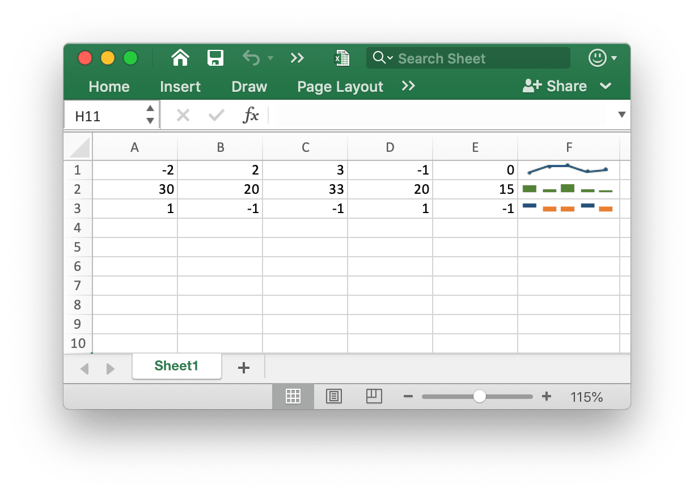
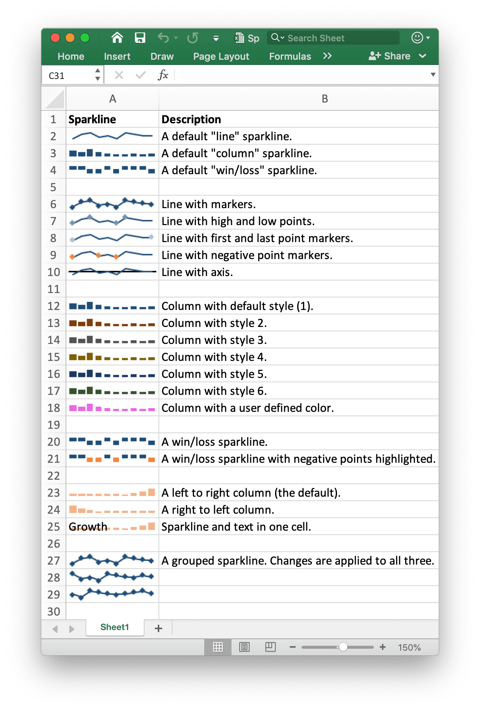

# Sparklines

Sparklines are a feature of Excel 2010+ which allows you to add small charts to worksheet cells. These are useful for showing visual trends in data in a compact format.

<p align="center"></p>

[Sparklines](https://en.wikipedia.org/wiki/Sparklines) was invented by [Edward Tufte](https://en.wikipedia.org/wiki/Edward_Tufte).

## Add Sparkline

```go
func (f *File) AddSparkline(sheet string, opt *SparklineOption) error
```

AddSparkline provides a function to add sparklines to the worksheet by given formatting options. Sparklines are small charts that fit in a single cell and are used to show trends in data. Sparklines are a feature of Excel 2010 and later only. You can write them to a spreadsheet file that can be read by Excel 2007 but they won't be displayed. For example, add a grouped sparkline. Changes are applied to all three:

```go
err := f.AddSparkline("Sheet1", &excelize.SparklineOption{
    Location: []string{"A1", "A2", "A3"},
    Range:    []string{"Sheet2!A1:J1", "Sheet2!A2:J2", "Sheet2!A3:J3"},
    Markers:  true,
})
```

<p align="center"></p>

The following shows the formatting options of sparkline supported by excelize:

Parameter | Description
---|---
Location  | Required, must have the same number with `Range` parameter
Range     | Required, must have the same number with `Location` parameter
Type      | Enumeration value: `line`, `column`, `win_loss`
Style     | Value range: 0 - 35
Hight     | Toggle sparkline high points
Low       | Toggle sparkline low points
First     | Toggle sparkline first points
Last      | Toggle sparkline last points
Negative  | Toggle sparkline negative points
Markers   | Toggle sparkline markers
ColorAxis | An RGB Color is specified as `RRGGBB`
Axis      | Show sparkline axis
