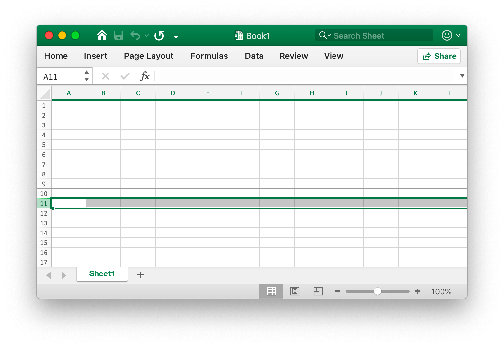
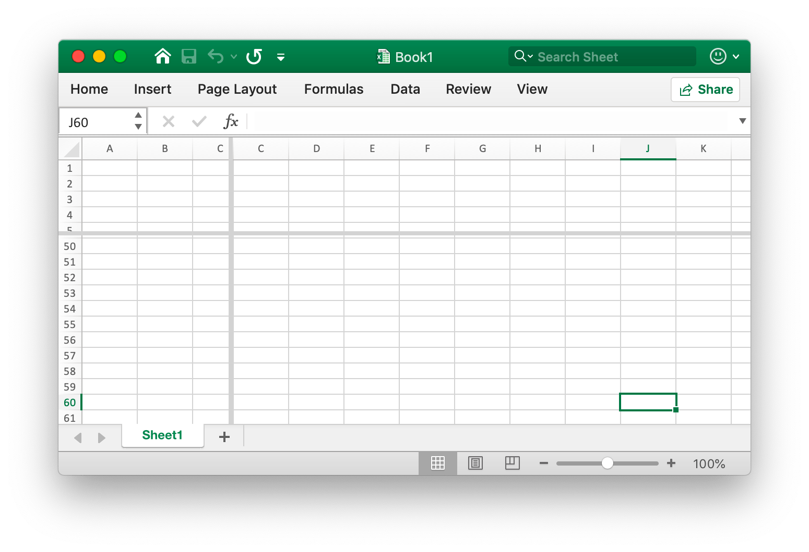

# Utils

## Table {#AddTable}

```go
func (f *File) AddTable(sheet, hcell, vcell, format string) error
```

AddTable provides the method to add table in a worksheet by given worksheet name, coordinate area and format set.

- Example 1, create a table of `A1:D5` on `Sheet1`:


```go
xlsx.AddTable("Sheet1", "A1", "D5", ``)
```

- Example 2, create a table of `F2:H6` on `Sheet2` with format set:


```go
xlsx.AddTable("Sheet2", "F2", "H6", `{"table_name":"table","table_style":"TableStyleMedium2", "show_first_column":true,"show_last_column":true,"show_row_stripes":false,"show_column_stripes":true}`)
```

Note that the table at least two lines include string type header. Multiple tables coordinate areas can't have an intersection.

`table_name`: The name of the table, in the same worksheet name of the table should be unique.

`table_style`: The built-in table style names:

```text
TableStyleLight1 - TableStyleLight21
TableStyleMedium1 - TableStyleMedium28
TableStyleDark1 - TableStyleDark11
```

## Auto filter {#AutoFilter}

```go
func (f *File) AutoFilter(sheet, hcell, vcell, format string) error
```

AutoFilter provides the method to add auto filter in a worksheet by given worksheet name, coordinate area and settings. An autofilter in Excel is a way of filtering a 2D range of data based on some simple criteria.

Example 1, applying an autofilter to a cell range `A1:D4` in the `Sheet1`:


```go
err = xlsx.AutoFilter("Sheet1", "A1", "D4", "")
```

Example 2, filter data in an autofilter:

```go
err = xlsx.AutoFilter("Sheet1", "A1", "D4", `{"column":"B","expression":"x != blanks"}`)
```

`column` defines the filter columns in a autofilter range based on simple criteria

It isn't sufficient to just specify the filter condition. You must also hide any rows that don't match the filter condition. Rows are hidden using the [`SetRowVisible()`](sheet.md#SetRowVisible) method. Excelize can't filter rows automatically since this isn't part of the file format.

Setting a filter criteria for a column:

`expression` defines the conditions, the following operators are available for setting the filter criteria:

```text
==
!=
>
<
>=
<=
and
or
```

An expression can comprise a single statement or two statements separated by the `and` and `or` operators. For example:

```text
x <  2000
x >  2000
x == 2000
x >  2000 and x <  5000
x == 2000 or  x == 5000
```

Filtering of blank or non-blank data can be achieved by using a value of Blanks or NonBlanks in the expression:

```text
x == Blanks
x == NonBlanks
```

Office Excel also allows some simple string matching operations:

```text
x == b*      // begins with b
x != b*      // doesn't begin with b
x == *b      // ends with b
x != *b      // doesn't end with b
x == *b*     // contains b
x != *b*     // doesn't contains b
```

You can also use `*` to match any character or number and `?` to match any single character or number. No other regular expression quantifier is supported by Excel's filters. Excel's regular expression characters can be escaped using `~`.

The placeholder variable `x` in the above examples can be replaced by any simple string. The actual placeholder name is ignored internally so the following are all equivalent:

```text
x     < 2000
col   < 2000
Price < 2000
```

## Update linked value {#UpdateLinkedValue}

```go
func (f *File) UpdateLinkedValue()
```

UpdateLinkedValue fix linked values within a spreadsheet are not updating in Office Excel 2007 and 2010. This function will be remove value tag when met a cell have a linked value. Reference [https://social.technet.microsoft.com/Forums/office/en-US/e16bae1f-6a2c-4325-8013-e989a3479066/excel-2010-linked-cells-not-updating?forum=excel](https://social.technet.microsoft.com/Forums/office/en-US/e16bae1f-6a2c-4325-8013-e989a3479066/excel-2010-linked-cells-not-updating?forum=excel) Notice: after open XLSX file Excel will be update linked value and generate new value and will prompt save file or not.

The effect of clearing the cell cache on the workbook appears as a modification to the `<v>` tag, for example, the cell cache before clearing:

```xml
<row r="19" spans="2:2">
    <c r="B19">
        <f>SUM(Sheet2!D2,Sheet2!D11)</f>
        <v>100</v>
     </c>
</row>
```

After clearing the cell cache:

```xml
<row r="19" spans="2:2">
    <c r="B19">
        <f>SUM(Sheet2!D2,Sheet2!D11)</f>
    </c>
</row>
```

## Convert column to index {#TitleToNumber}

```go
func TitleToNumber(s string) int
```

TitleToNumber provides a function to convert Excel sheet column title to int (this function doesn't do value check currently). For example convert `AK` and `ak` to column title `36`:

```go
excelize.TitleToNumber("AK")
excelize.TitleToNumber("ak")
```

## Convert index to column {#ToAlphaString}

```go
func ToAlphaString(value int) string
```

ToAlphaString provides a function to convert an integer to Excel sheet column title. For example, convert `36` to the column title `AK`

```go
excelize.ToAlphaString(36)
```

## Condition style {#NewConditionalStyle}

```go
func (f *File) NewConditionalStyle(style string) (int, error)
```

NewConditionalStyle provides a function to create a style for the conditional format by given style format. The parameters are the same as function [`NewStyle()`](style.md#NewStyle). Note that the color field uses RGB color code and only support to set the font, fills, alignment and borders currently.

## Condition format {#SetConditionalFormat}

```go
func (f *File) SetConditionalFormat(sheet, area, formatSet string) error
```

SetConditionalFormat provides a function to create a conditional formatting rule for cell value. Conditional formatting is a feature of Office Excel which allows you to apply a format to a cell or a range of cells based on certain criteria.

The `type` option is a required parameter and it has no default value. Allowable type values and their associated parameters are:

<table>
    <thead>
        <tr>
            <th>Type</th>
            <th>Parameters</th>
        </tr>
    </thead>
    <tbody>
        <tr>
            <td rowspan=4>cell</td>
            <td>criteria</td>
        </tr>
        <tr>
            <td>value</td>
        </tr>
        <tr>
            <td>minimum</td>
        </tr>
        <tr>
            <td>maximum</td>
        </tr>
        <tr>
            <td rowspan=4>date</td>
            <td>criteria</td>
        </tr>
        <tr>
            <td>value</td>
        </tr>
        <tr>
            <td>minimum</td>
        </tr>
        <tr>
            <td>maximum</td>
        </tr>
        <tr>
            <td>time_period</td>
            <td>criteria</td>
        </tr>
        <tr>
            <td rowspan=2>text</td>
            <td>criteria</td>
        </tr>
        <tr>
            <td>value</td>
        </tr>
        <tr>
            <td>average</td>
            <td>criteria</td>
        </tr>
        <tr>
            <td>duplicate</td>
            <td>(none)</td>
        </tr>
        <tr>
            <td>unique</td>
            <td>(none)</td>
        </tr>
        <tr>
            <td rowspan=2>top</td>
            <td>criteria</td>
        </tr>
        <tr>
            <td>value</td>
        </tr>
        <tr>
            <td rowspan=2>bottom</td>
            <td>criteria</td>
        </tr>
        <tr>
            <td>value</td>
        </tr>
        <tr>
            <td>blanks</td>
            <td>(none)</td>
        </tr>
        <tr>
            <td>no_blanks</td>
            <td>(none)</td>
        </tr>
        <tr>
            <td>errors</td>
            <td>(none)</td>
        </tr>
        <tr>
            <td>no_errors</td>
            <td>(none)</td>
        </tr>
        <tr>
            <td rowspan=6>2_color_scale</td>
            <td>min_type</td>
        </tr>
        <tr>
            <td>max_type</td>
        </tr>
        <tr>
            <td>min_value</td>
        </tr>
        <tr>
            <td>max_value</td>
        </tr>
        <tr>
            <td>min_color</td>
        </tr>
        <tr>
            <td>max_color</td>
        </tr>
        <tr>
            <td rowspan=9>3_color_scale</td>
            <td>min_type</td>
        </tr>
        <tr>
            <td>mid_type</td>
        </tr>
        <tr>
            <td>max_type</td>
        </tr>
        <tr>
            <td>min_value</td>
        </tr>
        <tr>
            <td>mid_value</td>
        </tr>
        <tr>
            <td>max_value</td>
        </tr>
        <tr>
            <td>min_color</td>
        </tr>
        <tr>
            <td>mid_color</td>
        </tr>
        <tr>
            <td>max_color</td>
        </tr>
        <tr>
            <td rowspan=5>data_bar</td>
            <td>min_type</td>
        </tr>
        <tr>
            <td>max_type</td>
        </tr>
        <tr>
            <td>min_value</td>
        </tr>
        <tr>
            <td>max_value</td>
        </tr>
        <tr>
            <td>bar_color</td>
        </tr>
        <tr>
            <td>formula</td>
            <td>criteria</td>
        </tr>
    </tbody>
</table>

The `criteria` parameter is used to set the criteria by which the cell data will be evaluated. It has no default value. The most common criteria as applied to `{"type"："cell"}` are:

Text description character|Symbolic representation
---|---
between|
not between|
equal to|==
not equal to|!=
greater than|>
less than|<
greater than or equal to|>=
less than or equal to|<=

You can either use Excel's textual description strings, in the first column above, or the more common symbolic alternatives.

Additional criteria which are specific to other conditional format types are shown in the relevant sections below.

`value`: The value is generally used along with the `criteria` parameter to set the rule by which the cell data will be evaluated:

```go
xlsx.SetConditionalFormat("Sheet1", "D1:D10", fmt.Sprintf(`[{"type":"cell","criteria":">","format":%d,"value":"6"}]`, format))
```

The `value` property can also be a cell reference:

```go
xlsx.SetConditionalFormat("Sheet1", "D1:D10", fmt.Sprintf(`[{"type":"cell","criteria":">","format":%d,"value":"$C$1"}]`, format))
```

type: `format` - The `format` parameter is used to specify the format that will be applied to the cell when the conditional formatting criterion is met. The format is created using the [`NewConditionalStyle()`](utils.md#NewConditionalStyle) method in the same way as cell formats:

```go
format, err = xlsx.NewConditionalStyle(`{"font":{"color":"#9A0511"},"fill":{"type":"pattern","color":["#FEC7CE"],"pattern":1}}`)
if err != nil {
    fmt.Println(err)
}
xlsx.SetConditionalFormat("Sheet1", "A1:A10", fmt.Sprintf(`[{"type":"cell","criteria":">","format":%d,"value":"6"}]`, format))
```

Note: In Excel, a conditional format is superimposed over the existing cell format and not all cell format properties can be modified. Properties that cannot be modified in a conditional format are font name, font size, superscript and subscript, diagonal borders, all alignment properties and all protection properties.

Excel specifies some default formats to be used with conditional formatting. These can be replicated using the following excelize formats:

```go
// Rose format for bad conditional.
format1, err = xlsx.NewConditionalStyle(`{"font":{"color":"#9A0511"},"fill":{"type":"pattern","color":["#FEC7CE"],"pattern":1}}`)

// Light yellow format for neutral conditional.
format2, err = xlsx.NewConditionalStyle(`{"font":{"color":"#9B5713"},"fill":{"type":"pattern","color":["#FEEAA0"],"pattern":1}}`)

// Light green format for good conditional.
format3, err = xlsx.NewConditionalStyle(`{"font":{"color":"#09600B"},"fill":{"type":"pattern","color":["#C7EECF"],"pattern":1}}`)
```

type: `minimum` - The minimum parameter is used to set the lower limiting value when the `criteria` is either `between` or `not between`.

```go
// Highlight cells rules: between...
xlsx.SetConditionalFormat("Sheet1", "A1:A10", fmt.Sprintf(`[{"type":"cell","criteria":"between","format":%d,"minimum":"6","maximum":"8"}]`, format))
```

type: `maximum` - The `maximum` parameter is used to set the upper limiting value when the criteria is either `between` or `not between`. See the previous example.

type: `average` - The `average` type is used to specify Office Excel's "Average" style conditional format:

```go
// Top/Bottom rules: Above Average...
xlsx.SetConditionalFormat("Sheet1", "A1:A10", fmt.Sprintf(`[{"type":"average","criteria":"=","format":%d, "above_average": true}]`, format1))

// Top/Bottom rules: Below Average...
xlsx.SetConditionalFormat("Sheet1", "B1:B10", fmt.Sprintf(`[{"type":"average","criteria":"=","format":%d, "above_average": false}]`, format2))
```

type: `duplicate` - The `duplicate` type is used to highlight duplicate cells in a range:

```go
// Highlight cells rules: Duplicate Values...
xlsx.SetConditionalFormat("Sheet1", "A1:A10", fmt.Sprintf(`[{"type":"duplicate","criteria":"=","format":%d}]`, format))
```

type: `unique` - The unique type is used to highlight unique cells in a range:

```go
// Highlight cells rules: Not Equal To...
xlsx.SetConditionalFormat("Sheet1", "A1:A10", fmt.Sprintf(`[{"type":"unique","criteria":"=","format":%d}]`, format))
```

type: `top` - The `top` type is used to specify the top n values by number or percentage in a range:

```go
// Top/Bottom rules: Top 10.
xlsx.SetConditionalFormat("Sheet1", "H1:H10", fmt.Sprintf(`[{"type":"top","criteria":"=","format":%d,"value":"6"}]`, format))
```

The criteria can be used to indicate that a percentage condition is required:

```go
xlsx.SetConditionalFormat("Sheet1", "A1:A10", fmt.Sprintf(`[{"type":"top","criteria":"=","format":%d,"value":"6","percent":true}]`, format))
```

type: `2_color_scale` - The `2_color_scale` type is used to specify Excel's "2 Color Scale" style conditional format:

```go
// Color scales: 2 color.
xlsx.SetConditionalFormat("Sheet1", "A1:A10", `[{"type":"2_color_scale","criteria":"=","min_type":"min","max_type":"max","min_color":"#F8696B","max_color":"#63BE7B"}]`)
```

This conditional type can be modified with `min_type`, `max_type`, `min_value`, `max_value`, `min_color` and `max_color`, see below.

type: `3_color_scale` - The `3_color_scale` type is used to specify Excel's "3 Color Scale" style conditional format:

```go
// Color scales: 3 color.
xlsx.SetConditionalFormat("Sheet1", "A1:A10", `[{"type":"3_color_scale","criteria":"=","min_type":"min","mid_type":"percentile","max_type":"max","min_color":"#F8696B","mid_color":"#FFEB84","max_color":"#63BE7B"}]`)
```

This conditional type can be modified with `min_type`, `mid_type`, `max_type`, `min_value`, `mid_value`, `max_value`, `min_color`, `mid_color` and `max_color`, see below.

type: `data_bar` - The `data_bar` type is used to specify Excel's "Data Bar" style conditional format.

`min_type` - The `min_type` and `max_type` properties are available when the conditional formatting type is `2_color_scale`, `3_color_scale` or `data_bar`. The `mid_type` is available for `3_color_scale`. The properties are used as follows:

```go
// Data Bars: Gradient Fill.
xlsx.SetConditionalFormat("Sheet1", "K1:K10", `[{"type":"data_bar", "criteria":"=", "min_type":"min","max_type":"max","bar_color":"#638EC6"}]`)
```

The available `min/mid/max` types are:

Parameter|Explanation
---|---
min|Minimum value (for `min_type` only)
num|Numeric
percent|Percentage
percentile|Percentile
formula|Formula
max|Maximum (for `max_type` only)

`mid_type` - Used for `3_color_scale`. Same as `min_type`, see above.

`max_type` - Same as `min_type`, see above.

`min_value` - The `min_value` and `max_value` properties are available when the conditional formatting type is `2_color_scale`, `3_color_scale` or `data_bar`. The `mid_value` is available for `3_color_scale`.

`mid_value` - Used for `3_color_scale`. Same as `min_value`, see above.

`max_value` - Same as `min_value`, see above.

`min_color` - The `min_color` and `max_color` properties are available when the conditional formatting type is `2_color_scale`, `3_color_scale` or `data_bar`. The `mid_color` is available for `3_color_scale`. The properties are used as follows:

```go
// Color scales: 3 color.
xlsx.SetConditionalFormat("Sheet1", "B1:B10", `[{"type":"3_color_scale","criteria":"=","min_type":"min","mid_type":"percentile","max_type":"max","min_color":"#F8696B","mid_color":"#FFEB84","max_color":"#63BE7B"}]`)
```

`mid_color` - Used for `3_color_scale`. Same as `min_color`, see above.

`max_color` - Same as `min_color`, see above.

`bar_color` - Used for `data_bar`. Same as `min_color`, see above.

## Panes {#SetPanes}

```go
func (f *File) SetPanes(sheet, panes string)
```

SetPanes provides a function to create and remove freeze panes and split panes by given worksheet name and panes format set.

`activePane` defines the pane that is active. The possible values for this attribute are defined in the following table:

Enumeration Value|Description
---|---
bottomLeft (Bottom Left Pane) |Bottom left pane, when both vertical and horizontal splits are applied.<br><br>This value is also used when only a horizontal split has been applied, dividing the pane into upper and lower regions. In that case, this value specifies the bottom pane.
bottomRight (Bottom Right Pane) | Bottom right pane, when both vertical and horizontal splits are applied.
topLeft (Top Left Pane)|Top left pane, when both vertical and horizontal splits are applied.<br><br>This value is also used when only a horizontal split has been applied, dividing the pane into upper and lower regions. In that case, this value specifies the top pane.<br><br>This value is also used when only a vertical split has been applied, dividing the pane into right and left regions. In that case, this value specifies the left pane.
topRight (Top Right Pane)|Top right pane, when both vertical and horizontal splits are applied.<br><br> This value is also used when only a vertical split has been applied, dividing the pane into right and left regions. In that case, this value specifies the right pane.

Pane state type is restricted to the values supported currently listed in the following table:

Enumeration Value|Description
---|---
frozen (Frozen)|Panes are frozen, but were not split being frozen. In this state, when the panes are unfrozen again, a single pane results, with no split.<br><br>In this state, the split bars are not adjustable.
split (Split)|Panes are split, but not frozen. In this state, the split bars are adjustable by the user.

`x_split` - Horizontal position of the split, in 1/20th of a point; 0 (zero) if none. If the pane is frozen, this value indicates the number of columns visible in the top pane.

`y_split` - Vertical position of the split, in 1/20th of a point; 0 (zero) if none. If the pane is frozen, this value indicates the number of rows visible in the left pane. The possible values for this attribute are defined by the W3C XML Schema double datatype.

`top_left_cell` - Location of the top left visible cell in the bottom right pane (when in Left-To-Right mode).

`sqref` - Range of the selection. Can be non-contiguous set of ranges.

Example 1: freeze column `A` in the `Sheet1` and set the active cell on `Sheet1!K16`:


```go
xlsx.SetPanes("Sheet1", `{"freeze":true,"split":false,"x_split":1,"y_split":0,"top_left_cell":"B1","active_pane":"topRight","panes":[{"sqref":"K16","active_cell":"K16","pane":"topRight"}]}`)
```

Example 2: freeze rows 1 to 9 in the Sheet1 and set the active cell ranges on `Sheet1!A11:XFD11`:



```go
xlsx.SetPanes("Sheet1", `{"freeze":true,"split":false,"x_split":0,"y_split":9,"top_left_cell":"A34","active_pane":"bottomLeft","panes":[{"sqref":"A11:XFD11","active_cell":"A11","pane":"bottomLeft"}]}`)
```

Example 3: create split panes in the `Sheet1` and set the active cell on `Sheet1!J60`:



```go
xlsx.SetPanes("Sheet1", `{"freeze":false,"split":true,"x_split":3270,"y_split":1800,"top_left_cell":"N57","active_pane":"bottomLeft","panes":[{"sqref":"I36","active_cell":"I36"},{"sqref":"G33","active_cell":"G33","pane":"topRight"},{"sqref":"J60","active_cell":"J60","pane":"bottomLeft"},{"sqref":"O60","active_cell":"O60","pane":"bottomRight"}]}`)
```

Example 4, unfreeze and remove all panes on `Sheet1`:

```go
xlsx.SetPanes("Sheet1", `{"freeze":false,"split":false}`)
```

## Color {#ThemeColor}

```go
func ThemeColor(baseColor string, tint float64) string
```

ThemeColor applied the color with tint value:

```go
package main

import (
    "fmt"

    "github.com/360EntSecGroup-Skylar/excelize"
)

func main() {
    xlsx, _ := excelize.OpenFile("Book1.xlsx")
    fmt.Println(getCellBgColor(xlsx, "Sheet1", "C1"))
}

func getCellBgColor(xlsx *excelize.File, sheet, axix string) string {
    styleID := xlsx.GetCellStyle(sheet, axix)
    fillID := xlsx.Styles.CellXfs.Xf[styleID].FillID
    fgColor := xlsx.Styles.Fills.Fill[fillID].PatternFill.FgColor
    if fgColor.Theme != nil {
        srgbClr := xlsx.Theme.ThemeElements.ClrScheme.Children[*fgColor.Theme].SrgbClr.Val
        return excelize.ThemeColor(srgbClr, fgColor.Tint)
    }
    return fgColor.RGB
}
```

## Convert RGB to HSL {#RGBToHSL}

```go
func RGBToHSL(r, g, b uint8) (h, s, l float64)
```

RGBToHSL converts an RGB triple to a HSL triple.

## Convert HSL to RGB {#HSLToRGB}

```go
func HSLToRGB(h, s, l float64) (r, g, b uint8)
```

HSLToRGB converts an HSL triple to a RGB triple.

## File Writer {#FileWriter}

### Write {#Write}

```go
func (f *File) Write(w io.Writer) error
```

Write provides a function to write to an `io.Writer`.

### WriteTo {#WriteTo}

```go
func (f *File) WriteTo(w io.Writer) (int64, error)
```

WriteTo implements `io.WriterTo` to write the file.

### WriteToBuffer {#WriteToBuffer}

```go
func (f *File) WriteToBuffer() (*bytes.Buffer, error)
```

WriteToBuffer provides a function to get `*bytes.Buffer` from the saved file.
