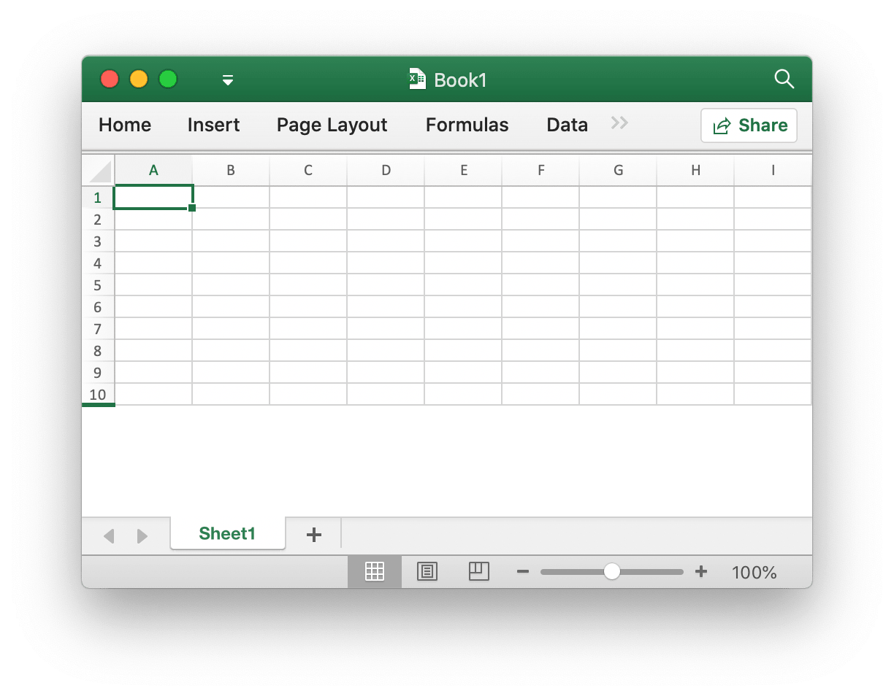
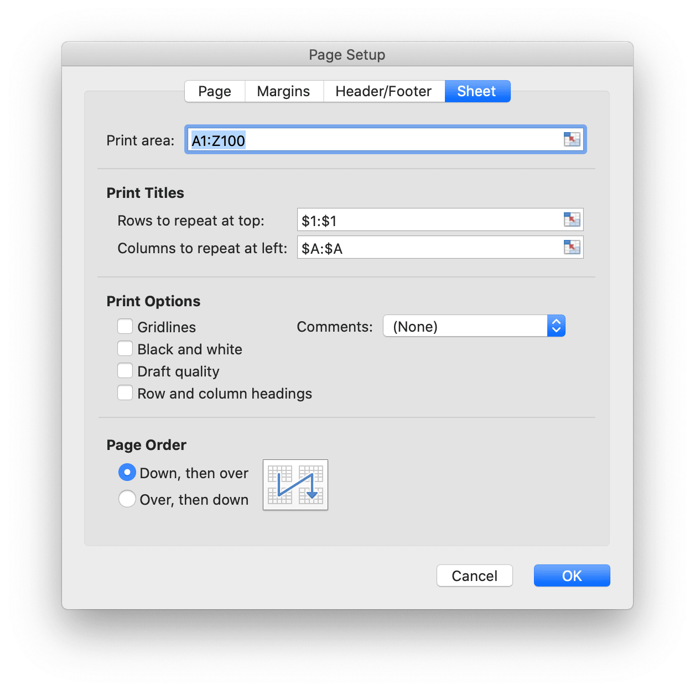

# Workbook

Options define the options for open spreadsheet.

```go
type Options struct {
    Password       string
    UnzipSizeLimit int64
}
```

## Create Excel document {#NewFile}

```go
func NewFile() *File
```

NewFile provides a function to create new file by default template. The newly created workbook will by default contain a worksheet named `Sheet1`. For example:

## Open {#OpenFile}

```go
func OpenFile(filename string, opt ...Options) (*File, error)
```

OpenFile takes the name of a spreadsheet file and returns a populated spreadsheet file struct for it. For example, open a spreadsheet with password protection:

```go
f, err := excelize.OpenFile("Book1.xlsx", excelize.Options{Password: "password"})
if err != nil {
    return
}
```

Note that the excelize just support decrypt and not support encrypt currently, the spreadsheet saved by [`Save()`](workbook.md#Save) and [`SaveAs()`](workbook.md#SaveAs) will be without password unprotected.

`UnzipSizeLimit` specified the unzip size limit in bytes on open the spreadsheet, the default size limit is 16GB.

## Open data stream {#OpenReader}

```go
func OpenReader(r io.Reader, opt ...Options) (*File, error)
```

OpenReader read data stream from `io.Reader` and return a populated spreadsheet file.

For example, create HTTP server to handle upload template, then response download file with new worksheet added:

```go
package main

import (
    "fmt"
    "net/http"

    "github.com/xuri/excelize/v2"
)

func process(w http.ResponseWriter, req *http.Request) {
    file, _, err := req.FormFile("file")
    if err != nil {
        fmt.Fprintf(w, err.Error())
        return
    }
    defer file.Close()
    f, err := excelize.OpenReader(file)
    if err != nil {
        fmt.Fprintf(w, err.Error())
        return
    }
    f.NewSheet("NewSheet")
    w.Header().Set("Content-Disposition", "attachment; filename=Book1.xlsx")
    w.Header().Set("Content-Type", req.Header.Get("Content-Type"))
    if _, err := f.WriteTo(w); err != nil {
        fmt.Fprintf(w, err.Error())
    }
    return
}

func main() {
    http.HandleFunc("/process", process)
    http.ListenAndServe(":8090", nil)
}
```

Test with cURL:

```bash
curl --location --request GET 'http://127.0.0.1:8090/process' \
--form 'file=@/tmp/template.xlsx' -O -J
curl: Saved to filename 'Book1.xlsx'
```

## Save {#Save}

```go
func (f *File) Save() error
```

Save provides a function to override the spreadsheet file with the origin path.

## Save as {#SaveAs}

```go
func (f *File) SaveAs(name string) error
```

SaveAs provides a function to create or update the spreadsheet file at the provided path.

## Create worksheet {#NewSheet}

```go
func (f *File) NewSheet(name string) int
```

NewSheet provides the function to create a new sheet by given a worksheet name and returns the index of the sheets in the workbook (spreadsheet) after it appended. Note that when creating a new spreadsheet file, the default worksheet named `Sheet1` will be created.

## Delete worksheet {#DeleteSheet}

```go
func (f *File) DeleteSheet(name string)
```

DeleteSheet provides a function to delete worksheets in a workbook by given worksheet name. Use this method with caution, which will affect changes in references such as formulas, charts, and so on. If there is any referenced value of the deleted worksheet, it will cause a file error when you open it. This function will be invalid when only one worksheet is left.

## Copy worksheet {#CopySheet}

```go
func (f *File) CopySheet(from, to int) error
```

CopySheet provides a function to duplicate a worksheet by gave source and target worksheet index. Note that currently doesn't support duplicate workbooks that contain tables, charts or pictures. For example:

```go
// Sheet1 already exists...
index := f.NewSheet("Sheet2")
err := f.CopySheet(1, index)
return err
```

## Set worksheet background {#SetSheetBackground}

```go
func (f *File) SetSheetBackground(sheet, picture string) error
```

SetSheetBackground provides a function to set background picture by given worksheet name.

## Set default worksheet {#SetActiveSheet}

```go
func (f *File) SetActiveSheet(index int)
```

SetActiveSheet provides a function to set the default active sheet of the workbook by a given index. Note that the active index is different from the ID returned by function [`GetSheetMap`](sheet.md#GetSheetMap). It should be greater or equal to 0 and less than the total worksheet numbers.

## Get active sheet index {#GetActiveSheetIndex}

```go
func (f *File) GetActiveSheetIndex() int
```

GetActiveSheetIndex provides a function to get an active worksheet of the workbook. If not found the active sheet will return integer `0`.

## Set worksheet visible {#SetSheetVisible}

```go
func (f *File) SetSheetVisible(name string, visible bool) error
```

SetSheetVisible provides a function to set worksheet visible by given worksheet name. A workbook must contain at least one visible worksheet. If the given worksheet has been activated, this setting will be invalidated. Sheet state values as defined by [SheetStateValues Enum](https://docs.microsoft.com/en-us/dotnet/api/documentformat.openxml.spreadsheet.sheetstatevalues?view=openxml-2.8.1):

|Sheet State Values|
|---|
|visible|
|hidden|
|veryHidden|

For example, hide `Sheet1`:

```go
err := f.SetSheetVisible("Sheet1", false)
```

## Get worksheet visible {#GetSheetVisible}

```go
func (f *File) GetSheetVisible(name string) bool
```

GetSheetVisible provides a function to get worksheet visible by given worksheet name. For example, get the visible state of `Sheet1`:

```go
f.GetSheetVisible("Sheet1")
```

## Set worksheet format properties {#SetSheetFormatPr}

```go
func (f *File) SetSheetFormatPr(sheet string, opts ...SheetFormatPrOptions) error
```

SetSheetFormatPr provides a function to set worksheet formatting properties.

Available options:

Optional format parameter |Type
---|---
BaseColWidth | uint8
DefaultColWidth | float64
DefaultRowHeight | float64
CustomHeight | bool
ZeroHeight | bool
ThickTop | bool
ThickBottom | bool

For example, make worksheet rows default as hidden:

<p align="center"></p>

```go
f := excelize.NewFile()
const sheet = "Sheet1"
if err := f.SetSheetFormatPr("Sheet1", excelize.ZeroHeight(true)); err != nil {
    fmt.Println(err)
}
if err := f.SetRowVisible("Sheet1", 10, true); err != nil {
    fmt.Println(err)
}
f.SaveAs("Book1.xlsx")
```

## Get worksheet format properties {#GetSheetFormatPr}

```go
func (f *File) GetSheetFormatPr(sheet string, opts ...SheetFormatPrOptionsPtr) error
```

GetSheetFormatPr provides a function to get worksheet formatting properties.

Available options:

Optional format parameter |Type
---|---
BaseColWidth | uint8
DefaultColWidth | float64
DefaultRowHeight | float64
CustomHeight | bool
ZeroHeight | bool
ThickTop | bool
ThickBottom | bool

For example:

```go
f := excelize.NewFile()
const sheet = "Sheet1"

var (
    baseColWidth     excelize.BaseColWidth
    defaultColWidth  excelize.DefaultColWidth
    defaultRowHeight excelize.DefaultRowHeight
    customHeight     excelize.CustomHeight
    zeroHeight       excelize.ZeroHeight
    thickTop         excelize.ThickTop
    thickBottom      excelize.ThickBottom
)

if err := f.GetSheetFormatPr(sheet,
    &baseColWidth,
    &defaultColWidth,
    &defaultRowHeight,
    &customHeight,
    &zeroHeight,
    &thickTop,
    &thickBottom,
); err != nil {
    fmt.Println(err)
}
fmt.Println("Defaults:")
fmt.Println("- baseColWidth:", baseColWidth)
fmt.Println("- defaultColWidth:", defaultColWidth)
fmt.Println("- defaultRowHeight:", defaultRowHeight)
fmt.Println("- customHeight:", customHeight)
fmt.Println("- zeroHeight:", zeroHeight)
fmt.Println("- thickTop:", thickTop)
fmt.Println("- thickBottom:", thickBottom)
```

Get output:

```text
Defaults:
- baseColWidth: 0
- defaultColWidth: 0
- defaultRowHeight: 15
- customHeight: false
- zeroHeight: false
- thickTop: false
- thickBottom: false
```

## Set worksheet view properties {#SetSheetViewOptions}

```go
func (f *File) SetSheetViewOptions(name string, viewIndex int, opts ...SheetViewOption) error
```

SetSheetViewOptions sets sheet view options. The `viewIndex` may be negative and if so is counted backward (`-1` is the last view).

Available options:

Optional view parameter |Type
---|---
DefaultGridColor|bool
RightToLeft|bool
ShowFormulas|bool
ShowGridLines|bool
ShowRowColHeaders|bool
ZoomScale|float64
TopLeftCell|string
ShowZeros|bool

- Example 1:

```go
err = f.SetSheetViewOptions("Sheet1", -1, ShowGridLines(false))
```

- Example 2:

```go
f := excelize.NewFile()
const sheet = "Sheet1"

if err := f.SetSheetViewOptions(sheet, 0,
    excelize.DefaultGridColor(false),
    excelize.RightToLeft(false),
    excelize.ShowFormulas(true),
    excelize.ShowGridLines(true),
    excelize.ShowRowColHeaders(true),
    excelize.ZoomScale(80),
    excelize.TopLeftCell("C3"),
); err != nil {
    fmt.Println(err)
}

var zoomScale excelize.ZoomScale
fmt.Println("Default:")
fmt.Println("- zoomScale: 80")

if err := f.SetSheetViewOptions(sheet, 0, excelize.ZoomScale(500)); err != nil {
    fmt.Println(err)
}

if err := f.GetSheetViewOptions(sheet, 0, &zoomScale); err != nil {
    fmt.Println(err)
}

fmt.Println("Used out of range value:")
fmt.Println("- zoomScale:", zoomScale)

if err := f.SetSheetViewOptions(sheet, 0, excelize.ZoomScale(123)); err != nil {
    fmt.Println(err)
}

if err := f.GetSheetViewOptions(sheet, 0, &zoomScale); err != nil {
    fmt.Println(err)
}

fmt.Println("Used correct value:")
fmt.Println("- zoomScale:", zoomScale)
```

Get output:

```text
Default:
- zoomScale: 80
Used out of range value:
- zoomScale: 80
Used correct value:
- zoomScale: 123
```

## Get worksheet view properties {#GetSheetViewOptions}

```go
func (f *File) GetSheetViewOptions(name string, viewIndex int, opts ...SheetViewOptionPtr) error
```

GetSheetViewOptions gets the value of sheet view options. The `viewIndex` may be negative and if so is counted backward (`-1` is the last view).

Available options:

Optional view parameter |Type
---|---
DefaultGridColor|bool
RightToLeft|bool
ShowFormulas|bool
ShowGridLines|bool
ShowRowColHeaders|bool
ZoomScale|float64
TopLeftCell|string
ShowZeros|bool

- Example 1, to get the gridline property settings for the last view on the worksheet named `Sheet1`:

```go
var showGridLines excelize.ShowGridLines
err = f.GetSheetViewOptions("Sheet1", -1, &showGridLines)
```

- Example 2:

```go
f := excelize.NewFile()
const sheet = "Sheet1"

var (
    defaultGridColor  excelize.DefaultGridColor
    rightToLeft       excelize.RightToLeft
    showFormulas      excelize.ShowFormulas
    showGridLines     excelize.ShowGridLines
    showZeros         excelize.ShowZeros
    showRowColHeaders excelize.ShowRowColHeaders
    zoomScale         excelize.ZoomScale
    topLeftCell       excelize.TopLeftCell
)

if err := f.GetSheetViewOptions(sheet, 0,
    &defaultGridColor,
    &rightToLeft,
    &showFormulas,
    &showGridLines,
    &showZeros,
    &showRowColHeaders,
    &zoomScale,
    &topLeftCell,
); err != nil {
    fmt.Println(err)
}

fmt.Println("Default:")
fmt.Println("- defaultGridColor:", defaultGridColor)
fmt.Println("- rightToLeft:", rightToLeft)
fmt.Println("- showFormulas:", showFormulas)
fmt.Println("- showGridLines:", showGridLines)
fmt.Println("- showZeros:", showZeros)
fmt.Println("- showRowColHeaders:", showRowColHeaders)
fmt.Println("- zoomScale:", zoomScale)
fmt.Println("- topLeftCell:", `"`+topLeftCell+`"`)

if err := f.SetSheetViewOptions(sheet, 0, excelize.TopLeftCell("B2")); err != nil {
    fmt.Println(err)
}

if err := f.GetSheetViewOptions(sheet, 0, &topLeftCell); err != nil {
    fmt.Println(err)
}

if err := f.SetSheetViewOptions(sheet, 0, excelize.ShowGridLines(false)); err != nil {
    fmt.Println(err)
}

if err := f.GetSheetViewOptions(sheet, 0, &showGridLines); err != nil {
    fmt.Println(err)
}

if err := f.SetSheetViewOptions(sheet, 0, excelize.ShowZeros(false)); err != nil {
    fmt.Println(err)
}

if err := f.GetSheetViewOptions(sheet, 0, &showZeros); err != nil {
    fmt.Println(err)
}

fmt.Println("After change:")
fmt.Println("- showGridLines:", showGridLines)
fmt.Println("- showZeros:", showZeros)
fmt.Println("- topLeftCell:", topLeftCell)
```

Get output:

```text
Default:
- defaultGridColor: true
- rightToLeft: false
- showFormulas: false
- showGridLines: true
- showZeros: true
- showRowColHeaders: true
- zoomScale: 0
- topLeftCell: ""
After change:
- showGridLines: false
- showZeros: false
- topLeftCell: B2
```

## Set worksheet page layout {#SetPageLayout}

```go
func (f *File) SetPageLayout(sheet string, opts ...PageLayoutOption) error
```

SetPageLayout provides a function to sets worksheet page layout. Available options:

- `BlackAndWhite` specified print black and white.

- `FirstPageNumber` specified the first printed page number. If no value is specified, then "automatic" is assumed.

- `PageLayoutOrientation` provides a method to sets worksheet orientation, the default orientation is "portrait". The following shows the orientation parameters supported by Excelize index number:

Parameter|Orientation
---|---
OrientationPortrait|portrait
OrientationLandscape|landscape

- `PageLayoutPaperSize` provides a method to sets worksheet paper size, the default paper size of worksheet is "Letter paper (8.5 in. by 11 in.)". The following shows the paper size sorted by Excelize index number:

Index|Paper Size
---|---
1   | Letter paper (8.5 in. × 11 in.)
2   | Letter small paper (8.5 in. × 11 in.)
3   | Tabloid paper (11 in. × 17 in.)
4   | Ledger paper (17 in. × 11 in.)
5   | Legal paper (8.5 in. × 14 in.)
6   | Statement paper (5.5 in. × 8.5 in.)
7   | Executive paper (7.25 in. × 10.5 in.)
8   | A3 paper (297 mm × 420 mm)
9   | A4 paper (210 mm × 297 mm)
10  | A4 small paper (210 mm × 297 mm)
11  | A5 paper (148 mm × 210 mm)
12  | B4 paper (250 mm × 353 mm)
13  | B5 paper (176 mm × 250 mm)
14  | Folio paper (8.5 in. × 13 in.)
15  | Quarto paper (215 mm × 275 mm)
16  | Standard paper (10 in. × 14 in.)
17  | Standard paper (11 in. × 17 in.)
18  | Note paper (8.5 in. × 11 in.)
19  | #9 envelope (3.875 in. × 8.875 in.)
20  | #10 envelope (4.125 in. × 9.5 in.)
21  | #11 envelope (4.5 in. × 10.375 in.)
22  | #12 envelope (4.75 in. × 11 in.)
23  | #14 envelope (5 in. × 11.5 in.)
24  | C paper (17 in. × 22 in.)
25  | D paper (22 in. × 34 in.)
26  | E paper (34 in. × 44 in.)
27  | DL envelope (110 mm × 220 mm)
28  | C5 envelope (162 mm × 229 mm)
29  | C3 envelope (324 mm × 458 mm)
30  | C4 envelope (229 mm × 324 mm)
31  | C6 envelope (114 mm × 162 mm)
32  | C65 envelope (114 mm × 229 mm)
33  | B4 envelope (250 mm × 353 mm)
34  | B5 envelope (176 mm × 250 mm)
35  | B6 envelope (176 mm × 125 mm)
36  | Italy envelope (110 mm × 230 mm)
37  | Monarch envelope (3.875 in. × 7.5 in.).
38  | 6¾ envelope (3.625 in. × 6.5 in.)
39  | US standard fanfold (14.875 in. × 11 in.)
40  | German standard fanfold (8.5 in. × 12 in.)
41  | German legal fanfold (8.5 in. × 13 in.)
42  | ISO B4 (250 mm × 353 mm)
43  | Japanese postcard (100 mm × 148 mm)
44  | Standard paper (9 in. × 11 in.)
45  | Standard paper (10 in. × 11 in.)
46  | Standard paper (15 in. × 11 in.)
47  | Invite envelope (220 mm × 220 mm)
50  | Letter extra paper (9.275 in. × 12 in.)
51  | Legal extra paper (9.275 in. × 15 in.)
52  | Tabloid extra paper (11.69 in. × 18 in.)
53  | A4 extra paper (236 mm × 322 mm)
54  | Letter transverse paper (8.275 in. × 11 in.)
55  | A4 transverse paper (210 mm × 297 mm)
56  | Letter extra transverse paper (9.275 in. × 12 in.)
57  | SuperA/SuperA/A4 paper (227 mm × 356 mm)
58  | SuperB/SuperB/A3 paper (305 mm × 487 mm)
59  | Letter plus paper (8.5 in. × 12.69 in.)
60  | A4 plus paper (210 mm × 330 mm)
61  | A5 transverse paper (148 mm × 210 mm)
62  | JIS B5 transverse paper (182 mm × 257 mm)
63  | A3 extra paper (322 mm × 445 mm)
64  | A5 extra paper (174 mm × 235 mm)
65  | ISO B5 extra paper (201 mm × 276 mm)
66  | A2 paper (420 mm × 594 mm)
67  | A3 transverse paper (297 mm × 420 mm)
68  | A3 extra transverse paper (322 mm × 445 mm)
69  | Japanese Double Postcard (200 mm × 148 mm)
70  | A6 (105 mm × 148 mm)
71  | Japanese Envelope Kaku #2
72  | Japanese Envelope Kaku #3
73  | Japanese Envelope Chou #3
74  | Japanese Envelope Chou #4
75  | Letter Rotated (11 × 8½ in.)
76  | A3 Rotated (420 mm × 297 mm)
77  | A4 Rotated (297 mm × 210 mm)
78  | A5 Rotated (210 mm × 148 mm)
79  | B4 (JIS) Rotated (364 mm × 257 mm)
80  | B5 (JIS) Rotated (257 mm × 182 mm)
81  | Japanese Postcard Rotated (148 mm × 100 mm)
82  | Double Japanese Postcard Rotated (148 mm × 200 mm)
83  | A6 Rotated (148 mm × 105 mm)
84  | Japanese Envelope Kaku #2 Rotated
85  | Japanese Envelope Kaku #3 Rotated
86  | Japanese Envelope Chou #3 Rotated
87  | Japanese Envelope Chou #4 Rotated
88  | B6 (JIS) (128 mm × 182 mm)
89  | B6 (JIS) Rotated (182 mm × 128 mm)
90  | (12 in × 11 in)
91  | Japanese Envelope You #4
92  | Japanese Envelope You #4 Rotated
93  | PRC 16K (146 mm × 215 mm)
94  | PRC 32K (97 mm × 151 mm)
95  | PRC 32K(Big) (97 mm × 151 mm)
96  | PRC Envelope #1 (102 mm × 165 mm)
97  | PRC Envelope #2 (102 mm × 176 mm)
98  | PRC Envelope #3 (125 mm × 176 mm)
99  | PRC Envelope #4 (110 mm × 208 mm)
100 | PRC Envelope #5 (110 mm × 220 mm)
101 | PRC Envelope #6 (120 mm × 230 mm)
102 | PRC Envelope #7 (160 mm × 230 mm)
103 | PRC Envelope #8 (120 mm × 309 mm)
104 | PRC Envelope #9 (229 mm × 324 mm)
105 | PRC Envelope #10 (324 mm × 458 mm)
106 | PRC 16K Rotated
107 | PRC 32K Rotated
108 | PRC 32K(Big) Rotated
109 | PRC Envelope #1 Rotated (165 mm × 102 mm)
110 | PRC Envelope #2 Rotated (176 mm × 102 mm)
111 | PRC Envelope #3 Rotated (176 mm × 125 mm)
112 | PRC Envelope #4 Rotated (208 mm × 110 mm)
113 | PRC Envelope #5 Rotated (220 mm × 110 mm)
114 | PRC Envelope #6 Rotated (230 mm × 120 mm)
115 | PRC Envelope #7 Rotated (230 mm × 160 mm)
116 | PRC Envelope #8 Rotated (309 mm × 120 mm)
117 | PRC Envelope #9 Rotated (324 mm × 229 mm)
118 | PRC Envelope #10 Rotated (458 mm × 324 mm)

- `FitToHeight` specified the number of vertical pages to fit on.

- `FitToWidth` specified the number of horizontal pages to fit on.

- `PageLayoutScale` defines the print scaling. This attribute is restricted to values ranging from 10 (10%) to 400 (400%). This setting is overridden when `FitToWidth` and/or `FitToHeight` are in use.

- For example, set page layout for `Sheet1` with print black and white, first printed page number from `2`, landscape A4 small paper (210 mm by 297 mm), 2 vertical pages to fit on, 2 horizontal pages to fit on and 50% print scaling:

```go
f := excelize.NewFile()
if err := f.SetPageLayout(
    "Sheet1",
    excelize.BlackAndWhite(true),
    excelize.FirstPageNumber(2),
    excelize.PageLayoutOrientation(excelize.OrientationLandscape),
    excelize.PageLayoutPaperSize(10),
    excelize.FitToHeight(2),
    excelize.FitToWidth(2),
    excelize.PageLayoutScale(50),
); err != nil {
    fmt.Println(err)
}
```

## Get worksheet page layout {#GetPageLayout}

```go
func (f *File) GetPageLayout(sheet string, opts ...PageLayoutOptionPtr) error
```

GetPageLayout provides a function to gets worksheet page layout. Available options:

- `PageLayoutOrientation` provides a method to gets worksheet orientation
- `PageLayoutPaperSize` provides a method to gets worksheet paper size

- For example, get page layout of `Sheet1`:

```go
f := excelize.NewFile()
const sheet = "Sheet1"
var (
    orientation excelize.PageLayoutOrientation
    paperSize   excelize.PageLayoutPaperSize
)
if err := f.GetPageLayout("Sheet1", &orientation); err != nil {
    fmt.Println(err)
}
if err := f.GetPageLayout("Sheet1", &paperSize); err != nil {
    fmt.Println(err)
}
fmt.Println("Defaults:")
fmt.Printf("- orientation: %q\n", orientation)
fmt.Printf("- paper size: %d\n", paperSize)
```

Output:

```text
Defaults:
- orientation: "portrait"
- paper size: 1
```

## Set worksheet page margins {#SetPageMargins}

```go
func (f *File) SetPageMargins(sheet string, opts ...PageMarginsOptions) error
```

SetPageMargins provides a function to set worksheet page margins. Available options:

Options|Type
---|---
PageMarginBotom|float64
PageMarginFooter|float64
PageMarginHeader|float64
PageMarginLeft|float64
PageMarginRight|float64
PageMarginTop|float64

- For example, set page margins of `Sheet1`:

```go
f := excelize.NewFile()
const sheet = "Sheet1"

if err := f.SetPageMargins(sheet,
    excelize.PageMarginBottom(1.0),
    excelize.PageMarginFooter(1.0),
    excelize.PageMarginHeader(1.0),
    excelize.PageMarginLeft(1.0),
    excelize.PageMarginRight(1.0),
    excelize.PageMarginTop(1.0),
); err != nil {
    fmt.Println(err)
}
```

## Get worksheet page margins {#GetPageMargins}

GetPageMargins provides a function to get worksheet page margins. Available options:

Options|Type
---|---
PageMarginBotom|float64
PageMarginFooter|float64
PageMarginHeader|float64
PageMarginLeft|float64
PageMarginRight|float64
PageMarginTop|float64

- For example, get page margins of `Sheet1`:

```go
f := excelize.NewFile()
const sheet = "Sheet1"

var (
    marginBottom excelize.PageMarginBottom
    marginFooter excelize.PageMarginFooter
    marginHeader excelize.PageMarginHeader
    marginLeft   excelize.PageMarginLeft
    marginRight  excelize.PageMarginRight
    marginTop    excelize.PageMarginTop
)

if err := f.GetPageMargins(sheet,
    &marginBottom,
    &marginFooter,
    &marginHeader,
    &marginLeft,
    &marginRight,
    &marginTop,
); err != nil {
    fmt.Println(err)
}
fmt.Println("Defaults:")
fmt.Println("- marginBottom:", marginBottom)
fmt.Println("- marginFooter:", marginFooter)
fmt.Println("- marginHeader:", marginHeader)
fmt.Println("- marginLeft:", marginLeft)
fmt.Println("- marginRight:", marginRight)
fmt.Println("- marginTop:", marginTop)
```

Output:

```text
Defaults:
- marginBottom: 0.75
- marginFooter: 0.3
- marginHeader: 0.3
- marginLeft: 0.7
- marginRight: 0.7
- marginTop: 0.75
```

## Set header and footer {#SetHeaderFooter}

```go
func (f *File) SetHeaderFooter(sheet string, settings *FormatHeaderFooter) error
```

SetHeaderFooter provides a function to set headers and footers by given worksheet name and the control characters.

Headers and footers are specified using the following settings fields:

Fields           | Description
---|---
AlignWithMargins | Align header footer margins with page margins
DifferentFirst   | Different first-page header and footer indicator
DifferentOddEven | Different odd and even page headers and footers indicator
ScaleWithDoc     | Scale header and footer with document scaling
OddFooter        | Odd Page Footer
OddHeader        | Odd Header
EvenFooter       | Even Page Footer
EvenHeader       | Even Page Header
FirstFooter      | First Page Footer
FirstHeader      | First Page Header

The following formatting codes can be used in 6 string type fields: `OddHeader`, `OddFooter`, `EvenHeader`, `EvenFooter`, `FirstFooter`, `FirstHeader`

<table>
    <thead>
        <tr>
            <th>Formatting Code</th>
            <th>Description</th>
        </tr>
    </thead>
    <tbody>
        <tr>
            <td><code>&amp;&amp;</code></td>
            <td>The character &quot;&amp;&quot;</td>
        </tr>
        <tr>
            <td><code>&amp;font-size</code></td>
            <td>Size of the text font, where font-size is a decimal font size in points</td>
        </tr>
        <tr>
            <td><code>&amp;&quot;font name,font type&quot;</code></td>
            <td>A text font-name string, font name, and a text font-type string, font type</td>
        </tr>
        <tr>
            <td><code>&amp;&quot;-,Regular&quot;</code></td>
            <td>Regular text format. Toggles bold and italic modes to off</td>
        </tr>
        <tr>
            <td><code>&amp;A</code></td>
            <td>Current worksheet&#39;s tab name</td>
        </tr>
        <tr>
            <td><code>&amp;B</code> or <code>&amp;&quot;-,Bold&quot;</code></td>
            <td>Bold text format, from off to on, or vice versa. The default mode is off</td>
        </tr>
        <tr>
            <td><code>&amp;D</code></td>
            <td>Current date</td>
        </tr>
        <tr>
            <td><code>&amp;C</code></td>
            <td>Center section</td>
        </tr>
        <tr>
            <td><code>&amp;E</code></td>
            <td>Double-underline text format</td>
        </tr>
        <tr>
            <td><code>&amp;F</code></td>
            <td>Current workbook&#39;s file name</td>
        </tr>
        <tr>
            <td><code>&amp;G</code></td>
            <td>Drawing object as background</td>
        </tr>
        <tr>
            <td><code>&amp;H</code></td>
            <td>Shadow text format</td>
        </tr>
        <tr>
            <td><code>&amp;I</code> or <code>&amp;&quot;-,Italic&quot;</code></td>
            <td>Italic text format</td>
        </tr>
        <tr>
            <td><code>&amp;K</code></td>
            <td>Text font color<br>An RGB Color is specified as RRGGBB<br>A Theme Color is specified as TTSNNN where TT is the theme color Id, S is either &quot;+&quot; or &quot;-&quot; of the tint/shade value, and NNN is the tint/shade value</td>
        </tr>
        <tr>
            <td><code>&amp;L</code></td>
            <td>Left section</td>
        </tr>
        <tr>
            <td><code>&amp;N</code></td>
            <td>Total number of pages</td>
        </tr>
        <tr>
            <td><code>&amp;O</code></td>
            <td>Outline text format</td>
        </tr>
        <tr>
            <td><code>&amp;P[[+\|-]n]</code></td>
            <td>Without the optional suffix, the current page number in decimal</td>
        </tr>
        <tr>
            <td><code>&amp;R</code></td>
            <td>Right section</td>
        </tr>
        <tr>
            <td><code>&amp;S</code></td>
            <td>Strikethrough text format</td>
        </tr>
        <tr>
            <td><code>&amp;T</code></td>
            <td>Current time</td>
        </tr>
        <tr>
            <td><code>&amp;U</code></td>
            <td>Single-underline text format. If double-underline mode is on, the next occurrence in a section specifier toggles double-underline mode to off; otherwise, it toggles single-underline mode, from off to on, or vice versa. The default mode is off</td>
        </tr>
        <tr>
            <td><code>&amp;X</code></td>
            <td>Superscript text format</td>
        </tr>
        <tr>
            <td><code>&amp;Y</code></td>
            <td>Subscript text format</td>
        </tr>
        <tr>
            <td><code>&amp;Z</code></td>
            <td>Current workbook&#39;s file path</td>
        </tr>
    </tbody>
</table>

For example:

```go
err := f.SetHeaderFooter("Sheet1", &excelize.FormatHeaderFooter{
    DifferentFirst:   true,
    DifferentOddEven: true,
    OddHeader:        "&R&P",
    OddFooter:        "&C&F",
    EvenHeader:       "&L&P",
    EvenFooter:       "&L&D&R&T",
    FirstHeader:      `&CCenter &"-,Bold"Bold&"-,Regular"HeaderU+000A&D`,
})
```

This example shows:

- The first page has its own header and footer
- Odd and even-numbered pages have different headers and footers
- Current page number in the right section of odd-page headers
- Current workbook's file name in the center section of odd-page footers
- Current page number in the left section of even-page headers
- Current date in the left section and the current time in the right section of even-page footers
- The text "Center Bold Header" on the first line of the center section of the first page, and the date on the second line of the center section of that same page
- No footer on the first page

## Set defined name {#SetDefinedName}

```go
func (f *File) SetDefinedName(definedName *DefinedName) error
```

SetDefinedName provides a function to set the defined names of the workbook or worksheet. If not specified scope, the default scope is the workbook.

For example:

```go
f.SetDefinedName(&excelize.DefinedName{
    Name:     "Amount",
    RefersTo: "Sheet1!$A$2:$D$5",
    Comment:  "defined name comment",
    Scope:    "Sheet2",
})
```

Print area and print titles settings for the worksheet:

<p align="center"></p>

```go
f.SetDefinedName(&excelize.DefinedName{
    Name:     "_xlnm.Print_Area",
    RefersTo: "Sheet1!$A$1:$Z$100",
    Scope:    "Sheet1",
})
f.SetDefinedName(&excelize.DefinedName{
    Name:     "_xlnm.Print_Titles",
    RefersTo: "Sheet1!$A:$A,Sheet1!$1:$1",
    Scope:    "Sheet1",
})
```

## Get defined name {#GetDefinedName}

```go
func (f *File) GetDefinedName() []DefinedName
```

GetDefinedName provides a function to get the defined names of the workbook or worksheet.

## Delete defined name {#DeleteDefinedName}

```go
func (f *File) DeleteDefinedName(definedName *DefinedName) error
```

DeleteDefinedName provides a function to delete the defined names of the workbook or worksheet. If not specified scope, the default scope is workbook. For example:

```go
f.DeleteDefinedName(&excelize.DefinedName{
    Name:     "Amount",
    Scope:    "Sheet2",
})
```

## Set document properties {#SetDocProps}

```go
func (f *File) SetDocProps(docProperties *DocProperties) error
```

SetDocProps provides a function to set document core properties. The properties that can be set are:

Property       | Description
---|---
Title          | The name given to the resource.
Subject        | The topic of the content of the resource.
Creator        | An entity primarily responsible for making the content of the resource.
Keywords       | A delimited set of keywords to support searching and indexing. This is typically a list of terms that are not available elsewhere in the properties.
Description    | An explanation of the content of the resource.
LastModifiedBy | The user who performed the last modification. The identification is environment-specific.
Language       | The language of the intellectual content of the resource.
Identifier     | An unambiguous reference to the resource within a given context.
Revision       | The topic of the content of the resource.
ContentStatus  | The status of the content. For example: Values might include "Draft", "Reviewed" and "Final"
Category       | A categorization of the content of this package.
Version        | The version number. This value is set by the user or by the application.

For example:

```go
err := f.SetDocProps(&excelize.DocProperties{
    Category:       "category",
    ContentStatus:  "Draft",
    Created:        "2019-06-04T22:00:10Z",
    Creator:        "Go Excelize",
    Description:    "This file created by Go Excelize",
    Identifier:     "xlsx",
    Keywords:       "Spreadsheet",
    LastModifiedBy: "Go Author",
    Modified:       "2019-06-04T22:00:10Z",
    Revision:       "0",
    Subject:        "Test Subject",
    Title:          "Test Title",
    Language:       "en-US",
    Version:        "1.0.0",
})
```

## Get document properties {#GetDocProps}

```go
func (f *File) GetDocProps() (*DocProperties, error)
```

GetDocProps provides a function to get document core properties.
