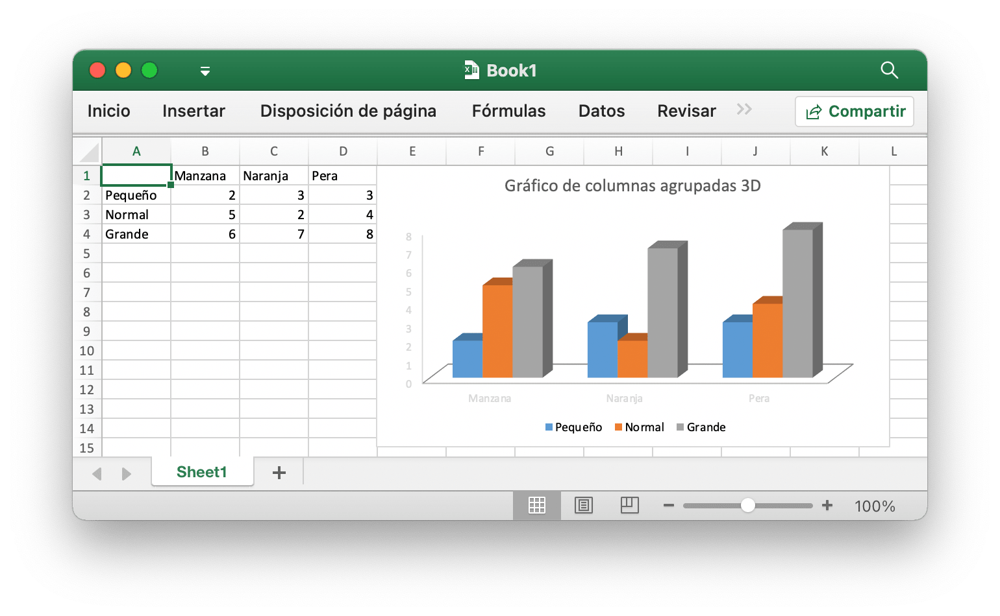

# Uso básico

## Instalación {#install}

La siguiente tabla muestra los requisitos mínimos del lenguaje Go con cada versión lanzada de Excelize:

Versión Excelize | Requisitos mínimos de la versión del idioma Go
---|---
v2.10.0 ~ master | 1.24.0
v2.9.1 | 1.23.0
v2.8.1 ~ v2.9.0 | 1.18
v2.7.0 ~ v2.8.0 | 1.16
v2.4.0 ~ v2.6.1 | 1.15
v2.0.2 ~ v2.3.2 | 1.10
v1.0.0 ~ v2.0.1 | 1.6

Using the latest version Excelize library require to Go version 1.23.0 or later. Tenga en cuenta que hay algunos [cambios incompatibles](https://github.com/golang/go/issues/61881) en Go 1.21.0, esta biblioteca no puede funcionar con esa versión; si está utilizando Go 1.21.x, actualice a Go 1.21.1 y una versión posterior.

- Instalación

```bash
go get github.com/xuri/excelize
```

- Si la administración de paquetes con [Go Modules](https://go.dev/blog/using-go-modules), instálelo con el siguiente comando.

```bash
go get github.com/xuri/excelize/v2
```

## Actualizar {#update}

- Actualizar a la última versión estable publicada

```bash
go get -u github.com/xuri/excelize/v2
```

- Actualizar al código de la rama de desarrollo más reciente

```bash
go get -u github.com/xuri/excelize/v2@master
```

## Crear una hoja de cálculo {#NewFile}

Este es un uso mínimo de ejemplo que creará un archivo de hoja de cálculo:

```go
package main

import (
    "fmt"

    "github.com/xuri/excelize/v2"
)

func main() {
    f := excelize.NewFile()
    defer func() {
        if err := f.Close(); err != nil {
            fmt.Println(err)
        }
    }()
    // Crear una nueva hoja de trabajo.
    index, err := f.NewSheet("Sheet2")
    if err != nil {
        fmt.Println(err)
        return
    }
    // Establecer el valor de una celda.
    f.SetCellValue("Sheet2", "A2", "Hello world.")
    f.SetCellValue("Sheet1", "B2", 100)
    // Establezca la hoja de trabajo activa del libro de trabajo.
    f.SetActiveSheet(index)
    // Guarde la hoja de cálculo por la ruta dada.
    if err := f.SaveAs("Book1.xlsx"); err != nil {
        fmt.Println(err)
    }
}
```

## Lectura de hojas de cálculo {#read}

Lo siguiente constituye el desnudo para leer un documento de hoja de cálculo:

```go
package main

import (
    "fmt"

    "github.com/xuri/excelize/v2"
)

func main() {
    f, err := excelize.OpenFile("Book1.xlsx")
    if err != nil {
        fmt.Println(err)
        return
    }
    defer func() {
        if err := f.Close(); err != nil {
            fmt.Println(err)
        }
    }()
    // Obtener valor de la celda por el nombre y el eje de la hoja de trabajo dado.
    cell, err := f.GetCellValue("Sheet1", "B2")
    if err != nil {
        fmt.Println(err)
        return
    }
    fmt.Println(cell)
    // Obtener todas las filas en el Sheet1.
    rows, err := f.GetRows("Sheet1")
    if err != nil {
        fmt.Println(err)
        return
    }
    for _, row := range rows {
        for _, colCell := range row {
            fmt.Print(colCell, "\t")
        }
        fmt.Println()
    }
}
```

## Añadir un gráfico a una hoja de cálculo {#chart}

Con Excelize la generación y administración de gráficos es tan fácil como unas pocas líneas de código. Puede crear gráficos basados en datos en su hoja de trabajo o generar gráficos sin ningún dato en su hoja de trabajo en absoluto.

<p align="center"></p>

```go
package main

import (
    "fmt"

    "github.com/xuri/excelize/v2"
)

func main() {
    f := excelize.NewFile()
    defer func() {
        if err := f.Close(); err != nil {
            fmt.Println(err)
        }
    }()
    for idx, row := range [][]interface{}{
        {nil, "Manzana", "Naranja", "Pera"}, {"Pequeño", 2, 3, 3},
        {"Normal", 5, 2, 4}, {"Grande", 6, 7, 8},
    } {
        cell, err := excelize.CoordinatesToCellName(1, idx+1)
        if err != nil {
            fmt.Println(err)
            return
        }
        f.SetSheetRow("Sheet1", cell, &row)
    }
    if err := f.AddChart("Sheet1", "E1", &excelize.Chart{
        Type: excelize.Col3DClustered,
        Series: []excelize.ChartSeries{
            {
                Name:       "Sheet1!$A$2",
                Categories: "Sheet1!$B$1:$D$1",
                Values:     "Sheet1!$B$2:$D$2",
            },
            {
                Name:       "Sheet1!$A$3",
                Categories: "Sheet1!$B$1:$D$1",
                Values:     "Sheet1!$B$3:$D$3",
            },
            {
                Name:       "Sheet1!$A$4",
                Categories: "Sheet1!$B$1:$D$1",
                Values:     "Sheet1!$B$4:$D$4",
            }},
        Title: []excelize.RichTextRun{
            {
                Text: "Gráfico de columnas agrupadas 3D",
            },
        },
    }); err != nil {
        fmt.Println(err)
        return
    }
    // Guarde la hoja de cálculo por la ruta dada.
    if err := f.SaveAs("Book1.xlsx"); err != nil {
        fmt.Println(err)
    }
}
```

## Añadir una imagen a la hoja de cálculo {#image}

```go
package main

import (
    "fmt"
    _ "image/gif"
    _ "image/jpeg"
    _ "image/png"

    "github.com/xuri/excelize/v2"
)

func main() {
    f, err := excelize.OpenFile("Book1.xlsx")
    if err != nil {
        fmt.Println(err)
        return
    }
    defer func() {
        if err := f.Close(); err != nil {
            fmt.Println(err)
        }
    }()
    // Insertar una imagen.
    if err := f.AddPicture("Sheet1", "A2", "image.png", nil); err != nil {
        fmt.Println(err)
        return
    }
    // Inserte una imagen en la hoja de trabajo con escalado.
    if err := f.AddPicture("Sheet1", "D2", "image.jpg",
        &excelize.GraphicOptions{ScaleX: 0.5, ScaleY: 0.5}); err != nil {
        fmt.Println(err)
        return
    }
    // Inserte un desplazamiento de imagen en la celda con soporte de impresión.
    enable, disable := true, false
    if err := f.AddPicture("Sheet1", "H2", "image.gif",
        &excelize.GraphicOptions{
            PrintObject:     &enable,
            LockAspectRatio: false,
            OffsetX:         15,
            OffsetY:         10,
            Locked:          &disable,
        }); err != nil {
        fmt.Println(err)
        return
    }
    // Guarde la hoja de cálculo por la ruta dada.
    if err = f.Save(); err != nil {
        fmt.Println(err)
    }
}
```
