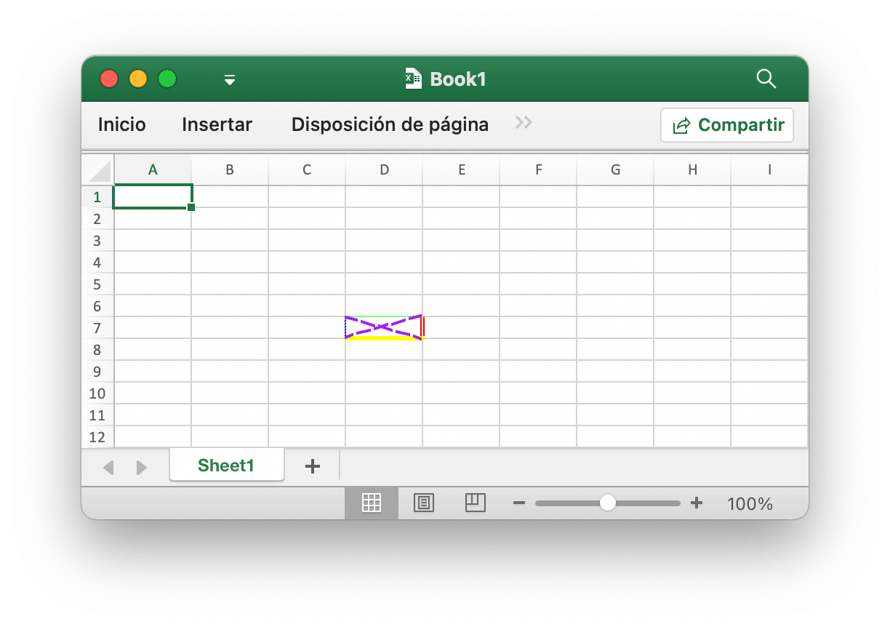
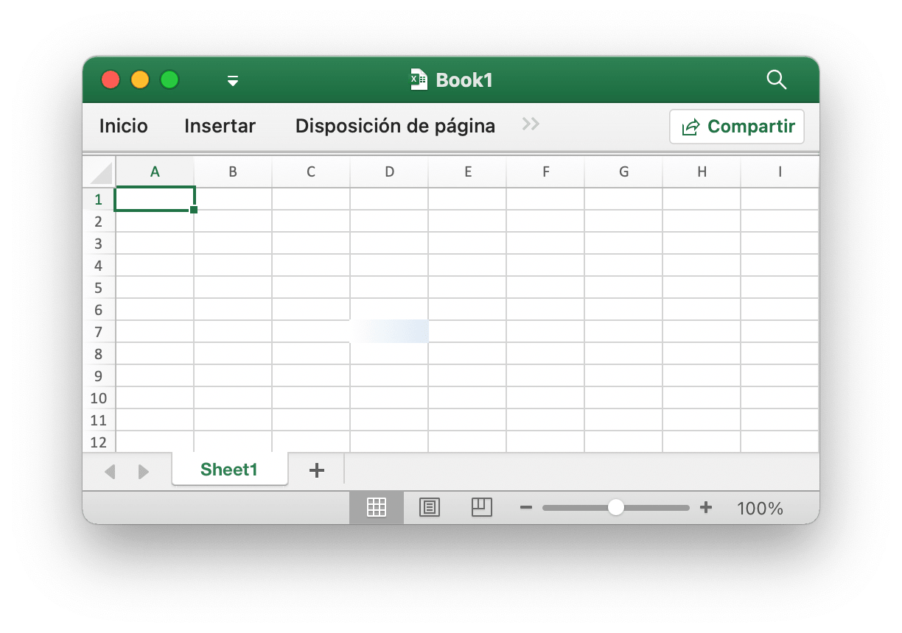
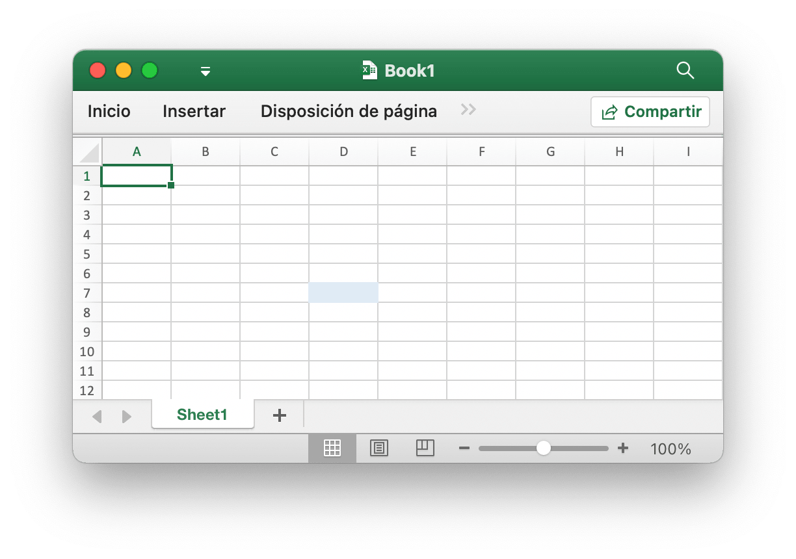
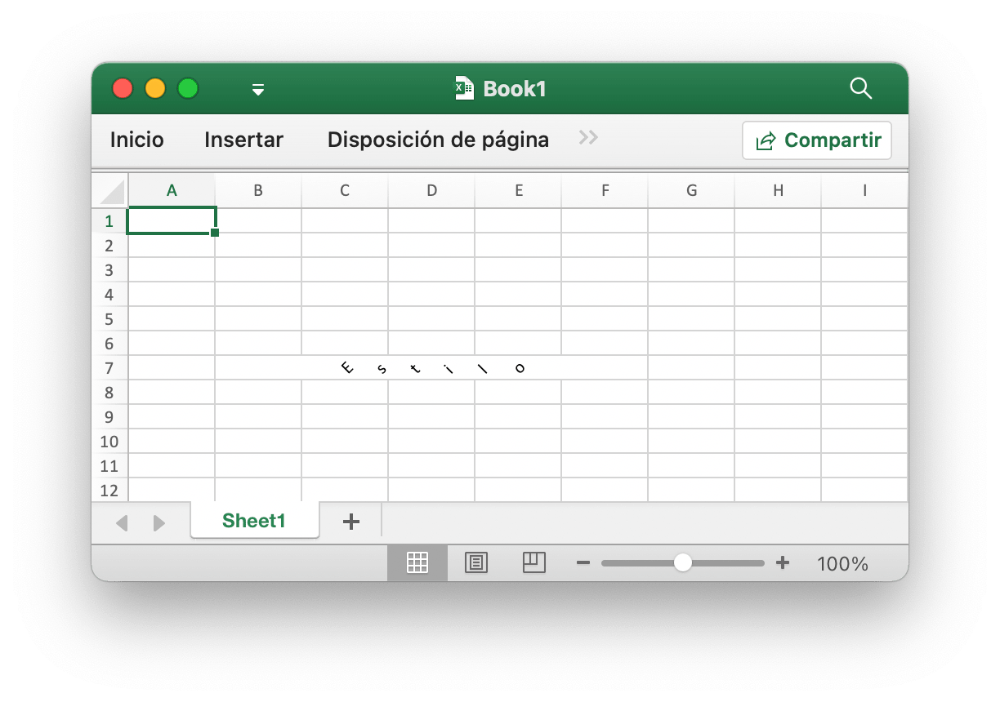
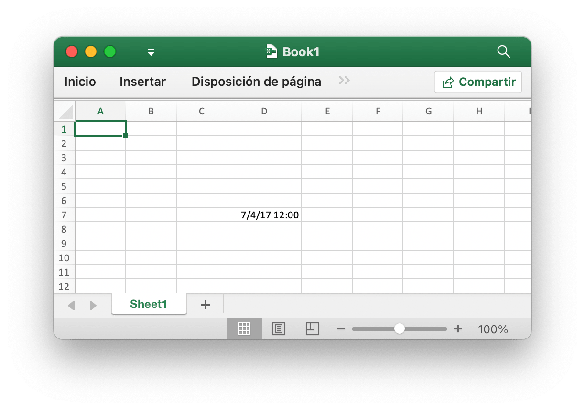
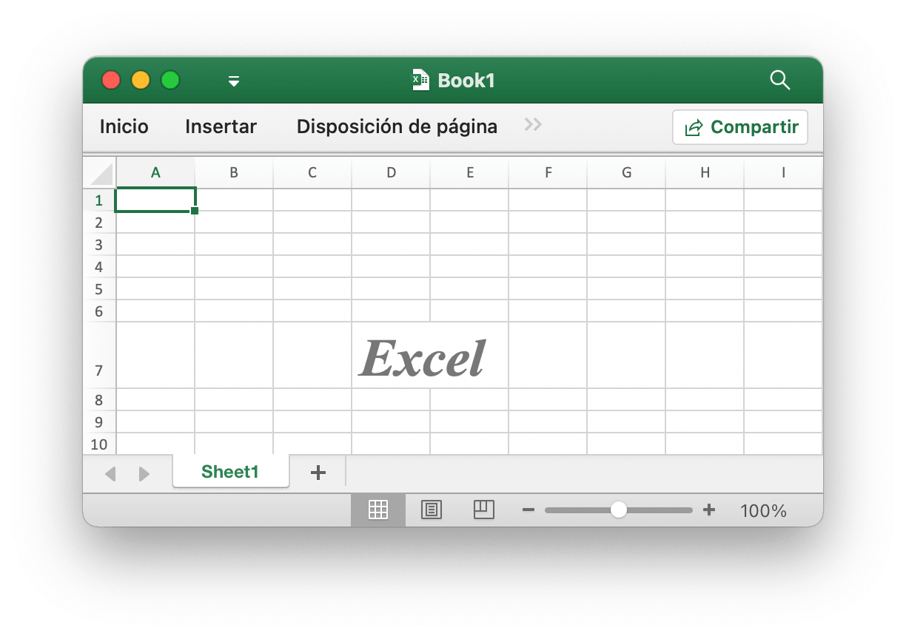
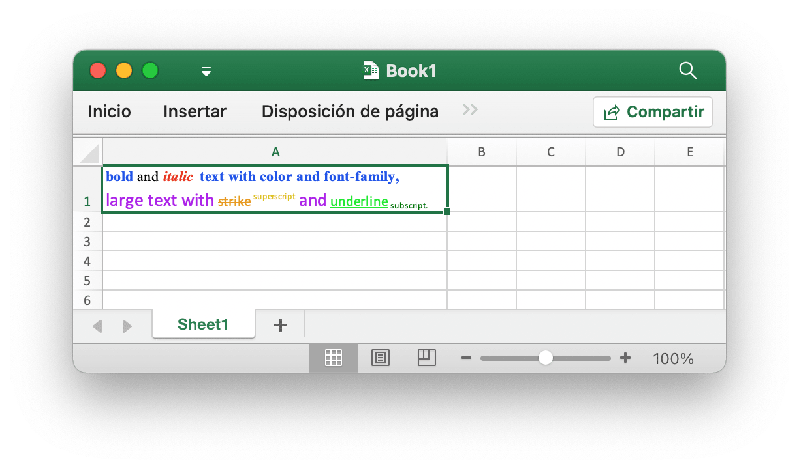
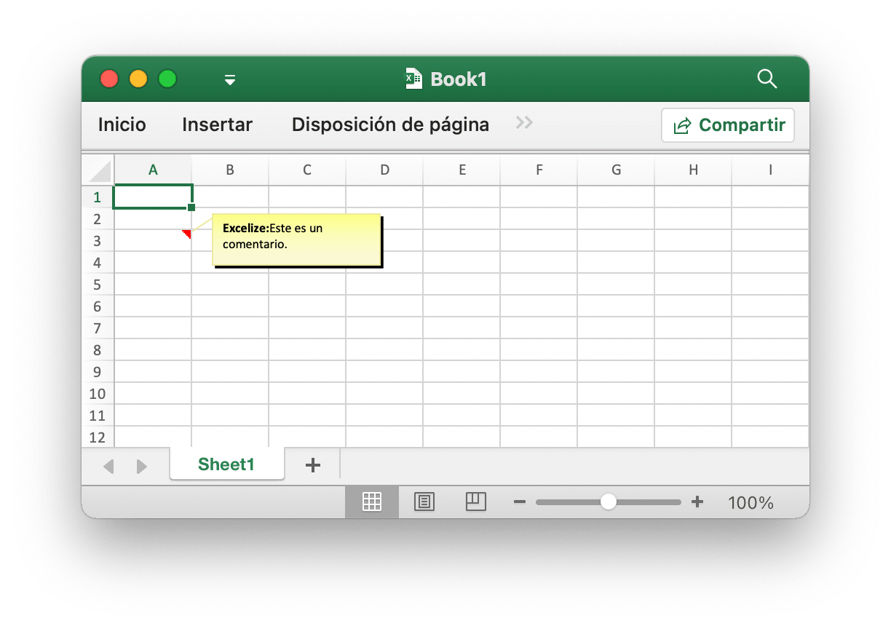

# Celda

`RichTextRun` mapea directamente la configuración de la ejecución de texto enriquecido.

```go
type RichTextRun struct {
    Font *Font
    Text string
}
```

`HyperlinkOpts` se puede pasar a [`SetCellHyperlink`](cell.md#SetCellHyperlink) para establecer atributos de hipervínculo opcionales (por ejemplo, texto para mostrar y texto de sugerencia en pantalla).

```go
type HyperlinkOpts struct {
    Display *string
    Tooltip *string
}
```

`FormulaOpts` se puede pasar a [`SetCellFormula`](cell.md#SetCellFormula) para usar otros tipos de fórmula.

```go
type FormulaOpts struct {
    Type *string // Tipo de fórmula
    Ref  *string // Referencia de fórmula compartida
}
```

## Establecer el valor de la celda {#SetCellValue}

```go
func (f *File) SetCellValue(sheet, cell string, value interface{}) error
```

SetCellValue proporciona una función para establecer el valor de una celda. Esta función es segura para la simultaneidad. Las coordenadas especificadas no deben estar en la primera fila de la tabla. A continuación, se muestran los tipos de datos admitidos:

|Tipos de datos admitidos|
|---|
|int|
|int8|
|int16|
|int32|
|int64|
|uint|
|uint8|
|uint16|
|uint32|
|uint64|
|float32|
|float64|
|string|
|[]byte|
|time.Duration|
|time.Time|
|bool|
|nil|

Tenga en cuenta que el formato de fecha predeterminado es `m/d/yy h:mm` del valor de tipo `time.Time`. Puede establecer el formato de los números mediante el método [`SetCellStyle`](cell.md#SetCellStyle). Si necesita establecer la fecha especializada en Excel, como el 0 de enero de 1900 o el 29 de febrero de 1900, estas horas no se pueden representar en el tipo de datos `time.Time` del lenguaje Go. Establezca el valor de la celda como número 0 o 60, luego cree y vincule el estilo de formato de número de fecha y hora para la celda.

## Establecer valor booleano {#SetCellBool}

```go
func (f *File) SetCellBool(sheet, cell string, value bool) error
```

SetCellBool proporciona una función para establecer el valor de tipo bool de una celda por nombre de hoja de trabajo, coordenadas de celda y valor de celda dados.

## Establecer el valor RAW {#SetCellDefault}

```go
func (f *File) SetCellDefault(sheet, cell, value string) error
```

SetCellDefault proporciona una función para establecer el valor del tipo de cadena de una celda como formato predeterminado sin escapar de la celda.

## Establecer valor entero {#SetCellInt}

```go
func (f *File) SetCellInt(sheet, cell string, value int64) error
```

SetCellInt proporciona una función para establecer el valor de tipo `int64` de una celda por nombre de hoja de trabajo, coordenadas de celda y valor de celda dados.

## Establecer un valor entero sin signo {#SetCellUint}

```go
func (f *File) SetCellUint(sheet, cell string, value uint64) error
```

SetCellUint proporciona una función para establecer el valor del tipo de datos entero sin signo de una celda según el nombre de la hoja de trabajo, la referencia de celda y el valor de celda.

## Establecer valor de coma flotante {#SetCellFloat}

```go
func (f *File) SetCellFloat(sheet, cell string, value float64, precision, bitSize int) error
```

SetCellFloat establece un valor de coma flotante en una celda. El parámetro `precision` especifica cuántos lugares después del decimal se mostrarán, mientras que `-1` es un valor especial que usará tantos lugares decimales como sea necesario para representar el número. `bitSize` es `32` o `64` dependiendo de si originalmente se usó un `float32` o `float64` para el valor.

## Establecer el valor de cadena {#SetCellStr}

```go
func (f *File) SetCellStr(sheet, cell, value string) error
```

SetCellStr proporciona una función para establecer el valor del tipo de cadena de una celda. El número total de caracteres que una celda puede contener `32767` caracteres.

## Establecer estilo de celda {#SetCellStyle}

```go
func (f *File) SetCellStyle(sheet, topLeftCell, bottomRightCell string, styleID int) error
```

SetCellStyle proporciona una función para agregar atributos de estilo para celdas por nombre de hoja de trabajo, área de coordenadas e ID de estilo dados. Esta función es segura para la simultaneidad. Los índices de estilo se pueden obtener con la función [`NewStyle`](style.md#NewStyle). Tenga en cuenta que los bordes de tipo `diagonalDown` y `diagonalUp` deben usar el mismo color en la misma área de coordenadas. SetCellStyle sobrescribirá los estilos existentes para la celda, no agregará ni fusionará el estilo con los estilos existentes.

- Ejemplo 1, cree bordes de celda `D7` en `Sheet1`:

```go
style, err := f.NewStyle(&excelize.Style{
    Border: []excelize.Border{
        {Type: "left", Color: "0000FF", Style: 3},
        {Type: "top", Color: "00FF00", Style: 4},
        {Type: "bottom", Color: "FFFF00", Style: 5},
        {Type: "right", Color: "FF0000", Style: 6},
        {Type: "diagonalDown", Color: "A020F0", Style: 8},
        {Type: "diagonalUp", Color: "A020F0", Style: 8},
    },
})
if err != nil {
    fmt.Println(err)
}
err = f.SetCellStyle("Sheet1", "D7", "D7", style)
```

<p align="center"></p>

Los cuatro bordes de la celda `D7` se establecen con diferentes estilos y colores. Esto está relacionado con los parámetros al llamar a la función [`NewStyle`](style.md#NewStyle). Debe establecer diferentes estilos para consultar la documentación de ese capítulo.

- Ejemplo 2, configurando el estilo de degradado para la celda de la hoja de trabajo `D7` llamada `Sheet1`:

```go
style, err := f.NewStyle(&excelize.Style{
    Fill: excelize.Fill{Type: "gradient", Color: []string{"FFFFFF", "E0EBF5"}, Shading: 1},
})
if err != nil {
    fmt.Println(err)
}
err = f.SetCellStyle("Sheet1", "D7", "D7", style)
```

<p align="center"></p>

La celda `D7` se establece con el relleno de color del efecto de degradado. El efecto de relleno de degradado está relacionado con el parámetro cuando se llama a la función [`NewStyle`](style.md#NewStyle). Debe establecer diferentes estilos para consultar la documentación de este capítulo.

- Ejemplo 3, establezca un relleno sólido para la celda `D7` llamada `Sheet1`:

```go
style, err := f.NewStyle(&excelize.Style{
    Fill: excelize.Fill{Type: "pattern", Color: []string{"E0EBF5"}, Pattern: 1},
})
if err != nil {
    fmt.Println(err)
}
err = f.SetCellStyle("Sheet1", "D7", "D7", style)
```

<p align="center"></p>

La celda `D7` se establece con un relleno sólido.

- Ejemplo 4, establezca el espaciado de caracteres y el ángulo de rotación para la celda `D7` llamada `Sheet1`:

```go
f.SetCellValue("Sheet1", "D7", "Estilo")
style, err := f.NewStyle(&excelize.Style{
    Alignment: &excelize.Alignment{
        Horizontal:      "center",
        Indent:          1,
        JustifyLastLine: true,
        ReadingOrder:    0,
        RelativeIndent:  1,
        ShrinkToFit:     true,
        TextRotation:    45,
        Vertical:        "",
        WrapText:        true,
    },
})
if err != nil {
    fmt.Println(err)
}
err = f.SetCellStyle("Sheet1", "D7", "D7", style)
```

<p align="center"></p>

- En el ejemplo 5, la fecha y la hora en Excel están representadas por números reales, por ejemplo, `2017/7/4 12:00:00 PM` se puede representar con el número `42920.5`. Establezca el formato de hora para la celda de la hoja de trabajo `D7` llamada `Sheet1`:

```go
f.SetCellValue("Sheet1", "D7", 42920.5)
f.SetColWidth("Sheet1", "D", "D", 13)
style, err := f.NewStyle(&excelize.Style{NumFmt: 22})
if err != nil {
    fmt.Println(err)
}
err = f.SetCellStyle("Sheet1", "D7", "D7", style)
```

<p align="center"></p>

La celda `D7` se establece en el formato de hora. Tenga en cuenta que cuando el ancho de celda con el formato de hora aplicado es demasiado estrecho para mostrarse por completo, se mostrará como `####`, puede arrastrar y soltar el ancho de la columna o establecer la columna en el tamaño apropiado llamando al Función `SetColWidth` para que sea una visualización normal.

- Ejemplo 6, configuración de la fuente, tamaño de fuente, color y estilo sesgado para la celda de la hoja de trabajo `D7` denominada `Sheet1`:

```go
f.SetCellValue("Sheet1", "D7", "Excel")
style, err := f.NewStyle(&excelize.Style{
    Font: &excelize.Font{
        Bold:   true,
        Italic: true,
        Family: "Times New Roman",
        Size:   36,
        Color:  "777777",
    },
})
if err != nil {
    fmt.Println(err)
}
err = f.SetCellStyle("Sheet1", "D7", "D7", style)
```

<p align="center"></p>

- Ejemplo 7, bloquear y ocultar la celda de la hoja de trabajo `D7` denominada `Sheet1`:

```go
style, err := f.NewStyle(&excelize.Style{
    Protection: &excelize.Protection{
        Hidden: true,
        Locked: true,
    },
})
if err != nil {
    fmt.Println(err)
}
err = f.SetCellStyle("Sheet1", "D7", "D7", style)
```

Para bloquear una celda u ocultar una fórmula, proteja la hoja de trabajo. En la pestaña "Revisar", haga clic en "Proteger hoja de trabajo".

## Establecer hipervínculo {#SetCellHyperLink}

```go
func (f *File) SetCellHyperLink(sheet, cell, link, linkType string, opts ...HyperlinkOpts) error
```

SetCellHyperLink proporciona una función para establecer hipervínculos de celda según el nombre de la hoja de trabajo y la dirección URL del enlace. LinkType define dos tipos de hipervínculos `External` para el sitio web o `Location` para moverse a una de las celdas de este libro. El límite máximo de hipervínculos en una hoja de trabajo es `65530`. Esta función solo se usa para establecer el hipervínculo de la celda y no afecta el valor de la celda. Si necesita establecer el valor de la celda, utilice las otras funciones como [`SetCellStyle`](cell.md#SetCellStyle) o [`SetSheetRow`](sheet.md#SetSheetRow). A continuación se muestra un ejemplo de un enlace externo.

- Ejemplo 1, agregando un enlace externo a la celda `A3` de la hoja de trabajo llamada `Sheet1`:

```go
display, tooltip := "https://github.com/xuri/excelize", "Excelize on GitHub"
if err := f.SetCellHyperLink("Sheet1", "A3",
    "https://github.com/xuri/excelize", "External", excelize.HyperlinkOpts{
        Display: &display,
        Tooltip: &tooltip,
    }); err != nil {
    fmt.Println(err)
}
// Establecer la fuente y el estilo de subrayado para la celda
style, err := f.NewStyle(&excelize.Style{
    Font: &excelize.Font{Color: "1265BE", Underline: "single"},
})
if err != nil {
    fmt.Println(err)
}
err = f.SetCellStyle("Sheet1", "A3", "A3", style)
```

- Ejemplo 2, agregando un enlace de ubicación interna a la celda `A3` llamada `Sheet1`:

```go
err := f.SetCellHyperLink("Sheet1", "A3", "Sheet1!A40", "Location")
```

## Establecer texto enriquecido de celda {#SetCellRichText}

```go
func (f *File) SetCellRichText(sheet, cell string, runs []RichTextRun) error
```

SetCellRichText proporciona una función para configurar una celda con texto enriquecido por una hoja de trabajo determinada.

Por ejemplo, establezca texto enriquecido en la celda `A1` de la hoja de trabajo denominada `Sheet1`:

<p align="center"></p>

```go
package main

import (
    "fmt"

    "github.com/xuri/excelize/v2"
)

func main() {
    f := excelize.NewFile()
    defer func() {
        if err := f.Close(); err != nil {
            fmt.Println(err)
        }
    }()
    if err := f.SetRowHeight("Sheet1", 1, 35); err != nil {
        fmt.Println(err)
        return
    }
    if err := f.SetColWidth("Sheet1", "A", "A", 44); err != nil {
        fmt.Println(err)
        return
    }
    if err := f.SetCellRichText("Sheet1", "A1", []excelize.RichTextRun{
        {
            Text: "bold",
            Font: &excelize.Font{
                Bold:   true,
                Color:  "2354E8",
                Family: "Times New Roman",
            },
        },
        {
            Text: " and ",
            Font: &excelize.Font{
                Family: "Times New Roman",
            },
        },
        {
            Text: "italic ",
            Font: &excelize.Font{
                Bold:   true,
                Color:  "E83723",
                Italic: true,
                Family: "Times New Roman",
            },
        },
        {
            Text: "text with color and font-family,",
            Font: &excelize.Font{
                Bold:   true,
                Color:  "2354E8",
                Family: "Times New Roman",
            },
        },
        {
            Text: "\r\nlarge text with ",
            Font: &excelize.Font{
                Size:  14,
                Color: "AD23E8",
            },
        },
        {
            Text: "strike",
            Font: &excelize.Font{
                Color:  "E89923",
                Strike: true,
            },
        },
        {
            Text: " superscript",
            Font: &excelize.Font{
                Color:     "DBC21F",
                VertAlign: "superscript",
            },
        },
        {
            Text: " and ",
            Font: &excelize.Font{
                Size:      14,
                Color:     "AD23E8",
                VertAlign: "baseline",
            },
        },
        {
            Text: "underline",
            Font: &excelize.Font{
                Color:     "23E833",
                Underline: "single",
            },
        },
        {
            Text: " subscript.",
            Font: &excelize.Font{
                Color:     "017505",
                VertAlign: "subscript",
            },
        },
    }); err != nil {
        fmt.Println(err)
        return
    }
    style, err := f.NewStyle(&excelize.Style{
        Alignment: &excelize.Alignment{
            WrapText: true,
        },
    })
    if err != nil {
        fmt.Println(err)
        return
    }
    if err := f.SetCellStyle("Sheet1", "A1", "A1", style); err != nil {
        fmt.Println(err)
        return
    }
    if err := f.SaveAs("Book1.xlsx"); err != nil {
        fmt.Println(err)
    }
}
```

## Obtener texto enriquecido de celda {#GetCellRichText}

```go
func (f *File) GetCellRichText(sheet, cell string) ([]RichTextRun, error)
```

GetCellRichText proporciona una función para obtener el texto enriquecido de las celdas mediante una hoja de trabajo determinada.

## Obtener valor de celda {#GetCellValue}

```go
func (f *File) GetCellValue(sheet, cell string, opts ...Options) (string, error)
```

El valor de la celda se recupera de acuerdo con la hoja de trabajo y las coordenadas de la celda dadas, y el valor de retorno se convierte al tipo `string`. Esta función es segura para la simultaneidad. Si el formato de celda se puede aplicar al valor de una celda, se devolverá el valor aplicado; de lo contrario, se devolverá el valor original. Los valores de todas las celdas serán los mismos en un rango combinado.

## Obtener el tipo de datos de la celda {#GetCellType}

```go
func (f *File) GetCellType(sheet, cell string) (CellType, error)
```

GetCellType proporciona una función para obtener el tipo de datos de la celda por el nombre y el eje de la hoja de trabajo dados en el archivo de la hoja de cálculo.

## Obtener todo el valor de celda por columnas {#GetCols}

```go
func (f *File) GetCols(sheet string, opts ...Options) ([][]string, error)
```

GetCols obtiene el valor de todas las celdas por columnas en la hoja de trabajo en función del nombre de la hoja de trabajo dado, devuelto como una matriz bidimensional, donde el valor de la celda se convierte al tipo `string`. Si el formato de celda se puede aplicar al valor de la celda, se usará el valor aplicado; de lo contrario, se usará el valor original.

Por ejemplo, obtenga y recorra el valor de todas las celdas por columnas en una hoja de trabajo llamada `Hoja1`:

```go
cols, err := f.GetCols("Hoja1")
if err != nil {
    fmt.Println(err)
    return
}
for _, col := range cols {
    for _, rowCell := range col {
        fmt.Print(rowCell, "\t")
    }
    fmt.Println()
}
```

## Obtener todo el valor de celda por filas {#GetRows}

```go
func (f *File) GetRows(sheet string, opts ...Options) ([][]string, error)
```

GetRows devuelve todas las filas de una hoja por el nombre de la hoja de cálculo dado, devueltas como una matriz bidimensional, donde el valor de la celda se convierte al tipo `string`. Si el formato de celda se puede aplicar al valor de la celda, se usará el valor aplicado; de lo contrario, se usará el valor original. GetRows obtuvo las filas con celdas de valor o fórmula, las celdas continuamente en blanco en la cola de cada fila se omitirán, por lo que la longitud de cada fila puede ser inconsistente.

Por ejemplo, obtenga y recorra el valor de todas las celdas por filas en una hoja de trabajo llamada `Hoja1`:

```go
rows, err := f.GetRows("Hoja1")
if err != nil {
    fmt.Println(err)
    return
}
for _, row := range rows {
    for _, colCell := range row {
        fmt.Print(colCell, "\t")
    }
    fmt.Println()
}
```

## Obtener hipervínculo {#GetCellHyperLink}

```go
func (f *File) GetCellHyperLink(sheet, cell string) (bool, string, error)
```

Obtiene un hipervínculo de celda según el nombre de la hoja de trabajo y las coordenadas de la celda. Si la celda tiene un hipervínculo, devolverá `true` y la dirección del enlace; de lo contrario, devolverá `false` y una dirección de enlace vacía.

Por ejemplo, obtenga un hipervínculo a una celda `H6` en una hoja de trabajo llamada `Hoja1`:

```go
link, target, err := f.GetCellHyperLink("Hoja1", "H6")
```

## Obtener índice de estilo {#GetCellStyle}

```go
func (f *File) GetCellStyle(sheet, cell string) (int, error)
```

El índice de estilo de celda se obtiene a partir del nombre de la hoja de trabajo y las coordenadas de la celda, y el índice obtenido se puede utilizar como parámetro para llamar a la función `SetCellStyle` al copiar el estilo de celda.

## Combinar celdas {#MergeCell}

```go
func (f *File) MergeCell(sheet, topLeftCell, bottomRightCell string) error
```

Fusionar celdas según el nombre de la hoja de trabajo y las regiones de coordenadas de celda. La combinación de celdas solo conserva el valor de la celda superior izquierda y descarta los demás valores. Por ejemplo, combine celdas en el área `D3:E9` en una hoja de trabajo llamada `Hoja1`:

```go
err := f.MergeCell("Hoja1", "D3", "E9")
```

Si el área de coordenadas de celda dada se superpone con otras celdas fusionadas existentes, las celdas fusionadas existentes se eliminarán.

## Unmerge celdas {#UnmergeCell}

```go
func (f *File) UnmergeCell(sheet, topLeftCell, bottomRightCell string) error
```

UnmergeCell proporciona una función para separar un área de coordenadas determinada. Por ejemplo, separe el área `D3:E9` en `Hoja1`:

```go
err := f.UnmergeCell("Hoja1", "D3", "E9")
```

Atención: las áreas superpuestas tampoco se fusionarán.

## Obtener celdas de combinación {#GetMergeCells}

```go
func (f *File) GetMergeCells(sheet string, withoutValues ...bool) ([]MergeCell, error)
```

GetMergeCells proporciona una función para obtener todas las celdas fusionadas de una hoja de cálculo específica. Si el parámetro `withoutValues` se establece en `true`, no se devolverán los valores de las celdas fusionadas, sino solo la referencia del rango. Por ejemplo, obtener todas las celdas fusionadas en `Sheet1`:

```go
mergeCells, err := f.GetMergeCells("Sheet1")
```

Si desea obtener celdas fusionadas sin valores de celda, puede usar el siguiente código:

```go
mergeCells, err := f.GetMergeCells("Sheet1", true)
```

### Obtener valor de celda combinada

```go
func (m *MergeCell) GetCellValue() string
```

GetCellValue devuelve el valor de la celda combinada.

### Obtenga las coordenadas de la celda superior izquierda del rango combinado

```go
func (m *MergeCell) GetStartAxis() string
```

GetStartAxis devuelve las coordenadas de la celda superior izquierda del rango combinado, por ejemplo: `C2`.

### Obtenga las coordenadas de la celda inferior derecha del rango combinado

```go
func (m *MergeCell) GetEndAxis() string
```

GetEndAxis devuelve las coordenadas de la celda inferior derecha del rango combinado, por ejemplo: `D4`.

## Obtener celdas de imagen {#GetPictureCells}

```go
func (f *File) GetPictureCells(sheet string) ([]string, error)
```

GetPictureCells devuelve todas las referencias de celdas de imágenes en una hoja de trabajo con un nombre de hoja de trabajo específico.

## Añadir comentario {#AddComment}

```go
func (f *File) AddComment(sheet string, comment Comment) error
```

AddComment proporciona el método para agregar comentarios en una hoja por índice de hoja de trabajo, celda y conjunto de formato dado (como autor y texto). Tenga en cuenta que la longitud máxima del autor es 255 y la longitud máxima del texto es 32512. Por ejemplo, agregue un comentario en `Sheet1!A3`:

<p align="center"></p>

```go
err := f.AddComment("Sheet1", excelize.Comment{
    Cell:   "A3",
    Author: "Excelize",
    Paragraph: []excelize.RichTextRun{
        {Text: "Excelize: ", Font: &excelize.Font{Bold: true}},
        {Text: "Este es un comentario."},
    },
})
```

## Obtener comentarios {#GetComments}

```go
func (f *File) GetComments(sheet string) ([]Comment, error)
```

GetComments recupera todos los comentarios en una hoja de trabajo por nombre de hoja de trabajo dado.

## Eliminar comentario {#DeleteComment}

```go
func (f *File) DeleteComment(sheet, cell string) error
```

DeleteComment proporciona el método para eliminar comentarios en una hoja por hoja de trabajo dada. Por ejemplo, elimine el comentario en `Hoja1!A30`:

```go
err := f.DeleteComment("Hoja1", "A30")
```

## Agregar errores ignorados {#AddIgnoredErrors}

```go
func (f *File) AddIgnoredErrors(sheet, rangeRef string, ignoredErrorsType IgnoredErrorsType) error
```

AddIgnoredErrors proporciona el método para ignorar los errores de un rango de celdas. Por ejemplo: ignorar el error "número almacenado como texto" en `Hoja1` para el rango de celdas `D15 C18:D19`:

```go
err := f.AddIgnoredErrors("Hoja1", "D15 C18:D19", excelize.IgnoredErrorsNumberStoredAsText)
```

## Establecer fórmula de celda {#SetCellFormula}

```go
func (f *File) SetCellFormula(sheet, cell, formula string, opts ...FormulaOpts) error
```

SetCellFormula proporciona una función para establecer la fórmula en la celda que se toma de acuerdo con el nombre de la hoja de trabajo dada y la configuración de la fórmula de la celda. El resultado de la celda de fórmula se puede calcular cuando la aplicación de Office Excel abre la hoja de cálculo o puede usar la función [CalcCellValue](cell.md#CalcCellValue) también puede obtener el valor de celda calculado. Si la aplicación de Excel no calcula la fórmula automáticamente cuando se abre el libro, llame a [UpdateLinkedValue](utils.md#UpdateLinkedValue) después de configurar las funciones de la fórmula de la celda.

- Ejemplo 1, establezca la fórmula normal `=SUM(A1,B1)` para la celda `A3` en `Hoja1`:

```go
err := f.SetCellFormula("Hoja1", "A3", "SUM(A1,B1)")
```

- Ejemplo 2, establezca la fórmula de matriz constante vertical unidimensional (matriz de columnas) `1;2;3` para la celda `A3` en `Hoja1`:

```go
err := f.SetCellFormula("Hoja1", "A3", "{1;2;3}")
```

- Ejemplo 3, establezca la fórmula de matriz constante horizontal unidimensional (matriz de fila) `"a","b","c"` para la celda `A3` en `Hoja1`:

```go
err := f.SetCellFormula("Hoja1", "A3", "{\"a\",\"b\",\"c\"}")
```

- Ejemplo 4, establezca la fórmula de matriz constante bidimensional `{1,2;"a","b"}` para la celda `A3` en `Hoja1`:

```go
formulaType, ref := excelize.STCellFormulaTypeArray, "A3:A3"
err := f.SetCellFormula("Hoja1", "A3", "{1,2;\"a\",\"b\"}",
    excelize.FormulaOpts{Ref: &ref, Type: &formulaType})
```

- Ejemplo 5, establezca la fórmula de matriz de rango `A1:A2` para la celda `A3` en `Hoja1`:

```go
formulaType, ref := excelize.STCellFormulaTypeArray, "A3:A3"
err := f.SetCellFormula("Hoja1", "A3", "A1:A2",
    excelize.FormulaOpts{Ref: &ref, Type: &formulaType})
```

- Ejemplo 6, establezca la fórmula compartida `=A1+B1` para las celdas `C1:C5` en `Hoja1`, `C1` es la celda maestra:

```go
formulaType, ref := excelize.STCellFormulaTypeShared, "C1:C5"
err := f.SetCellFormula("Hoja1", "C1", "A1+B1",
    excelize.FormulaOpts{Ref: &ref, Type: &formulaType})
```

- Ejemplo 7, establecer la fórmula de tabla `=SUM(Table1[[A]:[B]])` para la celda `C2` en `Hoja1`:

```go
package main

import (
    "fmt"

    "github.com/xuri/excelize/v2"
)

func main() {
    f := excelize.NewFile()
    defer func() {
        if err := f.Close(); err != nil {
            fmt.Println(err)
        }
    }()
    if err := f.SetSheetName("Sheet1", "Hoja1"); err != nil {
        fmt.Println(err)
        return
    }
    for idx, row := range [][]interface{}{{"A", "B", "C"}, {1, 2}} {
        if err := f.SetSheetRow("Hoja1", fmt.Sprintf("A%d", idx+1), &row); err != nil {
            fmt.Println(err)
            return
        }
    }
    if err := f.AddTable("Hoja1",
        &excelize.Table{
            Range:     "A1:C2",
            Name:      "Table1",
            StyleName: "TableStyleMedium2",
        }); err != nil {
        fmt.Println(err)
        return
    }
    formulaType := excelize.STCellFormulaTypeDataTable
    if err := f.SetCellFormula("Hoja1", "C2", "SUM(Table1[[A]:[B]])",
        excelize.FormulaOpts{Type: &formulaType}); err != nil {
        fmt.Println(err)
        return
    }
    if err := f.SaveAs("Libro1.xlsx"); err != nil {
        fmt.Println(err)
    }
}
```

## Obtener fórmula celular {#GetCellFormula}

```go
func (f *File) GetCellFormula(sheet, cell string) (string, error)
```

Obtenga la fórmula en la celda según el nombre de la hoja de trabajo y las coordenadas de la celda.

## Calcular el valor de la celda {#CalcCellValue}

```go
func (f *File) CalcCellValue(sheet, cell string, opts ...Options) (string, error)
```

CalcCellValue proporciona una función para obtener el valor de celda calculado. Esta función se encuentra actualmente en proceso de trabajo. El cálculo iterativo, la intersección implícita, la intersección explícita, la fórmula de matriz, la fórmula de tabla y algunas otras fórmulas no se admiten actualmente.

Fórmulas compatibles:

Nombre de la función | Tipo y descripción
---|---
ABS                      | Devuelve el valor absoluto de un número
INT.ACUM                 | Devuelve el interés devengado de un valor bursátil que paga intereses periódicos
INT.ACUM.V               | Devuelve el interés devengado de un valor bursátil que paga intereses a su vencimiento
ACOS                     | Devuelve el arcocoseno de un número
ACOSH                    | Devuelve el coseno hiperbólico inverso de un número
ACOT                     | Devuelve el arco cotangente de un número
ACOTH                    | Devuelve el arco cotangente hiperbólico de un número
AGREGAR                  | Devuelve un agregado en una lista o base de datos
ADDRESS                  | Devuelve una referencia como texto a una sola celda en una hoja de cálculo
AMORTIZ.PROGRE           | Devuelve la depreciación de cada período contable mediante un coeficiente de depreciación
AMORTIZ.LIN              | Devuelve la depreciación de cada período contable
AND                      | Devuelve TRUE si todos sus argumentos son TRUE
NUMERO.ARABE             | Convierte un número romano en arábigo, como un número
MATRIZATEXTO             | Devuelve una matriz de valores de texto de cualquier rango especificado
ASENO                    | Devuelve el arcoseno de un número
ASINH                    | Devuelve el seno hiperbólico inverso de un número
ATAN                     | Devuelve el arco tangente de un número
ATAN2                    | Devuelve el arco tangente de las coordenadas x e y
ATANH                    | Devuelve la tangente hiperbólica inversa de un número
AVEDEV                   | Devuelve el promedio de las desviaciones absolutas de la media para los puntos de datos
PROMEDIO                 | Devuelve el promedio de sus argumentos
PROMEDIOA                | Devuelve el promedio de sus argumentos, incluidos números, texto y valores lógicos
PROMEDIO.SI              | Devuelve el promedio (media aritmética) de todas las celdas de un intervalo que cumplan unos criterios dados
AVERAGEIFS               | Devuelve el promedio (media aritmética) de todas las celdas que cumplen varios criterios
TEXTOBAHT                | Convierte un número en texto tailandés y agrega un sufijo "Baht"
BASE                     | Convierte un número en una representación de texto con la base dada
BESSELI                  | Devuelve la función Bessel modificada In(x)
BESSELJ                  | Devuelve la función Bessel Jn(x)
BESSELK                  | Devuelve la función Bessel modificada Kn(x)
BESSELY                  | Devuelve la función Bessel Yn(x)
BETADIST                 | Devuelve la función de distribución beta acumulativa. En Excel 2007, esta es una función Estadística
BETA.DIST                | Devuelve la función de distribución beta acumulativa
DISTR.BETA.INV           | Devuelve el inverso de la función de distribución acumulativa para una distribución beta especificada. En Excel 2007, esta es una función Estadística
BETA.INV                 | Devuelve el inverso de la función de distribución acumulativa para una distribución beta especificada
BIN.A.DEC                | Convierte un número binario en decimal
BIN.A.HEX                | Convierte un número binario en hexadecimal
BIN.A.OCT                | Convierte un número binario en octal
BINOMDIST                | Devuelve la probabilidad de la distribución binomial del término individual. En Excel 2007, esta es una función Estadística
BINOM.DIST               | Devuelve la probabilidad de la distribución binomial del término individual
DISTR.BINOM.SERIE        | Devuelve la probabilidad de un resultado de prueba mediante una distribución binomial
BINOM.INV                | Devuelve el menor valor cuya distribución binomial acumulada sea menor o igual que un valor de criterio
BIT.Y                    | Devuelve una operación "AND bit a bit" de dos números
BIT.DESPLIZQDA           | Devuelve un número de valor desplazado una determinada cantidad de bits hacia la izquierda
BIT.O                    | Devuelve una operación "OR bit a bit" de dos números
BIT.DESPLDCHA            | Devuelve un número de valor desplazado una determinada cantidad de bits hacia la derecha
BIT.XO                   | Devuelve una operación "OR exclusivo" de dos números
CEILING                  | Redondea un número al entero más próximo o al múltiplo significativo más cercano
MULTIPLO.SUPERIOR.MAT    | Redondea un número hacia arriba al entero mayor más cercano o al múltiplo más cercano de la cifra significativa
MULTIPLO.SUPERIOR.EXACTO | Redondea un número al entero mayor más cercano o al múltiplo más cercano de la cifra significativa. Independientemente del signo del número, el número se redondea hacia arriba
CHAR                     | Devuelve el carácter especificado por el número de código
CHIDIST                  | Devuelve la probabilidad de una sola cola en una distribución chi cuadrado. Nota En Excel 2007, esta es una función Estadística
CHIINV                   | Devuelve el inverso de una probabilidad dada, de una sola cola, en una distribución chi cuadrada. Nota En Excel 2007, esta es una función Estadística
CHITEST                  | Devuelve la prueba de independencia. Nota En Excel 2007, esta es una función Estadística
CHISQ.DIST               | Devuelve la función de densidad de probabilidad beta acumulativa
CHISQ.DIST.RT            | Devuelve la probabilidad de una sola cola en una distribución chi cuadrado
CHISQ.INV                | Devuelve la función de densidad de probabilidad beta acumulativa
CHISQ.INV.RT             | Devuelve el inverso de una probabilidad dada, de una sola cola, en una distribución chi cuadrada
CHISQ.TEST               | Devuelve la prueba de independencia
CHOOSE                   | Elige un valor de una lista de valores
CLEAN                    | Quita del texto todos los caracteres no imprimibles
CODIGO                   | Devuelve un código numérico para el primer carácter de una cadena de texto
COLUMN                   | Devuelve el número de columna de una referencia
COLUMNAS                 | Devuelve el número de columnas de una referencia
COMBIN                   | Devuelve el número de combinaciones para un número de objetos determinado
COMBINA                  | Devuelve el número de combinaciones con repeticiones para un número de elementos determinado
COMPLEJO                 | Convierte coeficientes reales e imaginarios en números complejos
CONCAT                   | Combina el texto de varios rangos o cadenas, pero no proporciona el delimitador o los argumentos IgnoreEmpty
CONCATENAR               | Une varios elementos de texto en un elemento de texto
CONFIDENCE               | Devuelve el intervalo de confianza para la media de una población. En Excel 2007, esta es una función Estadística
CONFIDENCE.NORM          | Devuelve el intervalo de confianza para la media de una población
CONFIDENCE.T             | Devuelve el intervalo de confianza para la media de una población con una distribución t de Estudiante
CONVERT                  | Convierte un número de un sistema de medidas a otro
CORREL                   | Devuelve el coeficiente de correlación entre dos conjuntos de datos
COS                      | Devuelve el coseno de un número
COSH                     | Devuelve el coseno hiperbólico de un número
COT                      | Devuelve el coseno hiperbólico de un número
COTH                     | Devuelve la cotangente de un ángulo
COUNT                    | Cuenta cuántos números hay en la lista de argumentos
CONTARA                  | Cuenta cuántos valores hay en la lista de argumentos
CONTAR.BLANCO            | Cuenta el número de celdas en blanco en un intervalo
CONTAR.SI                | Cuenta las celdas contenidas en un intervalo que cumplen los criterios especificados
COUNTIFS                 | Cuenta las celdas contenidas en un intervalo que cumplan varios criterios
CUPON.DIAS.L1            | Devuelve el número de días desde el principio del período de un cupón hasta la fecha de liquidación
CUPON.DIAS               | Devuelve el número de días en el período de un cupón donde se encuentra la fecha de liquidación
CUPON.DIAS.L2            | Devuelve el número de días desde la fecha de liquidación hasta la fecha del próximo cupón
CUPON.FECHA.L2           | Devuelve la fecha del próximo cupón desde la fecha de liquidación
CUPON.NUM                | Devuelve el número de cupones a pagar entre la fecha de liquidación y la fecha de vencimiento
CUPON.FECHA.L1           | Devuelve la fecha previa del cupón antes de la fecha de liquidación
COVAR                    | Devuelve la covarianza, que es el promedio de productos de las desviaciones para cada pareja. En Excel 2007, esta es una función Estadística
COVARIANCE.P             | Devuelve la covarianza, que es el promedio de productos de las desviaciones para cada pareja
COVARIANCE.S             | Devuelve la covarianza de ejemplo, que es el promedio de las desviaciones de los productos para cada pareja de puntos de datos en dos conjuntos de datos
CRITBINOM                | Devuelve el menor valor cuya distribución binomial acumulada sea menor o igual que un valor de criterio. En Excel 2007, esta es una función Estadística
CSC                      | Devuelve la cosecante de un ángulo
CSCH                     | Devuelve la cosecante hiperbólica de un ángulo
PAGO.INT.ENTRE           | Devuelve el interés acumulativo pagado entre dos períodos
PAGO.PRINC.ENTRE         | Devuelve la cantidad acumulada de capital pagado de un préstamo entre dos períodos
DATE                     | Devuelve el número de serie de una fecha determinada
SIFECHA                  | Calcula el número de días, meses o años entre dos fechas. Esta función es útil en las fórmulas en las que necesite calcular una edad
DATEVALUE                | Convierte en un número de serie una fecha en formato de texto
DAVERAGE                 | Devuelve el promedio de entradas seleccionadas de una base de datos
DAY                      | Convierte un número de serie en un día del mes
DAYS                     | Devuelve el número de días entre dos fechas
DIAS360                  | Calcula el número de días entre dos fechas basándose en un año de 360 días
DB                       | Devuelve la depreciación de un activo durante un período específico usando el método de depreciación de saldo fijo
DCOUNT                   | Cuenta las celdas que contienen números en una base de datos
BDCONTARA                | Cuenta las celdas que no están en blanco en una base de datos
DDB                      | Devuelve la depreciación de un activo en un período específico con el método de doble disminución del saldo u otro método que se especifique
DEC.A.BIN                | Convierte un número decimal en binario
DEC.A.HEX                | Convierte un número decimal en hexadecimal
DEC.A.OCT                | Convierte un número decimal en octal
CONV.DECIMAL             | Convierte la representación de texto de un número en una base especificada en un número decimal
GRADOS                   | Convierte radianes en grados
DELTA                    | Comprueba si dos valores son iguales
DEVSQ                    | Devuelve la suma de los cuadrados de las desviaciones
DGET                     | Extrae de una base de datos un único registro que coincida con los criterios especificados
TASA.DESC                | Devuelve la tasa de descuento de un valor bursátil
DMAX                     | Devuelve el valor máximo de las entradas seleccionadas de una base de datos
BDMIN                    | Devuelve el valor mínimo de las entradas seleccionadas de una base de datos
MONEDA                   | Convierte un número en texto con formato de moneda, con los decimales redondeados al número de posiciones que especifique
DOLLARDE                 | Convierte un precio en dólares expresado como una fracción en un precio en dólares expresado como un número decimal
MONEDA.FRAC              | Convierte un precio en dólares expresado como un número decimal en un precio en dólares expresado como una fracción
DPRODUCT                 | Multiplica los valores de un campo determinado de los registros que cumplen los criterios de una base de datos
BDDESVEST                | Calcula la desviación estándar en función de una muestra de entradas seleccionadas de una base de datos
BDDESVESTP               | Calcula la desviación estándar en función de toda la población de entradas seleccionadas de una base de datos
BDSUMA                   | Suma los números de la columna de campo de los registros de la base de datos que coinciden con los criterios
DURACION                 | Devuelve la duración anual de un valor bursátil con pagos de intereses periódicos
DVAR                     | Calcula la varianza en función de una muestra de entradas seleccionadas de una base de datos
BDVARP                   | Calcula la varianza en función de toda la población de entradas seleccionadas de una base de datos
FECHA.MES                | Devuelve el número de serie de la fecha que es el número indicado de meses antes o después de la fecha de inicio
INT.EFECTIVO             | Devuelve la tasa de interés anual efectiva
ENCODEURL                | Devuelve una cadena con codificación URL
FIN.MES                  | Devuelve el número de serie del último día del mes antes o después de un número de meses especificado
FUN.ERROR                | Devuelve la función de error
ERF.PRECISE              | Devuelve la función de error
FUN.ERROR.COMPL          | Devuelve la función de error complementaria
ERFC.PRECISE             | Devuelve la función ERF complementaria integrada entre x e infinito
ERROR.TYPE               | Devuelve un número que se corresponde con un tipo de error
EUROCONVERT              | Convierte un número a euros. Convierte un número de euros a la moneda de un estado que haya adoptado el euro, o bien, convierte el número de una moneda de un estado que adoptó el euro a otro usando el euro como moneda intermedia (triangulación)
EVEN                     | Redondea un número hacia arriba hasta el próximo entero par
EXACT                    | Comprueba si dos valores de texto son idénticos
EXP                      | Devuelve e elevado a la potencia de un número dado
EXPANDIR                 | Expande o rellena una matriz a las dimensiones de fila y columna especificadas
EXPONDIST                | Devuelve la distribución exponencial. En Excel 2007, esta es una función Estadística
FACT                     | Devuelve el factorial de un número
FACT.DOBLE               | Devuelve el factorial doble de un número
FALSE                    | Devuelve el valor lógico FALSE
F.DIST                   | Devuelve la distribución de probabilidad F
FDIST                    | Devuelve la distribución de probabilidad F. En Excel 2007, esta es una función Estadística
F.DIST.RT                | Devuelve la distribución de probabilidad F
FIND                     | Busca un valor de texto dentro de otro (distingue mayúsculas de minúsculas)
FINDB                    | Busca un valor de texto dentro de otro (distingue mayúsculas de minúsculas)
F.INV                    | Devuelve el inverso de la distribución de probabilidad F
F.INV.RT                 | Devuelve el inverso de la distribución de probabilidad F
FINV                     | Devuelve el inverso de la distribución de probabilidad F. En Excel 2007, esta es una función Estadística
FISHER                   | Devuelve la transformación Fisher
PRUEBA.FISHER.INV        | Devuelve la función inversa de la transformación Fisher
FIXED                    | Da formato a un número como texto con un número fijo de decimales
FLOOR                    | Redondea un número hacia abajo, hacia cero. En Excel 2007 y Excel 2010, esta es una función de Matemáticas y trigonometría
MULTIPLO.INFERIOR.MAT    | Redondea un número hacia abajo, al entero más cercano o al múltiplo más cercano de la cifra significativa
FLOOR.PRECISE            | Redondea un número al entero mayor más cercano o al múltiplo más cercano de la cifra significativa. Independientemente del signo del número, el número se redondea hacia arriba
PRONOSTICAR              | Devuelve un valor en una tendencia lineal
PRONOSTICAR.LINEAL       | Devuelve un valor en una tendencia lineal
FORMULATEXT              | Devuelve la fórmula en la referencia dada como texto
FRECUENCIA               | Devuelve una distribución de frecuencia como una matriz vertical
F.TEST                   | Devuelve el resultado de una prueba F
FTEST                    | Devuelve el resultado de una prueba F. En Excel 2007, esta es una función Estadística
FV                       | Devuelve el valor futuro de una inversión
VF.PLAN                  | Devuelve el valor futuro del capital principal inicial después de aplicar una serie de tasas de interés compuesto
GAMMA                    | Devuelve el valor de la función gamma
GAMMA.DIST               | Devuelve la distribución gamma
GAMMADIST                | Devuelve la distribución gamma. En Excel 2007, esta es una función Estadística
GAMMA.INV                | Devuelve el inverso de la distribución gamma acumulativa
GAMMAINV                 | Devuelve el inverso de la distribución gamma acumulativa. En Excel 2007, esta es una función Estadística
GAMMALN                  | Devuelve el logaritmo natural de la función gamma, Γ(x)
GAMMALN.PRECISE          | Devuelve el logaritmo natural de la función gamma, Γ(x)
GAUSS                    | Devuelve un 0,5 menos que la distribución acumulativa normal estándar
M.C.D                    | Devuelve el máximo común divisor
GEOMEAN                  | Devuelve la media geométrica
MAYOR.O.IGUAL            | Comprueba si un número es mayor que un valor de umbral
GROWTH                   | Devuelve valores en una tendencia exponencial
MEDIA.ARMO               | Devuelve la media armónica
HEX.A.BIN                | Convierte un número hexadecimal en binario
HEX.A.DEC                | Convierte un número hexadecimal en decimal
HEX.A.OCT                | Convierte un número hexadecimal en octal
HLOOKUP                  | Busca en la fila superior de una matriz y devuelve el valor de la celda indicada
HOUR                     | Convierte un número de serie en una hora
HIPERVINCULO             | Crea un acceso directo o salto que abre un documento almacenado en un servidor de red, una intranet o Internet
HYPGEOM.DIST             | Devuelve la distribución hipergeométrica
HYPGEOMDIST              | Devuelve la distribución hipergeométrica En Excel 2007, esta es una función Estadística
IF                       | Especifica una prueba lógica que se va a realizar
SI.ERROR                 | Devuelve un valor que se especifica si una fórmula lo evalúa como un error; de lo contrario, devuelve el resultado de la fórmula
SI.ND                    | Devuelve el valor que se especifica si la expresión se convierte en #N/A; de lo contrario, devuelve el resultado de la expresión
SI.CONJUNTO              | Comprueba si se cumplen una o varias condiciones y devuelve un valor que corresponde a la primera condición TRUE
IM.ABS                   | Devuelve el valor absoluto (módulo) de un número complejo
IMAGINARIO               | Devuelve el coeficiente imaginario de un número complejo
IM.ANGULO                | Devuelve el argumento theta, un ángulo expresado en radianes
IM.CONJUGADA             | Devuelve el conjugado de un número complejo
IM.COS                   | Devuelve el coseno de un número complejo
IM.COSH                  | Devuelve el coseno hiperbólico de un número complejo
IM.COT                   | Devuelve la cotangente de un número complejo
IM.CSC                   | Devuelve la cosecante de un número complejo
IM.CSCH                  | Devuelve la cosecante hiperbólica de un número complejo
IM.DIV                   | Devuelve el cociente de dos números complejos
IM.EXP                   | Devuelve el valor exponencial de un número complejo
IM.LN                    | Devuelve el logaritmo natural de un número complejo
IM.LOG10                 | Devuelve el logaritmo en base 10 de un número complejo
IM.LOG2                  | Devuelve el logaritmo en base 2 de un número complejo
IM.POT                   | Devuelve un número complejo elevado a una potencia entera
IM.PRODUCT               | Devuelve el producto de números complejos
IM.REAL                  | Devuelve el coeficiente real de un número complejo
IM.SEC                   | Devuelve la secante de un número complejo
IM.SECH                  | Devuelve la secante hiperbólica de un número complejo
IM.SENO                  | Devuelve el seno de un número complejo
IM.SENOH                 | Devuelve el seno hiperbólico de un número complejo
IM.RAIZ2                 | Devuelve la raíz cuadrada de un número complejo
IM.SUSTR                 | Devuelve la diferencia entre dos números complejos
IM.SUM                   | Devuelve la suma de números complejos
IM.TAN                   | Devuelve la tangente de un número complejo
INDEX                    | Usa un índice para elegir un valor de una referencia o matriz
INDIRECTO                | Devuelve una referencia indicada por un valor de texto
INT                      | Redondea un número hacia abajo hasta el próximo entero
INTERSECCION.EJE         | Devuelve la intersección de la línea de regresión lineal
TASA.INT                 | Devuelve la tasa de interés para la inversión total en un valor bursátil
PAGOINT                  | Devuelve el pago de intereses de una inversión durante un período determinado
TIR                      | Devuelve la tasa interna de retorno de una inversión para una serie de valores en efectivo
ESBLANCO                 | Devuelve TRUE si el valor está en blanco
ESERR                    | Devuelve TRUE si el valor es cualquier valor de error excepto #N/A
ESERROR                  | Devuelve TRUE si el valor es cualquier valor de error
ES.PAR                   | Devuelve TRUE si el número es par
ESFORMULA                | Devuelve TRUE si hay alguna referencia a una celda que contenga una fórmula
ESLOGICO                 | Devuelve TRUE si el valor es un valor lógico
ESNOD                    | Devuelve TRUE si el valor es el valor de error #N/A
ESNOTEXTO                | Devuelve TRUE si el valor no es texto
ESNUMERO                 | Devuelve TRUE si el valor es un número
ES.IMPAR                 | Devuelve VERDADERO si el número es impar
ESREF                    | Devuelve TRUE si el valor es una referencia
ESTEXTO                  | Devuelve TRUE si el valor es texto
ISO.CEILING              | Devuelve un número redondeado al entero más cercano o al múltiplo más cercano de la cifra significativa
ISO.NUM.DE.SEMANA        | Devuelve el número de semana ISO del año para una fecha determinada
ISPMT                    | Calcula el interés pagado durante un período específico de una inversión
CURTOSIS                 | Devuelve la curtosis de un conjunto de datos
K.ESIMO.MAYOR            | Devuelve el mayor valor k-ésimo de un conjunto de datos
M.C.M                    | Devuelve el mínimo común múltiplo
LEFT                     | Devuelve los caracteres del extremo izquierdo de un valor de texto
LEFTB                    | Devuelve los caracteres del extremo izquierdo de un valor de texto
LARGO                    | Devuelve el número de caracteres de una cadena de texto
LARGOB                   | Devuelve el número de caracteres de una cadena de texto
LN                       | Devuelve el logaritmo natural de un número
LOG                      | Devuelve el logaritmo de un número en la base especificada
LOG10                    | Devuelve el logaritmo en base 10 de un número
LOGINV                   | Devuelve el inverso de la distribución logarítmico-normal acumulativa
LOGNORM.DIST             | Devuelve la distribución logarítmico-normal acumulativa
LOGNORMDIST              | Devuelve la distribución logarítmico-normal acumulativa
LOGNORM.INV              | Devuelve el inverso de la distribución logarítmico-normal acumulativa
LOOKUP                   | Busca valores en un vector o matriz
LOWER                    | Convierte texto en minúsculas
COINCIDIR                | Busca valores en una referencia o matriz
MAX                      | Devuelve el valor máximo de una lista de argumentos
MAXA                     | Devuelve el valor máximo de una lista de argumentos, incluidos números, texto y valores lógicos
MAXIFS                   | Devuelve el valor máximo entre celdas especificado por un determinado conjunto de condiciones o criterios
MDETERM                  | Devuelve el determinante matricial de una matriz
DURACION.MODIF           | Devuelve la duración modificada de Macauley de un valor bursátil con un valor nominal supuesto de 100$
MEDIAN                   | Devuelve la mediana de los números dados
MID                      | Devuelve un número específico de caracteres de una cadena de texto a partir de la posición especificada
MIDB                     | Devuelve un número específico de caracteres de una cadena de texto a partir de la posición especificada
MIN                      | Devuelve el valor mínimo de una lista de argumentos
MIN.SI.CONJUNTO          | Devuelve el valor mínimo entre celdas especificado por un determinado conjunto de condiciones o criterios
MINA                     | Devuelve el menor valor de una lista de argumentos, incluidos números, texto y valores lógicos
MINUTE                   | Convierte un número de serie en un minuto
MINVERSE                 | Devuelve la matriz inversa de una matriz
MIRR                     | Devuelve la tasa interna de retorno donde se financian flujos de efectivo positivos y negativos a tasas diferentes
MMULT                    | Devuelve el producto de matriz de dos matrices
RESIDUO                  | Devuelve el resto de la división
MODE                     | Devuelve el valor más común de un conjunto de datos. En Excel 2007, esta es una función Estadística
MODE.MULT                | Devuelve una matriz vertical de los valores que se repiten con más frecuencia en una matriz o rango de datos
MODE.SNGL                | Devuelve el valor más común de un conjunto de datos
MONTH                    | Convierte un número de serie en un mes
REDOND.MULT              | Devuelve un número redondeado al múltiplo deseado
MULTINOMIAL              | Devuelve el polinomio de un conjunto de números
M.UNIDAD                 | Devuelve la matriz de la unidad o la dimensión especificada
N                        | Devuelve un valor convertido en un número
NOD                      | Devuelve el valor de error #N/A
NEGBINOM.DIST            | Devuelve la distribución binomial negativa
NEGBINOMDIST             | Devuelve la distribución binomial negativa. En Excel 2007, esta es una función Estadística
DIAS.LAB                 | Devuelve el número total de días laborables entre dos fechas
NETWORKDAYS.INTL         | Devuelve el número total de días laborables entre dos fechas usando parámetros para indicar cuáles y cuántos son los días del fin de semana
TASA.NOMINAL             | Devuelve la tasa de interés nominal anual
NORM.DIST                | Devuelve la distribución acumulativa normal
NORMDIST                 | Devuelve la distribución acumulativa normal. En Excel 2007, esta es una función Estadística
NORMINV                  | Devuelve el inverso de la distribución acumulativa normal
NORM.INV                 | Devuelve el inverso de la distribución acumulativa normal. Nota En Excel 2007, esta es una función Estadística
NORM.S.DIST              | Devuelve la distribución acumulativa normal estándar
DISTR.NORM.ESTAND        | Devuelve la distribución acumulativa normal estándar
NORM.S.INV               | Devuelve el inverso de la distribución acumulativa normal estándar
NORMSINV                 | Devuelve el inverso de la distribución acumulativa normal estándar. En Excel 2007, esta es una función Estadística
NOT                      | Invierte la lógica de su argumento
NOW                      | Devuelve el número de serie de la fecha y hora actuales
NPER                     | Devuelve el número de períodos de una inversión
VNA                      | Devuelve el valor presente neto de una inversión basado en una serie de flujos de efectivos periódicos y una tasa de descuento
OCT.A.BIN                | Convierte un número octal en binario
OCT.A.DEC                | Convierte un número octal en decimal
OCT.A.HEX                | Convierte un número octal en hexadecimal
ODD                      | Redondea un número hacia arriba hasta el próximo entero impar
PRECIO.PER.IRREGULAR.1   | Devuelve el precio por cada 100$ del valor nominal de un valor bursátil con un período inicial impar
RENDTO.PER.IRREGULAR.1   | Devuelve el rendimiento de un valor bursátil con un período inicial impar
PRECIO.PER.IRREGULAR.2   | Devuelve el precio por cada 100$ del valor nominal de un valor bursátil con un período final impar
RENDTO.PER.IRREGULAR.2   | Devuelve el rendimiento de un valor bursátil con un período final impar
OR                       | Devuelve TRUE si algún argumento es TRUE
P.DURACION               | Devuelve el número de períodos que requiere una inversión para alcanzar un valor especificado
PEARSON                  | Devuelve el coeficiente de momento de correlación del producto Pearson
PERCENTILE.EXC           | Devuelve el k-ésimo percentil de los valores en un intervalo, donde k está en el intervalo de 0 a 1, exclusivo
PERCENTILE.INC           | Devuelve el k-ésimo percentil de los valores de un intervalo
PERCENTILE               | Devuelve el k-ésimo percentil de los valores de un intervalo. En Excel 2007, esta es una función Estadística
PERCENTRANK.EXC          | Devuelve el rango de un valor en un conjunto de datos como un porcentaje (de 0 a 1, ambos no incluidos) del conjunto de datos
PERCENTRANK.INC          | Devuelve el rango porcentual del valor de un conjunto de datos
PERCENTRANK              | Devuelve el rango porcentual del valor de un conjunto de datos. En Excel 2007, esta es una función Estadística
PERMUTACIONES            | Devuelve el número de permutaciones para un número de objetos determinado
PERMUTACIONES.A          | Devuelve el número de permutaciones para un número de objetos determinado (con repeticiones) que se pueden seleccionar entre los objetos totales
FI                       | Devuelve el valor de la función de densidad de una distribución normal estándar
PI                       | Devuelve el valor de pi
PMT                      | Devuelve el pago periódico de una anualidad
POISSON.DIST             | Devuelve la distribución de Poisson
POISSON                  | Devuelve la distribución de Poisson. En Excel 2007, esta es una función Estadística
POWER                    | Devuelve el resultado de elevar un número a una potencia
PPMT                     | Devuelve el pago del capital de una inversión durante un período determinado
PRECIO                   | Devuelve el precio por cada 100$ del valor nominal de un valor bursátil que paga una tasa de interés periódica
PRECIO.DESCUENTO         | Devuelve el precio por cada 100$ del valor nominal de un valor bursátil con descuento
PRECIO.VENCIMIENTO       | Devuelve el precio por cada 100$ del valor nominal de un valor bursátil que genera intereses al vencimiento
PROBABILIDAD             | Devuelve la probabilidad de que los valores de un intervalo se encuentren entre dos límites
PRODUCT                  | Multiplica sus argumentos
PROPER                   | Pone en mayúscula la primera letra de cada palabra de un valor de texto
PV                       | Devuelve el valor presente de una inversión
QUARTILE                 | Devuelve el cuartil de un conjunto de datos. En Excel 2007, esta es una función Estadística
QUARTILE.EXC             | Devuelve el cuartil del conjunto de datos según los valores de percentil de 0 a 1, ambos excluidos
QUARTILE.INC             | Devuelve el cuartil de un conjunto de datos
COCIENTE                 | Devuelve la parte entera de una división
RADIANES                 | Convierte grados en radianes
ALEATORIO                | Devuelve un número aleatorio entre 0 y 1
RANDBETWEEN              | Devuelve un número aleatorio entre los números especificados
RANK.EQ                  | Devuelve el rango de un número de una lista de números
RANK                     | Devuelve el rango de un número de una lista de números. En Excel 2007, esta es una función Estadística
RATE                     | Devuelve la tasa de interés por período de una anualidad
CANTIDAD.RECIBIDA        | Devuelve la cantidad recibida al vencimiento de un valor bursátil completamente invertido
REPLACE                  | Reemplaza caracteres dentro del texto
REPLACEB                 | Reemplaza caracteres dentro del texto
REPETIR                  | Repite el texto un número determinado de veces
DERECHA                  | Devuelve los caracteres del extremo derecho de un valor de texto
DERECHAB                 | Devuelve los caracteres del extremo derecho de un valor de texto
ROMAN                    | Convierte un número arábigo en número romano con formato de texto
ROUND                    | Redondea un número al número de dígitos especificado
REDONDEAR.MENOS          | Redondea un número hacia abajo, hacia cero
REDONDEAR.MAS            | Redondea un número hacia arriba, en dirección contraria a cero
ROW                      | Devuelve el número de fila de una referencia
FILAS                    | Devuelve el número de filas de una referencia
RRI                      | Devuelve una tasa de interés equivalente para el crecimiento de una inversión
RSQ                      | Devuelve el cuadrado del coeficiente de momento de correlación del producto Pearson
HALLAR                   | Busca un valor de texto dentro de otro (no distingue mayúsculas de minúsculas)
HALLARB                  | Busca un valor de texto dentro de otro (no distingue mayúsculas de minúsculas)
SEC                      | Devuelve la secante de un ángulo
SECH                     | Devuelve la secante hiperbólica de un ángulo
SECOND                   | Convierte un número de serie en un segundo
SUMA.SERIES              | Devuelve la suma de una serie de potencias basada en la fórmula
SHEET                    | Devuelve el número de hoja de la hoja a la que se hace referencia
SHEETS                   | Devuelve el número de hojas de una referencia
SIGN                     | Devuelve el signo de un número
SENO                     | Devuelve el seno de un ángulo dado
SINH                     | Devuelve el seno hiperbólico de un número
SKEW                     | Devuelve el sesgo de una distribución
COEFICIENTE.ASIMETRIA.P  | Devuelve el sesgo de una distribución en función de una población: una caracterización del grado de asimetría de una distribución alrededor de su media
SLN                      | Devuelve la depreciación por método directo de un bien en un período dado
SLOPE                    | Devuelve la pendiente de la línea de regresión lineal
K.ESIMO.MENOR            | Devuelve el valor k-ésimo menor de un conjunto de datos
SQRT                     | Devuelve una raíz cuadrada positiva
RAIZ2PI                  | Devuelve la raíz cuadrada de un número multiplicado por pi (número \* pi)
STANDARDIZE              | Devuelve un valor normalizado
STDEV                    | Calcula la desviación estándar en función de una muestra
STDEV.P                  | Calcula la desviación estándar en función de toda la población
STDEV.S                  | Calcula la desviación estándar en función de una muestra
DESVESTA                 | Calcula la desviación estándar en función de una muestra, incluidos números, texto y valores lógicos
STDEVP                   | Calcula la desviación estándar en función de toda la población En Excel 2007, esta es una función Estadística
STDEVPA                  | Calcula la desviación estándar en función de toda la población, incluidos números, texto y valores lógicos
ERROR.TIPICO.XY          | Devuelve el error estándar del valor de "y" previsto para cada "x" de la regresión
SUBSTITUTE               | Sustituye texto nuevo por texto antiguo en una cadena de texto
SUBTOTAL                 | Devuelve un subtotal en una lista o base de datos
SUMA                     | Suma sus argumentos
SUMAR.SI                 | Suma las celdas especificadas según un criterio determinado
SUMIFS                   | Suma las celdas de un intervalo que cumple varios criterios
SUMAPRODUCTO             | Devuelve la suma de los productos de los componentes de matriz correspondientes
SUMA.CUADRADOS           | Devuelve la suma de los cuadrados de los argumentos
SUMAX2MENOSY2            | Devuelve la suma de la diferencia de los cuadrados de los valores correspondientes de dos matrices
SUMAX2MASY2              | Devuelve la suma de la suma de los cuadrados de los valores correspondientes de dos matrices
SUMAXMENOSY2             | Devuelve la suma de los cuadrados de las diferencias de los valores correspondientes de dos matrices
SWITCH                   | Evalúa una expresión comparándola con una lista de valores y devuelve el resultado correspondiente al primer valor coincidente. Si no hay ninguna coincidencia, puede devolverse un valor predeterminado opcional
SYD                      | Devuelve la depreciación por método de anualidades de un activo durante un período específico
T                        | Convierte sus argumentos en texto
TAN                      | Devuelve la tangente de un número
TANH                     | Devuelve la tangente hiperbólica de un número
LETRA.DE.TES.EQV.A.BONO  | Devuelve el rendimiento para un bono equivalente a una letra de tesorería
LETRA.DE.TES.PRECIO      | Devuelve el precio de un valor nominal por cada 100$ para una letra de tesorería
LETRA.DE.TES.RENDTO      | Devuelve el rendimiento de una letra de tesorería
T.DIST                   | Devuelve los puntos porcentuales (probabilidad) de la distribución t del Estudiante
T.DIST.2T                | Devuelve los puntos porcentuales (probabilidad) de la distribución t del Estudiante
T.DIST.RT                | Devuelve la distribución t del Estudiante
TDIST                    | Devuelve la distribución t del Estudiante
TEXTO                    | Da formato a un número y lo convierte en texto
TEXTODESPUES             | Devuelve texto que aparece después de un carácter o una cadena determinados
TEXTOANTES               | Devuelve el texto que aparece antes de un carácter o una cadena determinados
UNIRCADENAS              | Combinar el texto de múltiples rangos o cadenas
NSHORA                   | Devuelve el número de serie de una hora determinada
HORANUMERO               | Convierte una hora en un número de serie en formato de texto
T.INV                    | Devuelve el valor t de la distribución t del Estudiante como función de la probabilidad y los grados de libertad
T.INV.2T                 | Devuelve el inverso de la distribución t del Estudiante
TINV                     | Devuelve el inverso de la distribución t del Estudiante
HOY                      | Devuelve el número de serie de la fecha de hoy
TRANSPONER               | Devuelve la transposición de una matriz
TREND                    | Devuelve valores en una tendencia lineal
TRIM                     | Quita los espacios del texto
TRIMMEAN                 | Devuelve la media del interior de un conjunto de datos
TRUE                     | Devuelve el valor lógico TRUE
TRUNC                    | Trunca un número en un entero
T.TEST                   | Devuelve la probabilidad asociada a una prueba t del Estudiante
TTEST                    | Devuelve la probabilidad asociada a una prueba t del Estudiante. En Excel 2007, esta es una función Estadística
TYPE                     | Devuelve un número que indica el tipo de datos de un valor
UNICAR                   | Devuelve el carácter Unicode al que hace referencia el valor numérico indicado
UNICODE                  | Devuelve el número (punto de código) que corresponde con el primer carácter del texto
UPPER                    | Convierte el texto en mayúsculas
VALOR                    | Convierte un argumento de texto en un número
VALORATEXTO              | Devuelve texto de cualquier valor especificado
VAR                      | Calcula la varianza en función de una muestra. En Excel 2007, esta es una función Estadística
VAR.P                    | Calcula la varianza en función de toda la población
VAR.S                    | Calcula la varianza en función de una muestra
VARA                     | Calcula la varianza en función de una muestra que incluye números, texto y valores lógicos
VARP                     | Calcula la varianza en función de toda la población. En Excel 2007, esta es una función Estadística
VARPA                    | Calcula la varianza en función de toda la población, incluidos números, texto y valores lógicos
VDB                      | Devuelve la depreciación de un activo durante un período específico o parcial usando el método de depreciación de saldo
VLOOKUP                  | Busca en la primera columna de una matriz y se desplaza por la fila para devolver el valor de una celda
WEEKDAY                  | Convierte un número de serie en un día de la semana
NUM.DE.SEMANA            | Convierte un número de serie en un número que indica dónde cae numéricamente la semana en un año
DIST.WEIBULL             | Calcula la varianza en función de toda la población, incluidos números, texto y valores lógicos. En Excel 2007, esta es una función Estadística
WEIBULL.DIST             | Devuelve la distribución Weibull
DIA.LAB                  | Devuelve el número de serie de la fecha antes o después de un número de días laborables especificado
WORKDAY.INTL             | Devuelve una fecha unos días antes o después de una fecha de inicio. Además, para no incluir días no laborables usa parámetros que especifican el número y fechas de fines de semana y días no laborables
TIR.NO.PER               | Devuelve la tasa interna de retorno para una programación de flujo de caja que no es necesariamente periódica
BUSCARX                  | Busca en un rango o una matriz y devuelve un elemento que corresponda a la primera coincidencia que encuentre. Si no hay ninguna coincidencia, BUSCARX puede devolver la coincidencia más cercana (aproximada)
VNA.NO.PER               | Devuelve el valor neto actual para una programación de flujo de caja que no es necesariamente periódica
XO                       | Devuelve una operación "OR exclusiva" lógica de todos los argumentos
YEAR                     | Convierte un número de serie en un año
FRAC.AÑO                 | Devuelve la fracción del año que representa el número de días completos entre la fecha_inicial y la fecha_final
RENDTO                   | Devuelve el rendimiento de un valor bursátil que genera intereses periódicos
RENDTO.DESC              | Devuelve el rendimiento anual para un valor bursátil con descuento. Por ejemplo, una letra de tesorería
RENDTO.VENCTO            | Devuelve el rendimiento anual de un valor bursátil que genera intereses al vencimiento
Z.TEST                   | Devuelve el valor de probabilidad de una sola cola de una prueba z
ZTEST                    | Devuelve el valor de probabilidad de una sola cola de una prueba z. En Excel 2007, esta es una función Estadística
