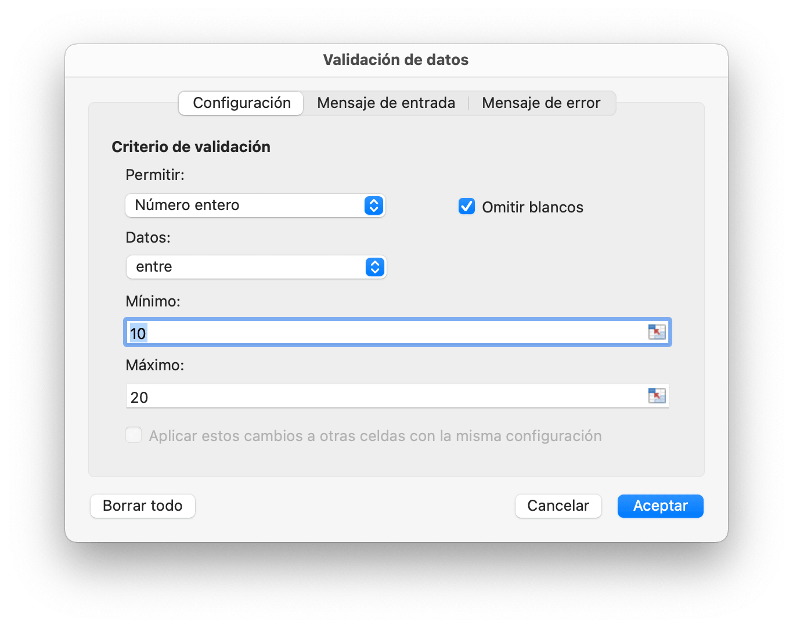
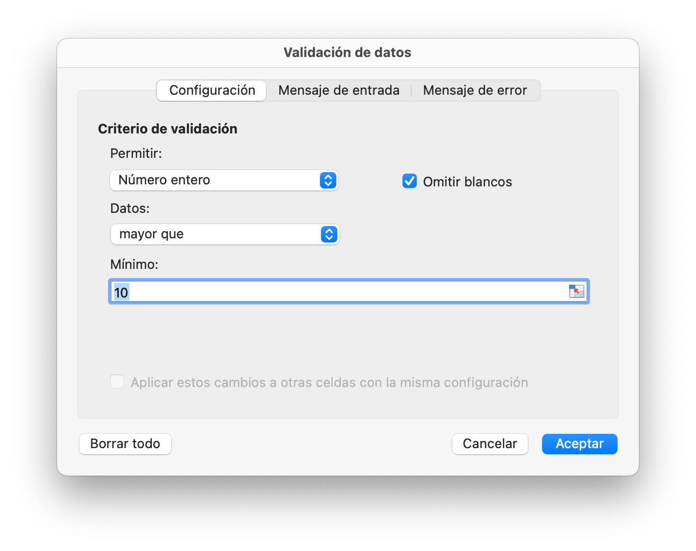
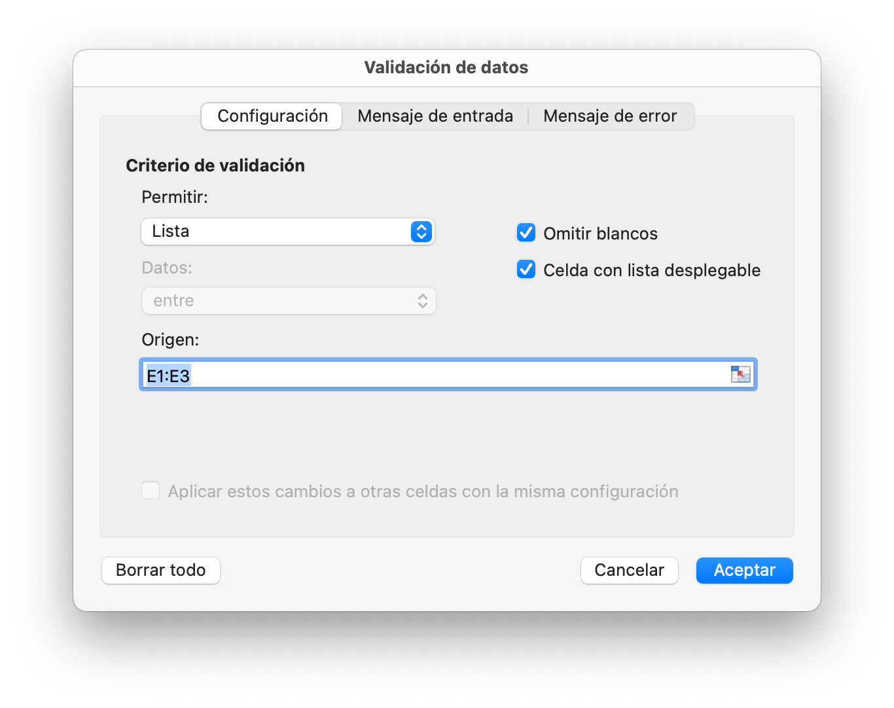

# Datos

## Agregar validación de datos {#AddDataValidation}

```go
func (f *File) AddDataValidation(sheet string, dv *DataValidation)
```

AddDataValidation proporciona una validación de datos establecida en un rango de la hoja de trabajo por objeto de validación de datos y nombre de la hoja de trabajo. El objeto de validación de datos puede ser creado por la función `NewDataValidation`. Los operadores y el tipo de validación de datos se pueden encontrar en la sección [Constants](constants.md).

Ejemplo 1, configure la validación de datos en `Sheet1!A1:B2` con la configuración de los criterios de validación, Mostrar alerta de error después de ingresar datos no válidos con el estilo "Detener" y el título personalizado "cuerpo de error":

<p align="center"></p>

```go
dvRange := excelize.NewDataValidation(true)
dvRange.Sqref = "A1:B2"
dvRange.SetRange(10, 20, excelize.DataValidationTypeWhole, excelize.DataValidationOperatorBetween)
dvRange.SetError(excelize.DataValidationErrorStyleStop, "error title", "cuerpo de error")
f.AddDataValidation("Sheet1", dvRange)
```

Ejemplo 2, configure la validación de datos en `Sheet1!A3:B4` con la configuración de los criterios de validación y muestre el mensaje de entrada cuando se seleccione la celda:

<p align="center"></p>

```go
dvRange = excelize.NewDataValidation(true)
dvRange.Sqref = "A3:B4"
dvRange.SetRange(10, 20, excelize.DataValidationTypeWhole, excelize.DataValidationOperatorGreaterThan)
dvRange.SetInput("input title", "input body")
f.AddDataValidation("Sheet1", dvRange)
```

Ejemplo 3, configure la validación de datos en `Sheet1!A5:B6` con la configuración de los criterios de validación, cree un menú desplegable en la celda permitiendo la fuente de la lista:

<p align="center"></p>

```go
dvRange = excelize.NewDataValidation(true)
dvRange.Sqref = "A5:B6"
dvRange.SetDropList([]string{"1", "2", "3"})
f.AddDataValidation("Sheet1", dvRange)
```

Ejemplo 4, configure la validación de datos en `Sheet1!A7:B8` con la fuente de criterios de validación `Sheet1!E1:E3`, cree un menú desplegable en la celda permitiendo la fuente de la lista:

<p align="center"></p>

```go
dvRange := excelize.NewDataValidation(true)
dvRange.Sqref = "A7:B8"
dvRange.SetSqrefDropList("$E$1:$E$3", true)
f.AddDataValidation("Sheet1", dvRange)
```

## Eliminar validación de datos {#DeleteDataValidation}

```go
func (f *File) DeleteDataValidation(sheet, sqref string) error
```

DeleteDataValidation elimina la validación de datos por el nombre de la hoja de trabajo dada y la secuencia de referencia.
