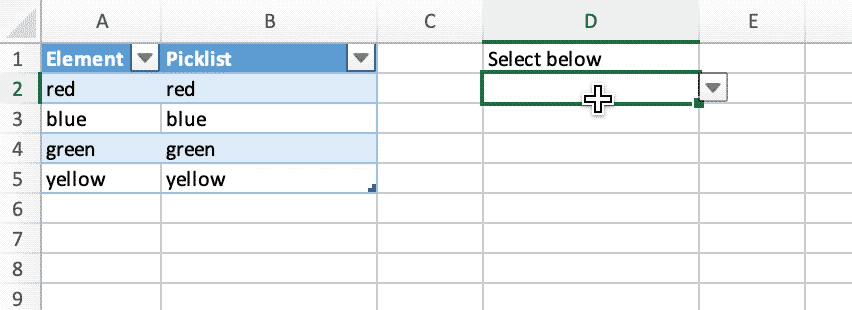

# Lista desplegable de selección múltiple

Cree una lista desplegable de selección múltiple sin VBA en la hoja de cálculo con Excelize usando Go:

<p align="center"></p>

```go
package main

import (
    "fmt"

    "github.com/xuri/excelize/v2"
)

func main() {
    // crear una nueva hoja de cálculo
    f := excelize.NewFile()
    var (
        sheetName = "Sheet1"
        selection = []string{"red", "blue", "green", "yellow"}
        // valores de celda
        data = [][]interface{}{
            {"Element", "Picklist", nil, "Select below"},
            {selection[0] + " "},
            {selection[1] + " "},
            {selection[2] + " "},
            {selection[3] + " "},
        }
        cell string
        err  error
    )
    // establecer cada valor de celda
    for r, row := range data {
        if cell, err = excelize.JoinCellName("A", r+1); err != nil {
            fmt.Println(err)
            return
        }
        if err = f.SetSheetRow(sheetName, cell, &row); err != nil {
            fmt.Println(err)
            return
        }
    }
    // establecer nombre definido
    for index, value := range selection {
        if cell, err = excelize.CoordinatesToCellName(1, index+2, true); err != nil {
            fmt.Println(err)
            return
        }
        if err = f.SetDefinedName(&excelize.DefinedName{
            Name:     value,
            RefersTo: fmt.Sprintf("%s!%s", sheetName, cell),
            Scope:    sheetName,
        }); err != nil {
            fmt.Println(err)
            return
        }
        if cell, err = excelize.CoordinatesToCellName(2, index+2); err != nil {
            fmt.Println(err)
            return
        }
        formula := fmt.Sprintf("=IF(ISNUMBER(FIND(%s,D2)),\"\",D2&%s)", value, value)
        if err := f.SetCellFormula(sheetName, cell, formula); err != nil {
            fmt.Println(err)
            return
        }
    }
    // establecer validación de datos
    dv := excelize.NewDataValidation(true)
    dv.SetSqref("D2:D2")
    dv.SetSqrefDropList("$B$2:$B$5")
    if err = f.AddDataValidation(sheetName, dv); err != nil {
        fmt.Println(err)
        return
    }
    // establecer ancho de columna personalizado
    for col, width := range map[string]float64{"A": 10, "B": 18, "D": 18} {
        if err = f.SetColWidth(sheetName, col, col, width); err != nil {
            fmt.Println(err)
            return
        }
    }
    // create a table
    if err = f.AddTable(sheetName, "A1:B5",
        &excelize.TableOptions{
            Name:      "table",
            StyleName: "TableStyleMedium2",
        },
    ); err != nil {
        fmt.Println(err)
        return
    }
    // guardar archivo de hoja de cálculo
    if err := f.SaveAs("Book1.xlsx"); err != nil {
        fmt.Println(err)
    }
}
```
