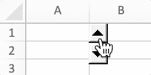

# Controles de formulario

FormControl mapea directamente la información de los controles de formulario.

```go
type FormControl struct {
    Cell         string
    Macro        string
    Width        uint
    Height       uint
    Checked      bool
    CurrentVal   uint
    MinVal       uint
    MaxVal       uint
    IncChange    uint
    PageChange   uint
    Horizontally bool
    CellLink     string
    Text         string
    Paragraph    []RichTextRun
    Type         FormControlType
    Format       GraphicOptions
}
```

## Agregar control de formulario {#AddFormControl}

```go
func (f *File) AddFormControl(sheet string, opts FormControl) error
```

AddFormControl proporciona el método para agregar un botón de control de formulario en una hoja de trabajo mediante el nombre de la hoja de trabajo y las opciones de control de formulario. Tipo de control de formulario admitido: botón, casilla de verificación, cuadro de grupo, etiqueta, botón de opción, barra de desplazamiento y control giratorio. Si establece una macro para el control de formulario, la extensión del libro debe ser `.xlsm` o `.xltm`. El valor de desplazamiento debe estar entre 0 y 30000.

Ejemplo 1, agregue un control de formulario de botón con macro, texto enriquecido, tamaño de botón personalizado, propiedad de impresión en `Hoja1!A2`, y deje que el botón no se mueva ni cambie de tamaño con las celdas:

<p align="center"></p>

```go
err := f.AddFormControl("Hoja1", excelize.FormControl{
    Cell:   "A2",
    Type:   excelize.FormControlButton,
    Macro:  "Button1_Click",
    Width:  140,
    Height: 60,
    Text:   "Button 1\r\n",
    Paragraph: []excelize.RichTextRun{
        {
            Font: &excelize.Font{
                Bold:      true,
                Italic:    true,
                Underline: "single",
                Family:    "Times New Roman",
                Size:      14,
                Color:     "777777",
            },
            Text: "C1=A1+B1",
        },
    },
    Format: excelize.GraphicOptions{
        PrintObject: &enable,
        Positioning: "absolute",
    },
})
```

Ejemplo 2, agregue controles de formulario de botón de opción con estado marcado y texto en `Hoja1!A1` y `Hoja1!A2`:

<p align="center"></p>

```go
if err := f.AddFormControl("Hoja1", excelize.FormControl{
    Cell:    "A1",
    Type:    excelize.FormControlOptionButton,
    Text:    "Option Button 1",
    Checked: true,
}); err != nil {
    fmt.Println(err)
}
if err := f.AddFormControl("Hoja1", excelize.FormControl{
    Cell:    "A2",
    Type:    excelize.FormControlOptionButton,
    Text:    "Option Button 2",
}); err != nil {
    fmt.Println(err)
}
```

Ejemplo 3, agregue el control de formulario de botón giratorio en `Hoja1!B1` para aumentar o disminuir el valor de `Hoja1!A1`:

<p align="center"></p>

```go
err := f.AddFormControl("Hoja1", excelize.FormControl{
    Cell:       "B1",
    Type:       excelize.FormControlSpinButton,
    Width:      15,
    Height:     40,
    CurrentVal: 7,
    MinVal:     5,
    MaxVal:     10,
    IncChange:  1,
    CellLink:   "A1",
})
```

Ejemplo 4, agregue un control de formulario de barra de desplazamiento horizontal en `Hoja1!A2` para cambiar el valor de `Hoja1!A1` haciendo clic en las flechas de desplazamiento o arrastrando el cuadro de desplazamiento:

<p align="center"></p>

```go
err := f.AddFormControl("Hoja1", excelize.FormControl{
    Cell:         "A2",
    Type:         excelize.FormControlScrollBar,
    Width:        140,
    Height:       20,
    CurrentVal:   50,
    MinVal:       10,
    MaxVal:       100,
    IncChange:    1,
    PageChange:   1,
    CellLink:     "A1",
    Horizontally: true,
})
```

## Obtener controles de formulario {#GetFormControls}

```go
func (f *File) GetFormControls(sheet string) ([]FormControl, error)
```

GetFormControls recupera todos los controles de formulario en una hoja de trabajo por un nombre de hoja de trabajo dado. Tenga en cuenta que esta función no admite obtener el ancho y el alto de los controles de formulario actualmente.

## Eliminar control de formulario {#DeleteFormControl}

```go
func (f *File) DeleteFormControl(sheet, cell string) error
```

DeleteFormControl proporciona el método para eliminar el control de formulario en una hoja de trabajo por el nombre de la hoja de trabajo y la referencia de celda dados. Por ejemplo, elimine el control de formulario en `Hoja1!$A$1`:

```go
err := f.DeleteFormControl("Hoja1", "A1")
```
