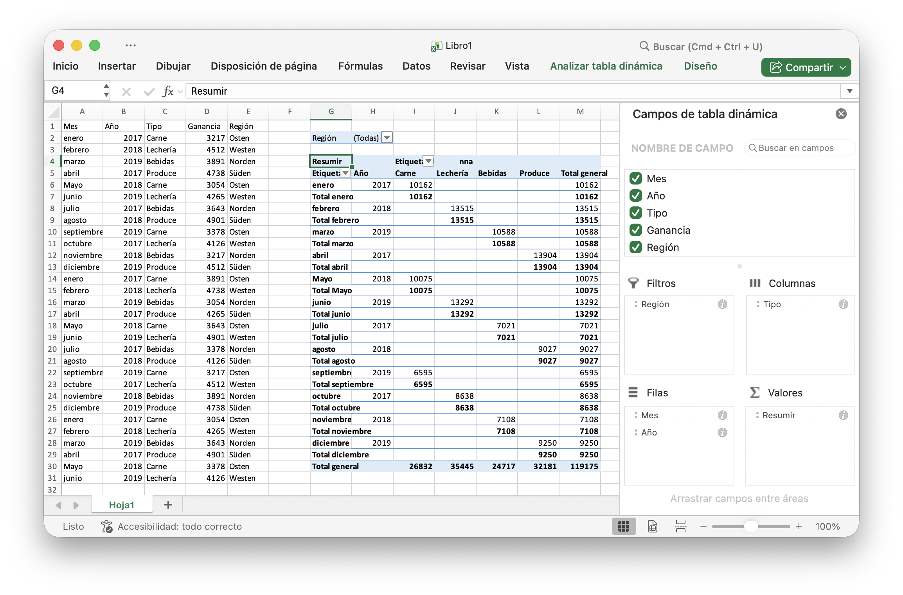

# Tabla dinámica {#PivotTable}

Una tabla dinámica es una tabla de estadísticas que resume los datos de una tabla más extensa (como la de una base de datos, una hoja de cálculo o un programa de inteligencia empresarial). Este resumen puede incluir sumas, promedios u otras estadísticas, que la tabla dinámica agrupa de manera significativa.

PivotTableOptions mapea directamente la configuración de formato de la tabla dinámica.

```go
type PivotTableOptions struct {
    pivotTableSheetName string
    DataRange           string            `json:"data_range"`
    PivotTableRange     string            `json:"pivot_table_range"`
    Rows                []PivotTableField `json:"rows"`
    Columns             []PivotTableField `json:"columns"`
    Data                []PivotTableField `json:"data"`
    Filter              []PivotTableField `json:"filter"`
    RowGrandTotals      bool              `json:"row_grand_totals"`
    ColGrandTotals      bool              `json:"col_grand_totals"`
    ShowDrill           bool              `json:"show_drill"`
    UseAutoFormatting   bool              `json:"use_auto_formatting"`
    PageOverThenDown    bool              `json:"page_over_then_down"`
    MergeItem           bool              `json:"merge_item"`
    CompactData         bool              `json:"compact_data"`
    ShowError           bool              `json:"show_error"`
    ShowRowHeaders      bool              `json:"show_row_headers"`
    ShowColHeaders      bool              `json:"show_col_headers"`
    ShowRowStripes      bool              `json:"show_row_stripes"`
    ShowColStripes      bool              `json:"show_col_stripes"`
    ShowLastColumn      bool              `json:"show_last_column"`
    PivotTableStyleName string            `json:"pivot_table_style_name"`
    // contains filtered or unexported fields
}
```

`PivotTableStyleName`: Los nombres de estilo de la tabla dinámica incorporados:

```text
PivotStyleLight1 - PivotStyleLight28
PivotStyleMedium1 - PivotStyleMedium28
PivotStyleDark1 - PivotStyleDark28
```

PivotTableField mapea directamente la configuración de campo de la tabla dinámica.

```go
type PivotTableField struct {
    Compact         bool   `json:"compact"`
    Data            string `json:"data"`
    Name            string `json:"name"`
    Outline         bool   `json:"outline"`
    Subtotal        string `json:"subtotal"`
    DefaultSubtotal bool   `json:"default_subtotal"`
}
```

Subtotal especifica la función de agregación que se aplica a este campo de datos. El valor predeterminado es `Sum`. Los posibles valores de este atributo son:

|Valor opcional|
|---|
|Average|
|Count|
|CountNums|
|Max|
|Min|
|Product|
|StdDev|
|StdDevp|
|Sum|
|Var|
|Varp|

Nombre especifica el nombre del campo de datos. Se permite un máximo de `255` caracteres en el nombre del campo de datos, los caracteres en exceso se truncarán.

## Crear una tabla dinámica {#AddPivotTable}

```go
func (f *File) AddPivotTable(opts *PivotTableOptions) error
```

AddPivotTable proporciona el método para agregar una tabla dinámica mediante las opciones de tabla dinámica dadas.

Por ejemplo, cree una tabla dinámica en el área `Sheet1!$G$2:$M$34` con la región `Sheet1!$A$1:$E$31` como fuente de datos, resuma por suma para las ventas:

<p align="center"></p>

```go
package main

import (
    "fmt"
    "math/rand"

    "github.com/xuri/excelize/v2"
)

func main() {
    f := excelize.NewFile()
    // Crea algunos datos en una hoja de trabajo
    month := []string{"enero", "febrero", "marzo", "abril", "Mayo", "junio",
        "julio", "agosto", "septiembre", "octubre", "noviembre", "diciembre"}
    year := []int{2017, 2018, 2019}
    types := []string{"Carne", "Lechería", "Bebidas", "Produce"}
    region := []string{"Este", "Oeste", "norte", "Sur"}
    f.SetSheetRow("Sheet1", "A1", &[]string{"Mes", "Año", "Tipo", "Ventas", "Región"})
    for row := 2; row < 32; row++ {
        f.SetCellValue("Sheet1", fmt.Sprintf("A%d", row), month[rand.Intn(12)])
        f.SetCellValue("Sheet1", fmt.Sprintf("B%d", row), year[rand.Intn(3)])
        f.SetCellValue("Sheet1", fmt.Sprintf("C%d", row), types[rand.Intn(4)])
        f.SetCellValue("Sheet1", fmt.Sprintf("D%d", row), rand.Intn(5000))
        f.SetCellValue("Sheet1", fmt.Sprintf("E%d", row), region[rand.Intn(4)])
    }
    if err := f.AddPivotTable(&excelize.PivotTableOptions{
        DataRange:       "Sheet1!$A$1:$E$31",
        PivotTableRange: "Sheet1!$G$2:$M$34",
        Rows: []excelize.PivotTableField{
            {Data: "Mes", DefaultSubtotal: true}, {Data: "Año"}},
        Filter: []excelize.PivotTableField{
            {Data: "Región"}},
        Columns: []excelize.PivotTableField{
            {Data: "Tipo", DefaultSubtotal: true}},
        Data: []excelize.PivotTableField{
            {Data: "Ventas", Name: "Resumir", Subtotal: "Sum"}},
        RowGrandTotals: true,
        ColGrandTotals: true,
        ShowDrill:      true,
        ShowRowHeaders: true,
        ShowColHeaders: true,
        ShowLastColumn: true,
    }); err != nil {
        fmt.Println(err)
    }
    if err := f.SaveAs("Libro1.xlsx"); err != nil {
        fmt.Println(err)
    }
}
```
