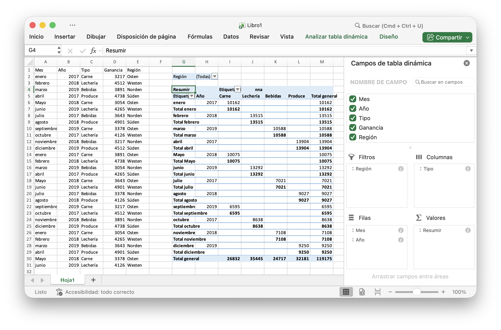

# Tabla dinámica {#PivotTable}

Una tabla dinámica es una tabla de estadísticas que resume los datos de una tabla más extensa (como la de una base de datos, una hoja de cálculo o un programa de inteligencia empresarial). Este resumen puede incluir sumas, promedios u otras estadísticas, que la tabla dinámica agrupa de manera significativa.

`PivotTableOptions` mapea directamente la configuración de formato de la tabla dinámica.

```go
type PivotTableOptions struct {
    DataRange           string
    PivotTableRange     string
    Name                string
    Rows                []PivotTableField
    Columns             []PivotTableField
    Data                []PivotTableField
    Filter              []PivotTableField
    RowGrandTotals      bool
    ColGrandTotals      bool
    ShowDrill           bool
    UseAutoFormatting   bool
    PageOverThenDown    bool
    MergeItem           bool
    ClassicLayout       bool
    CompactData         bool
    ShowError           bool
    ShowRowHeaders      bool
    ShowColHeaders      bool
    ShowRowStripes      bool
    ShowColStripes      bool
    ShowLastColumn      bool
    FieldPrintTitles    bool
    ItemPrintTitles     bool
    PivotTableStyleName string
    // contiene campos filtrados o no exportados
}
```

`PivotTableStyleName`: Los nombres de estilo de la tabla dinámica incorporados:

```text
PivotStyleLight1 - PivotStyleLight28
PivotStyleMedium1 - PivotStyleMedium28
PivotStyleDark1 - PivotStyleDark28
```

`PivotTableField` mapea directamente la configuración de campo de la tabla dinámica.

```go
type PivotTableField struct {
    Compact         bool
    Data            string
    Name            string
    Outline         bool
    ShowAll         bool
    InsertBlankRow  bool
    Subtotal        string
    DefaultSubtotal bool
    NumFmt          int
    SelectedItems   []string
}
```

`Subtotal` especifica la función de agregación que se aplica a este campo de datos. El valor predeterminado es `Sum`. Los posibles valores de este atributo son:

|Valor opcional|
|---|
|Average|
|Count|
|CountNums|
|Max|
|Min|
|Product|
|StdDev|
|StdDevp|
|Sum|
|Var|
|Varp|

`Name` especifica el nombre del campo de datos. Se permite un máximo de `255` caracteres en el nombre del campo de datos, el exceso de caracteres se truncará.

`SelectedItems` especifica los elementos seleccionados por defecto en un campo de tabla dinámica. Los elementos seleccionados deben ser valores dentro del rango de celdas al que hace referencia dicho campo.

## Crear una tabla dinámica {#AddPivotTable}

```go
func (f *File) AddPivotTable(opts *PivotTableOptions) error
```

AddPivotTable proporciona el método para agregar una tabla dinámica mediante las opciones de tabla dinámica dadas.

Por ejemplo, cree una tabla dinámica en el área `Hoja1!G4:M30` con la región `Hoja1!A1:E31` como fuente de datos, resuma por suma para las ventas:

<p align="center"></p>

```go
package main

import (
    "fmt"

    "github.com/xuri/excelize/v2"
)

func main() {
    f := excelize.NewFile()
    defer func() {
        if err := f.Close(); err != nil {
            fmt.Println(err)
        }
    }()
    if err := f.SetSheetName("Sheet1", "Hoja1"); err != nil {
        fmt.Println(err)
        return
    }
    // Crea algunos datos en una hoja de trabajo
    month := []string{"enero", "febrero", "marzo", "abril", "Mayo", "junio",
        "julio", "agosto", "septiembre", "octubre", "noviembre", "diciembre"}
    year := []int{2017, 2018, 2019}
    types := []string{"Carne", "Lechería", "Bebidas", "Produce"}
    revenue := []int{3217, 4512, 3891, 4738, 3054, 4265, 3643, 4901, 3378, 4126}
    region := []string{"Osten", "Westen", "Norden", "Süden"}
    if err := f.SetSheetRow(
        "Hoja1", "A1", &[]string{"Mes", "Año", "Tipo", "Ganancia", "Región"},
    ); err != nil {
        fmt.Println(err)
        return
    }
    for row := 2; row < 32; row++ {
        f.SetCellValue("Hoja1", fmt.Sprintf("A%d", row), month[(row-2)%len(month)])
        f.SetCellValue("Hoja1", fmt.Sprintf("B%d", row), year[(row-2)%len(year)])
        f.SetCellValue("Hoja1", fmt.Sprintf("C%d", row), types[(row-2)%len(types)])
        f.SetCellValue("Hoja1", fmt.Sprintf("D%d", row), revenue[(row-2)%len(revenue)])
        f.SetCellValue("Hoja1", fmt.Sprintf("E%d", row), region[(row-2)%len(region)])
    }
    if err := f.AddPivotTable(&excelize.PivotTableOptions{
        DataRange:       "Hoja1!A1:E31",
        PivotTableRange: "Hoja1!G4:M30",
        Rows: []excelize.PivotTableField{
            {Data: "Mes", DefaultSubtotal: true}, {Data: "Año"},
        },
        Filter: []excelize.PivotTableField{
            {Data: "Región"},
        },
        Columns: []excelize.PivotTableField{
            {Data: "Tipo", DefaultSubtotal: true},
        },
        Data: []excelize.PivotTableField{
            {Data: "Ganancia", Name: "Resumir", Subtotal: "Sum"},
        },
        RowGrandTotals: true,
        ColGrandTotals: true,
        ShowDrill:      true,
        ShowRowHeaders: true,
        ShowColHeaders: true,
        ShowLastColumn: true,
    }); err != nil {
        fmt.Println(err)
        return
    }
    if err := f.SaveAs("Libro1.xlsx"); err != nil {
        fmt.Println(err)
    }
}
```

## Obtener tablas dinámicas {#GetPivotTables}

```go
func (f *File) GetPivotTables(sheet string) ([]PivotTableOptions, error)
```

GetPivotTables devuelve todas las definiciones de tablas dinámicas en una hoja de trabajo por nombre de hoja de trabajo dado.

## Eliminar tabla dinámica {#DeletePivotTable}

```go
func (f *File) DeletePivotTable(sheet, name string) error
```

DeletePivotTable elimina una tabla dinámica dando el nombre de la hoja de trabajo y el nombre de la tabla dinámica. Tenga en cuenta que esta función no limpia los valores de celda en el rango de la tabla dinámica.
