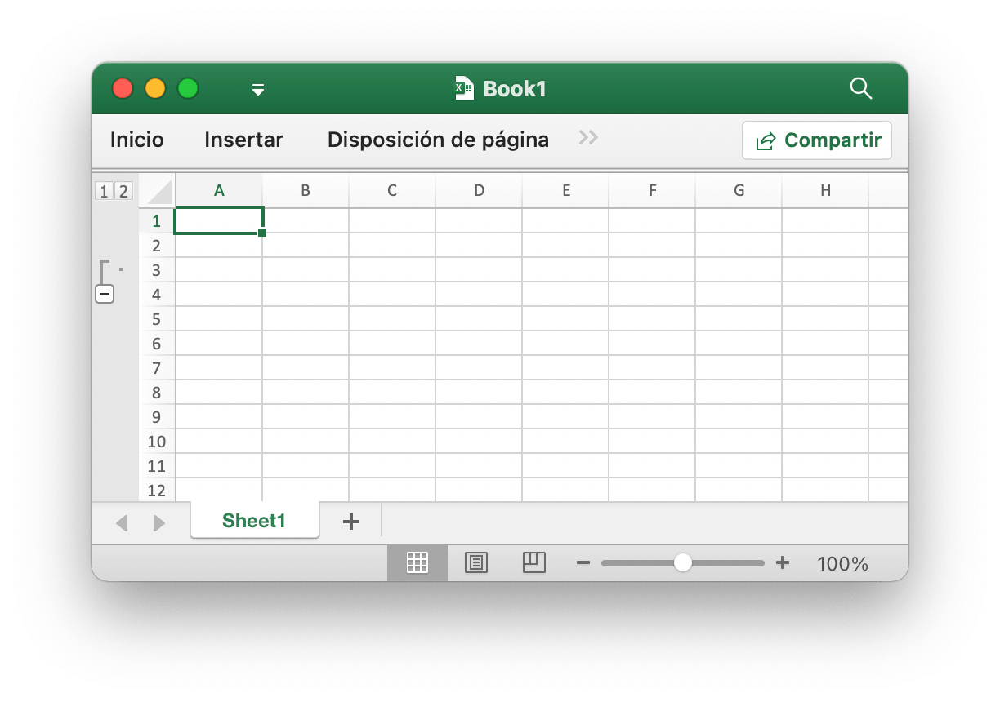
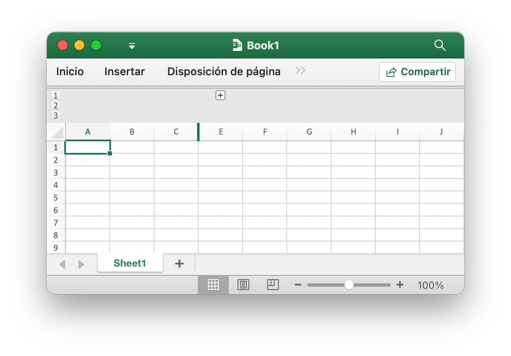
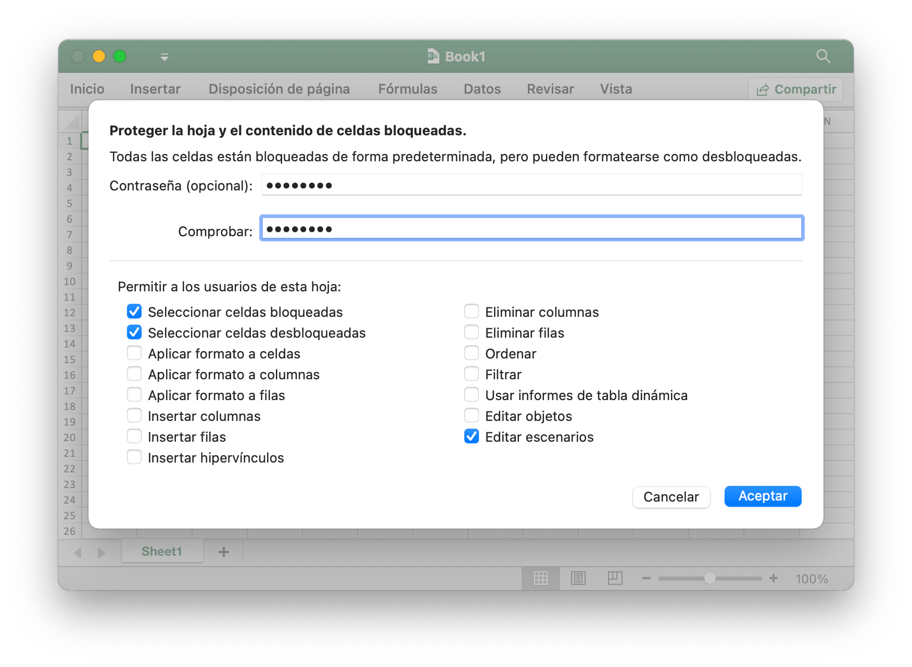

# Hoja de trabajo

## Establecer visibilidad de columna {#SetColVisible}

```go
func (f *File) SetColVisible(sheet, col string, visible bool) error
```

SetColVisible proporciona una función para establecer la visibilidad de una sola columna por el nombre de la hoja de trabajo y el nombre de la columna. Esta función es segura para la simultaneidad. Por ejemplo, oculte la columna `D` en `Sheet1`:

```go
err := f.SetColVisible("Sheet1", "D", false)
```

Ocultar las columnas de la `D` a la `F` (incluidas):

```go
err := f.SetColVisible("Sheet1", "D:F", false)
```

## Establecer el ancho de la columna {#SetColWidth}

```go
func (f *File) SetColWidth(sheet, startCol, endCol string, width float64) error
```

SetColWidth proporciona una función para establecer el ancho de una sola columna o de varias columnas. Esta función es segura para la simultaneidad. Por ejemplo:

```go
f := excelize.NewFile()
err := f.SetColWidth("Sheet1", "A", "H", 20)
```

## Establecer la altura de la fila {#SetRowHeight}

```go
func (f *File) SetRowHeight(sheet string, row int, height float64) error
```

SetRowHeight proporciona una función para establecer la altura de una sola fila. Por ejemplo, establezca la altura de la primera fila en `Sheet1`:

```go
err := f.SetRowHeight("Sheet1", 1, 50)
```

## Establecer visibilidad de fila {#SetRowVisible}

```go
func (f *File) SetRowVisible(sheet string, row int, visible bool) error
```

SetRowVisible proporciona una función para establecer la visibilidad de una sola fila por el nombre de la hoja de trabajo y el índice de fila. Por ejemplo, oculte la fila `2` en `Sheet1`:

```go
err := f.SetRowVisible("Sheet1", 2, false)
```

## Obtener el nombre de la hoja {#GetSheetName}

```go
func (f *File) GetSheetName(index int) string
```

GetSheetName proporciona una función para obtener el nombre de la hoja del libro de trabajo por el índice de hoja dado. Si el índice de hoja proporcionado no es válido, devolverá una cadena vacía.

## Obtenga visibilidad de columnas {#GetColVisible}

```go
func (f *File) GetColVisible(sheet, column string) (bool, error)
```

GetColVisible proporciona una función para hacer visible una sola columna por el nombre de la hoja de trabajo y el nombre de la columna. Esta función es segura para la simultaneidad. Por ejemplo, obtenga el estado visible de la columna `D` en `Sheet1`:

```go
visible, err := f.GetColVisible("Sheet1", "D")
```

## Obtener ancho de columna {#GetColWidth}

```go
func (f *File) GetColWidth(sheet, col string) (float64, error)
```

GetColWidth proporciona una función para obtener el ancho de la columna dado el nombre de la hoja de trabajo y el índice de la columna. Esta función es segura para la simultaneidad.

## Obtener altura de fila {#GetRowHeight}

```go
func (f *File) GetRowHeight(sheet string, row int) (float64, error)
```

GetRowHeight proporciona una función para obtener la altura de la fila según el nombre de la hoja de trabajo y el índice de fila. Por ejemplo, obtenga la altura de la primera fila en `Sheet1`:

```go
height, err := f.GetRowHeight("Sheet1", 1)
```

## Obtenga visibilidad de filas {#GetRowVisible}

```go
func (f *File) GetRowVisible(sheet string, row int) (bool, error)
```

GetRowVisible proporciona una función para visualizar una sola fila por el nombre de la hoja de trabajo y el índice de fila. Por ejemplo, obtenga el estado visible de la fila `2` en `Sheet1`:

```go
visible, err := f.GetRowVisible("Sheet1", 2)
```

## Obtener índice de hoja {#GetSheetIndex}

```go
func (f *File) GetSheetIndex(sheet string) (int, error)
```

GetSheetIndex proporciona una función para obtener un índice de hoja del libro de trabajo por el nombre de hoja dado. Si el nombre de la hoja dada no es válido o la hoja de trabajo no existe, devolverá un valor de tipo entero `-1`.

El índice obtenido se puede utilizar como parámetro para llamar a la función [`SetActiveSheet()`](workbook.md#SetActiveSheet) cuando se configura la hoja de trabajo predeterminada del libro.

## Obtener mapa de hojas {#GetSheetMap}

```go
func (f *File) GetSheetMap() map[int]string
```

GetSheetMap proporciona una función para obtener hojas de trabajo, hojas de gráficos, ID de hojas de diálogo y mapas de nombres del libro de trabajo. Por ejemplo:

```go
f, err := excelize.OpenFile("Book1.xlsx")
if err != nil {
    return
}
defer func() {
    if err := f.Close(); err != nil {
        fmt.Println(err)
    }
}()
for index, name := range f.GetSheetMap() {
    fmt.Println(index, name)
}
```

## Obtener lista de hojas {#GetSheetList}

```go
func (f *File) GetSheetList() []string
```

GetSheetList proporciona una función para obtener hojas de trabajo, hojas de gráficos y listas de nombres de hojas de diálogo del libro de trabajo.

## Establecer el nombre de la hoja {#SetSheetName}

```go
func (f *File) SetSheetName(source, target string) error
```

SetSheetName proporciona una función para establecer el nombre de la hoja de trabajo con los nombres antiguos y nuevos de la hoja de trabajo. Se permite un máximo de 31 caracteres en el título de la hoja y esta función solo cambia el nombre de la hoja y no actualizará el nombre de la hoja en la fórmula o referencia asociada con la celda. Por lo tanto, puede haber un error de fórmula de problema o falta una referencia.

## Insertar columnas {#InsertCols}

```go
func (f *File) InsertCols(sheet, col string, n int) error
```

InsertCols proporciona una función para insertar nuevas columnas antes del nombre de columna dado y el número de columnas. Por ejemplo, cree dos columnas antes de la columna `C` en `Sheet1`:

```go
err := f.InsertCols("Sheet1", "C", 2)
```

## Insertar filas {#InsertRows}

```go
func (f *File) InsertRows(sheet string, row, n int) error
```

InsertRows proporciona una función para insertar nuevas filas después del número de fila de Excel dado a partir de `1` y el número de filas. Por ejemplo, cree dos filas antes de la fila `3` en `Sheet1`:

```go
err := f.InsertRows("Sheet1", 3, 2)
```

## Anexar fila duplicada {#DuplicateRow}

```go
func (f *File) DuplicateRow(sheet string, row int) error
```

DuplicateRow inserta una copia de una fila específica debajo de la especificada, Por ejemplo:

```go
err := f.DuplicateRow("Sheet1", 2)
```

Utilice este método con precaución, ya que afectará a los cambios en las referencias, como fórmulas, gráficos, etc. Si hay algún valor referenciado de la hoja de trabajo, provocará un error de archivo cuando lo abra. Excelize solo actualiza parcialmente estas referencias actualmente.

## Fila duplicada {#DuplicateRowTo}

```go
func (f *File) DuplicateRowTo(sheet string, row, row2 int) error
```

DuplicateRowTo inserta una copia de la fila especificada por su número de Excel en la posición de fila especificada moviéndose hacia abajo existen filas después de la posición de destino, Por ejemplo:

```go
err := f.DuplicateRowTo("Sheet1", 2, 7)
```

Utilice este método con precaución, ya que afectará a los cambios en las referencias, como fórmulas, gráficos, etc. Si hay algún valor referenciado de la hoja de trabajo, provocará un error de archivo cuando lo abra. Excelize solo actualiza parcialmente estas referencias actualmente.

## Crear un esquema de fila {#SetRowOutlineLevel}

```go
func (f *File) SetRowOutlineLevel(sheet string, row int, level uint8) error
```

SetRowOutlineLevel proporciona una función para establecer el número de nivel de esquema de una sola fila por nombre de hoja de trabajo y número de fila de Excel. Por ejemplo, delinee la fila 2 en `Sheet1` al nivel 1:

<p align="center"></p>

```go
err := f.SetRowOutlineLevel("Sheet1", 2, 1)
```

## Crear esquema de columna {#SetColOutlineLevel}

```go
func (f *File) SetColOutlineLevel(sheet, col string, level uint8) error
```

SetColOutlineLevel proporciona una función para establecer el nivel de esquema de una sola columna por nombre de hoja de trabajo y nombre de columna dados. Por ejemplo, establezca el nivel de esquema de la columna `D` en `Sheet1` en 2:

<p align="center"></p>

```go
err := f.SetColOutlineLevel("Sheet1", "D", 2)
```

## Obtener esquema de fila {#GetRowOutlineLevel}

```go
func (f *File) GetRowOutlineLevel(sheet string, row int) (uint8, error)
```

GetRowOutlineLevel proporciona una función para obtener el número de nivel de esquema de una sola fila por nombre de hoja de cálculo y número de fila de Excel. Por ejemplo, obtenga el número de esquema de la fila 2 en `Sheet1`:

```go
err := f.GetRowOutlineLevel("Sheet1", 2)
```

## Obtener esquema de columna {#GetColOutlineLevel}

```go
func (f *File) GetColOutlineLevel(sheet, col string) (uint8, error)
```

GetColOutlineLevel proporciona una función para obtener el nivel de esquema de una sola columna por nombre de hoja de trabajo y nombre de columna dados. Por ejemplo, obtenga el nivel de esquema de la columna `D` en `Sheet1`:

```go
level, err := f.GetColOutlineLevel("Sheet1", "D")
```

## Iterador de columnas {#Cols}

```go
func (f *File) Cols(sheet string) (*Cols, error)
```

Cols devuelve un iterador de columna, que se utiliza para transmitir datos de lectura para una hoja de trabajo con datos grandes. Esta función es segura para la simultaneidad. Por ejemplo:

```go
cols, err := f.Cols("Sheet1")
if err != nil {
    fmt.Println(err)
    return
}
for cols.Next() {
    col, err := cols.Rows()
    if err != nil {
        fmt.Println(err)
    }
    for _, rowCell := range col {
        fmt.Print(rowCell, "\t")
    }
    fmt.Println()
}
```

### Iterador de columnas - Columnas

```go
func (cols *Cols) Rows(opts ...Options) ([]string, error)
```

Rows devuelve los valores de fila de la columna actual.

### Iterador de columnas - Atravesando

```go
func (cols *Cols) Next() bool
```

Next devolverá `true` si se encuentra la siguiente columna.

### Iterador de columnas - Manejo de errores

```go
func (cols *Cols) Error() error
```

Error devolverá el `error` cuando se produzca el error.

## Iterador de filas {#Rows}

```go
func (f *File) Rows(sheet string) (*Rows, error)
```

Rows returns a rows iterator, used for streaming reading data for a worksheet with a large data. Esta función es segura para la simultaneidad. Por ejemplo:

```go
rows, err := f.Rows("Sheet1")
if err != nil {
    fmt.Println(err)
    return
}
for rows.Next() {
    row, err := rows.Columns()
    if err != nil {
        fmt.Println(err)
    }
    for _, colCell := range row {
        fmt.Print(colCell, "\t")
    }
    fmt.Println()
}
if err = rows.Close(); err != nil {
    fmt.Println(err)
}
```

### Iterador de filas - Columnas

```go
func (rows *Rows) Columns(opts ...Options) ([]string, error)
```

Columns devuelve los valores de columna de la fila actual. Esto obtiene los datos de la hoja de trabajo como una secuencia, devuelve cada celda en una fila tal cual y no omitirá las filas vacías al final de la hoja de trabajo.

### Iterador de filas - Atravesando

```go
func (rows *Rows) Next() bool
```

Next devolverá `true` si encuentra el siguiente elemento de fila.

### Iterador de filas - Manejo de errores

```go
func (rows *Rows) Error() error
```

Error devolverá el `error` cuando se produzca el error.

### Iterador de filas - Obtener opciones de fila

```go
func (rows *Rows) GetRowOpts() RowOpts
```

GetRowOpts devolverá los `RowOpts` de la fila actual.

### Iterador de filas - Cerrar

```go
func (rows *Rows) Close() error
```

Close cierra el archivo XML de hoja de trabajo abierto en el directorio temporal del sistema.

## Hoja de búsqueda {#SearchSheet}

```go
func (f *File) SearchSheet(sheet, value string, reg ...bool) ([]string, error)
```

SearchSheet proporciona una función para obtener coordenadas por nombre de hoja de trabajo, valor de celda y expresión regular dados. La función no admite la búsqueda en el resultado calculado, los números formateados y la búsqueda condicional actualmente. Si es una celda fusionada, devolverá las coordenadas de la esquina superior izquierda del área fusionada.

Por ejemplo, busque las coordenadas del valor de `100` en `Sheet1`:

```go
result, err := f.SearchSheet("Sheet1", "100")
```

Por ejemplo, busque las coordenadas donde se describe el valor numérico en el rango de `0-9` de `Sheet1`:

```go
result, err := f.SearchSheet("Sheet1", "[0-9]", true)
```

## Hoja de protección {#ProtectSheet}

```go
func (f *File) ProtectSheet(sheet string, opts *SheetProtectionOptions) error
```

ProtectSheet proporciona una función para evitar que otros usuarios cambien, muevan o eliminen datos en una hoja de cálculo de forma accidental o deliberada. El campo opcional `AlgorithmName` especifica el algoritmo hash, admite XOR, MD4, MD5, SHA-1, SHA-256, SHA-384 y SHA-512 actualmente, si no se especifica ningún algoritmo hash, utilizará el algoritmo XOR de forma predeterminada. Por ejemplo, proteja `Sheet1` con la configuración de protección:

<p align="center"></p>

```go
err := f.ProtectSheet("Sheet1", &excelize.SheetProtectionOptions{
    AlgorithmName:       "SHA-512",
    Password:            "password",
    SelectLockedCells:   true,
    SelectUnlockedCells: true,
    EditScenarios:       true,
})
```

SheetProtectionOptions asigna directamente la configuración de la protección de la hoja de cálculo.

```go
type SheetProtectionOptions struct {
    AlgorithmName       string
    AutoFilter          bool
    DeleteColumns       bool
    DeleteRows          bool
    EditObjects         bool
    EditScenarios       bool
    FormatCells         bool
    FormatColumns       bool
    FormatRows          bool
    InsertColumns       bool
    InsertHyperlinks    bool
    InsertRows          bool
    Password            string
    PivotTables         bool
    SelectLockedCells   bool
    SelectUnlockedCells bool
    Sort                bool
}
```

## Desproteger hoja {#UnprotectSheet}

```go
func (f *File) UnprotectSheet(sheet string, password ...string) error
```

UnprotectSheet proporciona una función para eliminar la protección de una hoja, especificó el segundo parámetro de contraseña opcional para eliminar la protección de la hoja con verificación de contraseña.

## Eliminar columna {#RemoveCol}

```go
func (f *File) RemoveCol(sheet, col string) error
```

RemoveCol proporciona una función para eliminar una sola columna dado el nombre de la hoja de trabajo y el índice de columna. Por ejemplo, elimine la columna `C` en `Sheet1`:

```go
err := f.RemoveCol("Sheet1", "C")
```

Este método con precaución, ya que afectará a los cambios en las referencias, como fórmulas, gráficos, etc. Si utiliza algún valor de referencia de la hoja de trabajo, provocará un error de archivo cuando lo abra. Excelize solo actualiza parcialmente estas referencias actualmente.

## Eliminar fila {#RemoveRow}

```go
func (f *File) RemoveRow(sheet string, row int) error
```

RemoveRow proporciona una función para eliminar una sola fila por el nombre de la hoja de trabajo y el número de fila de Excel. Por ejemplo, elimine la fila `3` en `Sheet1`:

```go
err := f.RemoveRow("Sheet1", 3)
```

Utilice este método con precaución, ya que afectará a los cambios en las referencias, como fórmulas, gráficos, etc. Si hay algún valor referenciado de la hoja de trabajo, provocará un error de archivo cuando lo abra. Excelize solo actualiza parcialmente estas referencias actualmente.

## Establecer valores de columna {#SetSheetCol}

```go
func (f *File) SetSheetCol(sheet, cell string, slice interface{}) error
```

SetSheetCol escribe una matriz en la columna por el nombre de la hoja de cálculo, la coordenada inicial y un puntero al tipo de matriz `slice`. Por ejemplo, escribe una matriz en la columna `B` a partir de la celda `B6` de `Sheet1`:

```go
err := f.SetSheetCol("Sheet1", "B6", &[]interface{}{"1", nil, 2})
```

## Establecer valores de fila {#SetSheetRow}

```go
func (f *File) SetSheetRow(sheet, cell string, slice interface{}) error
```

SetSheetRow escribe una matriz en una fila según el nombre de la hoja de trabajo, la coordenada inicial y un puntero al tipo de matriz `slice`. Esta función es segura para la simultaneidad. Por ejemplo, escribe una matriz en la fila `6` y comienza con la celda `B6` en `Sheet1`:

```go
err := f.SetSheetRow("Sheet1", "B6", &[]interface{}{"1", nil, 2})
```

## Insertar salto de página {#InsertPageBreak}

```go
func (f *File) InsertPageBreak(sheet, cell string) error
```

InsertPageBreak crea un salto de página para determinar dónde termina la página impresa y dónde comienza la siguiente mediante el nombre y el eje de la hoja de trabajo, por lo que el contenido antes del salto de página se imprimirá en una página y después del salto de página en otra.

## Eliminar salto de página {#RemovePageBreak}

```go
func (f *File) RemovePageBreak(sheet, cell string) error
```

Eliminar salto de página Elimina un salto de página por el nombre y el eje de la hoja de trabajo.
